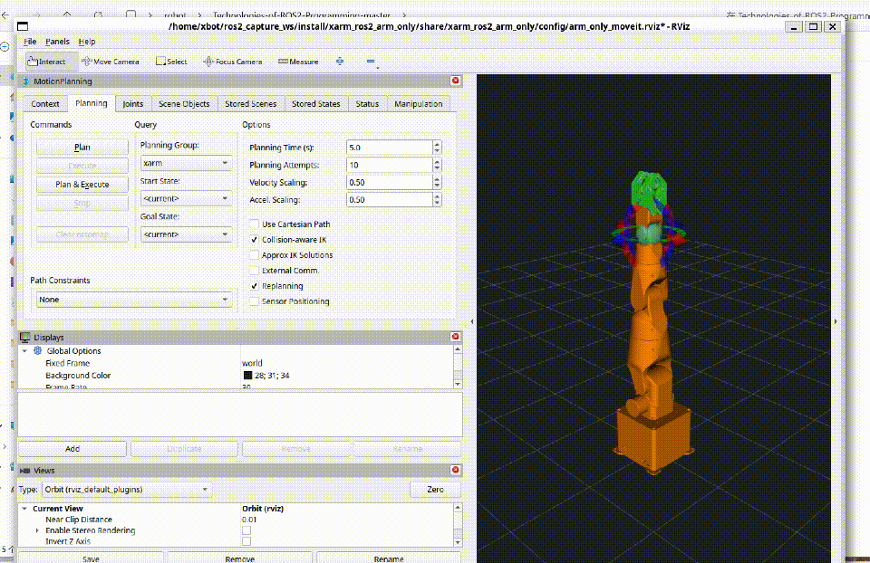

# RISC-V ROS2 机器人操作系统编程技术

## 课程介绍

本课程以 RISC-V 开源硬件平台（openEuler 24.03 LTS）为硬件基础，以 ROS2（Robot Operating System 2）Humble 为技术平台，系统讲授机器人的软件开发框架、分布式通信机制、实时控制系统以及智能终端装调技术。课程 ROS2 程序运行在 openEuler RISC-V 板卡上，Gazebo、RViz2 等仿真与可视化环境运行在 Windows x86 主机上，两端通过局域网内同一 DDS 域互联。

## 教学资源

- 方法1

1. [Bianbu for K3 镜像](https://spacemit.com/community/resources-download/Images%20Collects/K3/Bianbu)
2. [Bianbu ROS2 开发入门指南 ](https://www.spacemit.com/community/document/info?lang=zh&nodepath=competition/%E7%AB%9E%E8%B5%9B%E6%95%99%E7%A8%8B/01_Bianbu_%E4%BD%BF%E7%94%A8%E6%96%87%E6%A1%A3%E5%8F%8A%E6%A1%88%E4%BE%8B%E9%9B%86/02_ROS2%E4%BD%BF%E7%94%A8%E8%AF%B4%E6%98%8E.md)

- 方法2
1. [Docker RISC-V](https://github.com/RLC-Lab/riscv-ros2)

- 方法3
1. [openEuler RISC-V 24.03 Humble](https://docs.openeuler.org/zh/docs/24.03_LTS_SP3/tools/application/ros/ros_user_guide.html)
曾经完成小车和四旋翼RISC-V实例

- 方法4
1. [K1 ROS2 安装教程](https://docs.bit-brick.com/zh/docs/k1/news/ros2)

- 方法5
1. [Licheepi4A + RevyOS](https://github.com/lalafua/recording/blob/main/riscv/ros2/tutorial/first.md)

- 方法6
1. [revyOS ROS2 源](https://mirror.iscas.ac.cn/revyos/revyos-ros2/)

## 教学目标

| 目标维度 | 目标描述 |
|:--------|---------|
| **知识目标** | 掌握 ROS2 分布式通信机制（话题、服务、动作）、参数系统、TF2 坐标变换、URDF 建模、Gazebo 仿真等基础理论；理解 SLAM 建图与定位、自主导航、机械臂运动规划、视觉检测等核心技术原理 |
| **技能目标** | 能够独立完成 ROS2 功能包的创建与调试；能够在 PAV-S RISC-V 机器人平台及 Windows 主机仿真环境中实现 SLAM 建图、自主导航、机械臂抓取等工程任务；能够集成激光雷达、深度相机等多传感器实现智能感知 |
| **素养目标** | 培养系统化工程思维和跨领域技术整合能力；建立 RISC-V 开源软硬件平台与具身机器人统一的软件架构认知；形成规范的项目开发与文档编写习惯 |

---

## 课程大纲

### Part 1: ROS2 编程基础（RISC-V 机器人终端软件平台，36 课时）

| 章节 | 内容 | 理论 | 实验 | 小计 |
|:---:|------|:---:|:---:|:---:|
| 1 | ROS2 概述与架构 | 2 | 2 | 4 |
| 2 | 核心编程基础（Package/Node/Logger） | 2 | 2 | 4 |
| 3 | 话题通信——RISC-V 机器人传感器数据分发 | 2 | 2 | 4 |
| 4 | 服务通信——RISC-V 机器人远程诊断与指令 | 2 | 2 | 4 |
| 5 | 动作通信——RISC-V 机器人路径规划与执行 | 2 | 2 | 4 |
| 6 | 参数系统与 Launch 文件——RISC-V 机器人多节点管理 | 2 | 2 | 4 |
| 7 | TF2 坐标变换——多传感器联合标定基础 | 2 | 2 | 4 |
| 8 | URDF 机器人建模——RISC-V 机器人结构描述 | 2 | 2 | 4 |
| 9 | Gazebo 仿真——机器人仿真环境搭建（Windows x86 主机运行） | 2 | 2 | 4 |

### Part 2: SLAM 与自主导航（RISC-V 机器人环境感知与决策，62 课时）

| 章节 | 内容 | 理论 | 实验 | 小计 |
|:---:|------|:---:|:---:|:---:|
| 10 | SLAM 基本概念与贝叶斯框架 | 2 | 2 | 4 |
| 11 | ICP 与 PLICP 扫描匹配 | 2 | 2 | 4 |
| 12 | Hector-SLAM | 2 | 2 | 4 |
| 13 | gmapping 粒子滤波 SLAM | 2 | 2 | 4 |
| 14 | AMCL 自适应蒙特卡洛定位 | 2 | 2 | 4 |
| 15 | Cartographer 图优化 SLAM | 4 | 2 | 6 |
| 16 | Nav2 架构与核心组件 | 2 | 2 | 4 |
| 17 | 全局代价地图 | 2 | 2 | 4 |
| 18 | 全局路径规划（Dijkstra / A\*） | 2 | 2 | 4 |
| 19 | 局部路径规划（DWA） | 2 | 2 | 4 |
| 20 | 行为树与恢复行为 | 2 | 2 | 4 |
| 21 | 视觉 SLAM 导论 | 2 | 2 | 4 |
| 22 | 多传感器融合 SLAM | 2 | 2 | 4 |
| 23 | SLAM 与导航综合实训 | 4 | 4 | 8 |

### Part 3: 机械臂编程技术（具身智能机器人操作系统，52 课时）

| 章节 | 内容 | 理论 | 实验 | 小计 |
|:---:|------|:---:|:---:|:---:|
| 24 | 机械臂基础知识与运动学 | 2 | 2 | 4 |
| 25 | ROS2 机械臂建模（URDF/Xacro） | 2 | 2 | 4 |
| 26 | MoveIt2 基础 | 2 | 2 | 4 |
| 27 | MoveIt2 Python 关节空间规划 | 2 | 2 | 4 |
| 28 | MoveIt2 笛卡尔空间与避障 | 2 | 2 | 4 |
| 29 | 抓取与放置编程 | 2 | 2 | 4 |
| 30 | ROS2 图像接口与相机标定 | 2 | 2 | 4 |
| 31 | 颜色检测与 YOLO 物体检测 | 2 | 2 | 4 |
| 32 | AR 标签检测与手眼标定 | 2 | 2 | 4 |
| 33 | 视觉大模型与 ROS2 应用 | 2 | 2 | 4 |
| 34 | 视觉抓取应用 | 2 | 2 | 4 |
| 35 | 综合实训（集成机器人产线） | 4 | 4 | 8 |

---

## 理论章节与实验手册对照

教学文档和课件仍按 35 个理论章节组织；实验代码和实验手册按 `src/lab_code/` 的 21 个实验组织。多个理论章节共用一个综合实验手册，实验手册编号与代码目录保持一致。

| 实验手册 | 对应理论章节 | 合并/调整说明 |
|:---:|:---|:---|
| ch01 | 第1章 | ROS 2 环境与生命周期节点入门 |
| ch02-ch09 | 第2-9章 | 与基础通信、TF、URDF、Gazebo 一一对应 |
| ch10 | 第10-15章 | SLAM、扫描匹配、Hector、gmapping、AMCL、Cartographer 合并 |
| ch11 | 第16-20章 | Nav2、代价地图、全局/局部规划、行为树合并 |
| ch12 | 第22章 | RealSense 多传感器数据采集与融合 |
| ch13、ch14 | 第23章 | SLAM 一键建图与 Nav2 一键导航拆分 |
| ch15-ch16 | 第24-25章 | 机械臂基础/关节控制与 URDF 建模 |
| ch17 | 第26-27章 | MoveIt2 配置、FK/IK 与关节空间规划合并 |
| ch18 | 第28-29章 | 笛卡尔路径、避障与抓取放置合并 |
| ch19 | 第30-32章 | 相机、标定、颜色/YOLO、AR 检测合并 |
| ch20 | 第33章 | 视觉大模型服务化设计占位实验 |
| ch21 | 第34-35章 | 视觉抓取与智能产线综合实训合并 |

---

## 课程资料索引

### 理论章节

| 模块 | 文档 |
|:---|:---|
| Part 1 | [ch01_ROS2概述与架构.md](teaching_docs/ch01_ROS2概述与架构.md) · [ch02_核心编程基础.md](teaching_docs/ch02_核心编程基础.md) · [ch03_话题通信.md](teaching_docs/ch03_话题通信.md) · [ch04_服务通信.md](teaching_docs/ch04_服务通信.md) · [ch05_动作通信.md](teaching_docs/ch05_动作通信.md) · [ch06_参数与Launch.md](teaching_docs/ch06_参数与Launch.md) · [ch07_TF2坐标变换.md](teaching_docs/ch07_TF2坐标变换.md) · [ch08_URDF机器人建模.md](teaching_docs/ch08_URDF机器人建模.md) · [ch09_Gazebo仿真.md](teaching_docs/ch09_Gazebo仿真.md) |
| Part 2 | [ch10_SLAM基本概念与贝叶斯框架.md](teaching_docs/ch10_SLAM基本概念与贝叶斯框架.md) · [ch11_ICP与PLICP扫描匹配.md](teaching_docs/ch11_ICP与PLICP扫描匹配.md) · [ch12_Hector_SLAM.md](teaching_docs/ch12_Hector_SLAM.md) · [ch13_gmapping粒子滤波SLAM.md](teaching_docs/ch13_gmapping粒子滤波SLAM.md) · [ch14_AMCL定位.md](teaching_docs/ch14_AMCL定位.md) · [ch15_Cartographer图优化SLAM.md](teaching_docs/ch15_Cartographer图优化SLAM.md) · [ch16_Nav2架构与核心组件.md](teaching_docs/ch16_Nav2架构与核心组件.md) · [ch17_全局代价地图.md](teaching_docs/ch17_全局代价地图.md) · [ch18_全局路径规划.md](teaching_docs/ch18_全局路径规划.md) · [ch19_局部路径规划.md](teaching_docs/ch19_局部路径规划.md) · [ch20_行为树与恢复行为.md](teaching_docs/ch20_行为树与恢复行为.md) · [ch21_视觉SLAM导论.md](teaching_docs/ch21_视觉SLAM导论.md) · [ch22_多传感器融合SLAM.md](teaching_docs/ch22_多传感器融合SLAM.md) · [ch23_SLAM与导航综合实训.md](teaching_docs/ch23_SLAM与导航综合实训.md) |
| Part 3 | [ch24_机械臂基础知识.md](teaching_docs/ch24_机械臂基础知识.md) · [ch25_ROS2机械臂建模.md](teaching_docs/ch25_ROS2机械臂建模.md) · [ch26_MoveIt2基础.md](teaching_docs/ch26_MoveIt2基础.md) · [ch27_MoveIt2_Python规划.md](teaching_docs/ch27_MoveIt2_Python规划.md) · [ch28_MoveIt2笛卡尔空间与避障.md](teaching_docs/ch28_MoveIt2笛卡尔空间与避障.md) · [ch29_抓取与放置编程.md](teaching_docs/ch29_抓取与放置编程.md) · [ch30_ROS2图像接口与相机标定.md](teaching_docs/ch30_ROS2图像接口与相机标定.md) · [ch31_颜色检测与YOLO检测.md](teaching_docs/ch31_颜色检测与YOLO检测.md) · [ch32_AR标签检测与手眼标定.md](teaching_docs/ch32_AR标签检测与手眼标定.md) · [ch33_视觉大模型与ROS2应用.md](teaching_docs/ch33_视觉大模型与ROS2应用.md) · [ch34_视觉抓取应用.md](teaching_docs/ch34_视觉抓取应用.md) · [ch35_综合实训.md](teaching_docs/ch35_综合实训.md) |

### 实验手册

| 模块 | 手册 |
|:---|:---|
| Part 1 | [ch01](lab_manuals/ch01_lab.md) · [ch02](lab_manuals/ch02_lab.md) · [ch03](lab_manuals/ch03_lab.md) · [ch04](lab_manuals/ch04_lab.md) · [ch05](lab_manuals/ch05_lab.md) · [ch06](lab_manuals/ch06_lab.md) · [ch07](lab_manuals/ch07_lab.md) · [ch08](lab_manuals/ch08_lab.md) · [ch09](lab_manuals/ch09_lab.md) |
| Part 2 | [ch10](lab_manuals/ch10_lab.md) · [ch11](lab_manuals/ch11_lab.md) · [ch12](lab_manuals/ch12_lab.md) · [ch13](lab_manuals/ch13_lab.md) · [ch14](lab_manuals/ch14_lab.md) |
| Part 3 | [ch15](lab_manuals/ch15_lab.md) · [ch16](lab_manuals/ch16_lab.md) · [ch17](lab_manuals/ch17_lab.md) · [ch18](lab_manuals/ch18_lab.md) · [ch19](lab_manuals/ch19_lab.md) · [ch20](lab_manuals/ch20_lab.md) · [ch21](lab_manuals/ch21_lab.md) |

### K3 平台适配

K3 Pico-ITX 第 1 章适配：先阅读[公共双端环境](lab_manuals_k3_pico_itx/ch00_common_setup.md)，再完成[第 1 章实验](lab_manuals_k3_pico_itx/ch01_lab.md)。[运行证据与交付状态](lab_manuals_k3_pico_itx/runtime_evidence.md)按章节记录；运行支持文件见 [course_support/k3](course_support/k3/README.md)。 教师／课程文档见 [K3 第一章教案](teaching_docs_k3_pico_itx/ch01_ROS2概述与架构.md)。

原版课程使用 `teaching_docs/`、`lab_manuals/` 和 `src/`；C++ / RISC-V K3 版使用 `teaching_docs_k3_pico_itx/`、`lab_manuals_k3_pico_itx/` 和 `src_k3_pico_itx/`。K3 第一章源码通过 `setup_course_k3.sh` 在独立工作区 `~/ros2_course_k3_ws` 构建。

COM260 Kit 第 1～2 章适配：[公共环境](lab_manuals_k3_com260_kit/ch00_common_setup.md)、[第一章实验](lab_manuals_k3_com260_kit/ch01_lab.md)、[第二章实验](lab_manuals_k3_com260_kit/ch02_lab.md)、[第一章教案](teaching_docs_k3_com260_kit/ch01_ROS2概述与架构.md)、[第二章教案](teaching_docs_k3_com260_kit/ch02_核心编程基础.md)及[COM260 实测证据](lab_manuals_k3_com260_kit/runtime_evidence.md)。

---

## 课时汇总

| 模块 | 理论 | 实验 | 总课时 |
|:----:|:----:|:----:|:------:|
| Part 1 编程基础（RISC-V 机器人终端软件平台） | 18 | 18 | 36 |
| Part 2 SLAM/导航（环境感知与决策） | 30 | 32 | 62 |
| Part 3 机械臂（具身智能操作系统） | 26 | 26 | 52 |
| **合计** | **74** | **76** | **150** |

## 目录结构

```
ROS2/
├── README.md                    # 本文件，课程总览
├── teaching_docs/               # 教学文档（35 章，含 images/）
├── lecture_slides/              # 教学课件（35 章）
├── lab_manuals/                 # 实验手册（21 个，含 images/）
└── src/                         # ROS2 课程源码（46 个可构建包；ch16_lab 为非功能包示例）
    ├── topic_demo_cpp/          # 话题通信 C++ 示例（车载传感器数据流）
    ├── topic_demo_py/           # 话题通信 Python 示例
    ├── topic_demo_interfaces/   # 话题通信自定义接口
    ├── service_demo_cpp/        # 服务通信 C++ 示例（远程诊断指令）
    ├── service_demo_py/         # 服务通信 Python 示例
    ├── service_demo_interfaces/ # 服务通信自定义接口
    ├── action_demo_cpp/         # 动作通信 C++ 示例（路径规划任务）
    ├── action_demo_py/          # 动作通信 Python 示例
    ├── action_demo_interfaces/  # 动作通信自定义接口
    ├── msgs_demo_interfaces/    # 消息接口定义
    ├── param_demo_cpp/          # 参数 C++ 示例
    ├── param_demo_py/           # 参数 Python 示例
    ├── tf_demo_cpp/             # TF2 C++ 示例（多传感器标定）
    ├── tf_demo_py/              # TF2 Python 示例
    ├── name_demo_cpp/           # 节点命名 C++ 示例
    ├── robot_sim_demo/           # TurtleBot3 Burger + ISCAS Museum Gazebo 仿真
    ├── navigation_sim_demo_ros2/ # 导航仿真
    ├── slam_sim_demo_ros2/      # SLAM 仿真
    ├── urdf_demo_ros2/          # URDF 建模示例
    ├── tf_follower_ros2/        # TF 跟随机器人
    ├── xarm/                    # xArm6 + MoveIt2 仿真
    ├── xarm_description/        # xArm6 URDF、mesh 和 ros2_control 描述
    ├── course_lab_interfaces/   # 课程实验共享接口
    ├── course_lab_utils/        # 课程实验共享实现
    └── lab_code/                # 实验代码（21 章，ch01_lab/ ~ ch21_lab/）
```

---

## 环境要求

课程采用**板卡 + 主机**双端架构：

**板卡端（课程程序运行平台）**

- **操作系统：** openEuler 24.03 LTS（riscv64），桌面环境可选
- **ROS2 版本：** Humble（openEuler ROS SIG 软件源）
- **Python：** 3.11（openEuler 系统 Python）
- **磁盘空间：** 至少 15GB
- **可选硬件：** RealSense、USB 摄像头、串口机械臂或 PAV-S 实训平台

**主机端（仿真与可视化平台，Windows x86）**

- **Gazebo 仿真与 RViz2 可视化：** 推荐使用 Windows 主机的 WSL2（Ubuntu 24.04 + ROS 2 Jazzy）；Ubuntu 22.04 + ROS 2 Humble 适用于课程兼容环境
- **互联：** 主机与板卡处于同一局域网，共用 `ROS_DOMAIN_ID` 与 CycloneDDS，主机端 RViz2/Nav2 可视化并操控板卡上的课程节点


**机器人端（K3/Licheepi4A Linux RISC-V）**

- **机器人：** TurtleBot3 Burger
- **开发板 + 操作系统：** K3/Licheepi4A + openEuler/openKylin/?

安装器优先通过 `package.xml` 和 `rosdep` 解析 ROS 依赖。NumPy、OpenCV、SciPy

等 ABI 敏感依赖由 dnf 安装；ML 依赖进入独立 venv，不会覆盖 `cv_bridge` 使用的

系统 Python 包。Gazebo、RViz2 没有 riscv64 软件包，一律不安装到板卡。

## 快速开始

```bash
# 板卡端默认：配置 RISC-V 软件源 + ROS2 Humble + src/lab 依赖 + 编译课程包 + ~/.bashrc 配置
bash setup_course.sh

# 先检查将执行的安装命令
bash setup_course.sh --dry-run

# 安装后验证
bash setup_course.sh --verify
```

默认安装不包含体积较大或依赖硬件的组件，可按需组合 profile：

```bash
# FilterPy、OpenAI、EVO（安装到独立 venv，riscv64 上部分需要源码编译）
bash setup_course.sh --with-ml

# USB Camera 和串口依赖
bash setup_course.sh --with-hardware

# 启用全部 profile，并在编译后运行 colcon 测试
bash setup_course.sh --all-profiles --run-tests
```

## 纯净 Ubuntu 安装 ROS2（主机端）

以下步骤适用于新安装的 Ubuntu 主机或 WSL2。Ubuntu 24.04 使用 ROS 2 Jazzy，Ubuntu 22.04
使用 ROS 2 Humble；当前仓库的 Gazebo、MoveIt 2 和 xArm6 主机仿真已在 Ubuntu 22.04 +
ROS 2 Jazzy 环境中完成验证，优先推荐 Jazzy。`setup_course.sh` 是 openEuler RISC-V
板卡端安装器，不要在 Ubuntu/WSL 主机端执行。

### 1. 配置 ROS2 官方软件源

```bash
sudo apt install -y locales
sudo locale-gen en_US en_US.UTF-8
sudo update-locale LC_ALL=en_US.UTF-8 LANG=en_US.UTF-8
export LANG=en_US.UTF-8

sudo apt update
sudo apt install -y software-properties-common curl ca-certificates
sudo add-apt-repository universe

sudo curl -L https://raw.githubusercontent.com/ros/rosdistro/master/ros.key \
  -o /usr/share/keyrings/ros-archive-keyring.gpg
echo "deb [arch=$(dpkg --print-architecture) signed-by=/usr/share/keyrings/ros-archive-keyring.gpg] \
http://packages.ros.org/ros2/ubuntu $(. /etc/os-release && echo $UBUNTU_CODENAME) main" | \
sudo tee /etc/apt/sources.list.d/ros2.list >/dev/null
sudo apt update
```

### 2. 安装 ROS2 和开发工具

根据 Ubuntu 版本选择一个发行版，不要同时安装两套 ROS2：

```bash
# Ubuntu 24.04 LTS：推荐用于 Gazebo、MoveIt 2 和 xArm6 主机仿真
export ROS_DISTRO=jazzy
sudo apt install -y ros-jazzy-desktop

# Ubuntu 22.04 LTS：课程 Humble 兼容环境，改用上一段后不要重复执行
# export ROS_DISTRO=humble
# sudo apt install -y ros-humble-desktop
```

安装编译、依赖解析和课程 Python 节点所需工具：

```bash
sudo apt install -y \
  build-essential cmake git \
  python3-pip python3-rosdep python3-colcon-common-extensions python3-vcstool \
  python3-numpy python3-opencv python3-yaml ffmpeg
```

### 3. 初始化环境并安装源码依赖

```bash
sudo rosdep init
rosdep update
echo "source /opt/ros/${ROS_DISTRO}/setup.bash" >> ~/.bashrc
source ~/.bashrc

cd /path/to/ROS2
rosdep install --from-paths src --ignore-src --rosdistro "${ROS_DISTRO}" -r -y
```

### 4. 编译和验证课程源码

从仓库根目录使用 `--base-paths src`，避免把根目录中的非 ROS 文件夹当成软件包：

```bash
cd /path/to/ROS2
colcon list --base-paths src --names-only | sort -u | wc -l  # 应为 46
colcon build --base-paths src --symlink-install \
  --event-handlers console_cohesion+ \
  --cmake-args -DCMAKE_BUILD_TYPE=RelWithDebInfo
source install/setup.bash
colcon test --base-paths src --executor sequential \
  --return-code-on-test-failure
colcon test-result --verbose
```

当前源码应发现并安装 46 个 ROS 2 包；`src/lab_code/ch16_lab/` 是不带 `package.xml` 的纯文件
示例，不属于遗漏的构建包。安装后可检查：

```bash
find -L install -path '*/share/ament_index/resource_index/packages/*' -type f | wc -l  # 应为 46
test -f install/setup.bash && echo 'ROS 2 workspace ready'
```

## 机械臂安装（Windows x86 主机端）

下面的 xArm6 机械臂仿真步骤在 **Windows x86 主机端**执行（WSL2 或 Windows 原生），不安装在 openEuler RISC-V 板卡上。本次验证环境为 WSL2 Ubuntu 22.04 + ROS 2 Jazzy；使用 Humble 时将发行版名替换为 `humble`。

### xArm6 机械臂仿真

#### 1. 安装依赖并编译课程包

```bash
cd /path/to/ROS2

# 主机端需预先安装 ROS 2、ros2_control、MoveIt 2、Gazebo Harmonic 和 RViz2
source /opt/ros/jazzy/setup.bash
colcon build --base-paths src --symlink-install \
  --packages-select xarm_description xarm_ros2_arm_only
source install/setup.bash
```

本项目的 `xarm_ros2_arm_only` 位于 `src/xarm/`，兼容的 `xarm_description` 已包含在
`src/xarm_description/`。安装后检查：

```bash
ros2 pkg prefix xarm_description
ros2 pkg prefix xarm_ros2_arm_only
ros2 pkg prefix moveit_ros_move_group
ros2 pkg prefix gz_ros2_control
```

如果只需要重新构建机械臂包：

```bash
cd /path/to/ROS2
colcon build --symlink-install --packages-select xarm_description xarm_ros2_arm_only
source install/setup.bash
```

#### 2. 启动和验证机械臂

完整模式会启动 Gazebo、ros2_control、MoveIt 2 和 RViz2：

```bash
source install/setup.bash
ros2 launch xarm_ros2_arm_only arm_only.launch.py
```

完整模式启动后，另开一个终端执行动作序列；启动命令本身只负责保持仿真和 RViz2 运行：

```bash
source install/setup.bash
ros2 run xarm_ros2_arm_only arm_only_moveit_sequence --timeout 60
```

只查看 RViz2 中的机械臂和 MoveIt MotionPlanning 面板时，可使用轻量模式：

```bash
ros2 launch xarm_ros2_arm_only arm_only.launch.py \
  use_gazebo:=false use_sim_time:=false
```

完整模式启动后，在另一个已加载环境的终端中验证规划链路：

```bash
ros2 control list_controllers
ros2 topic echo /joint_states --once
ros2 run xarm_ros2_arm_only arm_only_runtime_smoke
```

启动后的 xArm6 Gazebo/MoveIt 动作画面（约 71 秒录制）：



源码会使用 `rsync --delete` 同步到脚本管理的 `~/ros2_course_ws`：课程 ROS 包位于

`src/course/`，实验代码位于 `src/labs/`；源码树中的 `src/lab_code/` 不会再次复制到

`src/course/`，以避免嵌套实验包重复发现。比如源码中的 `src/xarm/` 在托管工作空间中

对应 `src/course/xarm/`。这样也能避开 WSL 中 `/mnt/c` 的编译性能和中文路径问题。

脚本不会修改已有的非托管工作空间；可通过 `--workspace /absolute/path` 选择新的目标目录。

安装完成后重新打开终端，或执行：

```bash

source ~/.config/ros2-course/env.bash

cd ~/ros2_course_ws
```

---

## Gazebo 仿真启动（robot_sim_demo）

`robot_sim_demo` 使用 Gazebo Sim 启动 TurtleBot3 Burger 机器人（官方
ROBOTIS 网格与尺寸参数）。原有
`gazebo2.launch.py` 继续使用 ISCAS Museum 的 `museum.sdf`；新增
`campus_pucrs.launch.py` 使用 Campus PUCRS 的 `campus_pucrs.world.sdf`，并将车辆
放在黄色 X 标志中心 `(20.0, 0.0)` 的无障碍区域。

### 默认启动（Gazebo + 机器人 + 自动巡航）

```bash
source ~/ros2_course_ws/install/setup.bash
ros2 launch robot_sim_demo gazebo2.launch.py
```

默认启动 GUI 和自动巡航，RViz 默认关闭。需要手动控制时，先关闭自动巡航：

```bash

ros2 launch robot_sim_demo gazebo2.launch.py rviz:=true drive:=false
```

然后在另一终端运行键盘控制：

```bash
ros2 run teleop_twist_keyboard teleop_twist_keyboard
```

### Campus PUCRS 世界

```bash

ros2 launch robot_sim_demo campus_pucrs.launch.py
```

Campus 入口默认启动 GUI、传感器桥和 RViz 可选项，但不自动巡航；车辆初始位姿
为 `x=20.0, y=0.0, z=0.010, yaw=0.0`，对应世界中黄色标志的中心。

### Launch 参数

| 参数 | 默认值 | 说明 |
|------|--------|------|
| `gui` | `true` | 启动 Gazebo GUI；设为 `false` 使用无头模式 |
| `rviz` | `false` | 启动 RViz2 |
| `spawn_robot` | `true` | 在世界中生成 TurtleBot3 Burger 机器人 |
| `drive` | `true` | 启动自动巡航节点 |
| `drive_linear_speed` | `5.0` | 巡航线速度（m/s） |
| `drive_angular_speed` | `1.5` | 巡航角速度（rad/s） |
| `drive_loop` | `true` | 是否循环巡航 |
| `drive_duration` | `0.0` | 巡航持续时间（0 表示不限制） |
| `world` | `museum.sdf` | Gazebo 世界文件路径 |
| `world_name` | `default` | Gazebo 世界名称 |
| `spawn_x/y/z/yaw` | `0/0/0.010/0` | 机器人生成位姿 |
| `use_sim_time` | `true` | 使用 Gazebo 仿真时钟 |


### 常用启动方式

```bash
# 无 GUI、无 RViz、无自动巡航
ros2 launch robot_sim_demo gazebo2.launch.py gui:=false rviz:=false drive:=false

# 启动 RViz 并关闭自动巡航
ros2 launch robot_sim_demo gazebo2.launch.py rviz:=true drive:=false

# 自定义机器人生成位置
ros2 launch robot_sim_demo gazebo2.launch.py \
  spawn_x:=1.0 spawn_y:=0.5 spawn_z:=0.010 spawn_yaw:=1.57
```

### 仿真包关键节点与话题

| 节点/组件 | 实现 | 功能 |
|------|------|------|
| `patrol_driver` | `robot_sim_demo/patrol_driver.py` | 自动巡航速度发布 |
| `camera_info_publisher` | `robot_sim_demo/camera_info_publisher.py` | 发布相机内参 |
| `parameter_bridge` | `ros_gz_bridge` | 桥接 `/cmd_vel`、`/odom`、`/scan`、`/clock` 等话题 |
| `image_bridge` | `ros_gz_image` | 桥接 `/camera/image_raw` |
| `create` | `ros_gz_sim` | 在 Gazebo 世界中生成机器人 |

常用验证命令：

```bash

ros2 topic echo /odom --once

ros2 topic echo /scan --once

ros2 topic echo /camera/camera_info --once

ros2 topic hz /camera/image_raw
```

---

## xArm MoveIt2 演示启动（xarm_ros2_arm_only）

`xarm_ros2_arm_only` 包位于 `src/xarm/`，为 xArm6 纯机械臂提供 Gazebo Harmonic、
ros2_control、MoveIt2 和 RViz 集成。兼容的 `xarm_description` 已包含在
`src/xarm_description/`，不需要另外准备底层描述包。

### 完整 MoveIt2 演示（含 RViz、move_group 和 Gazebo）

```bash
source install/setup.bash

# 启动完整 xArm6 仿真环境
ros2 launch xarm_ros2_arm_only arm_only.launch.py
```

此 Launch 文件启动：
- `tf2_ros static_transform_publisher`（world → base_link 静态变换）
- `robot_state_publisher`（发布机器人 TF）
- `controller_manager` + ros2_control 控制器
- `move_group`（MoveIt2 运动规划核心）
- `RViz2`（含 MoveIt2 MotionPlanning 插件）

启动后可在 RViz2 中通过 **Interact 模式**拖拽机械臂末端设定目标位姿，点击 **Plan & Execute** 执行运动规划。

### 仅启动 MoveIt2（不含 Gazebo）

```bash

ros2 launch xarm_ros2_arm_only arm_only.launch.py \

  use_gazebo:=false use_sim_time:=false
```

该模式使用 MoveIt mock components，适用于纯运动学验证和规划预览。

### 常用启动变体

```bash
# Gazebo 无头运行，不启动 RViz
ros2 launch xarm_ros2_arm_only arm_only.launch.py \
  gz_headless:=true use_rviz:=false

# 启动独立的 MoveIt2 + RViz launch
ros2 launch xarm_ros2_arm_only arm_only_move_group.launch.py use_rviz:=true

# 调整机械臂固定底座高度
ros2 launch xarm_ros2_arm_only arm_only.launch.py base_height:=0.20
```

### 包结构与关键配置

```
src/xarm/
├── config/
│   ├── arm_only_kinematics.yaml # 运动学求解器配置
│   ├── arm_only_joint_limits.yaml # 关节限位配置
│   ├── arm_only_ompl_planning.yaml # OMPL 规划器参数
│   ├── arm_only_controllers.yaml # ros2_control 控制器配置
│   ├── moveit_controllers.yaml # MoveIt2 控制器映射
│   ├── xarm.srdf              # 语义机器人描述（碰撞矩阵、组定义）
│   └── arm_only_moveit.rviz   # RViz MotionPlanning 配置
├── launch/
│   ├── arm_only.launch.py      # Gazebo + ros2_control + MoveIt2
│   └── arm_only_move_group.launch.py # MoveIt2 + RViz
├── urdf/
│   └── arm_only_xarm.urdf.xacro
└── worlds/
    └── arm_only.sdf
```

> **前置依赖**：板卡端依赖由 `setup_course.sh` 和 rosdep 安装；Ubuntu 主机端依赖由本节的 apt 和 rosdep 步骤安装。机械臂 URDF 模型定义在 `xarm_description` 包中，meshes 文件位于 `xarm_description/meshes/`。

备注：

1. [openEuler(x86/arm/RISC-V)下ROS2的安装](https://docs.openeuler.org/zh/docs/24.03_LTS_SP3/tools/application/ros/ros_user_guide.html)

---

## openEuler 24.03（x86 / ARM / RISC-V）安装 ROS2 Humble

课程安装器 `setup_course.sh` 默认即面向 openEuler 24.03 RISC-V；如只需安装 ROS2 Humble 本体（不编译课程包），可直接使用官方 ROS SIG 软件源：

```bash
# RISC-V 板卡一键安装（配置软件源 + 安装 ros-humble-* + 写入 ~/.bashrc）
sudo bash scripts/install_ros2_humble_riscv.sh

# 激活环境
source ~/.bashrc

# 测试小乌龟
ros2 run turtlesim turtlesim_node      # 终端1
ros2 run turtlesim turtle_teleop_key   # 终端2
```

要点（依据 openEuler 24.03 LTS SP3 官方《安装与部署》文档）：

| 项目 | 说明 |
|------|------|
| RISC-V 软件源 | `https://build-repo.tarsier-infra.isrc.ac.cn/openEuler:/ROS/24.03/` |
| x86 / ARM 软件源 | EulerMaker `ROS-SIG-Multi-Version_ros-humble_openEuler-24.03-LTS-TEST4` 仓库（见官方文档） |
| 安装命令 | `dnf install "ros-humble-*" --skip-broken --exclude=ros-humble-generate-parameter-library-example` |
| 环境变量 | `source /opt/ros/humble/setup.bash`（写入 `~/.bashrc`） |
| 注意 | openEuler 24.03 需**手动**配置软件源（22.03 会自动配置）；x86/ARM 架构需将脚本中 `baseurl` 替换为对应 EulerMaker 源 |

> openEuler 上 ROS 版本为 **Humble**。Gazebo、RViz2 openEuler RISC-V 有 riscv64 软件包，考虑到性能问题，统一运行在 Windows x86 主机端，与板卡共用同一局域网 DDS 域；RISC-V 源暂无 Noetic（ROS1）软件包。

---

