# 第2章 实验指导书：C++17 节点编程与工具链

连接、环境和 GUI 启动见[公共双端环境](ch00_common_setup.md)。以下 C++ 节点在 COM260 运行，Gazebo、rqt 和 RViz 在 x86 课程容器运行。先按公共环境的第二章步骤同步并执行 `--build-ch02`。本章沿用原练习编号 3.1、3.2、3.3 和 4。

每个 COM260 终端都先 `source ~/.config/ros2-course-com260/env.bash`；使用独立练习包时再 `source ~/my_hello_com260_ws/install/setup.bash`。程序在前台运行时，查询命令另开终端执行，最后 Ctrl+C 停止。

本章沿用 Pico 参考实现的日志格式：`HELLO_CPP_OK`、`LOGGER_CPP_OK` 表示对应节点已启动，`count=N` 对应原章的“计数: N”。启动标记便于核对运行记录，不改变每秒计数、日志级别、第 3 次 ERROR 和节流阈值等教学要求。

## 当前仓库仿真验证：节点命名空间与工具链检查

### 实验目标

在移动机器人仿真运行时创建/检查 ROS 2 节点，练习 `ros2 node` 命令、节点重命名和 RViz 观察，验证 C++17 节点与仿真节点处于同一 DDS 域。

### 运行步骤

【x86 课程容器】仅在尚未启动课程仿真时执行；使用公共环境的 `x86-gazebo.bash start` 已启动同一仿真时，直接进入板端步骤。

```bash
source /opt/ros/humble/setup.bash
source /workspace/install/setup.bash
ros2 launch robot_sim_demo gazebo2.launch.py \
  gui:=true rviz:=true drive:=false
```

【COM260 板端，终端 1】加载课程环境，运行命名空间节点；节点保持运行，在另一 COM260 终端执行查询：

原版 `name_demo_cpp` 打印后立即退出；本版通过 `rclcpp::spin(node)` 保持节点及参数服务可查询，观察结束后 Ctrl+C 退出。

```bash
source ~/.config/ros2-course-com260/env.bash
source ~/ros2_course_com260_ws/install/setup.bash
ros2 run name_demo_cpp name_demo_node \
  --ros-args -r __ns:=/student -p serial:=7
```

【COM260 板端，终端 2】

```bash
source ~/.config/ros2-course-com260/env.bash
ros2 node list --no-daemon --spin-time 10
ros2 node info /student/name_demo
ros2 param get --no-daemon --spin-time 10 /student/name_demo serial
```

### 观察与验收

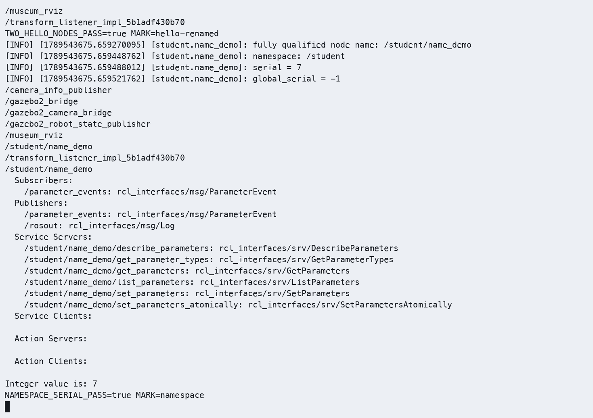

在另一个 COM260 终端加载同样环境后执行查询；运行节点的终端会持续等待。终端应显示 `/student/name_demo` 的完整名称；RViz 可显示仿真机器人和 TF。源码：`src_k3_com260_kit/name_demo_cpp/src/name_demo.cpp`，仿真入口：`src_k3_pico_itx/robot_sim_demo/launch/gazebo2.launch.py`。

> **实验课时**：2 课时（90 分钟）
> **实验平台**：COM260 / Bianbu 4.0.6 / ROS 2 Humble；x86 Humble/Harmonic 课程容器

---

## 实验目标

完成本实验后，学员应能够：
1. 独立创建 ROS 2 C++17 包和节点
2. 配置 CMakeLists.txt 中的构建与安装目标
3. 使用日志系统进行程序调试
4. 使用 ros2 命令行工具查看系统状态
5. 使用 rqt_graph 和 RViz2 可视化工具

---

## 练习 3.1：创建并运行 C++17 节点（约 30 分钟）

### 目标
创建一个完整的 C++17 节点，通过定时器周期输出日志。

### 步骤

**步骤1：创建 C++17 包**

【COM260 板端】已有同名包时先核对并保留，首次创建演示使用独立空工作空间，不覆盖已有练习。
```bash
source ~/.config/ros2-course-com260/env.bash
mkdir -p ~/my_hello_com260_ws/src
cd ~/my_hello_com260_ws/src
ros2 pkg create hello_pkg_cpp --build-type ament_cmake \
  --dependencies rclcpp nav_msgs
```

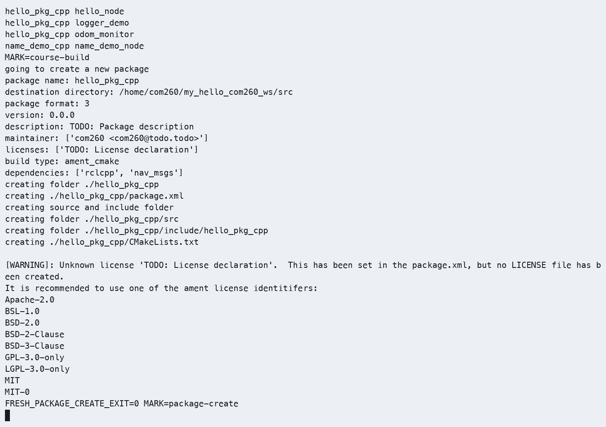

**步骤2：编写节点代码**

在 `~/my_hello_com260_ws/src/hello_pkg_cpp/src/` 目录下创建 `hello_node.cpp`：

```cpp
#include <chrono>
#include <functional>
#include <memory>

#include "rclcpp/rclcpp.hpp"

using namespace std::chrono_literals;

class HelloNode : public rclcpp::Node
{
public:
  HelloNode()
  : Node("hello_node"), count_(0)
  {
    timer_ = create_wall_timer(1s, std::bind(&HelloNode::tick, this));
    RCLCPP_INFO(get_logger(), "HELLO_CPP_OK HelloNode started");
  }

private:
  void tick()
  {
    ++count_;
    RCLCPP_INFO(get_logger(), "Hello ROS 2! count=%zu", count_);
  }

  rclcpp::TimerBase::SharedPtr timer_;
  std::size_t count_;
};

int main(int argc, char ** argv)
{
  rclcpp::init(argc, argv);
  rclcpp::spin(std::make_shared<HelloNode>());
  rclcpp::shutdown();
  return 0;
}
```

**步骤3：配置 CMakeLists.txt**

编辑 `~/my_hello_com260_ws/src/hello_pkg_cpp/CMakeLists.txt`，写入以下内容：

```cmake
cmake_minimum_required(VERSION 3.10)
project(hello_pkg_cpp)
find_package(ament_cmake REQUIRED)
find_package(rclcpp REQUIRED)
add_executable(hello_node src/hello_node.cpp)
target_compile_features(hello_node PUBLIC cxx_std_17)
ament_target_dependencies(hello_node rclcpp)
install(TARGETS hello_node DESTINATION lib/${PROJECT_NAME})
ament_package()
```

**步骤4：编译并运行**
```bash
cd ~/my_hello_com260_ws
python3 -m colcon build --packages-select hello_pkg_cpp --symlink-install
source install/setup.bash
ros2 run hello_pkg_cpp hello_node
# 期望输出：[INFO] HELLO_CPP_OK HelloNode started
#          [INFO] Hello ROS 2! count=1
#          [INFO] Hello ROS 2! count=2
```

**步骤4：检查运行结果与图示一致**

- 截图1：python3 -m colcon build 输出显示编译成功

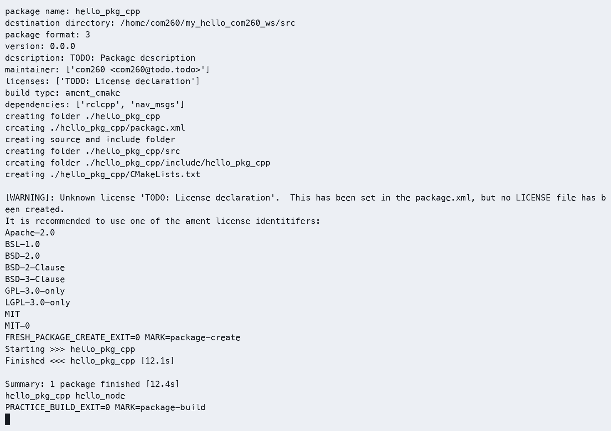

- 截图2：ros2 run 输出显示周期日志

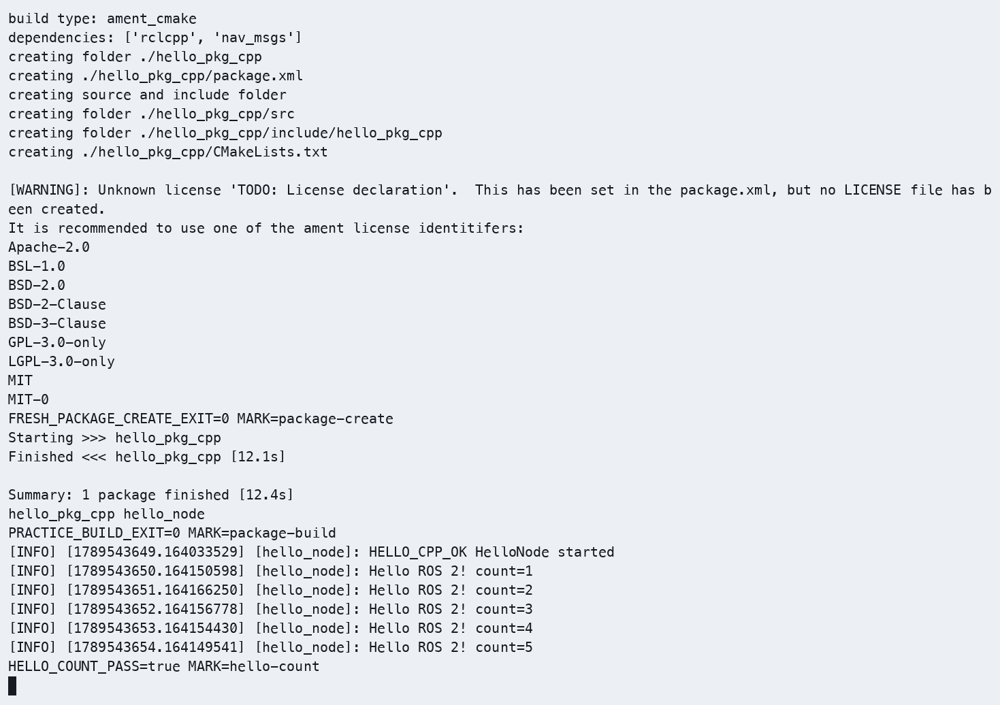

- 截图3：`ros2 node list` 显示 /hello_node

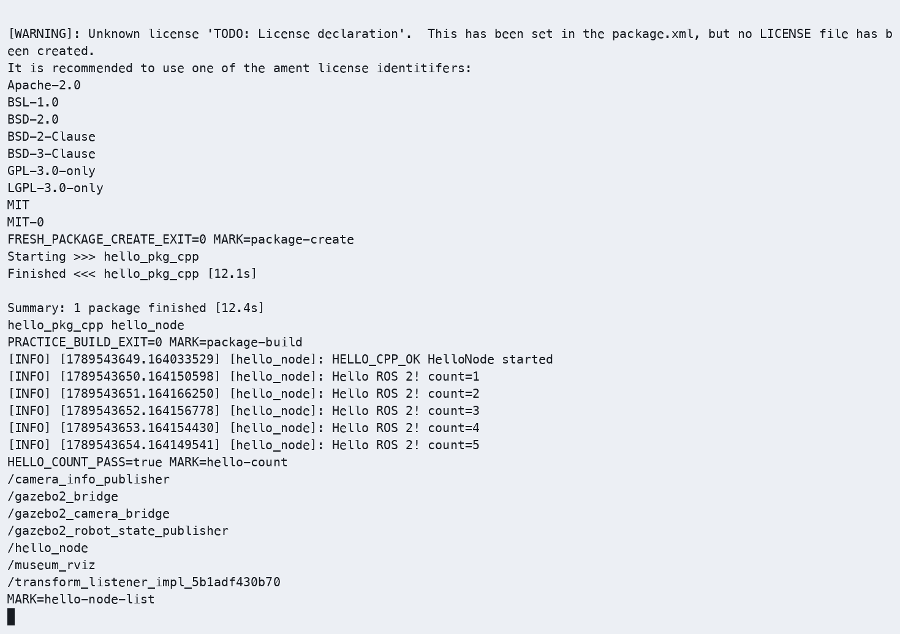

### 参考代码
> 完整参考代码位于 `src_k3_com260_kit/hello_pkg_cpp/`

---

## 练习 3.2：日志系统实验（约 30 分钟）

### 目标
掌握 ROS 2 日志系统，测试不同日志级别和节流功能。

### 步骤

**步骤1：创建带日志功能的节点**

在 `hello_pkg_cpp/src/` 下创建 `logger_demo.cpp`：

```cpp
#include <chrono>
#include <functional>
#include <memory>

#include "rclcpp/rclcpp.hpp"

using namespace std::chrono_literals;

class LoggerDemo : public rclcpp::Node
{
public:
  LoggerDemo()
  : Node("logger_demo"), count_(0)
  {
    timer_ = create_wall_timer(1s, std::bind(&LoggerDemo::tick, this));
    RCLCPP_INFO(get_logger(), "LOGGER_CPP_OK logger demo started");
  }

private:
  void tick()
  {
    ++count_;
    RCLCPP_DEBUG(get_logger(), "DEBUG message #%zu", count_);
    RCLCPP_INFO(get_logger(), "INFO message #%zu", count_);
    RCLCPP_WARN(get_logger(), "WARN message #%zu", count_);
    if (count_ == 3) {
      RCLCPP_ERROR(get_logger(), "ERROR: exception on message 3");
    }
    if (count_ >= 5) {
      RCLCPP_WARN_THROTTLE(get_logger(), *get_clock(), 2000, "high-frequency warning (throttled)");
    }
  }

  rclcpp::TimerBase::SharedPtr timer_;
  std::size_t count_;
};

int main(int argc, char ** argv)
{
  rclcpp::init(argc, argv);
  rclcpp::spin(std::make_shared<LoggerDemo>());
  rclcpp::shutdown();
  return 0;
}
```

**步骤2：配置构建目标并编译**

在 CMakeLists.txt 的 `ament_package()` 前添加：
```cmake
add_executable(logger_demo src/logger_demo.cpp)
target_compile_features(logger_demo PUBLIC cxx_std_17)
ament_target_dependencies(logger_demo rclcpp)
install(TARGETS logger_demo DESTINATION lib/${PROJECT_NAME})
```

**步骤3：运行并观察日志**
```bash
cd ~/my_hello_com260_ws
python3 -m colcon build --packages-select hello_pkg_cpp --symlink-install
source install/setup.bash
ros2 run hello_pkg_cpp logger_demo --ros-args --log-level logger_demo:=DEBUG
# 观察各级别日志输出
# Ctrl+C 停止
```

**步骤4：使用命令行参数修改日志级别**（C++ 节点由 CLI 指定日志等级，不在源码中覆盖）
```bash
# 仅输出 ERROR 级日志
ros2 run hello_pkg_cpp logger_demo --ros-args --log-level ERROR
# 期望：仅看到 ERROR 输出

# 指定节点日志级别
ros2 run hello_pkg_cpp logger_demo --ros-args \
  --log-level logger_demo:=WARN
# 期望：仅看到 WARN 及以上输出
```

**步骤4：检查运行结果与图示一致**

- 截图1：显式启用 DEBUG 后的日志输出（DEBUG ~ ERROR）

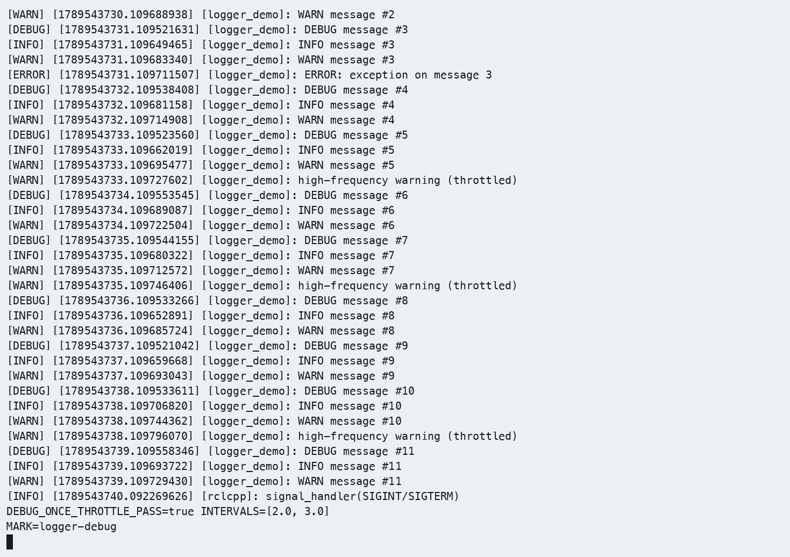

- 截图2：`--log-level ERROR` 仅显示错误日志

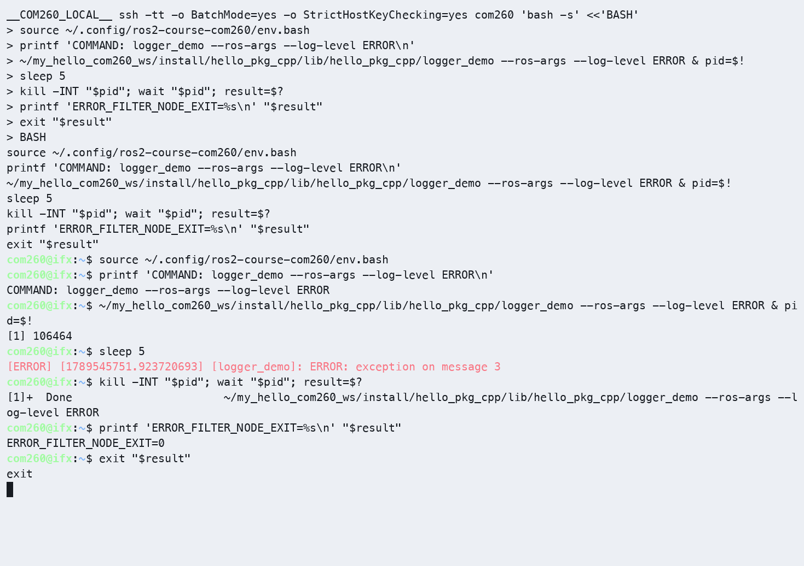

- 截图3：`rqt_console` 输出（`ros2 run rqt_console rqt_console`）

【x86 课程容器，另一个终端】加载环境并启动控制台，然后在 COM260 重新运行 DEBUG 示例，观察第 3 次 ERROR 和持续追加的日志。

```bash
source /opt/ros/humble/setup.bash
ros2 run rqt_console rqt_console
```

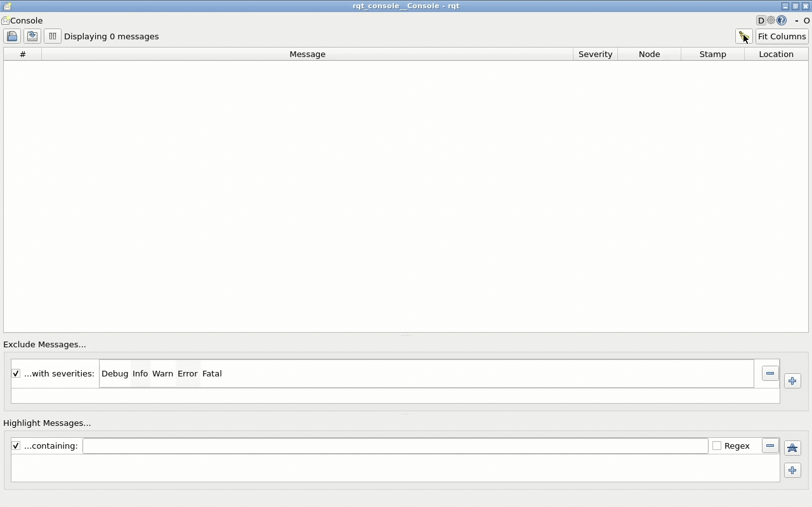

### 参考代码
> 完整参考代码位于 `src_k3_com260_kit/hello_pkg_cpp/src/logger_demo.cpp`

---

## 练习 3.3：可视化工具使用（约 30 分钟）

### 目标
使用 rqt_graph 和 RViz2 查看 ROS 2 系统状态。

### 步骤

**步骤1：启动 talker 和 listener 两个节点**
```bash
# 终端1
ros2 run demo_nodes_cpp talker

# 终端2
ros2 run demo_nodes_cpp listener
```

**步骤2：启动 rqt_graph**

【x86 课程容器终端】
```bash
# 终端3
rqt_graph
```
- 在 rqt_graph 界面中，观察节点（椭圆）与话题（矩形）的拓扑关系
- 选择 "Nodes/Topics (all)" 查看完整图
- 截图保存拓扑图

**步骤3：查看节点信息**
```bash
# 终端3
ros2 node info /talker
# 期望输出：
# Subscribers: /parameter_events
# Publishers: /chatter: std_msgs/msg/String

ros2 node info /listener
# 期望输出：
# Subscribers: /chatter: std_msgs/msg/String
# Publishers: /parameter_events
```

**步骤4：启动 RViz2**

【x86 课程容器终端】查看已启动的课程 RViz 窗口；仅在没有 RViz 窗口时执行：
```bash
rviz2
```
- 左侧 "Displays" → Add → "By topic"，选择话题添加显示
- 理解 RViz2 的 Displays 面板和 Views 面板

**步骤4：检查运行结果与图示一致**

- 截图1：rqt_graph 中的节点-话题拓扑图

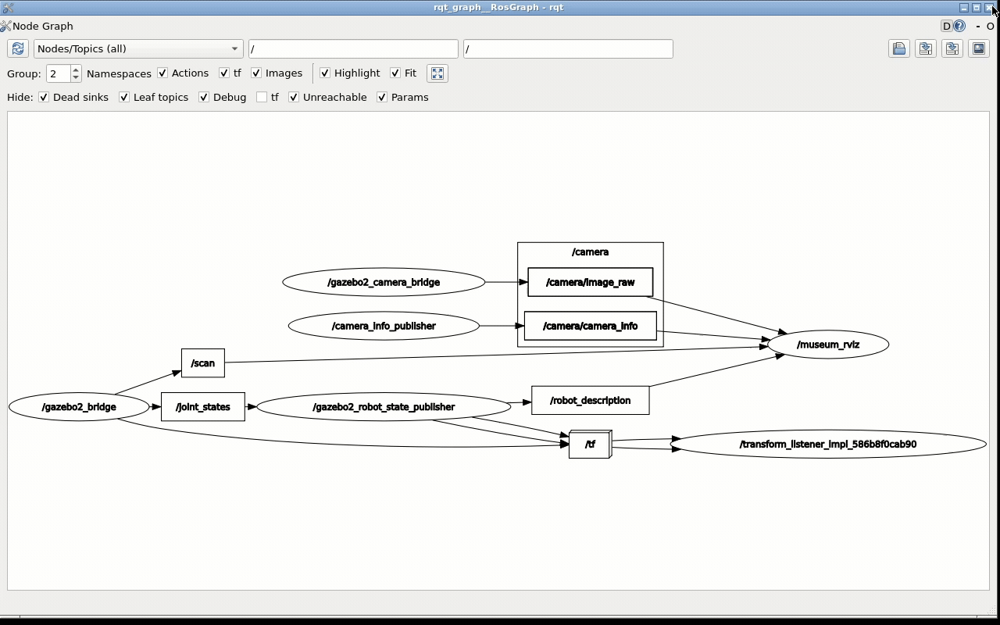

- 截图2：ros2 node info /talker 输出

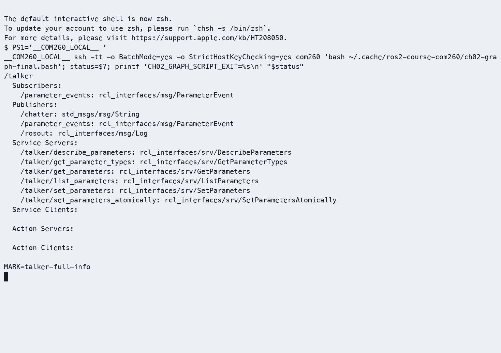

- 截图3：RViz2 启动界面

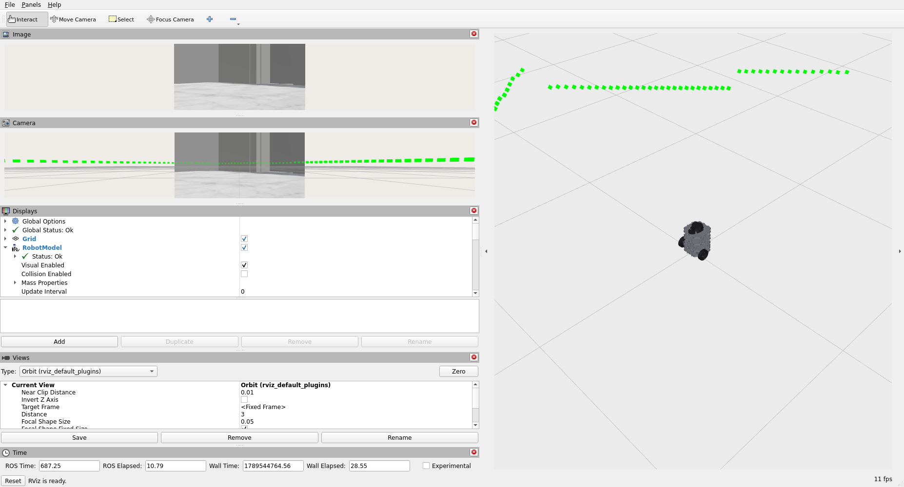

### 思考题

1. `rqt_graph` 中哪些是节点？哪些是话题？如何区分？椭圆表述节点，矩形表示话题，用箭头链接，	节点 → 话题表示发布，话题 → 节点表示订阅
2. `--log-level` 参数的默认值是多少？（练习3.1步骤1）默认参数是info，ROS2默认会输出 INFO、WARN、ERROR 和 FATAL 级别的日志，不会输出 DEBUG 日志
3. 如果 CMake 构建或安装目标未正确配置，运行时会出现什么错误？未构建或未安装可执行文件时，`ros2 run` 通常提示 `No executable found`；应检查目标、安装目录及工作空间环境。

---

## 练习 4：节点与仿真交互 — 订阅 /odom 查看机器人位置（约 15 分钟）

### 目标
编写一个订阅者节点，订阅 TurtleBot3 Burger 仿真的 `/odom` 话题，实时输出平面位置（x、y）、航向角（yaw）、前向线速度（vx）和绕 z 轴的角速度（wz）。

### 步骤

**步骤1：启动课程仿真**

【x86 课程容器】继续使用本章开头的同一实例；尚未启动时才运行以下命令，避免重复的 `/cmd_vel` 订阅者和仿真节点。

```bash
source /opt/ros/humble/setup.bash
source /workspace/install/setup.bash
ros2 launch robot_sim_demo gazebo2.launch.py gui:=true rviz:=true drive:=false
```

**步骤2：创建 odom_monitor.cpp**
```cpp
#include <cmath>
#include <functional>
#include <memory>

#include "nav_msgs/msg/odometry.hpp"
#include "rclcpp/rclcpp.hpp"

class OdomMonitor : public rclcpp::Node
{
public:
  OdomMonitor()
  : Node("odom_monitor")
  {
    subscription_ = create_subscription<nav_msgs::msg::Odometry>(
      "/odom", 10, std::bind(&OdomMonitor::handle, this, std::placeholders::_1));
  }

private:
  void handle(const nav_msgs::msg::Odometry::SharedPtr message)
  {
    const auto & position = message->pose.pose.position;
    const auto & orientation = message->pose.pose.orientation;
    const auto & velocity = message->twist.twist;
    const double yaw = std::atan2(
      2.0 * (orientation.w * orientation.z + orientation.x * orientation.y),
      1.0 - 2.0 * (orientation.y * orientation.y + orientation.z * orientation.z));
    RCLCPP_INFO(
      get_logger(), "ODOM_RECEIVED x=%.2f m y=%.2f m yaw=%.2f rad vx=%.3f m/s wz=%.3f rad/s",
      position.x, position.y, yaw, velocity.linear.x, velocity.angular.z);
  }

  rclcpp::Subscription<nav_msgs::msg::Odometry>::SharedPtr subscription_;
};

int main(int argc, char ** argv)
{
  rclcpp::init(argc, argv);
  rclcpp::spin(std::make_shared<OdomMonitor>());
  rclcpp::shutdown();
  return 0;
}
```

先在 `CMakeLists.txt` 的 `ament_package()` 前注册里程计节点（`package.xml` 已由建包命令声明 `nav_msgs`）：

```cmake
find_package(nav_msgs REQUIRED)
add_executable(odom_monitor src/odom_monitor.cpp)
target_compile_features(odom_monitor PUBLIC cxx_std_17)
ament_target_dependencies(odom_monitor rclcpp nav_msgs)
install(TARGETS odom_monitor DESTINATION lib/${PROJECT_NAME})
```

本实现按已确认的修正使用完整四元数公式 `atan2(2*(w*z+x*y), 1-2*(y*y+z*z))` 计算 yaw，替换原章 `2*z` 的简化近似，避免转角较大时产生明显误差。

`vx`、`wz` 分别读取 `/odom` 的 `twist.twist.linear.x`、`twist.twist.angular.z`，单位为 m/s、rad/s；位置和航向的单位分别为 m、rad。速度取自里程计反馈，不能用 `/cmd_vel` 指令值替代。

**步骤3：运行测试**
```bash
# 终端1：仿真已启动
# 终端2：启动 odom_monitor
cd ~/my_hello_com260_ws
source ~/.config/ros2-course-com260/env.bash
python3 -m colcon build --packages-select hello_pkg_cpp --symlink-install
source install/setup.bash
ros2 run hello_pkg_cpp odom_monitor

# 终端3：发送控制指令改变机器人位置
ros2 topic pub /cmd_vel geometry_msgs/msg/Twist \
  "{linear: {x: 0.2}, angular: {z: 0.5}}" -r 10
```

在速度发布终端按 Ctrl+C 后发送停止指令：

```bash
ros2 topic pub --once /cmd_vel geometry_msgs/msg/Twist "{linear: {x: 0.0}, angular: {z: 0.0}}"
```

**✓ 验证**：分别观察初始静止、运动和停止后的 `x、y、yaw、vx、wz`，确认位置、航向及速度反馈与运动状态一致。另开已加载课程环境的 COM260 终端，持续查看原始速度字段并与节点日志对应，观察结束后 Ctrl+C：

```bash
ros2 topic echo /odom nav_msgs/msg/Odometry --field twist.twist
```

静止和停止后速度应接近零，运动期间应有有效的线速度和角速度反馈；具体数值以 `/odom` 实测为准。若位置变化但速度字段始终为零，应核对仿真里程计输出，不能将该情况判为速度验证通过。

先前实测覆盖位置和航向变化：C++ 节点日志首尾显示从约 `(0, 0, 0)` 到 `(0.28, 0.69, 2.37)`；下图按该次原始 `/odom` 的完整四元数计算验收数值。

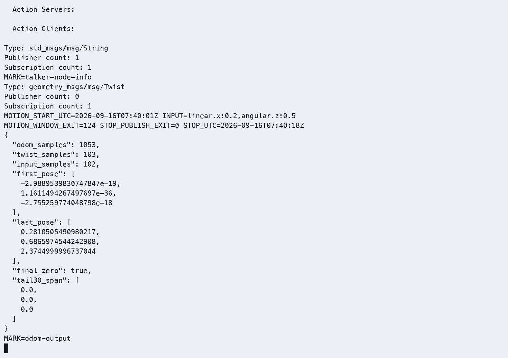

**新增速度输出补验（2026-09-16）**：运行编号 `20260916T153020Z-ch02-velocity`。课程与独立练习工作区均重新构建成功，并分别通过 90 条[已知输入消息验证](images/ch02/ch02-velocity-input.cast)。随后在独立 Gazebo 实例中使用原运动输入，采集原始 `/odom` 并与新版 C++ 日志比对：

| 阶段 | 原始里程计速度反馈 | 观察结果 |
|---|---|---|
| 静止 | `vx、wz` 均接近 0 | 位置保持不变 |
| 运动 | 稳定段约 `vx=0.200 m/s、wz=0.500 rad/s` | 位置和航向连续变化，包含起步加速过程 |
| 停止 | 稳定段 `vx=0、wz=0` | 末尾 30 条样本位置保持不变 |

本次结束位置约为 `(0.028 m, 0.799 m)`，航向为 `3.081 rad`；它属于本次独立运行，不与上图旧运行的终点混用。节点退出码为 0，原始消息与 C++ 输出的数值按显示精度比对一致。


[完整终端 CAST](images/ch02/ch02-velocity.cast)、[Gazebo 连续 MP4](images/ch02/ch02-velocity-gazebo.mp4)。GUI 片段取本轮原录像约第 24～62 秒，共约 38 秒，原速、连续无拼接；原始记录及清理结论见[本轮证据索引](runtime_evidence.md#ch02)。

### 思考题
1. `/odom` 中的 `pose.pose.orientation` 使用四元数表示姿态，如何转换为欧拉角？使用 TF2转换为欧拉角 (Roll、Pitch、Yaw)，其中Yaw是航向角
2. 如何利用 `/odom` 数据计算机器人的行驶总距离？每次接收 /odom 消息时，读取当前位置 (x, y)，与上一时刻的位置计算两点间距离 并将每次位移累加，得到机器人的总行驶距离。

## 实际运行证据

本轮在 COM260 运行 C++17 节点，在 x86 运行 Museum/Burger 仿真和图形工具。运动输入沿用 `linear.x=0.2`、`angular.z=0.5`，显式发送零速度停止。

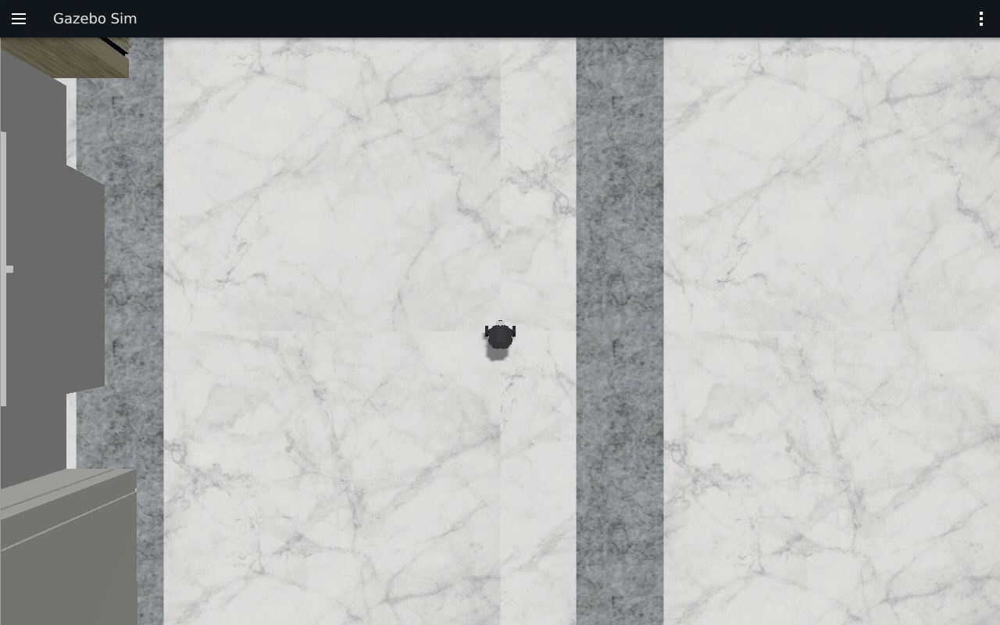

连续 GUI 录像：[Gazebo MP4](images/ch02/ch02-gazebo.mp4)、[rqt_graph MP4](images/ch02/ch02-rqt-graph.mp4)、[rqt_console MP4](images/ch02/ch02-rqt-console.mp4)。GIF 来自本轮真实录像，未使用旧板素材或生成画面。


完整终端：[建包、节点与日志 CAST](images/ch02/ch02-basics.cast)、[MP4](images/ch02/ch02-basics.mp4)；[节点查询与运动 CAST](images/ch02/ch02-motion.cast)、[MP4](images/ch02/ch02-motion.mp4)。教案两个独立程序的编译与 `/scan` 订阅见 [教案 CAST](images/ch02/ch02-teacher.cast) 和[运行证据](runtime_evidence.md#ch02)。
