# 第3章 实验指导书：话题通信编程与实践

连接和环境加载见[公共双端环境](ch00_common_setup.md)。发布者、订阅者和控制节点在 COM260 运行，Gazebo、rqt、RViz 在 x86 课程容器运行。

## 当前仓库仿真验证：订阅 Gazebo 的 `/scan` 与 `/odom`

### 实验目标

把本实验的 Publisher/Subscriber 知识应用到真实仿真话题，检查消息类型、发布者数量、QoS 和持续数据流。

### 运行步骤

【x86 主机】启动本轮仿真（Gazebo、RViz 使用第一章已经建立的 Humble 容器环境）：

```bash
bash ~/ROS2_RISCV_COM260/course_support/k3_com260_kit/scripts/x86-gazebo.bash start-ch03 ch03-course
```

运动验证前按[公共环境的有线接口复核](ch00_common_setup.md#dds-wired)检查两端路由、延迟和 DDS 接口；更换网络配置后须重启仿真实例。本章复用这一仿真实例。`start-ch03` 使用独立 RViz 配置，Fixed Frame 为 `odom`，Odometry 的 `/odom` 历史箭头用于观察轨迹。双端首次准备及文件同步见[公共环境](ch00_common_setup.md)；COM260 在仓库目录先执行 `bash setup_course_k3_com260_kit.sh --build-ch03`，只构建本章四包。

【COM260】另开终端，先停止其他 `/cmd_vel` 发布者：

```bash
source ~/.config/ros2-course-com260/env.bash
source ~/ros2_course_com260_ws/install/setup.bash
ros2 topic info /scan
ros2 topic echo /scan sensor_msgs/msg/LaserScan --once
ros2 topic echo /odom nav_msgs/msg/Odometry --once
ros2 topic pub --once /cmd_vel geometry_msgs/msg/Twist \
  "{linear: {x: 0.1}, angular: {z: 0.0}}"
# 观察消息后发送零速停止。
ros2 topic pub --once /cmd_vel geometry_msgs/msg/Twist "{}"
```

### 观察与验收

`/scan` 应为 `sensor_msgs/msg/LaserScan`，`/odom` 应为 `nav_msgs/msg/Odometry`；可将实验订阅节点的输入改为 `/scan`。源码：`src_k3_pico_itx/robot_sim_demo/config/gazebo2_bridge.yaml`。

> **实验课时**：2 课时（90 分钟）
> **实验平台**：COM260 Kit / Bianbu >= 4.0.1 / ROS 2 Humble；x86 Humble/Harmonic 课程容器

---

## 实验目标

完成本实验后，学员应能够：
1. 编写 Publisher 和 Subscriber 节点
2. 理解标准消息类型的使用
3. 创建并使用自定义消息接口
4. 配置测试不同的 QoS 策略

---

## 练习 3.1：Publisher 与 Subscriber 通信（约 30 分钟）

### 目标
实现一个完整的发布-订阅通信链路，发布者周期发送消息，订阅者接收并打印。

### 步骤

**步骤1：创建 topic_demo_cpp 包**
```bash
source ~/.config/ros2-course-com260/env.bash
mkdir -p ~/my_topics_com260_ws/src
cd ~/my_topics_com260_ws/src
ros2 pkg create topic_demo_cpp --build-type ament_cmake \
  --dependencies rclcpp std_msgs geometry_msgs
```

**步骤2：编写 Publisher 节点**

在 `~/my_topics_com260_ws/src/topic_demo_cpp/src/` 下创建 `publisher.cpp`：

```cpp
#include <chrono>
#include <functional>
#include <memory>

#include "geometry_msgs/msg/point.hpp"
#include "rclcpp/rclcpp.hpp"

using namespace std::chrono_literals;

class PositionPublisher : public rclcpp::Node
{
public:
  PositionPublisher()
  : Node("gps_publisher"), x_(0.0)
  {
    publisher_ = create_publisher<geometry_msgs::msg::Point>("/gps_position", 10);
    timer_ = create_wall_timer(1s, std::bind(&PositionPublisher::publish, this));
  }

private:
  void publish()
  {
    geometry_msgs::msg::Point message;
    message.x = x_;
    message.y = 2.0 * x_ + 1.0;
    publisher_->publish(message);
    RCLCPP_INFO(get_logger(), "GPS_PUBLISHED x=%.2f y=%.2f", message.x, message.y);
    x_ += 1.0;
  }

  rclcpp::Publisher<geometry_msgs::msg::Point>::SharedPtr publisher_;
  rclcpp::TimerBase::SharedPtr timer_;
  double x_;
};

int main(int argc, char ** argv)
{
  rclcpp::init(argc, argv);
  rclcpp::spin(std::make_shared<PositionPublisher>());
  rclcpp::shutdown();
  return 0;
}
```

**步骤3：编写 Subscriber 节点**

在 `topic_demo_cpp/src/` 下创建 `gps_subscriber.cpp`：

```cpp
#include <cmath>
#include <functional>
#include <memory>

#include "geometry_msgs/msg/point.hpp"
#include "rclcpp/rclcpp.hpp"

class GpsSubscriber : public rclcpp::Node
{
public:
  GpsSubscriber()
  : Node("gps_subscriber")
  {
    subscription_ = create_subscription<geometry_msgs::msg::Point>(
      "/gps_position", 10, std::bind(&GpsSubscriber::handle, this, std::placeholders::_1));
  }

private:
  void handle(const geometry_msgs::msg::Point::SharedPtr message)
  {
    const double distance = std::hypot(message->x, message->y);
    RCLCPP_INFO(
      get_logger(), "GPS_RECEIVED x=%.2f y=%.2f distance=%.2f", message->x, message->y, distance);
  }

  rclcpp::Subscription<geometry_msgs::msg::Point>::SharedPtr subscription_;
};

int main(int argc, char ** argv)
{
  rclcpp::init(argc, argv);
  rclcpp::spin(std::make_shared<GpsSubscriber>());
  rclcpp::shutdown();
  return 0;
}
```

**步骤4：配置 CMakeLists.txt 并编译**

编辑 `topic_demo_cpp/CMakeLists.txt`：
```cmake
cmake_minimum_required(VERSION 3.10)
project(topic_demo_cpp)
find_package(ament_cmake REQUIRED)
find_package(rclcpp REQUIRED)
find_package(geometry_msgs REQUIRED)
add_executable(publisher src/publisher.cpp)
target_compile_features(publisher PUBLIC cxx_std_17)
ament_target_dependencies(publisher rclcpp geometry_msgs)
install(TARGETS publisher DESTINATION lib/${PROJECT_NAME})
add_executable(gps_subscriber src/gps_subscriber.cpp)
target_compile_features(gps_subscriber PUBLIC cxx_std_17)
ament_target_dependencies(gps_subscriber rclcpp geometry_msgs)
install(TARGETS gps_subscriber DESTINATION lib/${PROJECT_NAME})
ament_package()
```

```bash
cd ~/my_topics_com260_ws
python3 -m colcon build --packages-select topic_demo_cpp --symlink-install
source install/setup.bash
```

**步骤5：运行测试**
```bash
source ~/.config/ros2-course-com260/env.bash
source ~/my_topics_com260_ws/install/setup.bash
# 终端1：启动发布者
ros2 run topic_demo_cpp publisher
# 终端2：启动订阅者
ros2 run topic_demo_cpp gps_subscriber
# 终端3：监控
ros2 topic echo /gps_position
ros2 topic hz /gps_position       # 查看发布频率（期望 ~1Hz）
```

**步骤5：检查运行结果与图示一致**

- 话题消息字段：

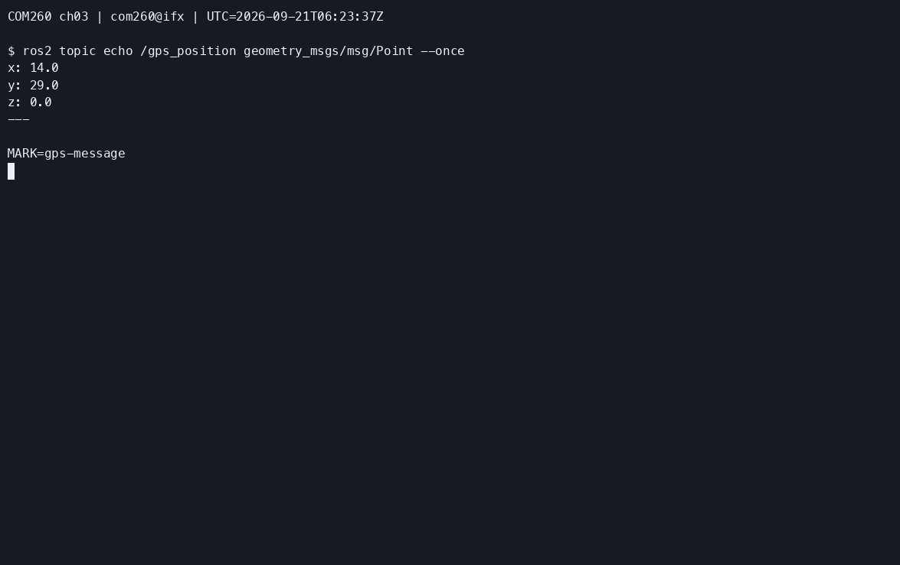

- 截图1：publisher 发布日志

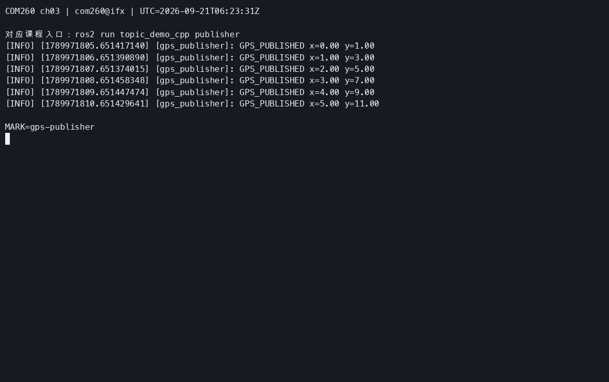

- 截图2：subscriber 接收日志

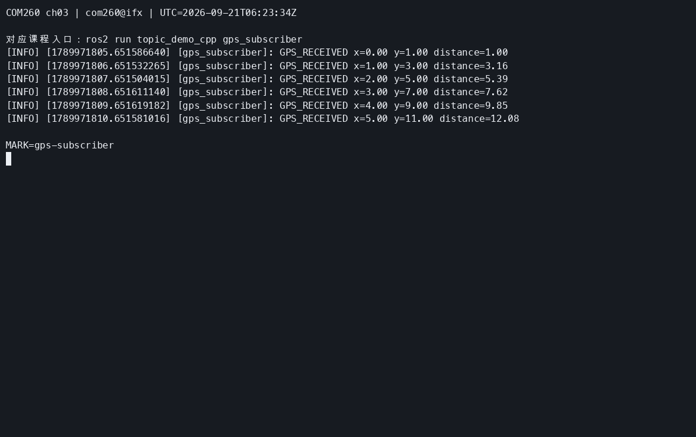

- 截图3：`ros2 topic hz /gps_position` 输出（频率）

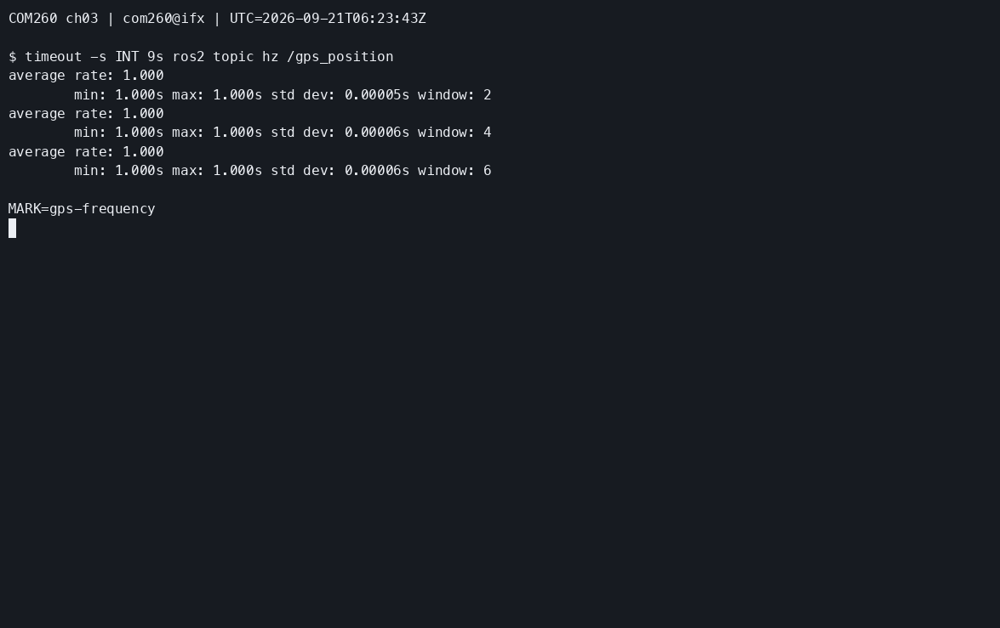

- 截图4：rqt_graph 通信拓扑

【x86 课程容器】在 `podman exec -it ros2-com260-ch03-course bash` 打开的终端运行：

```bash
source /opt/ros/humble/setup.bash
source /workspace/install/setup.bash
rqt_graph
```

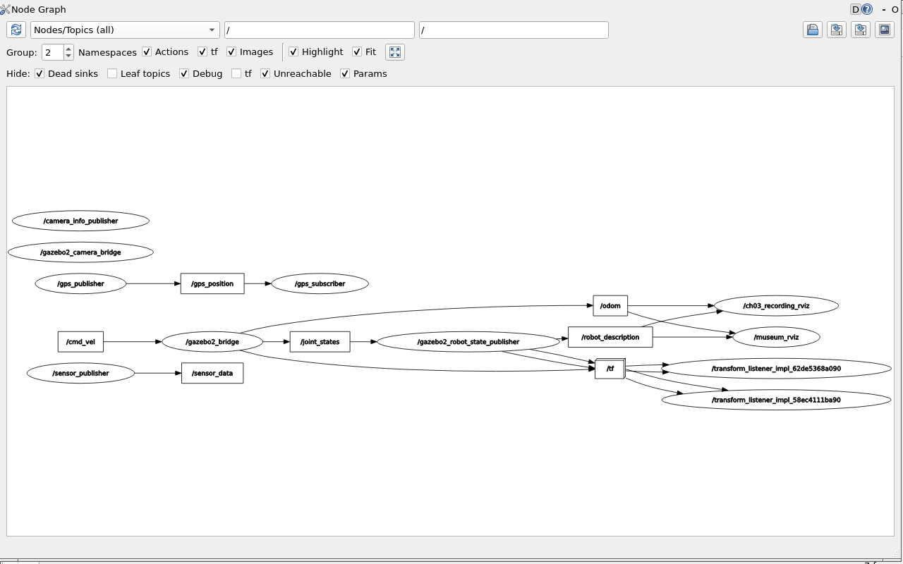

### 参考代码
> 完整参考代码位于 `src_k3_com260_kit/topic_demo_cpp/`

---

## 练习 3.2：自定义消息接口（约 30 分钟）

### 目标
创建自定义消息接口包，定义 `SensorData.msg` 并在 C++17 中使用。

### 步骤

**步骤1：创建 CMake 消息接口包**（先查有没有，有的话就不用创建了）
```bash
cd ~/my_topics_com260_ws/src
ros2 pkg create sensor_interfaces --build-type ament_cmake
```

**步骤2：定义 SensorData.msg**

创建 `sensor_interfaces/msg/SensorData.msg`：
因为没有 msg 文件夹，先创建目录再编辑文件：

```bash
mkdir -p ~/my_topics_com260_ws/src/sensor_interfaces/msg
nano ~/my_topics_com260_ws/src/sensor_interfaces/msg/SensorData.msg
```

```text
# 传感器数据消息定义
float64 temperature      # 温度 (℃)
float64 humidity         # 湿度 (%)
float64 pressure         # 气压 (hPa)
string device_id         # 传感器ID
```

**步骤3：配置 CMakeLists.txt**
```cmake
cmake_minimum_required(VERSION 3.8)
project(sensor_interfaces)

find_package(ament_cmake REQUIRED)
find_package(rosidl_default_generators REQUIRED)
rosidl_generate_interfaces(${PROJECT_NAME}
  "msg/SensorData.msg"
)
ament_package()
```

**步骤4：配置 package.xml**

在生成的 `<package>` 内保留 `ament_cmake` 构建依赖，并补充以下声明；若已有 `<depend>rosidl_default_generators</depend>`，先移除该行，避免与 `build_depend` 重复：

```xml
<build_depend>rosidl_default_generators</build_depend>
<exec_depend>rosidl_default_runtime</exec_depend>
<member_of_group>rosidl_interface_packages</member_of_group>
```

**步骤5：编译接口包**
```bash
cd ~/my_topics_com260_ws
python3 -m colcon build --packages-select sensor_interfaces
source install/setup.bash
ros2 interface show sensor_interfaces/msg/SensorData
```

**步骤6：创建使用自定义消息的 C++17 包**
```bash
cd ~/my_topics_com260_ws/src
ros2 pkg create sensor_pub_cpp --build-type ament_cmake \
  --dependencies rclcpp sensor_interfaces
```

编写 `sensor_pub_cpp/src/sensor_publisher.cpp`：
```cpp
#include <chrono>
#include <functional>
#include <memory>

#include "rclcpp/rclcpp.hpp"
#include "sensor_interfaces/msg/sensor_data.hpp"

using namespace std::chrono_literals;

class SensorPublisher : public rclcpp::Node
{
public:
  SensorPublisher()
  : Node("sensor_publisher")
  {
    publisher_ = create_publisher<sensor_interfaces::msg::SensorData>("/sensor_data", 10);
    timer_ = create_wall_timer(1s, std::bind(&SensorPublisher::publish, this));
  }

private:
  void publish()
  {
    sensor_interfaces::msg::SensorData message;
    message.temperature = 25.5F;
    message.humidity = 60.0F;
    message.pressure = 1013.25F;
    message.device_id = "sensor_01";
    publisher_->publish(message);
    RCLCPP_INFO(get_logger(), "SENSOR_PUBLISHED device_id=%s", message.device_id.c_str());
  }

  rclcpp::Publisher<sensor_interfaces::msg::SensorData>::SharedPtr publisher_;
  rclcpp::TimerBase::SharedPtr timer_;
};

int main(int argc, char ** argv)
{
  rclcpp::init(argc, argv);
  rclcpp::spin(std::make_shared<SensorPublisher>());
  rclcpp::shutdown();
  return 0;
}
```

**步骤7：编译并运行**
在 `sensor_pub_cpp/CMakeLists.txt` 中写入：

```cmake
cmake_minimum_required(VERSION 3.10)
project(sensor_pub_cpp)

find_package(ament_cmake REQUIRED)
find_package(rclcpp REQUIRED)
find_package(sensor_interfaces REQUIRED)

add_executable(sensor_publisher src/sensor_publisher.cpp)
target_compile_features(sensor_publisher PUBLIC cxx_std_17)
ament_target_dependencies(sensor_publisher rclcpp sensor_interfaces)
install(TARGETS sensor_publisher DESTINATION lib/${PROJECT_NAME})
ament_package()
```

```bash
source ~/.config/ros2-course-com260/env.bash
source ~/my_topics_com260_ws/install/setup.bash
cd ~/my_topics_com260_ws

python3 -m colcon build --packages-select sensor_interfaces sensor_pub_cpp --symlink-install
source ~/my_topics_com260_ws/install/setup.bash

ros2 interface show sensor_interfaces/msg/SensorData
ros2 pkg executables sensor_pub_cpp
ros2 run sensor_pub_cpp sensor_publisher # 终端1
ros2 topic echo /sensor_data          # 终端2
```

**步骤7：检查运行结果与图示一致**

- 截图1：`ros2 interface show sensor_interfaces/msg/SensorData` 输出消息定义

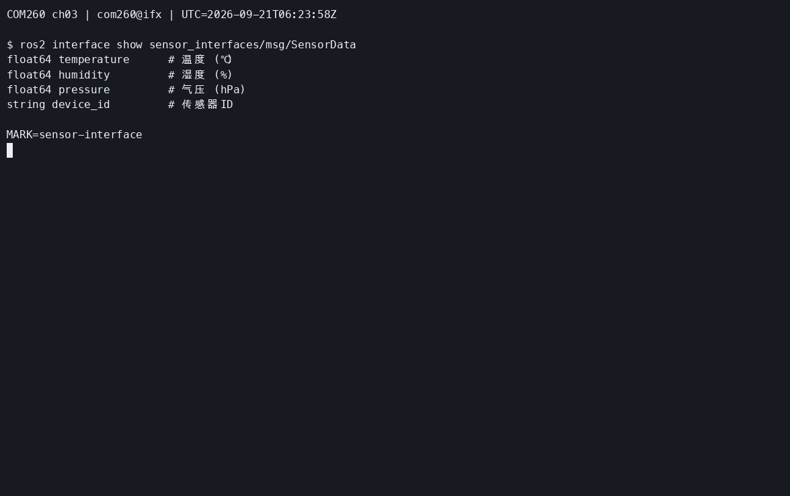

- 截图2：发布者和 echo 终端输出

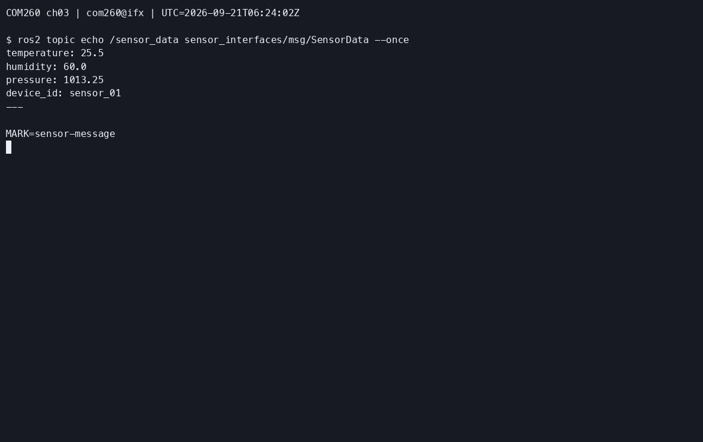

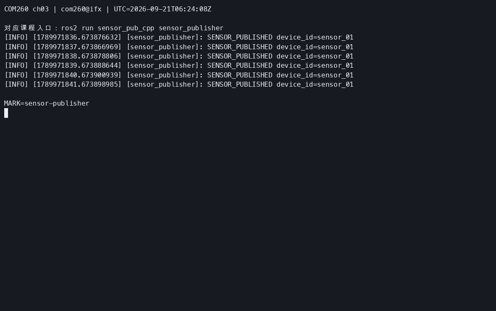

- 截图3：rqt_graph 中的自定义消息话题


### 参考代码
> 完整参考代码位于 `src_k3_com260_kit/sensor_interfaces/` 和 `src_k3_com260_kit/sensor_pub_cpp/`

---

## 练习 3.3：QoS 策略对比实验（约 30 分钟）

### 目标
测试不同 QoS 配置下的通信行为差异。

### 步骤

**步骤1：编写 QoS 测试发布者**

在 `topic_demo_cpp/src/` 下创建 `qos_publisher.cpp`：

```cpp
#include <chrono>
#include <functional>
#include <memory>

#include "rclcpp/rclcpp.hpp"
#include "std_msgs/msg/string.hpp"

using namespace std::chrono_literals;

class QosPublisher : public rclcpp::Node
{
public:
  QosPublisher()
  : Node("qos_publisher"), count_(0)
  {
    rclcpp::QoS reliable(10);
    reliable.reliable();
    rclcpp::QoS best_effort(10);
    best_effort.best_effort();
    reliable_pub_ = create_publisher<std_msgs::msg::String>("/qos_reliable", reliable);
    best_effort_pub_ = create_publisher<std_msgs::msg::String>("/qos_best_effort", best_effort);
    timer_ = create_wall_timer(1s, std::bind(&QosPublisher::publish, this));
  }

private:
  void publish()
  {
    ++count_;
    std_msgs::msg::String reliable;
    reliable.data = "RELIABLE: " + std::to_string(count_);
    reliable_pub_->publish(reliable);
    std_msgs::msg::String best_effort;
    best_effort.data = "BEST_EFFORT: " + std::to_string(count_);
    best_effort_pub_->publish(best_effort);
    RCLCPP_INFO(get_logger(), "QOS_PUBLISHED count=%zu", count_);
  }

  rclcpp::Publisher<std_msgs::msg::String>::SharedPtr reliable_pub_;
  rclcpp::Publisher<std_msgs::msg::String>::SharedPtr best_effort_pub_;
  rclcpp::TimerBase::SharedPtr timer_;
  std::size_t count_;
};

int main(int argc, char ** argv)
{
  rclcpp::init(argc, argv);
  rclcpp::spin(std::make_shared<QosPublisher>());
  rclcpp::shutdown();
  return 0;
}
```

**步骤2：测试兼容性**

| 实验 | Publisher QoS | Subscriber QoS | 预期结果 |
|------|--------------|----------------|---------|
| A | RELIABLE | RELIABLE | ✓ 正常通信 |
| B | RELIABLE | BEST_EFFORT | ✓ 降级通信 |
| C | BEST_EFFORT | BEST_EFFORT | ✓ 正常通信 |
| D | BEST_EFFORT | RELIABLE | ✗ 无法通信 |

在 `topic_demo_cpp/CMakeLists.txt` 的 `ament_package()` 前添加：

```cmake
find_package(std_msgs REQUIRED)
add_executable(qos_publisher src/qos_publisher.cpp)
target_compile_features(qos_publisher PUBLIC cxx_std_17)
ament_target_dependencies(qos_publisher rclcpp std_msgs)
install(TARGETS qos_publisher DESTINATION lib/${PROJECT_NAME})
```

```bash
source ~/.config/ros2-course-com260/env.bash
source ~/my_topics_com260_ws/install/setup.bash
cd ~/my_topics_com260_ws
python3 -m colcon build --packages-select topic_demo_cpp --symlink-install
source ~/my_topics_com260_ws/install/setup.bash
# 终端1：启动发布者
ros2 run topic_demo_cpp qos_publisher

# 终端2：分别测试不同 QoS 订阅
# 实验A：显式设置 RELIABLE
ros2 topic echo /qos_reliable --qos-reliability reliable

# 实验B：以 BEST_EFFORT 订阅 RELIABLE 话题 → 应成功
ros2 topic echo /qos_reliable --qos-reliability best_effort

# 实验D：以 RELIABLE 订阅 BEST_EFFORT 话题 → 应失败
ros2 topic echo /qos_best_effort --qos-reliability reliable

# 实验C：以 BEST_EFFORT 订阅 BEST_EFFORT 话题 → 应成功
ros2 topic echo /qos_best_effort --qos-reliability best_effort
```

**步骤3：检查运行结果与图示一致**

- 截图1：实验 A（成功）：/qos_reliable 正常输出

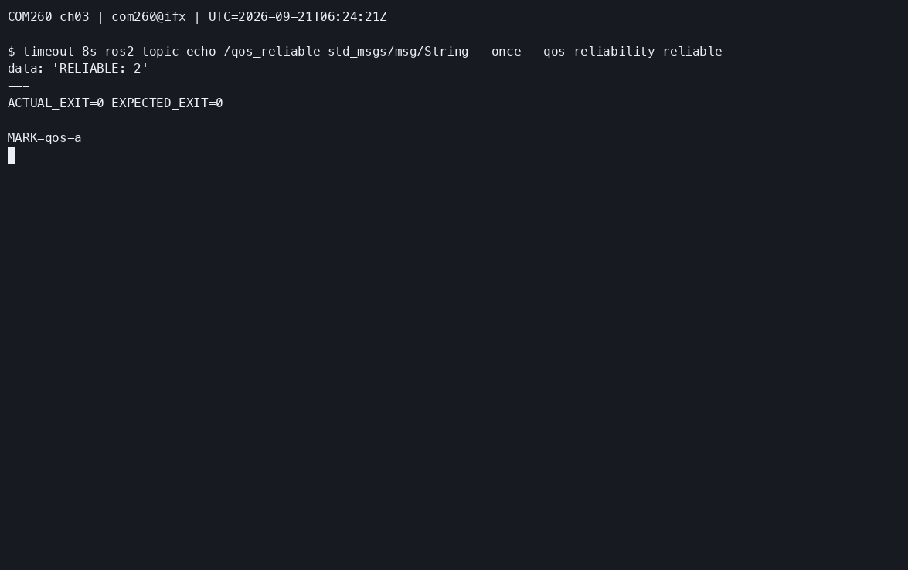

- 截图2：实验 D（失败）：ros2 topic echo 无输出

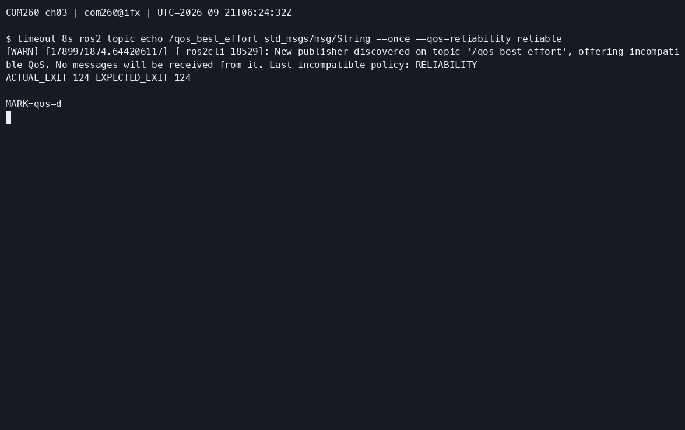

- 截图3：实验 C（成功）：/qos_best_effort 正常输出

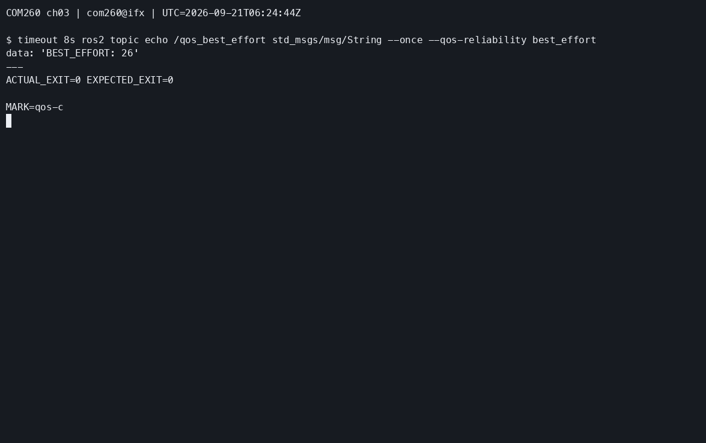

### 参考代码
> 完整参考代码位于 `src_k3_com260_kit/topic_demo_cpp/src/qos_publisher.cpp`

---

## 本章实验总结

| 练习 | 核心技能 | 关键 API |
|------|---------|---------|
| 练习1 | Publisher + Subscriber 编程 | `create_publisher()`, `create_subscription()` |
| 练习2 | 自定义消息接口定义与使用 | `.msg` 定义, `rosidl_generate_interfaces()` |
| 练习3 | QoS 策略配置与兼容性测试 | `rclcpp::QoS`, `reliable()`, `best_effort()` |

### 思考题

1. 如果 Publisher 发布频率 100Hz，Subscriber 处理能力仅 50Hz，使用哪种 QoS 策略处理丢包？KEEP_LAST（depth），队列满就丢掉就消息，保证最新数据，如果可以丢包，可以配合BEST_EFFORT
2. KEEP_LAST(1) 和 KEEP_ALL 的使用场景分别是什么？KEEP_LAST(1)保存最新的一条消息，用于/cmd_vel实时状态数据；KEEP_ALL保存所有消息，用于日志
3. BEST_EFFORT + TRANSIENT_LOCAL 组合能否正常通信？为什么？可以，BEST_EFFORT属于可靠性策略，TRANSIENT_LOCAL是持久性策略，是不同的QoS维度，不冲突

---

## 练习3.4：Twist 控制 TurtleBot3 Burger 走方形轨迹（约 15 分钟）

### 目标
发布 `geometry_msgs/Twist` 消息到 `/cmd_vel`，驱动仿真中的 TurtleBot3 Burger 机器人在 Gazebo 中走正方形轨迹。

### 步骤

**步骤1：启动课程仿真**
沿用本章开头的 x86 仿真实例；若尚未启动，再在 x86 执行：

```bash
bash ~/ROS2_RISCV_COM260/course_support/k3_com260_kit/scripts/x86-gazebo.bash start-ch03 ch03-course
```

**步骤2：创建 square_driver.cpp**
```cpp
#include <algorithm>
#include <chrono>
#include <csignal>
#include <memory>
#include <thread>

#include "geometry_msgs/msg/twist.hpp"
#include "rclcpp/rclcpp.hpp"

using namespace std::chrono_literals;

namespace
{
volatile std::sig_atomic_t stop_requested = 0;
void request_stop(int) {stop_requested = 1;}
}

class SquareDriver : public rclcpp::Node
{
public:
  SquareDriver()
  : Node("square_driver")
  {
    publisher_ = create_publisher<geometry_msgs::msg::Twist>("/cmd_vel", 10);
    motion_clock_ = get_parameter("use_sim_time").as_bool() ?
      get_clock() : std::make_shared<rclcpp::Clock>(RCL_STEADY_TIME);
    RCLCPP_INFO(get_logger(), "SQUARE_DRIVER_ACTIVE waiting=5s");
  }

  bool drive_square()
  {
    for (int i = 0; i < 50 && !stop_requested && rclcpp::ok(); ++i) {
      std::this_thread::sleep_for(100ms);
    }
    if (stop_requested || !rclcpp::ok()) {return false;}
    if (get_parameter("use_sim_time").as_bool() && now().nanoseconds() == 0) {
      RCLCPP_ERROR(get_logger(), "No simulation clock received; motion not started");
      return false;
    }
    bool completed = true;
    for (int side = 1; side <= 4; ++side) {
      RCLCPP_INFO(get_logger(), "SQUARE_SIDE %d straight", side);
      if (!move(0.2, 0.0, 5s)) {completed = false; break;}
      RCLCPP_INFO(get_logger(), "SQUARE_SIDE %d turn", side);
      if (!move(0.0, 1.57, 1s)) {completed = false; break;}
    }
    // Stop using wall time so a paused simulation cannot block shutdown.
    for (int i = 0; i < 5 && rclcpp::ok(); ++i) {
      publisher_->publish(geometry_msgs::msg::Twist());
      std::this_thread::sleep_for(100ms);
    }
    completed = completed && !stop_requested && rclcpp::ok();
    if (completed) {RCLCPP_INFO(get_logger(), "SQUARE_DRIVER_DONE");}
    else {RCLCPP_WARN(get_logger(), "SQUARE_DRIVER_INTERRUPTED");}
    return completed;
  }

private:
  bool move(double linear, double angular, std::chrono::milliseconds duration)
  {
    geometry_msgs::msg::Twist message;
    message.linear.x = linear;
    message.angular.z = angular;
    const auto end = motion_clock_->now() + rclcpp::Duration(duration);
    while (!stop_requested && rclcpp::ok() && motion_clock_->now() < end) {
      publisher_->publish(message);
      const auto next = std::min(end, motion_clock_->now() + rclcpp::Duration(100ms));
      while (!stop_requested && rclcpp::ok() && motion_clock_->now() < next) {
        std::this_thread::sleep_for(10ms);
      }
    }
    return !stop_requested && rclcpp::ok();
  }

  rclcpp::Publisher<geometry_msgs::msg::Twist>::SharedPtr publisher_;
  rclcpp::Clock::SharedPtr motion_clock_;
};

int main(int argc, char ** argv)
{
  rclcpp::init(argc, argv, rclcpp::InitOptions(), rclcpp::SignalHandlerOptions::None);
  std::signal(SIGINT, request_stop);
  std::signal(SIGTERM, request_stop);
  auto node = std::make_shared<SquareDriver>();
  std::thread executor([node]() {rclcpp::spin(node);});
  const bool completed = node->drive_square();
  rclcpp::shutdown();
  executor.join();
  return completed ? 0 : 1;
}
```

在 `topic_demo_cpp/CMakeLists.txt` 的 `ament_package()` 前添加控制器并重新编译：

```cmake
add_executable(square_driver src/square_driver.cpp)
target_compile_features(square_driver PUBLIC cxx_std_17)
ament_target_dependencies(square_driver rclcpp geometry_msgs)
install(TARGETS square_driver DESTINATION lib/${PROJECT_NAME})
```

```bash
cd ~/my_topics_com260_ws
python3 -m colcon build --packages-select topic_demo_cpp
source install/setup.bash
```

仿真运动按已确认的适配使用 ROS `/clock` 计时；启动等待仍为 5 秒墙钟，未收到仿真时钟时退出，不开始运动。开始前用 `ros2 topic info /cmd_vel` 确认没有其他发布者；Ctrl+C／SIGTERM 提前中止时，程序先按墙钟发送零速度，再以退出码 1 结束，不输出 `SQUARE_DRIVER_DONE`；仿真时钟暂停时也可中止。若进程被强制终止或连接中断，仍需在 COM260 已加载环境的终端显式执行 `ros2 topic pub --once /cmd_vel geometry_msgs/msg/Twist "{}"` 停止。

**步骤3：运行测试**

【COM260】保持 x86 的 Gazebo 仿真运行，在已加载本章工作空间的终端执行：

```bash
source ~/.config/ros2-course-com260/env.bash
source ~/my_topics_com260_ws/install/setup.bash
ros2 run topic_demo_cpp square_driver --ros-args -p use_sim_time:=true
```

**✓ 验证**：

- 截图1：Gazebo 中 TurtleBot3 Burger 按正方形轨迹运动

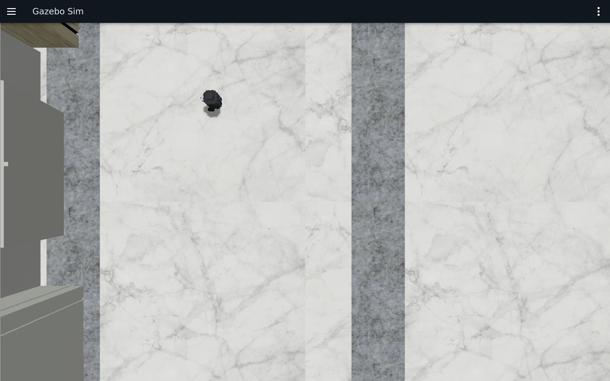

- 截图2：RViz 中 /odom 轨迹显示正方形图案

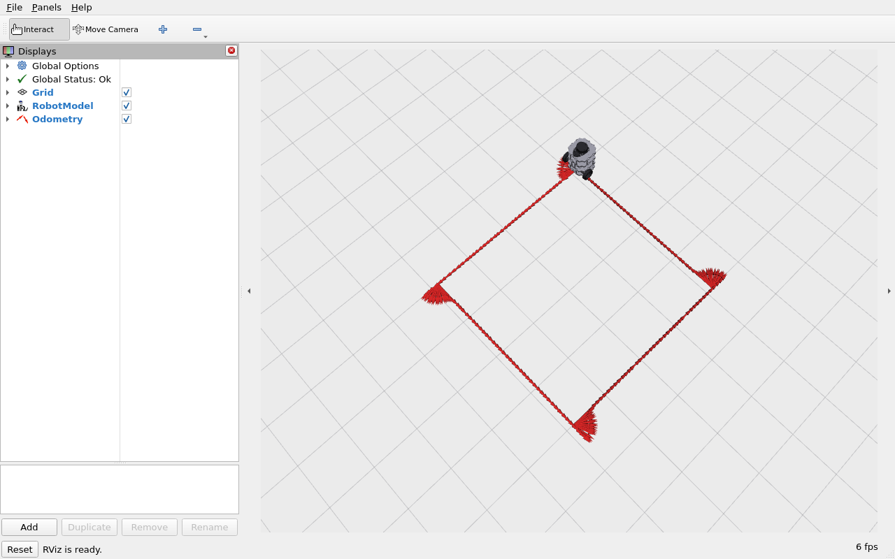

- 截图3：终端日志输出四边一角的执行进度

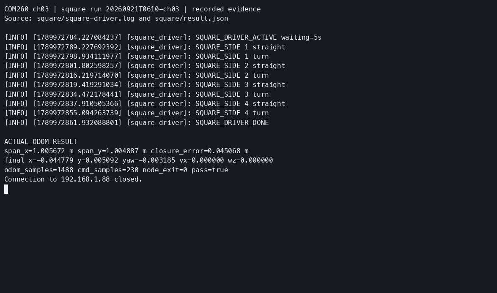

### 参考代码
> 完整参考代码位于 `src_k3_com260_kit/topic_demo_cpp/src/square_driver.cpp`

### 思考题
1. 如何精确控制机器人走 2m×2m 的正方形？调整哪些参数？用直线运动+原地旋转90°循环四次。要调整线速度、角速度、运动时间、控制频率
2. 如果需要在正方形路径上添加圆角过渡，如何实现？在拐角处加入圆弧轨迹。在接近拐角时同时设置线速度和角速度，使机器人沿圆弧过渡。

## 实际运行证据

COM260 执行本章 C++ 节点，x86 运行 Humble/Harmonic 仿真。消息字段、QoS 正反例、执行器并发、逐步建包，以及完整方形运动均通过；环境和详细结果见[第三章运行记录](runtime_evidence.md#ch03)。

有线连接并显式选择 DDS 接口后，方形 `/odom` 跨度为 x=1.006820 m、y=1.004632 m，终点距起点约 0.002019 m，停止后 vx=0、wz=0。直行输入为 0.2 m/s × 5 s，转弯为 1.57 rad/s × 1 s，时间使用仿真 `/clock`。这些是开环控制的实测结果，网络条件与实际误差见[运动与停止验证](runtime_evidence.md#ch03-ch04-validation)。

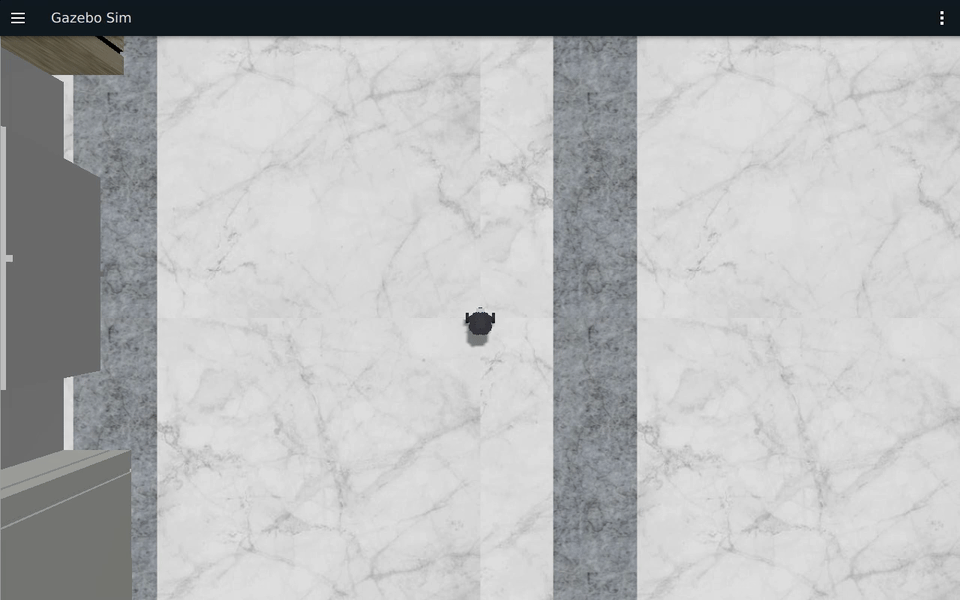

[Gazebo 连续原速录像](images/ch03/ch03-square-wired.mp4) · [同轮完整验收 CAST](images/ch03/ch03-square-wired.cast)。MP4 78 秒，GIF 为同段 2 倍速。Ctrl+C／SIGTERM、无时钟及暂停仿真时钟时的停止行为也已验证；停止反馈在测试清理前检查。


[原始终端 CAST](images/ch03/ch03-topics.cast) · [终端回放 MP4](images/ch03/ch03-topics.mp4)。终端回放压缩超过 2 秒的空闲等待。

[rqt_graph 连续录像](images/ch03/ch03-rqt-graph.mp4)展示 GPS 和 SensorData 的发布／订阅拓扑；[RViz 录像](images/ch03/ch03-square-rviz.mp4)展示 `odom` 固定系下的历史轨迹。各录像的采集时间和对应结果见运行记录。

实验结束后在 x86 宿主停止本轮实例：

```bash
bash ~/ROS2_RISCV_COM260/course_support/k3_com260_kit/scripts/x86-gazebo.bash stop ch03-course
```
