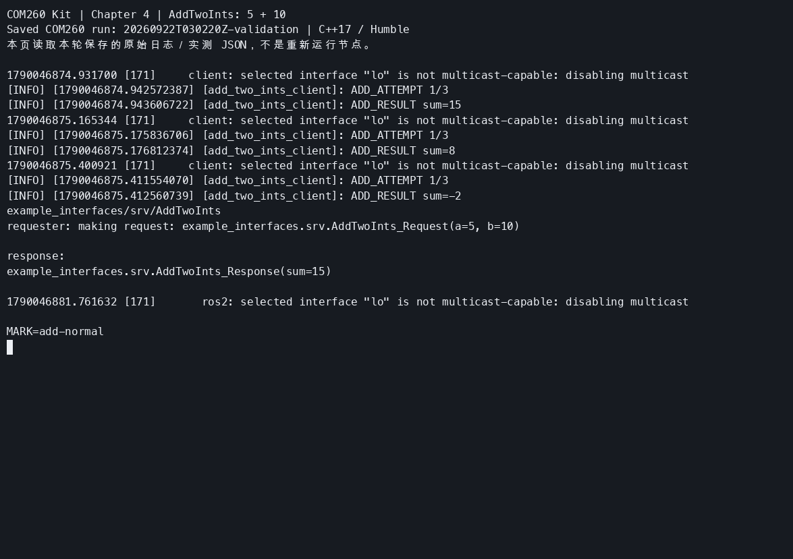
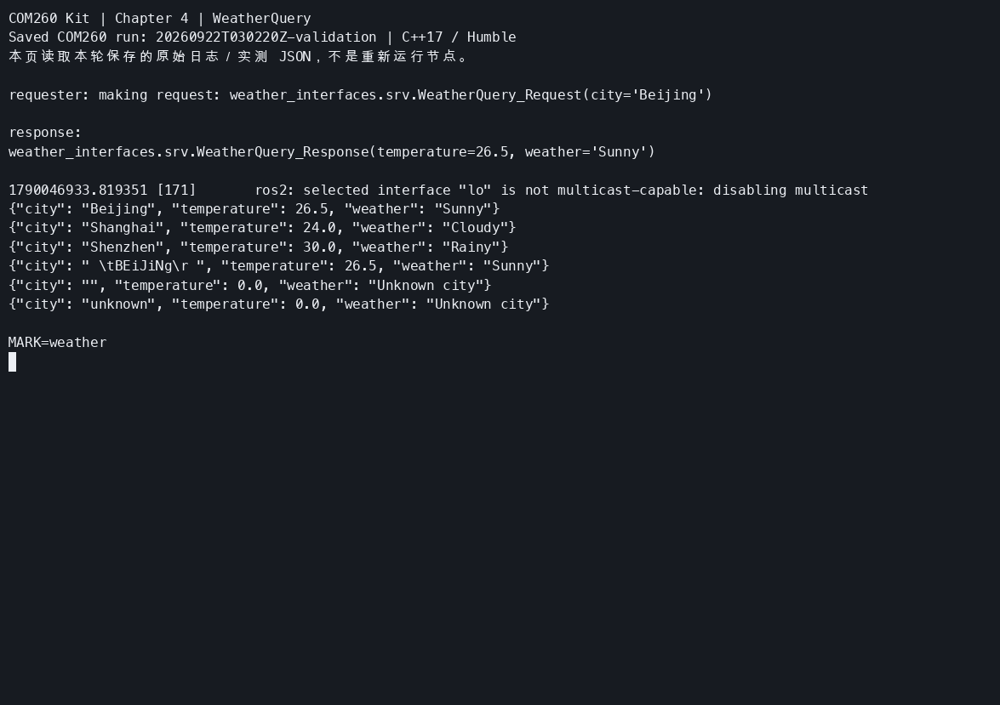
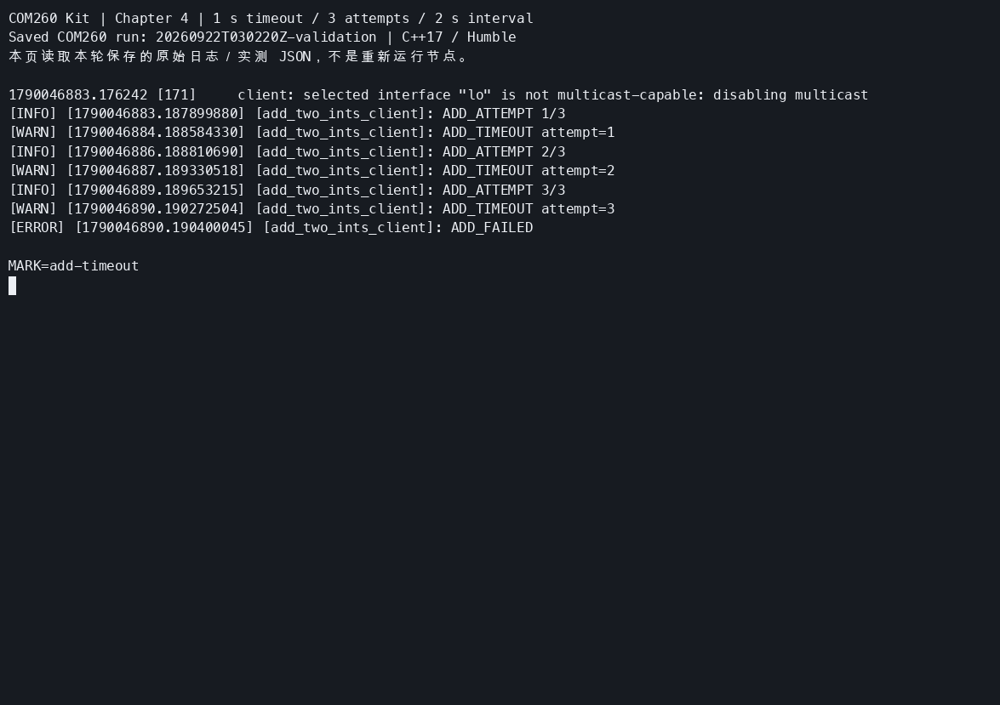
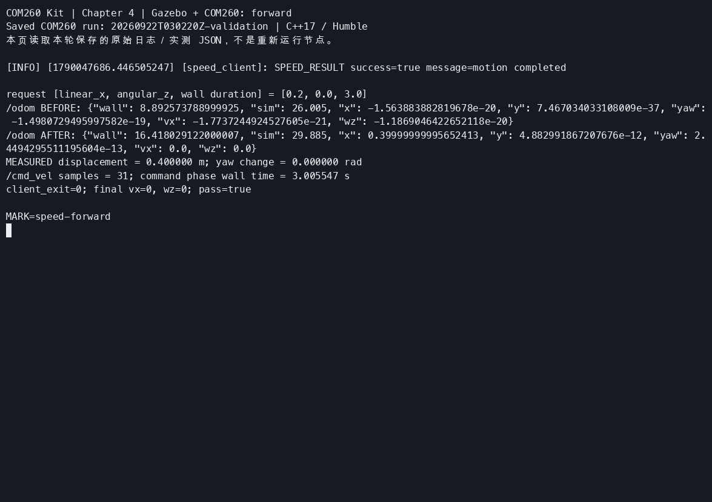
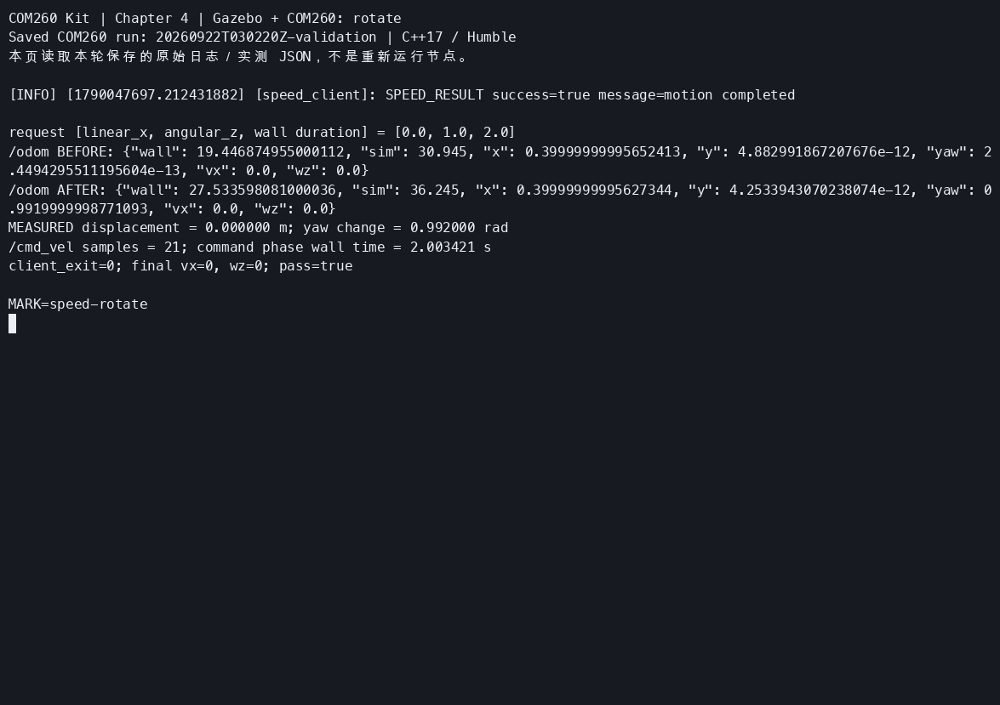
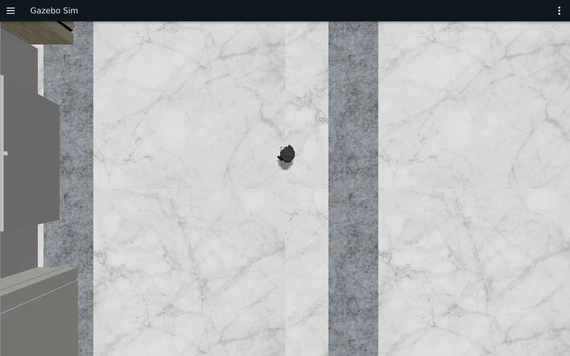
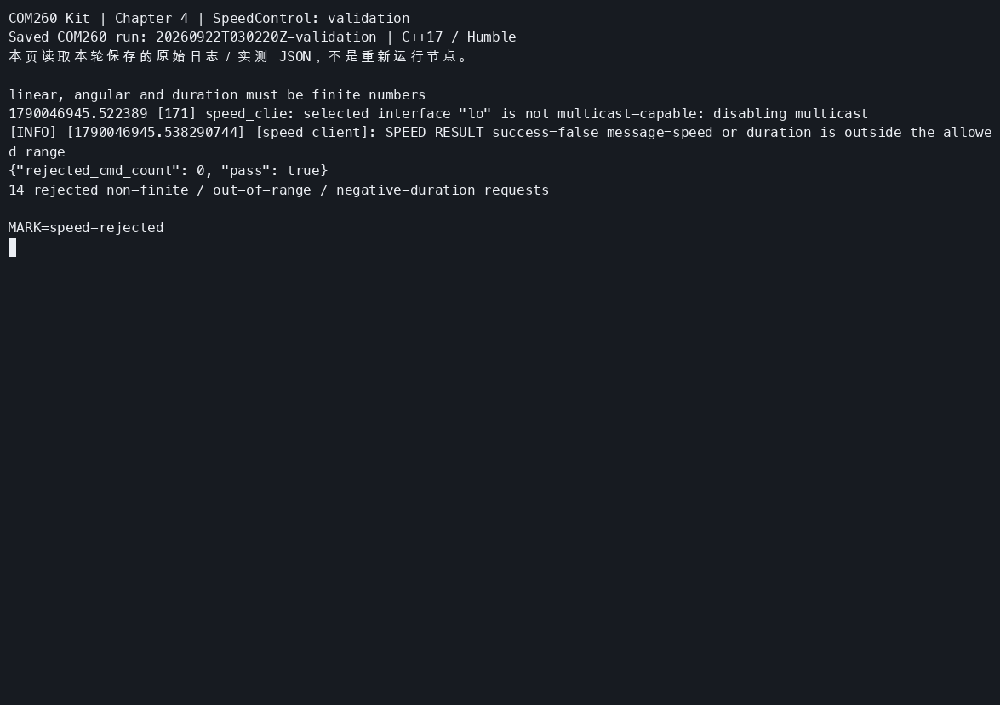

# 第4章 实验指导书：服务通信编程

连接、环境与仿真启动见[公共双端环境](ch00_common_setup.md)。C++ 服务和客户端在 COM260 运行，Gazebo/RViz 在 x86 Humble/Harmonic 课程容器运行。

跨机运行使用[双端单播配置](ch00_common_setup.md#dds-unicast)。在 x86 启动终端和每个 COM260 实验终端加载环境后设置对端地址；仅在本机验证服务返回值时不需要跨机配置。多网卡环境还需[选择有线 DDS 接口](ch00_common_setup.md#dds-wired)。

## 当前仓库仿真验证：服务请求与移动机器人数据流并行运行

### 实验目标

让服务 Server/Client 与 Gazebo 仿真同时运行，区分一次性请求-响应和持续传感器 Topic，并验证服务节点可被 DDS 发现。

### 运行步骤

【x86 主机】先按[公共环境第四章入口](ch00_common_setup.md#ch04)同步并构建，再启动一轮仿真。记下本次 `RUN_ID`，本章后面的速度实验复用它：

```bash
cd ~/ROS2_RISCV_COM260
RUN_ID=$(date -u +%Y%m%dT%H%M%SZ)-ch04
bash course_support/k3_com260_kit/scripts/x86-gazebo.bash start "$RUN_ID"
```

【COM260】另开两个终端：

```bash
source ~/.config/ros2-course-com260/env.bash
source ~/ros2_course_com260_ws/install/setup.bash
ros2 run service_demo_cpp server
```

```bash
source ~/.config/ros2-course-com260/env.bash
source ~/ros2_course_com260_ws/install/setup.bash
ros2 service list | grep greetings
ros2 run service_demo_cpp client
```

### 观察与验收

客户端应收到服务器响应，同时仿真继续发布 `/scan` 和 `/odom`。源码：`src_k3_com260_kit/service_demo_cpp/`；本实例不把服务调用误认为 Gazebo 控制接口。完成后在 Greeting 服务端终端按 Ctrl+C，Gazebo 实例保留供练习 4.4 使用。

> **实验课时**：2 课时（90 分钟） | TurtleBot3 Burger Gazebo 仿真

---

## 实验目标
1. 编写 Service Server 和 Client 节点
2. 定义自定义 .srv 接口
3. 处理服务超时和重试

---

后续每个 COM260 新终端都先加载 `~/.config/ros2-course-com260/env.bash`；练习工作区构建后还需加载 `~/my_services_com260_ws/install/setup.bash`。同名服务只启动一个 Server。切换延迟参数或改用教案 `teacher_server` 前，先 Ctrl+C 停止上一服务端；否则请求可能到达不同实例。

## 练习 4.1：AddTwoInts 服务（约 30 分钟）

### 步骤

**1. 创建包**

```bash
source ~/.config/ros2-course-com260/env.bash
# 首次练习使用独立工作区；若已存在，先检查已有内容，不覆盖。
mkdir -p ~/my_services_com260_ws/src
cd ~/my_services_com260_ws/src
ros2 pkg create service_demo_lab_cpp --build-type ament_cmake \
  --dependencies rclcpp example_interfaces
```

**2. 在 `service_demo_lab_cpp/src/` 编写 `server.cpp` 和 `client.cpp`**

完整 C++ 参考实现为 `src_k3_com260_kit/service_demo_lab_cpp/src/server.cpp` 和 `client.cpp`。本章先用 `delay_sec:=0.0` 验证正常响应，再在练习 4.3 使用 3 秒延迟及有限重试。已有同名包时核对并保留，不覆盖已有练习。复制源码仅用于对照，须完成下列编译和运行验收。可从 COM260 课程副本复制已同步的参考源码：

```bash
cp ~/ROS2_RISCV_COM260/src_k3_com260_kit/service_demo_lab_cpp/src/{server,client}.cpp ~/my_services_com260_ws/src/service_demo_lab_cpp/src/
```

**3. 修改 `~/my_services_com260_ws/src/service_demo_lab_cpp/CMakeLists.txt`**

```cmake
cmake_minimum_required(VERSION 3.10)
project(service_demo_lab_cpp)

find_package(ament_cmake REQUIRED)
find_package(example_interfaces REQUIRED)
find_package(rclcpp REQUIRED)

add_executable(server src/server.cpp)
target_compile_features(server PUBLIC cxx_std_17)
add_executable(client src/client.cpp)
target_compile_features(client PUBLIC cxx_std_17)
ament_target_dependencies(server example_interfaces rclcpp)
ament_target_dependencies(client example_interfaces rclcpp)

install(TARGETS server client DESTINATION lib/${PROJECT_NAME})

ament_package()
```

**4. 编译并运行**

先编译，再分别在两个已加载环境和练习 overlay 的终端运行下面标注的 Server／Client。

```bash
cd ~/my_services_com260_ws
python3 -m colcon build --packages-select service_demo_lab_cpp
source install/setup.bash
ros2 run service_demo_lab_cpp server --ros-args -p delay_sec:=0.0    # 终端1
ros2 run service_demo_lab_cpp client 5 10  # 终端2
```



**参考代码**：`src_k3_com260_kit/service_demo_lab_cpp/`

---

## 练习 4.2：自定义 .srv 接口（约 30 分钟）

定义 `WeatherQuery.srv`（城市 string → 温度 float64 + 天气 string），创建 Server 模拟天气查询。
1. 创建两个包
```bash
cd ~/my_services_com260_ws/src
ros2 pkg create weather_interfaces --build-type ament_cmake
ros2 pkg create weather_srv --build-type ament_cmake \
  --dependencies rclcpp weather_interfaces
mkdir -p weather_interfaces/srv
```

创建 `weather_interfaces/srv/WeatherQuery.srv`：

```text
string city
---
float64 temperature
string weather
```

2. 配置接口包

在 `weather_interfaces/CMakeLists.txt` 的 `ament_package()` 前添加：

```cmake
find_package(rosidl_default_generators REQUIRED)
rosidl_generate_interfaces(${PROJECT_NAME}
  "srv/WeatherQuery.srv"
)
ament_export_dependencies(rosidl_default_runtime)
```

在 `weather_interfaces/package.xml` 的 `<export>` 前添加：

```xml
<build_depend>rosidl_default_generators</build_depend>
<exec_depend>rosidl_default_runtime</exec_depend>
<member_of_group>rosidl_interface_packages</member_of_group>
```

3. 编写 Server
创建 weather_srv/src/weather_server.cpp：
```cpp
#include <algorithm>
#include <cctype>
#include <functional>
#include <memory>
#include <string>

#include "rclcpp/rclcpp.hpp"
#include "weather_interfaces/srv/weather_query.hpp"

class WeatherServer : public rclcpp::Node
{
public:
  WeatherServer()
  : Node("weather_server")
  {
    service_ = create_service<weather_interfaces::srv::WeatherQuery>(
      "weather_query",
      std::bind(&WeatherServer::handle, this, std::placeholders::_1, std::placeholders::_2));
    RCLCPP_INFO(get_logger(), "WEATHER_SERVER_READY");
  }

private:
  void handle(
    const std::shared_ptr<weather_interfaces::srv::WeatherQuery::Request> request,
    std::shared_ptr<weather_interfaces::srv::WeatherQuery::Response> response)
  {
    std::string city = request->city;
    city.erase(city.begin(), std::find_if(city.begin(), city.end(), [](unsigned char value) {
      return !std::isspace(value);
    }));
    city.erase(std::find_if(city.rbegin(), city.rend(), [](unsigned char value) {
      return !std::isspace(value);
    }).base(), city.end());
    std::transform(city.begin(), city.end(), city.begin(), [](unsigned char value) {
      return static_cast<char>(std::tolower(value));
    });
    if (city == "beijing") {
      response->temperature = 26.5;
      response->weather = "Sunny";
    } else if (city == "shanghai") {
      response->temperature = 24.0;
      response->weather = "Cloudy";
    } else if (city == "shenzhen") {
      response->temperature = 30.0;
      response->weather = "Rainy";
    } else {
      response->temperature = 0.0;
      response->weather = "Unknown city";
    }
    RCLCPP_INFO(get_logger(), "WEATHER_RESULT city=%s weather=%s", city.c_str(), response->weather.c_str());
  }

  rclcpp::Service<weather_interfaces::srv::WeatherQuery>::SharedPtr service_;
};

int main(int argc, char ** argv)
{
  rclcpp::init(argc, argv);
  rclcpp::spin(std::make_shared<WeatherServer>());
  rclcpp::shutdown();
  return 0;
}
```
4. 注册可执行程序
修改 weather_srv/CMakeLists.txt
```cmake
cmake_minimum_required(VERSION 3.10)
project(weather_srv)

find_package(ament_cmake REQUIRED)
find_package(rclcpp REQUIRED)
find_package(weather_interfaces REQUIRED)

add_executable(weather_server src/weather_server.cpp)
target_compile_features(weather_server PUBLIC cxx_std_17)
ament_target_dependencies(weather_server rclcpp weather_interfaces)
install(TARGETS weather_server DESTINATION lib/${PROJECT_NAME})
ament_package()
```
5. 编译和检查接口
```bash
cd ~/my_services_com260_ws
python3 -m colcon build --packages-select weather_interfaces weather_srv --symlink-install
source install/setup.bash
ros2 interface show weather_interfaces/srv/WeatherQuery
```
6. 运行测试
终端 1：
```bash
source ~/.config/ros2-course-com260/env.bash
source ~/my_services_com260_ws/install/setup.bash
ros2 run weather_srv weather_server
```
终端 2：
```bash
source ~/.config/ros2-course-com260/env.bash
source ~/my_services_com260_ws/install/setup.bash
ros2 service call /weather_query \
  weather_interfaces/srv/WeatherQuery "{city: 'Beijing'}"
  ```



**参考代码**：`src_k3_com260_kit/weather_interfaces/` + `src_k3_com260_kit/weather_srv/`

---

## 练习 4.3：超时与重试（约 30 分钟）

1. Server 设置 3 秒处理延迟
2. Client 设置 1 秒超时 → 观察超时行为
3. 添加重试机制（最多3次，间隔2秒）

1. 修改 Server
编辑：
```bash
nano ~/my_services_com260_ws/src/service_demo_lab_cpp/src/server.cpp
```
服务端完整实现（使用 `delay_sec` 参数切换 0 秒与 3 秒延迟）：
```cpp
#include <chrono>
#include <functional>
#include <memory>
#include <thread>

#include "example_interfaces/srv/add_two_ints.hpp"
#include "rclcpp/rclcpp.hpp"

using namespace std::chrono_literals;

class AddServer : public rclcpp::Node
{
public:
  AddServer()
  : Node("add_two_ints_server")
  {
    declare_parameter<double>("delay_sec", 3.0);
    service_ = create_service<example_interfaces::srv::AddTwoInts>(
      "add_two_ints",
      std::bind(&AddServer::handle, this, std::placeholders::_1, std::placeholders::_2));
    RCLCPP_INFO(get_logger(), "ADD_SERVER_READY");
  }

private:
  void handle(
    const std::shared_ptr<example_interfaces::srv::AddTwoInts::Request> request,
    std::shared_ptr<example_interfaces::srv::AddTwoInts::Response> response)
  {
    const auto delay = get_parameter("delay_sec").as_double();
    RCLCPP_INFO(get_logger(), "ADD_REQUEST a=%ld b=%ld delay=%.1f", request->a, request->b, delay);
    std::this_thread::sleep_for(std::chrono::duration<double>(delay));
    response->sum = request->a + request->b;
    RCLCPP_INFO(get_logger(), "ADD_RESULT sum=%ld", response->sum);
  }

  rclcpp::Service<example_interfaces::srv::AddTwoInts>::SharedPtr service_;
};

int main(int argc, char ** argv)
{
  rclcpp::init(argc, argv);
  rclcpp::spin(std::make_shared<AddServer>());
  rclcpp::shutdown();
  return 0;
}
```
2. 修改 Client
编辑：
```bash
nano ~/my_services_com260_ws/src/service_demo_lab_cpp/src/client.cpp
```
客户端完整实现（1 秒超时、最多 3 次、间隔 2 秒）：
```cpp
#include <cerrno>
#include <chrono>
#include <cstdint>
#include <cstdlib>
#include <iostream>
#include <memory>
#include <thread>

#include "example_interfaces/srv/add_two_ints.hpp"
#include "rclcpp/rclcpp.hpp"

using namespace std::chrono_literals;

bool parse_integer(const char * text, std::int64_t & value)
{
  errno = 0;
  char * end = nullptr;
  const long long parsed = std::strtoll(text, &end, 10);
  if (errno == ERANGE || end == text || *end != '\0') {
    return false;
  }
  value = static_cast<std::int64_t>(parsed);
  return true;
}

class AddClient : public rclcpp::Node
{
public:
  AddClient()
  : Node("add_two_ints_client")
  {
    client_ = create_client<example_interfaces::srv::AddTwoInts>("add_two_ints");
  }

  int run(std::int64_t a, std::int64_t b)
  {
    if (!client_->wait_for_service(2s)) {
      RCLCPP_ERROR(get_logger(), "ADD_SERVICE_UNAVAILABLE");
      return 1;
    }
    for (int attempt = 1; attempt <= 3; ++attempt) {
      auto request = std::make_shared<example_interfaces::srv::AddTwoInts::Request>();
      request->a = a;
      request->b = b;
      RCLCPP_INFO(get_logger(), "ADD_ATTEMPT %d/3", attempt);
      auto future = client_->async_send_request(request);
      if (rclcpp::spin_until_future_complete(shared_from_this(), future, 1s) ==
        rclcpp::FutureReturnCode::SUCCESS)
      {
        RCLCPP_INFO(get_logger(), "ADD_RESULT sum=%ld", future.get()->sum);
        return 0;
      }
      client_->remove_pending_request(future);
      RCLCPP_WARN(get_logger(), "ADD_TIMEOUT attempt=%d", attempt);
      if (attempt < 3) {
        std::this_thread::sleep_for(2s);
      }
    }
    RCLCPP_ERROR(get_logger(), "ADD_FAILED");
    return 1;
  }

private:
  rclcpp::Client<example_interfaces::srv::AddTwoInts>::SharedPtr client_;
};

int main(int argc, char ** argv)
{
  if (argc > 3) {
    std::cerr << "Usage: ros2 run service_demo_lab_cpp client [a] [b]\n";
    return 2;
  }
  std::int64_t a = 5;
  std::int64_t b = 3;
  if ((argc > 1 && !parse_integer(argv[1], a)) ||
    (argc > 2 && !parse_integer(argv[2], b)))
  {
    std::cerr << "a and b must be integers\n";
    return 2;
  }
  rclcpp::init(argc, argv);
  auto node = std::make_shared<AddClient>();
  const int result = node->run(a, b);
  rclcpp::shutdown();
  return result;
}
```
3. 编译

```bash
cd ~/my_services_com260_ws
python3 -m colcon build --packages-select service_demo_lab_cpp --symlink-install &&
source install/setup.bash
```

终端 1：
```bash
source ~/.config/ros2-course-com260/env.bash
source ~/my_services_com260_ws/install/setup.bash
ros2 run service_demo_lab_cpp server --ros-args -p delay_sec:=3.0
```
终端 2：
```bash
source ~/.config/ros2-course-com260/env.bash
source ~/my_services_com260_ws/install/setup.bash
ros2 run service_demo_lab_cpp client 5 10
```

客户端超时会清理本地未决请求，**不会取消服务端正在执行的回调**。因此客户端报告失败后，服务端仍可能输出求和结果；本例的加法可安全重试，有副作用的操作则需要额外设计幂等性。服务端目前使用单线程 `spin`，两个客户端同时请求会排队处理。



### 思考题
1. 服务通信适合什么场景？不适合什么场景？服务通信适合低频、短时间、需要明确响应结果的请求操作，例如参数设置、状态查询、启动停止控制。不适合高频数据传输和长时间任务，后者应使用 Topic 或 Action。
2. 如何保证多个 Client 同时调用服务时的安全性？可以通过 Callback Group 控制并发方式、mutex 保证共享数据访问安全、Executor 管理线程调度，以及服务端状态检查避免重复调用

---

## 练习 4.4：Service 控制机器人运动（约 15 分钟）

### 目标
创建自定义 `SpeedControl.srv` 服务，设置机器人速度（linear, angular）和运行时间（duration），Service 调用后驱动仿真中的 TurtleBot3 Burger 运动。

### 步骤

**步骤1：定义 SpeedControl.srv**
```bash
source ~/.config/ros2-course-com260/env.bash
cd ~/my_services_com260_ws/src

ros2 pkg create speed_interfaces --build-type ament_cmake
ros2 pkg create speed_control --build-type ament_cmake \
  --dependencies rclcpp geometry_msgs speed_interfaces

mkdir -p speed_interfaces/srv
```
```text
float64 linear_x
float64 angular_z
float64 duration
---
bool success
string message
```

**步骤2：编写 Service Server**
```cpp
#include <algorithm>
#include <chrono>
#include <cmath>
#include <csignal>
#include <functional>
#include <memory>
#include <thread>

#include "geometry_msgs/msg/twist.hpp"
#include "rclcpp/rclcpp.hpp"
#include "speed_interfaces/srv/speed_control.hpp"

using namespace std::chrono_literals;

namespace
{
volatile std::sig_atomic_t stop_requested = 0;
void request_stop(int) {stop_requested = 1;}
}

class SpeedServer : public rclcpp::Node
{
public:
  SpeedServer()
  : Node("speed_server")
  {
    publisher_ = create_publisher<geometry_msgs::msg::Twist>("/cmd_vel", 10);
    service_ = create_service<speed_interfaces::srv::SpeedControl>(
      "speed_control",
      std::bind(&SpeedServer::handle, this, std::placeholders::_1, std::placeholders::_2));
    RCLCPP_INFO(get_logger(), "SPEED_SERVER_READY");
  }

  bool motion_interrupted() const {return motion_interrupted_;}

private:
  void handle(
    const std::shared_ptr<speed_interfaces::srv::SpeedControl::Request> request,
    std::shared_ptr<speed_interfaces::srv::SpeedControl::Response> response)
  {
    if (!std::isfinite(request->duration) || !std::isfinite(request->linear_x) ||
      !std::isfinite(request->angular_z) || request->duration < 0.0 ||
      std::abs(request->linear_x) > 1.0 || std::abs(request->angular_z) > 2.0)
    {
      response->success = false;
      response->message = "speed or duration is outside the allowed range";
      RCLCPP_WARN(get_logger(), "SPEED_REJECTED");
      return;
    }
    geometry_msgs::msg::Twist command;
    command.linear.x = request->linear_x;
    command.angular.z = request->angular_z;
    const auto deadline = std::chrono::steady_clock::now() + std::chrono::duration<double>(request->duration);
    while (!stop_requested && rclcpp::ok() && std::chrono::steady_clock::now() < deadline) {
      publisher_->publish(command);
      std::this_thread::sleep_for(100ms);
    }
    publisher_->publish(geometry_msgs::msg::Twist());
    motion_interrupted_ = stop_requested || !rclcpp::ok();
    response->success = !motion_interrupted_;
    response->message = motion_interrupted_ ? "motion interrupted" : "motion completed";
    RCLCPP_INFO(get_logger(), "SPEED_RESULT success=%s", response->success ? "true" : "false");
  }

  rclcpp::Publisher<geometry_msgs::msg::Twist>::SharedPtr publisher_;
  rclcpp::Service<speed_interfaces::srv::SpeedControl>::SharedPtr service_;
  bool motion_interrupted_{false};
};

int main(int argc, char ** argv)
{
  rclcpp::init(argc, argv, rclcpp::InitOptions(), rclcpp::SignalHandlerOptions::None);
  std::signal(SIGINT, request_stop);
  std::signal(SIGTERM, request_stop);
  auto node = std::make_shared<SpeedServer>();
  rclcpp::executors::SingleThreadedExecutor executor;
  executor.add_node(node);
  while (!stop_requested && rclcpp::ok()) {executor.spin_once(100ms);}
  // Keep the context alive briefly for the final zero command and response.
  std::this_thread::sleep_for(100ms);
  rclcpp::shutdown();
  return node->motion_interrupted() ? 1 : 0;
}
```

**步骤3：编写 Service Client**
```cpp
#include <algorithm>
#include <cerrno>
#include <chrono>
#include <cmath>
#include <cstdlib>
#include <iostream>
#include <memory>

#include "rclcpp/rclcpp.hpp"
#include "speed_interfaces/srv/speed_control.hpp"

using namespace std::chrono_literals;

bool parse_number(const char * text, double & value)
{
  errno = 0;
  char * end = nullptr;
  value = std::strtod(text, &end);
  return errno != ERANGE && end != text && *end == '\0' && std::isfinite(value);
}

class SpeedClient : public rclcpp::Node
{
public:
  SpeedClient()
  : Node("speed_client")
  {
    client_ = create_client<speed_interfaces::srv::SpeedControl>("speed_control");
  }

  int run(double linear, double angular, double duration)
  {
    if (!client_->wait_for_service(5s)) {
      RCLCPP_ERROR(get_logger(), "SPEED_SERVICE_UNAVAILABLE");
      return 1;
    }
    auto request = std::make_shared<speed_interfaces::srv::SpeedControl::Request>();
    request->linear_x = linear;
    request->angular_z = angular;
    request->duration = duration;
    auto future = client_->async_send_request(request);
    if (rclcpp::spin_until_future_complete(
        shared_from_this(), future,
        std::chrono::duration<double>(std::max(0.0, duration) + 5.0)) !=
      rclcpp::FutureReturnCode::SUCCESS)
    {
      return 1;
    }
    const auto response = future.get();
    RCLCPP_INFO(get_logger(), "SPEED_RESULT success=%s message=%s", response->success ? "true" : "false", response->message.c_str());
    return response->success ? 0 : 1;
  }

private:
  rclcpp::Client<speed_interfaces::srv::SpeedControl>::SharedPtr client_;
};

int main(int argc, char ** argv)
{
  if (argc > 4) {
    std::cerr << "Usage: ros2 run speed_control speed_client [linear] [angular] [duration]\n";
    return 2;
  }
  double linear = 0.2;
  double angular = 0.0;
  double duration = 3.0;
  if ((argc > 1 && !parse_number(argv[1], linear)) ||
    (argc > 2 && !parse_number(argv[2], angular)) ||
    (argc > 3 && !parse_number(argv[3], duration)))
  {
    std::cerr << "linear, angular and duration must be finite numbers\n";
    return 2;
  }
  rclcpp::init(argc, argv);
  auto node = std::make_shared<SpeedClient>();
  const int result = node->run(linear, angular, duration);
  rclcpp::shutdown();
  return result;
}
```
**步骤4：完善配置**

·将 speed_interfaces/CMakeLists.txt 配置为：
```cmake
cmake_minimum_required(VERSION 3.10)
project(speed_interfaces)

find_package(ament_cmake REQUIRED)
find_package(rosidl_default_generators REQUIRED)

rosidl_generate_interfaces(${PROJECT_NAME} "srv/SpeedControl.srv")
ament_export_dependencies(rosidl_default_runtime)
ament_package()
```
·在 speed_interfaces/package.xml 的 `<export>` 前加入：
```xml
<build_depend>rosidl_default_generators</build_depend>
<exec_depend>rosidl_default_runtime</exec_depend>
<member_of_group>rosidl_interface_packages</member_of_group>
```
·修改 speed_control/CMakeLists.txt 的入口配置：
```cmake
cmake_minimum_required(VERSION 3.10)
project(speed_control)

find_package(ament_cmake REQUIRED)
find_package(geometry_msgs REQUIRED)
find_package(rclcpp REQUIRED)
find_package(speed_interfaces REQUIRED)

add_executable(speed_server src/speed_server.cpp)
target_compile_features(speed_server PUBLIC cxx_std_17)
add_executable(speed_client src/speed_client.cpp)
target_compile_features(speed_client PUBLIC cxx_std_17)
ament_target_dependencies(speed_server geometry_msgs rclcpp speed_interfaces)
ament_target_dependencies(speed_client rclcpp speed_interfaces)
install(TARGETS speed_server speed_client DESTINATION lib/${PROJECT_NAME})
ament_package()
```
按已确认的修正，速度服务只接受有限数值，且要求 `|linear_x| ≤ 1.0 m/s`、`|angular_z| ≤ 2.0 rad/s`、`duration ≥ 0 s`。超出边界时返回 `success=false`，不执行该请求的运动；这是相对原章新增的输入限制。

**步骤4：运行测试**

【COM260】编译：

```bash
cd ~/my_services_com260_ws
python3 -m colcon build --packages-select speed_interfaces speed_control --symlink-install
source install/setup.bash
```

【x86 主机，终端 1】复用本章开头已启动的 Gazebo，不重复启动。若已停止，重新执行开头的 `start` 命令并记录新的 `RUN_ID`。确认没有其他节点在发布运动指令，后续只启动一个速度服务。

【COM260，终端 2】启动速度服务：

```bash
source ~/.config/ros2-course-com260/env.bash
source ~/.config/ros2-course-com260/env.bash
source ~/my_services_com260_ws/install/setup.bash
ros2 run speed_control speed_server
```

【COM260，终端 3】调用服务，前进 0.2 m/s 持续 3 秒：

```bash
source ~/.config/ros2-course-com260/env.bash
source ~/.config/ros2-course-com260/env.bash
source ~/my_services_com260_ws/install/setup.bash
ros2 run speed_control speed_client 0.2 0.0 3.0
```



旋转测试，角速度 1.0 rad/s 持续 2 秒：

```bash
ros2 run speed_control speed_client 0.0 1.0 2.0
```



**✓ 验证**：服务端按墙钟计时发送速度，Gazebo 中 TurtleBot3 Burger 运动，结束后发出零速度；同时检查 `/odom` 的位置、完整四元数转换后的航向和反馈速度。仿真慢于实时运行时，3 秒墙钟不等于 3 秒仿真时间，不能预写为前进 0.6 m 或旋转 2 rad。本轮实际结果见下方证据。

输入检查可先在独立 Domain 中完成：`speed_client nan 0 0` 在客户端退出 2；`speed_client 1.01 0 0` 收到 `success=false` 后退出 1。服务端还须拒绝 NaN、正负无穷和负时长；边界 ±1.0／±2.0 与零时长合法。零时长只发停止指令，拒绝请求不发新的运动指令。

实验结束，先确认最后一次调用完成并已停止，再在速度服务终端按 Ctrl+C。Ctrl+C／SIGTERM 中途打断运动时，服务端在 ROS 通信仍有效时发送零速度，返回 `success=false`、`motion interrupted`，服务端与本章客户端均退出 1；空闲时停止服务端仍退出 0。若进程被强制终止、客户端未收到响应或反馈未归零，在 COM260 另开终端发送停止指令：

```bash
source ~/.config/ros2-course-com260/env.bash
ros2 topic pub --once /cmd_vel geometry_msgs/msg/Twist '{}'
```

【x86 主机】完成观察后停止本轮仿真：

```bash
bash ~/ROS2_RISCV_COM260/course_support/k3_com260_kit/scripts/x86-gazebo.bash stop "$RUN_ID"
```

### 参考代码
> 完整参考代码位于 `src_k3_com260_kit/speed_control/`

### 思考题
1. 服务处理函数中直接 `std::this_thread::sleep_for()` 是否会影响其他服务请求？如何改进？服务回调中直接使用 std::this_thread::sleep_for() 会阻塞当前 Executor 线程，在单线程 Executor 下会影响其他服务请求和消息处理。改进方法包括使用 Action 处理长时间任务、采用异步线程、Timer 或 MultiThreadedExecutor，并合理配置 Callback Group。

2. 如果同时在 Server 中处理话题发布和服务请求，两者如何协调？Server 同时处理 Topic 发布和 Service 请求时，需要通过 Executor 进行调度。简单场景可以使用单线程 Executor 保证安全；需要并发时使用 MultiThreadedExecutor，并结合 Callback Group 和 mutex 保护共享数据，避免服务请求影响实时话题发布。

## 实际运行证据

COM260 执行 C++ 服务和客户端，x86 Humble 容器运行 Gazebo。服务调用、超时、并发、输入边界及逐步建包的结果见[第四章运行记录](runtime_evidence.md#ch04)。


[终端展示录像](images/ch04/ch04-services.mp4) · [课程工作区验收 CAST](images/ch04/ch04-services-course.cast) · [独立练习工作区验收 CAST](images/ch04/ch04-services-practice.cast)



[Gazebo 连续原速录像](images/ch04/ch04-speed-wired.mp4) · [同轮请求与里程计 CAST](images/ch04/ch04-speed-wired.cast)

| 请求 | `/odom` 实测 | 停止与消息证据 |
|---|---|---|
| 0.2 m/s，0 rad/s，3 s 墙钟 | 前进 0.218600 m | 31 条速度消息；从首条到零速约 3.005756 s；反馈 vx=0、wz=0 |
| 0 m/s，1 rad/s，2 s 墙钟 | 航向增加 0.723000 rad | 21 条速度消息；从首条到零速约 2.003690 s；反馈 vx=0、wz=0 |

本段 MP4 为 33 秒连续原速画面，GIF 为同段 2 倍速。统计 492 条 `/odom`、9731 条 `/clock`，停止检查与统计在清理补发零速之前完成。实际位移和转角受墙钟计时与软件渲染速度影响，采集时间及详细数据见[运动与停止验证](runtime_evidence.md#ch03-ch04-validation)。

课程和独立练习工作区均通过 14 个非法输入及中止检查。运动中止时服务返回失败，C++ 客户端退出 1，Gazebo 的 `/odom` 反馈归零。


