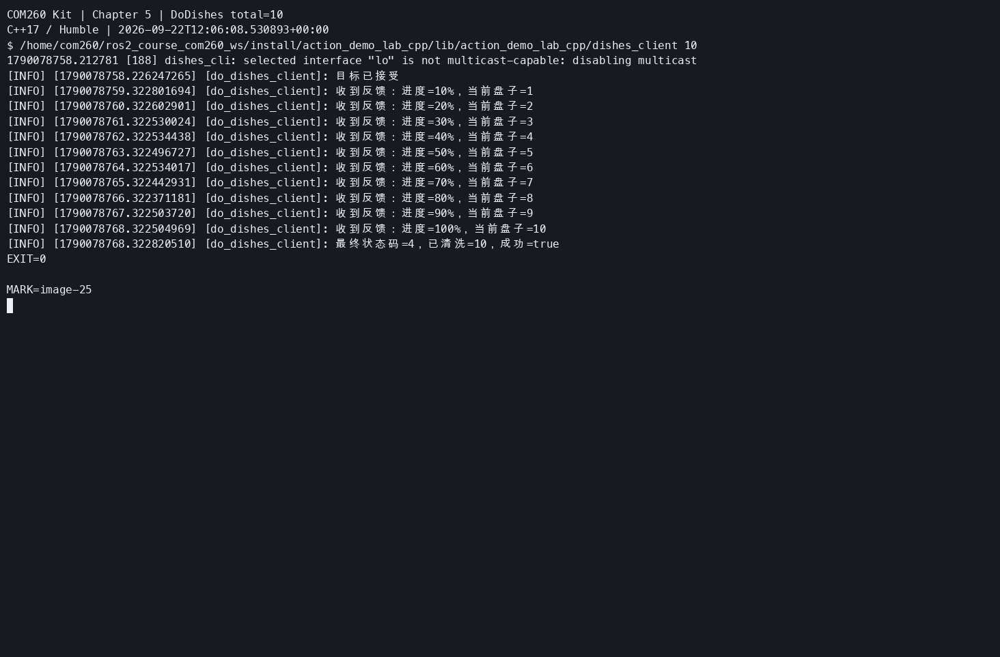
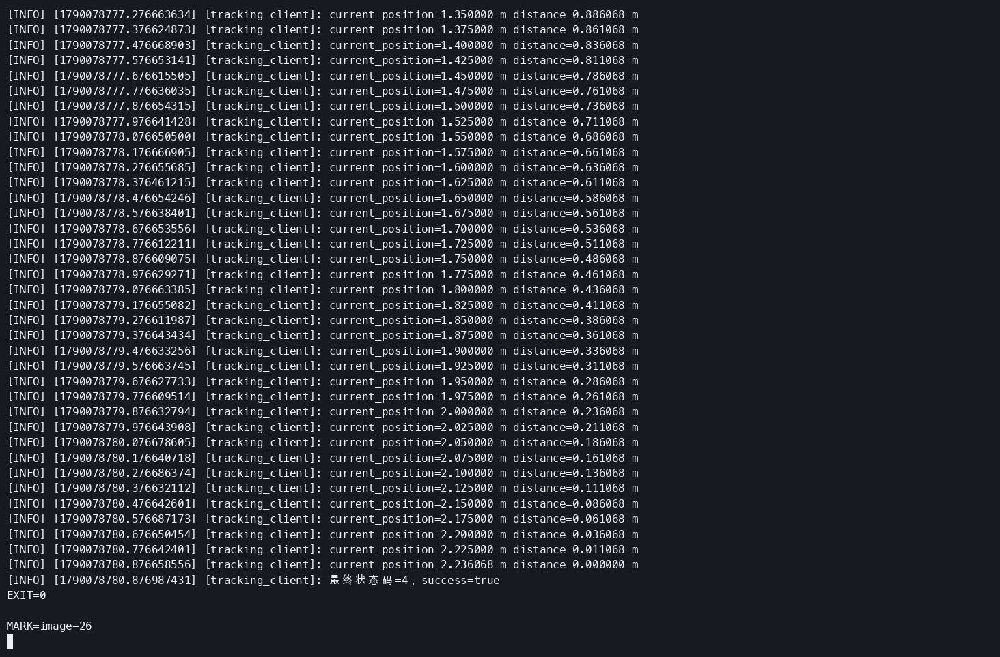
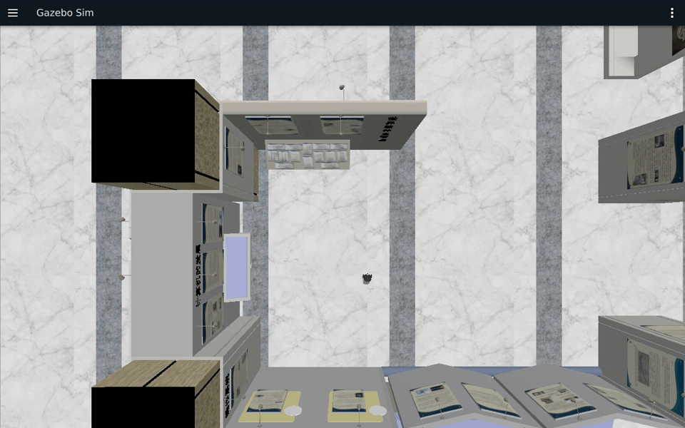
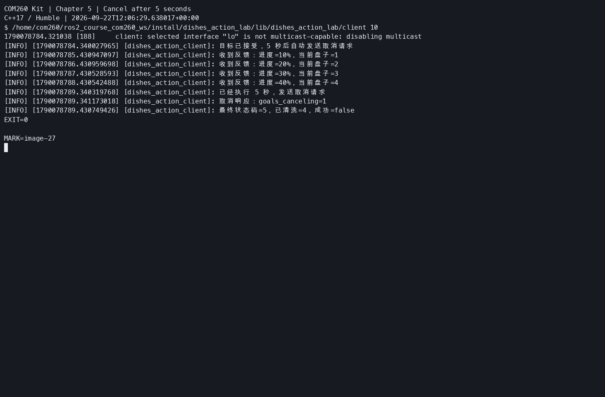
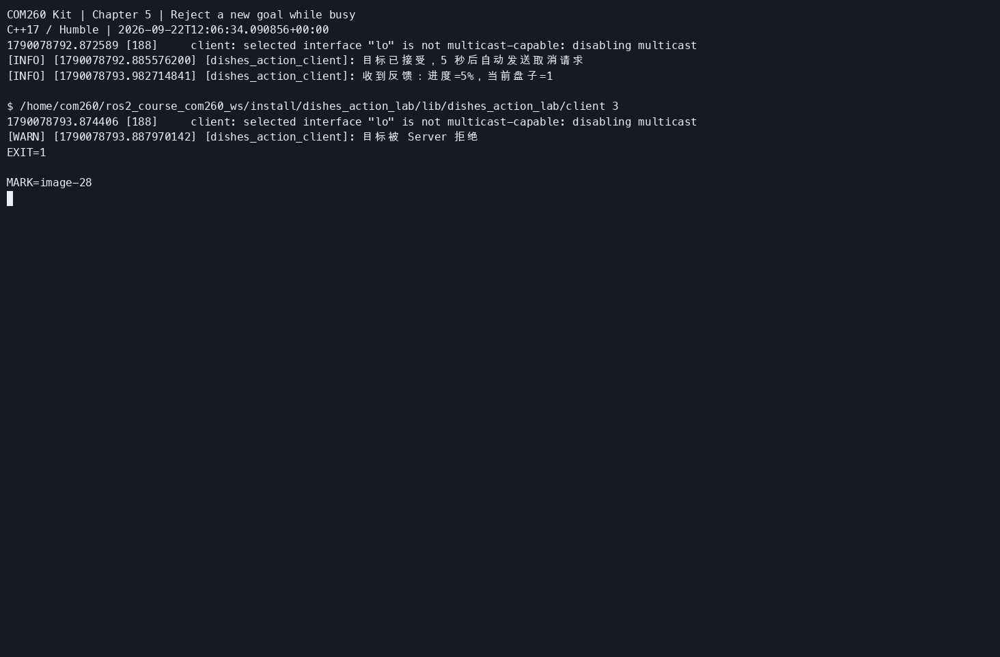
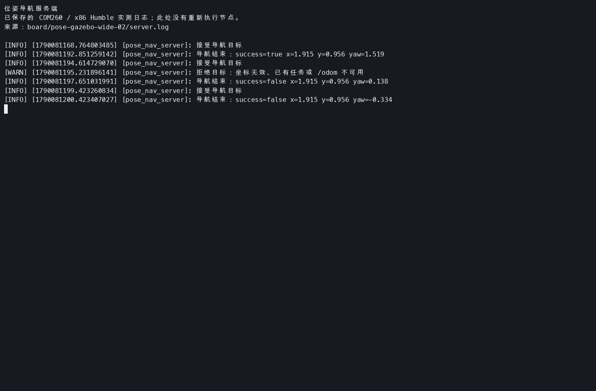
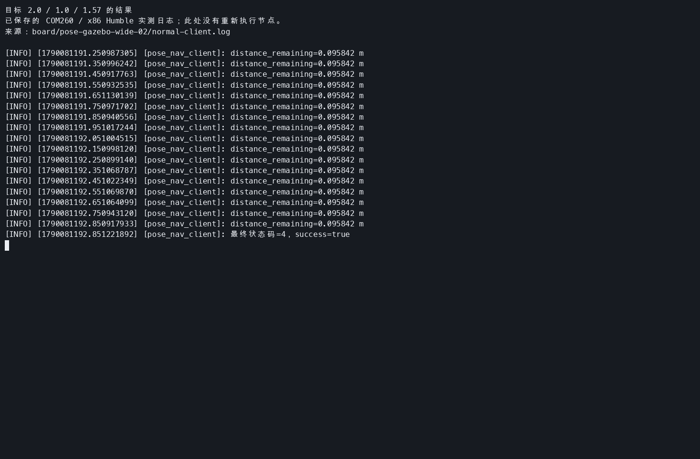
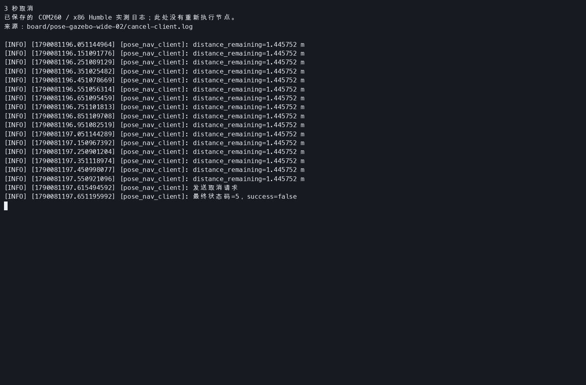
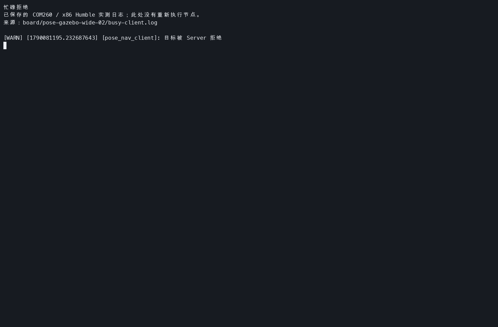
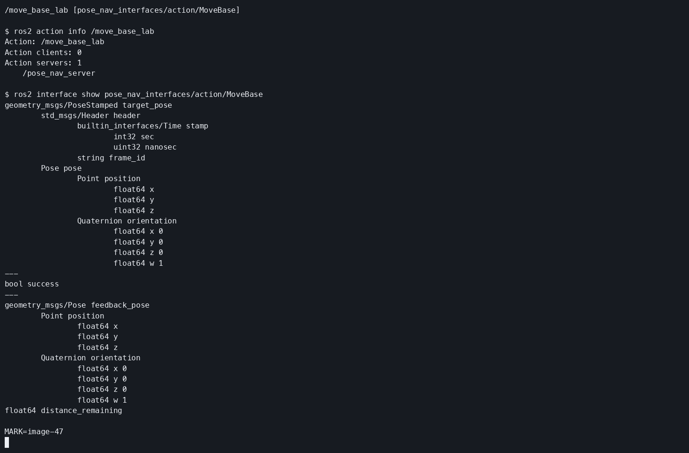

# 第5章 实验指导书：动作通信编程

连接、同步和构建见[公共双端环境](ch00_common_setup.md#ch05)。本章 C++17 服务和客户端在 COM260 运行，Gazebo/RViz 在 x86 Humble 课程容器运行。跨机终端需按[有线 DDS 配置](ch00_common_setup.md#dds-wired)设置两端接口并核对回程路由。

## 当前仓库仿真验证：Action 反馈与底盘仿真并行检查

### 实验目标

在机器人仿真背景下运行 `DoDishes` Action，观察目标接受、反馈、结果和动作查询，理解长期任务与底盘 Topic 的区别。

### 运行步骤

【x86 主机】启动一轮仿真：

```bash
cd ~/ROS2_RISCV_COM260
RUN_ID=$(date -u +%Y%m%dT%H%M%SZ)-ch05
bash course_support/k3_com260_kit/scripts/x86-gazebo.bash start "$RUN_ID"
```

【COM260】终端 2：

```bash
source ~/.config/ros2-course-com260/env.bash
ros2 run action_demo_cpp dishes_server
```

【COM260】终端 3：

```bash
source ~/.config/ros2-course-com260/env.bash
ros2 run action_demo_cpp dishes_client
ros2 action info /dishes
```

### 观察与验收

客户端应显示 20% 至 100% 的五次反馈和清洗总数 10；Gazebo 独立提供 `/odom`、`/scan`。本例的 `dishwasher_id=2` 表示每一步对应两只盘子。核心接口位于 `src_k3_com260_kit/action_demo_interfaces/`，节点位于 `src_k3_com260_kit/action_demo_cpp/`。它不驱动机器人。观察完成后 Ctrl+C 停止服务端。

> **实验课时**：2 课时（90 分钟） | TurtleBot3 Burger Gazebo 仿真

---

## 实验目标
1. 编写 Action Server 和 Client
2. 处理进度反馈
3. 实现取消和抢占

---

下面使用独立练习工作区。已有同名包时先核对内容，不覆盖。每个 COM260 新终端先加载公共环境，再加载练习工作区；同一动作只运行一个服务端。

```bash
source ~/.config/ros2-course-com260/env.bash
mkdir -p ~/my_actions_com260_ws/src
cd ~/my_actions_com260_ws/src
```

## 练习 3.1：DoDishes 动作（约 30 分钟）

按本章手册与教案定义，Goal 是要清洗的盘子数量。此接口与开头核心例程的 `dishwasher_id` 语义不同，因此使用独立的 `action_demo_lab_interfaces`，避免两个同名接口相互覆盖。

**创建接口包、配置 CMake 和 package.xml**

```bash
cd ~/my_actions_com260_ws/src
ros2 pkg create action_demo_lab_interfaces --build-type ament_cmake --license Apache-2.0
mkdir -p action_demo_lab_interfaces/action
```

编辑 `action_demo_lab_interfaces/action/DoDishes.action`：

```bash
nano ~/my_actions_com260_ws/src/action_demo_lab_interfaces/action/DoDishes.action
```


```text
uint32 total_dishes
---
uint32 cleaned_dishes
bool success
---
float32 progress
uint32 current_dish
```

编辑 `action_demo_lab_interfaces/CMakeLists.txt`：

```bash
nano ~/my_actions_com260_ws/src/action_demo_lab_interfaces/CMakeLists.txt
```


```cmake
cmake_minimum_required(VERSION 3.8)
project(action_demo_lab_interfaces)

find_package(ament_cmake REQUIRED)
find_package(rosidl_default_generators REQUIRED)

rosidl_generate_interfaces(${PROJECT_NAME} "action/DoDishes.action")
ament_export_dependencies(rosidl_default_runtime)


ament_package()
```

编辑 `action_demo_lab_interfaces/package.xml`：

```bash
nano ~/my_actions_com260_ws/src/action_demo_lab_interfaces/package.xml
```


```xml
<?xml version="1.0"?>
<package format="3">
  <name>action_demo_lab_interfaces</name>
  <version>0.1.0</version>
  <description>COM260 Kit ROS 2 course examples.</description>
  <maintainer email="student@example.com">Student</maintainer>
  <license>Apache-2.0</license>
  <buildtool_depend>ament_cmake</buildtool_depend>
  <build_depend>rosidl_default_generators</build_depend>
  <exec_depend>rosidl_default_runtime</exec_depend>
  <member_of_group>rosidl_interface_packages</member_of_group>
  <export><build_type>ament_cmake</build_type></export>
</package>
```

**编译接口**

```bash
cd ~/my_actions_com260_ws
source ~/.config/ros2-course-com260/env.bash
python3 -m colcon build --packages-select action_demo_lab_interfaces --symlink-install
source install/setup.bash
```

**创建 action_demo_lab_cpp**

C++ 使用 0.1 秒定时器推进工作，每只盘子清洗 1 秒；等待期间执行器仍能响应取消和新目标。原 Python 的等待写法对应这里的时间判断，不在回调中调用阻塞的长时间 sleep。服务端拒绝零盘子及忙碌时的新目标。

```bash
cd ~/my_actions_com260_ws/src
ros2 pkg create action_demo_lab_cpp --build-type ament_cmake --license Apache-2.0
mkdir -p action_demo_lab_cpp/src
```

编辑 `action_demo_lab_cpp/src/dishes_server.cpp`：

```bash
nano ~/my_actions_com260_ws/src/action_demo_lab_cpp/src/dishes_server.cpp
```


```cpp
#include <chrono>
#include <csignal>
#include <memory>
#include <thread>
#include "rclcpp/rclcpp.hpp"
#include "rclcpp_action/rclcpp_action.hpp"
#include "action_demo_lab_interfaces/action/do_dishes.hpp"

using namespace std::chrono_literals;
namespace {
volatile std::sig_atomic_t stop_requested = 0;
void request_stop(int) {stop_requested = 1;}
}

class DishesServer : public rclcpp::Node
{
public:
  using Action = action_demo_lab_interfaces::action::DoDishes;
  using Handle = rclcpp_action::ServerGoalHandle<Action>;
  DishesServer() : Node("do_dishes_server")
  {
    server_ = rclcpp_action::create_server<Action>(this, "do_dishes",
      [this](const rclcpp_action::GoalUUID &, std::shared_ptr<const Action::Goal> goal) {
        if (busy_ || goal->total_dishes == 0) {
          RCLCPP_WARN(get_logger(), "拒绝目标：已有任务或盘子数量为零");
          return rclcpp_action::GoalResponse::REJECT;
        }
        busy_ = true;
        return rclcpp_action::GoalResponse::ACCEPT_AND_EXECUTE;
      },
      [this](const std::shared_ptr<Handle>) {
        RCLCPP_INFO(get_logger(), "收到取消请求");
        return rclcpp_action::CancelResponse::ACCEPT;
      },
      [this](const std::shared_ptr<Handle> handle) {
        goal_ = handle;
        cleaned_ = 0;
        next_ = std::chrono::steady_clock::now() + 1s;
        RCLCPP_INFO(get_logger(), "接受目标：%u", goal_->get_goal()->total_dishes);
      });
    timer_ = create_wall_timer(100ms, [this]() {tick();});
  }

  void stop()
  {
    timer_->cancel();
    if (goal_) {finish(false);}
  }

private:
  void finish(bool success)
  {
    auto result = std::make_shared<Action::Result>();
    result->cleaned_dishes = cleaned_;
    result->success = success && !goal_->is_canceling();
    if (goal_->is_canceling()) {goal_->canceled(result);}
    else if (success) {goal_->succeed(result);}
    else {goal_->abort(result);}
    RCLCPP_INFO(get_logger(), "任务结束：cleaned=%u success=%s", cleaned_, success ? "true" : "false");
    goal_.reset();
    busy_ = false;
  }

  void tick()
  {
    if (!goal_) {return;}
    if (stop_requested || goal_->is_canceling()) {finish(false); return;}
    if (std::chrono::steady_clock::now() < next_) {return;}
    if (cleaned_ == goal_->get_goal()->total_dishes) {finish(true); return;}
    ++cleaned_;
    auto feedback = std::make_shared<Action::Feedback>();
    feedback->progress = static_cast<float>(cleaned_) / goal_->get_goal()->total_dishes;
    feedback->current_dish = cleaned_;
    goal_->publish_feedback(feedback);
    RCLCPP_INFO(get_logger(), "进度: %.0f%%", feedback->progress * 100.0);
    next_ += 1s;
    if (cleaned_ == goal_->get_goal()->total_dishes) {finish(!goal_->is_canceling());}
  }

  rclcpp_action::Server<Action>::SharedPtr server_;
  rclcpp::TimerBase::SharedPtr timer_;
  std::shared_ptr<Handle> goal_;
  bool busy_{false};
  uint32_t cleaned_{0};
  std::chrono::steady_clock::time_point next_;
};

int main(int argc, char ** argv)
{
  rclcpp::init(argc, argv, rclcpp::InitOptions(), rclcpp::SignalHandlerOptions::None);
  std::signal(SIGINT, request_stop);
  std::signal(SIGTERM, request_stop);
  auto node = std::make_shared<DishesServer>();
  rclcpp::executors::SingleThreadedExecutor executor;
  executor.add_node(node);
  while (!stop_requested && rclcpp::ok()) {executor.spin_once(100ms);}
  node->stop();
  std::this_thread::sleep_for(100ms);
  rclcpp::shutdown();
  return 0;
}
```

编辑 `action_demo_lab_cpp/src/dishes_client.cpp`：

```bash
nano ~/my_actions_com260_ws/src/action_demo_lab_cpp/src/dishes_client.cpp
```


```cpp
#include <chrono>
#include <cstdint>
#include <iostream>
#include <limits>
#include <memory>
#include <string>
#include "rclcpp/rclcpp.hpp"
#include "rclcpp_action/rclcpp_action.hpp"
#include "action_demo_lab_interfaces/action/do_dishes.hpp"

using namespace std::chrono_literals;
using Action = action_demo_lab_interfaces::action::DoDishes;
int main(int argc, char ** argv)
{
  uint32_t total = 10;
  try {
    const auto args = rclcpp::remove_ros_arguments(argc, argv);
    if (args.size() > 2) {throw std::invalid_argument("参数过多");}
    if (args.size() == 2) {
      size_t used = 0;
      const auto value = std::stoull(args[1], &used);
      if (args[1].empty() || args[1][0] == '-' || used != args[1].size() ||
        value == 0 || value > std::numeric_limits<uint32_t>::max())
      {throw std::invalid_argument("盘子数量必须为正 uint32 整数");}
      total = static_cast<uint32_t>(value);
    }
  } catch (const std::exception & error) {std::cerr << error.what() << '\n'; return 2;}
  rclcpp::init(argc, argv);
  auto node = std::make_shared<rclcpp::Node>("do_dishes_client");
  auto client = rclcpp_action::create_client<Action>(node, "do_dishes");
  int exit_code = 1;
  if (client->wait_for_action_server(10s)) {
    Action::Goal goal;
    goal.total_dishes = total;
    rclcpp_action::Client<Action>::SendGoalOptions options;
    options.feedback_callback = [node](auto, const auto feedback) {
      RCLCPP_INFO(node->get_logger(), "收到反馈：进度=%.0f%%，当前盘子=%u", feedback->progress * 100.0, feedback->current_dish);
    };
    auto sent = client->async_send_goal(goal, options);
    if (rclcpp::spin_until_future_complete(node, sent, 10s) == rclcpp::FutureReturnCode::SUCCESS) {
      auto handle = sent.get();
      if (!handle) {RCLCPP_WARN(node->get_logger(), "目标被 Server 拒绝");}
      else {
        RCLCPP_INFO(node->get_logger(), "目标已接受");
        rclcpp::TimerBase::SharedPtr cancel_timer;

        auto result = client->async_get_result(handle);
        if (rclcpp::spin_until_future_complete(node, result) == rclcpp::FutureReturnCode::SUCCESS) {
          const auto response = result.get();
          RCLCPP_INFO(node->get_logger(), "最终状态码=%d，已清洗=%u，成功=%s",
            static_cast<int>(response.code), response.result->cleaned_dishes, response.result->success ? "true" : "false");
          exit_code = response.code == rclcpp_action::ResultCode::SUCCEEDED ? 0 : 1;
        }
        if (cancel_timer) {cancel_timer->cancel();}
      }
    }
  } else {RCLCPP_ERROR(node->get_logger(), "没有找到 Action Server");}
  rclcpp::shutdown();
  return exit_code;
}
```

编辑 `action_demo_lab_cpp/CMakeLists.txt`：

```bash
nano ~/my_actions_com260_ws/src/action_demo_lab_cpp/CMakeLists.txt
```


```cmake
cmake_minimum_required(VERSION 3.8)
project(action_demo_lab_cpp)

find_package(ament_cmake REQUIRED)
find_package(rclcpp REQUIRED)
find_package(rclcpp_action REQUIRED)
find_package(action_demo_lab_interfaces REQUIRED)

add_compile_options(-Wall -Wextra -Wpedantic)

add_executable(dishes_server src/dishes_server.cpp)
target_compile_features(dishes_server PRIVATE cxx_std_17)
ament_target_dependencies(dishes_server rclcpp rclcpp_action action_demo_lab_interfaces)

add_executable(dishes_client src/dishes_client.cpp)
target_compile_features(dishes_client PRIVATE cxx_std_17)
ament_target_dependencies(dishes_client rclcpp rclcpp_action action_demo_lab_interfaces)

install(TARGETS dishes_server dishes_client DESTINATION lib/${PROJECT_NAME})

ament_package()
```

编辑 `action_demo_lab_cpp/package.xml`：

```bash
nano ~/my_actions_com260_ws/src/action_demo_lab_cpp/package.xml
```


```xml
<?xml version="1.0"?>
<package format="3">
  <name>action_demo_lab_cpp</name>
  <version>0.1.0</version>
  <description>COM260 Kit ROS 2 course examples.</description>
  <maintainer email="student@example.com">Student</maintainer>
  <license>Apache-2.0</license>
  <buildtool_depend>ament_cmake</buildtool_depend>
  <depend>rclcpp</depend>
  <depend>rclcpp_action</depend>
  <depend>action_demo_lab_interfaces</depend>
  <export><build_type>ament_cmake</build_type></export>
</package>
```

**编译**

```bash
cd ~/my_actions_com260_ws
source ~/.config/ros2-course-com260/env.bash
python3 -m colcon build --packages-select action_demo_lab_interfaces action_demo_lab_cpp --symlink-install
source install/setup.bash
```


```bash
ros2 interface show action_demo_lab_interfaces/action/DoDishes
```

**运行**

终端一：

```bash
source ~/.config/ros2-course-com260/env.bash
source ~/my_actions_com260_ws/install/setup.bash
ros2 run action_demo_lab_cpp dishes_server
```

终端二：

```bash
source ~/.config/ros2-course-com260/env.bash
source ~/my_actions_com260_ws/install/setup.bash
ros2 run action_demo_lab_cpp dishes_client 10
```

客户端应收到逐盘反馈，最后状态为 SUCCEEDED（4），清洗数量 10，success=true。正常完成后退出码为 0；拒绝或执行失败返回非零。结束后停止服务端。


## 练习 3.2：自定义 Tracking 动作（约 30 分钟）

**创建接口包、编写 Tracking.action 与构建配置**

```bash
cd ~/my_actions_com260_ws/src
ros2 pkg create tracking_interfaces --build-type ament_cmake --license Apache-2.0
mkdir -p tracking_interfaces/action
```

编辑 `tracking_interfaces/action/Tracking.action`：

```bash
nano ~/my_actions_com260_ws/src/tracking_interfaces/action/Tracking.action
```


```text
geometry_msgs/Point target
---
bool success
---
float64 current_position
float64 distance
```

编辑 `tracking_interfaces/CMakeLists.txt`：

```bash
nano ~/my_actions_com260_ws/src/tracking_interfaces/CMakeLists.txt
```


```cmake
cmake_minimum_required(VERSION 3.8)
project(tracking_interfaces)

find_package(ament_cmake REQUIRED)
find_package(rosidl_default_generators REQUIRED)
find_package(geometry_msgs REQUIRED)

rosidl_generate_interfaces(${PROJECT_NAME} "action/Tracking.action" DEPENDENCIES geometry_msgs)
ament_export_dependencies(rosidl_default_runtime)


ament_package()
```

编辑 `tracking_interfaces/package.xml`：

```bash
nano ~/my_actions_com260_ws/src/tracking_interfaces/package.xml
```


```xml
<?xml version="1.0"?>
<package format="3">
  <name>tracking_interfaces</name>
  <version>0.1.0</version>
  <description>COM260 Kit ROS 2 course examples.</description>
  <maintainer email="student@example.com">Student</maintainer>
  <license>Apache-2.0</license>
  <buildtool_depend>ament_cmake</buildtool_depend>
  <build_depend>rosidl_default_generators</build_depend>
  <exec_depend>rosidl_default_runtime</exec_depend>
  <member_of_group>rosidl_interface_packages</member_of_group>
  <depend>geometry_msgs</depend>
  <export><build_type>ament_cmake</build_type></export>
</package>
```

**编译接口**

```bash
cd ~/my_actions_com260_ws
source ~/.config/ros2-course-com260/env.bash
python3 -m colcon build --packages-select tracking_interfaces --symlink-install
source install/setup.bash
```

**创建 Tracking C++ 包、服务端与客户端**

基础 `server` 用目标向量长度计算总距离，起点为 0，以 0.25 m/s、0.1 秒周期推进进度；它不订阅里程计，也不驱动 Gazebo。`current_position` 是计算得到的进度，`distance` 是剩余距离。目标 `(2.0, 1.0, 0.0)` 的总距离为 √5 m。非法数值被拒绝。

```bash
cd ~/my_actions_com260_ws/src
ros2 pkg create tracking_server --build-type ament_cmake --license Apache-2.0
mkdir -p tracking_server/src
```

编辑 `tracking_server/src/server.cpp`：

```bash
nano ~/my_actions_com260_ws/src/tracking_server/src/server.cpp
```


```cpp
#include <algorithm>
#include <chrono>
#include <cmath>
#include <csignal>
#include <memory>
#include <thread>

#include "rclcpp/rclcpp.hpp"
#include "rclcpp_action/rclcpp_action.hpp"
#include "tracking_interfaces/action/tracking.hpp"

using namespace std::chrono_literals;
namespace {
volatile std::sig_atomic_t stop_requested = 0;
void request_stop(int) {stop_requested = 1;}
}

class TrackingServer : public rclcpp::Node
{
public:
  using Action = tracking_interfaces::action::Tracking;
  using Handle = rclcpp_action::ServerGoalHandle<Action>;
  TrackingServer() : Node("tracking_server")
  {
    server_ = rclcpp_action::create_server<Action>(this, "tracking",
      [this](const rclcpp_action::GoalUUID &, std::shared_ptr<const Action::Goal> goal) {
        const auto & p = goal->target;
        if (busy_ || !std::isfinite(p.x) || !std::isfinite(p.y) || !std::isfinite(p.z) ||
          !std::isfinite(std::hypot(p.x, p.y, p.z)))
        {return rclcpp_action::GoalResponse::REJECT;}
        busy_ = true;
        return rclcpp_action::GoalResponse::ACCEPT_AND_EXECUTE;
      },
      [](const std::shared_ptr<Handle>) {return rclcpp_action::CancelResponse::ACCEPT;},
      [this](const std::shared_ptr<Handle> handle) {
        goal_ = handle;
        const auto & p = goal_->get_goal()->target;
        total_ = std::hypot(p.x, p.y, p.z);
        position_ = 0.0;
        next_ = std::chrono::steady_clock::now() + 100ms;
        RCLCPP_INFO(get_logger(), "接受目标：distance=%.6f m", total_);
      });
    timer_ = create_wall_timer(100ms, [this]() {tick();});
  }
  void stop() {timer_->cancel(); if (goal_) {finish(false);}}

private:
  void finish(bool success)
  {
    auto result = std::make_shared<Action::Result>();
    result->success = success && !goal_->is_canceling();
    if (goal_->is_canceling()) {goal_->canceled(result);}
    else if (result->success) {goal_->succeed(result);}
    else {goal_->abort(result);}
    RCLCPP_INFO(get_logger(), "Tracking 结束：success=%s", result->success ? "true" : "false");
    goal_.reset();
    busy_ = false;
  }
  void tick()
  {
    if (!goal_) {return;}
    if (stop_requested || goal_->is_canceling()) {finish(false); return;}
    if (std::chrono::steady_clock::now() < next_) {return;}
    position_ = std::min(position_ + 0.25 * 0.1, total_);
    auto feedback = std::make_shared<Action::Feedback>();
    feedback->current_position = position_;
    feedback->distance = total_ - position_;
    goal_->publish_feedback(feedback);
    next_ += 100ms;
    if (position_ >= total_) {finish(!goal_->is_canceling());}
  }
  rclcpp_action::Server<Action>::SharedPtr server_;
  rclcpp::TimerBase::SharedPtr timer_;
  std::shared_ptr<Handle> goal_;
  std::chrono::steady_clock::time_point next_;
  bool busy_{false};
  double total_{0.0}, position_{0.0};
};

int main(int argc, char ** argv)
{
  rclcpp::init(argc, argv, rclcpp::InitOptions(), rclcpp::SignalHandlerOptions::None);
  std::signal(SIGINT, request_stop);
  std::signal(SIGTERM, request_stop);
  auto node = std::make_shared<TrackingServer>();
  rclcpp::executors::SingleThreadedExecutor executor;
  executor.add_node(node);
  while (!stop_requested && rclcpp::ok()) {executor.spin_once(100ms);}
  node->stop();
  std::this_thread::sleep_for(100ms);
  rclcpp::shutdown();
  return 0;
}
```

编辑 `tracking_server/src/client.cpp`：

```bash
nano ~/my_actions_com260_ws/src/tracking_server/src/client.cpp
```


```cpp
#include <chrono>
#include <cmath>
#include <iostream>
#include <memory>
#include <string>
#include "rclcpp/rclcpp.hpp"
#include "rclcpp_action/rclcpp_action.hpp"
#include "tracking_interfaces/action/tracking.hpp"

using namespace std::chrono_literals;
using Action = tracking_interfaces::action::Tracking;
int main(int argc, char ** argv)
{
  double x = 0.0, y = 0.0, third = 0.0;
  try {
    auto args = rclcpp::remove_ros_arguments(argc, argv);
    if (args.size() < 3 || args.size() > 4) {throw std::invalid_argument("用法：ros2 run tracking_server client x y [z]");}
    for (size_t i = 1; i < args.size(); ++i) {
      size_t used = 0;
      double value = std::stod(args[i], &used);
      if (used != args[i].size() || !std::isfinite(value)) {throw std::invalid_argument("坐标必须为有限数字");}
      if (i == 1) {x = value;} else if (i == 2) {y = value;}
      else if (i == 3) {third = value;}
    }

  } catch (const std::exception & error) {std::cerr << error.what() << '\n'; return 2;}
  rclcpp::init(argc, argv);
  auto node = std::make_shared<rclcpp::Node>("tracking_client");
  auto client = rclcpp_action::create_client<Action>(node, "tracking");
  int exit_code = 1;
  if (client->wait_for_action_server(10s)) {
    Action::Goal goal;
    goal.target.x = x;
    goal.target.y = y;
    goal.target.z = third;
    rclcpp_action::Client<Action>::SendGoalOptions options;
    options.feedback_callback = [node](auto, const auto feedback) {
      RCLCPP_INFO(node->get_logger(), "current_position=%.6f m distance=%.6f m", feedback->current_position, feedback->distance);
    };
    auto sent = client->async_send_goal(goal, options);
    if (rclcpp::spin_until_future_complete(node, sent, 10s) == rclcpp::FutureReturnCode::SUCCESS) {
      auto handle = sent.get();
      if (!handle) {RCLCPP_WARN(node->get_logger(), "目标被 Server 拒绝");}
      else {
        RCLCPP_INFO(node->get_logger(), "目标已接受");
        rclcpp::TimerBase::SharedPtr cancel_timer;

        auto future = client->async_get_result(handle);
        if (rclcpp::spin_until_future_complete(node, future) == rclcpp::FutureReturnCode::SUCCESS) {
          const auto response = future.get();
          RCLCPP_INFO(node->get_logger(), "最终状态码=%d，success=%s", static_cast<int>(response.code),
            response.result->success ? "true" : "false");
          exit_code = (response.code == rclcpp_action::ResultCode::SUCCEEDED) ? 0 : 1;
        } else {
          RCLCPP_ERROR(node->get_logger(), "等待结果失败，请求取消目标");
          auto canceled = client->async_cancel_goal(handle);
          rclcpp::spin_until_future_complete(node, canceled, 2s);
        }
        if (cancel_timer) {cancel_timer->cancel();}
      }
    }
  } else {RCLCPP_ERROR(node->get_logger(), "10 秒内没有找到 Action Server");}
  rclcpp::shutdown();
  return exit_code;
}
```

编辑 `tracking_server/CMakeLists.txt`：

```bash
nano ~/my_actions_com260_ws/src/tracking_server/CMakeLists.txt
```


```cmake
cmake_minimum_required(VERSION 3.8)
project(tracking_server)

find_package(ament_cmake REQUIRED)
find_package(rclcpp REQUIRED)
find_package(rclcpp_action REQUIRED)
find_package(tracking_interfaces REQUIRED)
find_package(geometry_msgs REQUIRED)
find_package(nav_msgs REQUIRED)

add_compile_options(-Wall -Wextra -Wpedantic)

add_executable(server src/server.cpp)
target_compile_features(server PRIVATE cxx_std_17)
ament_target_dependencies(server rclcpp rclcpp_action tracking_interfaces geometry_msgs nav_msgs)

add_executable(client src/client.cpp)
target_compile_features(client PRIVATE cxx_std_17)
ament_target_dependencies(client rclcpp rclcpp_action tracking_interfaces geometry_msgs nav_msgs)

install(TARGETS server client DESTINATION lib/${PROJECT_NAME})

ament_package()
```

编辑 `tracking_server/package.xml`：

```bash
nano ~/my_actions_com260_ws/src/tracking_server/package.xml
```


```xml
<?xml version="1.0"?>
<package format="3">
  <name>tracking_server</name>
  <version>0.1.0</version>
  <description>COM260 Kit ROS 2 course examples.</description>
  <maintainer email="student@example.com">Student</maintainer>
  <license>Apache-2.0</license>
  <buildtool_depend>ament_cmake</buildtool_depend>
  <depend>rclcpp</depend>
  <depend>rclcpp_action</depend>
  <depend>tracking_interfaces</depend>
  <depend>geometry_msgs</depend>
  <depend>nav_msgs</depend>
  <export><build_type>ament_cmake</build_type></export>
</package>
```

**编译**

```bash
cd ~/my_actions_com260_ws
source ~/.config/ros2-course-com260/env.bash
python3 -m colcon build --packages-select tracking_interfaces tracking_server --symlink-install
source install/setup.bash
```


```bash
ros2 pkg executables tracking_server
```

此时应包含 client、server。

**运行**

终端一：

```bash
source ~/.config/ros2-course-com260/env.bash
source ~/my_actions_com260_ws/install/setup.bash
ros2 run tracking_server server
```

终端二：

```bash
source ~/.config/ros2-course-com260/env.bash
source ~/my_actions_com260_ws/install/setup.bash
ros2 run tracking_server client 2.0 1.0
```

结束时 `current_position` 约为 2.236068 m，`distance=0`、success=true。结束后停止基础服务端。


## 改成用gazebo仿真

保留 `Tracking.action` 和 Client，新增 `server_gazebo`。这个入口把 x/y 解释为 `odom` 坐标系的平面目标；Burger 不能执行垂直位移，因此拒绝非零 z。`current_position` 改为接收目标后有效里程计相邻位置累计的实际路程，`distance` 是当前位置到目标的平面直线距离；单位均为 m。它与基础 server 的计算进度分开理解。

服务器订阅 `/odom` 并发布 `/cmd_vel`，位置误差不超过 0.10 m 时完成。控制周期 0.1 秒，线速度不超过 0.25 m/s、角速度不超过 1.0 rad/s；目标方位误差超过 20° 时先转向。无有效里程计时拒绝目标，里程计超过 1 秒未更新或执行超过 120 秒时中止；取消和中断均停车。

**编写 Gazebo 服务端并更新 CMake**
编辑 `tracking_server/src/server_gazebo.cpp`：

```bash
nano ~/my_actions_com260_ws/src/tracking_server/src/server_gazebo.cpp
```


```cpp
#include <algorithm>
#include <chrono>
#include <cmath>
#include <csignal>
#include <memory>
#include <thread>
#include "geometry_msgs/msg/twist.hpp"
#include "nav_msgs/msg/odometry.hpp"
#include "rclcpp/rclcpp.hpp"
#include "rclcpp_action/rclcpp_action.hpp"
#include "tracking_interfaces/action/tracking.hpp"

using namespace std::chrono_literals;
namespace {
volatile std::sig_atomic_t stop_requested = 0;
void request_stop(int) {stop_requested = 1;}
double normalize(double angle) {return std::atan2(std::sin(angle), std::cos(angle));}
bool valid_pose(const geometry_msgs::msg::Pose & pose)
{
  const auto & q = pose.orientation;
  const double norm = std::hypot(std::hypot(q.x, q.y), std::hypot(q.z, q.w));
  return std::isfinite(pose.position.x) && std::isfinite(pose.position.y) &&
    std::isfinite(pose.position.z) && std::isfinite(norm) && norm >= 1e-9;
}
double yaw(const geometry_msgs::msg::Quaternion & q)
{
  const double norm = std::hypot(std::hypot(q.x, q.y), std::hypot(q.z, q.w));
  const double x = q.x / norm, y = q.y / norm, z = q.z / norm, w = q.w / norm;
  return std::atan2(2 * (w * z + x * y), 1 - 2 * (y * y + z * z));
}
}

class NavigationServer : public rclcpp::Node
{
public:
  using Action = tracking_interfaces::action::Tracking;
  using Handle = rclcpp_action::ServerGoalHandle<Action>;
  NavigationServer() : Node("tracking_server_gazebo")
  {
    publisher_ = create_publisher<geometry_msgs::msg::Twist>("/cmd_vel", 10);
    odom_ = create_subscription<nav_msgs::msg::Odometry>("/odom", 10,
      [this](const nav_msgs::msg::Odometry::SharedPtr message) {
        if (message->header.frame_id != "odom" || !valid_pose(message->pose.pose)) {return;}
        if (goal_ && received_) {
          traveled_ += std::hypot(message->pose.pose.position.x - pose_.position.x,
            message->pose.pose.position.y - pose_.position.y);
        }
        pose_ = message->pose.pose;
        received_ = true;
        last_odom_ = std::chrono::steady_clock::now();
      });
    server_ = rclcpp_action::create_server<Action>(this, "tracking",
      [this](const rclcpp_action::GoalUUID &, std::shared_ptr<const Action::Goal> goal) {
        const bool valid = std::isfinite(goal->target.x) && std::isfinite(goal->target.y) && goal->target.z == 0.0;
        if (!valid || busy_ || !received_ || std::chrono::steady_clock::now() - last_odom_ > 1s) {
          RCLCPP_WARN(get_logger(), "拒绝目标：坐标无效、已有任务或 /odom 不可用");
          return rclcpp_action::GoalResponse::REJECT;
        }
        busy_ = true;
        return rclcpp_action::GoalResponse::ACCEPT_AND_EXECUTE;
      },
      [](const std::shared_ptr<Handle>) {return rclcpp_action::CancelResponse::ACCEPT;},
      [this](const std::shared_ptr<Handle> handle) {
        goal_ = handle;
        started_ = std::chrono::steady_clock::now();
        position_reached_ = false;
        traveled_ = 0.0;
        RCLCPP_INFO(get_logger(), "接受导航目标");
      });
    timer_ = create_wall_timer(100ms, [this]() {tick();});
  }
  void stop()
  {
    timer_->cancel();
    if (goal_) {finish(false);}
    for (int i = 0; i < 5 && rclcpp::ok(); ++i) {
      publisher_->publish(geometry_msgs::msg::Twist());
      std::this_thread::sleep_for(100ms);
    }
  }

private:
  void finish(bool success)
  {
    publisher_->publish(geometry_msgs::msg::Twist());
    auto result = std::make_shared<Action::Result>();
    result->success = success && !goal_->is_canceling();
    if (goal_->is_canceling()) {goal_->canceled(result);}
    else if (result->success) {goal_->succeed(result);}
    else {goal_->abort(result);}
    RCLCPP_INFO(get_logger(), "导航结束：success=%s x=%.3f y=%.3f yaw=%.3f",
      result->success ? "true" : "false", pose_.position.x, pose_.position.y, yaw(pose_.orientation));
    goal_.reset();
    busy_ = false;
  }
  void tick()
  {
    if (!goal_) {return;}
    const auto now = std::chrono::steady_clock::now();
    if (stop_requested || goal_->is_canceling()) {finish(false); return;}
    if (now - last_odom_ > 1s || now - started_ > 120s) {
      RCLCPP_ERROR(get_logger(), "导航超时或 /odom 已过期，停止机器人");
      finish(false); return;
    }
    const auto & target = goal_->get_goal()->target;
    const double dx = target.x - pose_.position.x, dy = target.y - pose_.position.y;
    const double distance = std::hypot(dx, dy);
    if (!std::isfinite(distance)) {finish(false); return;}
    auto feedback = std::make_shared<Action::Feedback>();
    feedback->current_position = traveled_;
    feedback->distance = distance;
    goal_->publish_feedback(feedback);
    geometry_msgs::msg::Twist command;
    const double current_yaw = yaw(pose_.orientation);
    if (!position_reached_) {
      if (distance <= 0.10) {
        position_reached_ = true;
        publisher_->publish(command);
        finish(!goal_->is_canceling());
        return;
      }
      const double error = normalize(std::atan2(dy, dx) - current_yaw);
      command.angular.z = std::clamp(1.8 * error, -1.0, 1.0);
      if (std::abs(error) <= 20.0 * std::acos(-1.0) / 180.0) {
        command.linear.x = std::min(0.25, 0.8 * distance);
      }
    }
    publisher_->publish(command);
  }
  rclcpp_action::Server<Action>::SharedPtr server_;
  rclcpp::Subscription<nav_msgs::msg::Odometry>::SharedPtr odom_;
  rclcpp::Publisher<geometry_msgs::msg::Twist>::SharedPtr publisher_;
  rclcpp::TimerBase::SharedPtr timer_;
  std::shared_ptr<Handle> goal_;
  geometry_msgs::msg::Pose pose_;
  std::chrono::steady_clock::time_point last_odom_, started_;
  bool busy_{false}, received_{false}, position_reached_{false};
  double traveled_{0.0};
};

int main(int argc, char ** argv)
{
  rclcpp::init(argc, argv, rclcpp::InitOptions(), rclcpp::SignalHandlerOptions::None);
  std::signal(SIGINT, request_stop);
  std::signal(SIGTERM, request_stop);
  auto node = std::make_shared<NavigationServer>();
  rclcpp::executors::SingleThreadedExecutor executor;
  executor.add_node(node);
  while (!stop_requested && rclcpp::ok()) {executor.spin_once(100ms);}
  node->stop();
  rclcpp::shutdown();
  return 0;
}
```

编辑 `tracking_server/CMakeLists.txt`：

```bash
nano ~/my_actions_com260_ws/src/tracking_server/CMakeLists.txt
```


```cmake
cmake_minimum_required(VERSION 3.8)
project(tracking_server)

find_package(ament_cmake REQUIRED)
find_package(rclcpp REQUIRED)
find_package(rclcpp_action REQUIRED)
find_package(tracking_interfaces REQUIRED)
find_package(geometry_msgs REQUIRED)
find_package(nav_msgs REQUIRED)

add_compile_options(-Wall -Wextra -Wpedantic)

add_executable(server src/server.cpp)
target_compile_features(server PRIVATE cxx_std_17)
ament_target_dependencies(server rclcpp rclcpp_action tracking_interfaces geometry_msgs nav_msgs)

add_executable(client src/client.cpp)
target_compile_features(client PRIVATE cxx_std_17)
ament_target_dependencies(client rclcpp rclcpp_action tracking_interfaces geometry_msgs nav_msgs)

add_executable(server_gazebo src/server_gazebo.cpp)
target_compile_features(server_gazebo PRIVATE cxx_std_17)
ament_target_dependencies(server_gazebo rclcpp rclcpp_action tracking_interfaces geometry_msgs nav_msgs)

install(TARGETS server client server_gazebo DESTINATION lib/${PROJECT_NAME})

ament_package()
```


```bash
cd ~/my_actions_com260_ws
source ~/.config/ros2-course-com260/env.bash
python3 -m colcon build --packages-select tracking_interfaces tracking_server --symlink-install
source install/setup.bash
```

【x86】保持本章 Gazebo 场景运行；如已移动过机器人，停止该 RUN_ID，再用新的 RUN_ID 启动，使本轮从初始位置开始。不要同时运行自动巡航或其他 `/cmd_vel` 发布者。

【COM260】终端二：

```bash
source ~/.config/ros2-course-com260/env.bash
source ~/my_actions_com260_ws/install/setup.bash
ros2 run tracking_server server_gazebo
```

终端三：

```bash
source ~/.config/ros2-course-com260/env.bash
source ~/my_actions_com260_ws/install/setup.bash
ros2 run tracking_server client 2.0 1.0
```

观察机器人实际向目标运动；同时检查客户端的剩余距离逐步减小以及到达后 `/odom` 的速度归零。结束后停止服务端。



[连续录像](images/ch05/ch05-tracking-gazebo.mp4)记录实际 Gazebo 窗口；数值与退出状态见[第五章实测记录](runtime_evidence.md#ch05)。

## 练习 3.3：取消与抢占机制（约 30 分钟）

1. Client 发送目标后 5 秒自动取消
2. Server 检测取消状态并执行清理
3. 抢占：发送新目标时拒绝或覆盖旧目标；本例明确采用忙碌时拒绝新目标，原任务继续执行

**创建新包、修改接口与构建配置**

```bash
cd ~/my_actions_com260_ws/src
ros2 pkg create dishes_action_interfaces --build-type ament_cmake --license Apache-2.0
mkdir -p dishes_action_interfaces/action
```

编辑 `dishes_action_interfaces/action/DoDishes.action`：

```bash
nano ~/my_actions_com260_ws/src/dishes_action_interfaces/action/DoDishes.action
```


```text
uint32 total_dishes
---
uint32 cleaned_dishes
bool success
---
float32 progress
uint32 current_dish
```

编辑 `dishes_action_interfaces/CMakeLists.txt`：

```bash
nano ~/my_actions_com260_ws/src/dishes_action_interfaces/CMakeLists.txt
```


```cmake
cmake_minimum_required(VERSION 3.8)
project(dishes_action_interfaces)

find_package(ament_cmake REQUIRED)
find_package(rosidl_default_generators REQUIRED)

rosidl_generate_interfaces(${PROJECT_NAME} "action/DoDishes.action")
ament_export_dependencies(rosidl_default_runtime)


ament_package()
```

编辑 `dishes_action_interfaces/package.xml`：

```bash
nano ~/my_actions_com260_ws/src/dishes_action_interfaces/package.xml
```


```xml
<?xml version="1.0"?>
<package format="3">
  <name>dishes_action_interfaces</name>
  <version>0.1.0</version>
  <description>COM260 Kit ROS 2 course examples.</description>
  <maintainer email="student@example.com">Student</maintainer>
  <license>Apache-2.0</license>
  <buildtool_depend>ament_cmake</buildtool_depend>
  <build_depend>rosidl_default_generators</build_depend>
  <exec_depend>rosidl_default_runtime</exec_depend>
  <member_of_group>rosidl_interface_packages</member_of_group>
  <export><build_type>ament_cmake</build_type></export>
</package>
```

**创建 C++ 文件并完善配置**

```bash
cd ~/my_actions_com260_ws/src
ros2 pkg create dishes_action_lab --build-type ament_cmake --license Apache-2.0
mkdir -p dishes_action_lab/src
```

编辑 `dishes_action_lab/src/server.cpp`：

```bash
nano ~/my_actions_com260_ws/src/dishes_action_lab/src/server.cpp
```


```cpp
#include <chrono>
#include <csignal>
#include <memory>
#include <thread>
#include "rclcpp/rclcpp.hpp"
#include "rclcpp_action/rclcpp_action.hpp"
#include "dishes_action_interfaces/action/do_dishes.hpp"

using namespace std::chrono_literals;
namespace {
volatile std::sig_atomic_t stop_requested = 0;
void request_stop(int) {stop_requested = 1;}
}

class DishesServer : public rclcpp::Node
{
public:
  using Action = dishes_action_interfaces::action::DoDishes;
  using Handle = rclcpp_action::ServerGoalHandle<Action>;
  DishesServer() : Node("dishes_action_server")
  {
    server_ = rclcpp_action::create_server<Action>(this, "do_dishes_lab",
      [this](const rclcpp_action::GoalUUID &, std::shared_ptr<const Action::Goal> goal) {
        if (busy_ || goal->total_dishes == 0) {
          RCLCPP_WARN(get_logger(), "拒绝目标：已有任务或盘子数量为零");
          return rclcpp_action::GoalResponse::REJECT;
        }
        busy_ = true;
        return rclcpp_action::GoalResponse::ACCEPT_AND_EXECUTE;
      },
      [this](const std::shared_ptr<Handle>) {
        RCLCPP_INFO(get_logger(), "收到取消请求");
        return rclcpp_action::CancelResponse::ACCEPT;
      },
      [this](const std::shared_ptr<Handle> handle) {
        goal_ = handle;
        cleaned_ = 0;
        next_ = std::chrono::steady_clock::now() + 1s;
        RCLCPP_INFO(get_logger(), "接受目标：%u", goal_->get_goal()->total_dishes);
      });
    timer_ = create_wall_timer(100ms, [this]() {tick();});
  }

  void stop()
  {
    timer_->cancel();
    if (goal_) {finish(false);}
  }

private:
  void finish(bool success)
  {
    auto result = std::make_shared<Action::Result>();
    result->cleaned_dishes = cleaned_;
    result->success = success && !goal_->is_canceling();
    if (goal_->is_canceling()) {goal_->canceled(result);}
    else if (success) {goal_->succeed(result);}
    else {goal_->abort(result);}
    RCLCPP_INFO(get_logger(), "任务结束：cleaned=%u success=%s", cleaned_, success ? "true" : "false");
    goal_.reset();
    busy_ = false;
  }

  void tick()
  {
    if (!goal_) {return;}
    if (stop_requested || goal_->is_canceling()) {finish(false); return;}
    if (std::chrono::steady_clock::now() < next_) {return;}
    if (cleaned_ == goal_->get_goal()->total_dishes) {finish(true); return;}
    ++cleaned_;
    auto feedback = std::make_shared<Action::Feedback>();
    feedback->progress = static_cast<float>(cleaned_) / goal_->get_goal()->total_dishes;
    feedback->current_dish = cleaned_;
    goal_->publish_feedback(feedback);
    RCLCPP_INFO(get_logger(), "进度: %.0f%%", feedback->progress * 100.0);
    next_ += 1s;
    if (cleaned_ == goal_->get_goal()->total_dishes) {finish(!goal_->is_canceling());}
  }

  rclcpp_action::Server<Action>::SharedPtr server_;
  rclcpp::TimerBase::SharedPtr timer_;
  std::shared_ptr<Handle> goal_;
  bool busy_{false};
  uint32_t cleaned_{0};
  std::chrono::steady_clock::time_point next_;
};

int main(int argc, char ** argv)
{
  rclcpp::init(argc, argv, rclcpp::InitOptions(), rclcpp::SignalHandlerOptions::None);
  std::signal(SIGINT, request_stop);
  std::signal(SIGTERM, request_stop);
  auto node = std::make_shared<DishesServer>();
  rclcpp::executors::SingleThreadedExecutor executor;
  executor.add_node(node);
  while (!stop_requested && rclcpp::ok()) {executor.spin_once(100ms);}
  node->stop();
  std::this_thread::sleep_for(100ms);
  rclcpp::shutdown();
  return 0;
}
```

编辑 `dishes_action_lab/src/client.cpp`：

```bash
nano ~/my_actions_com260_ws/src/dishes_action_lab/src/client.cpp
```


```cpp
#include <chrono>
#include <cstdint>
#include <iostream>
#include <limits>
#include <memory>
#include <string>
#include "rclcpp/rclcpp.hpp"
#include "rclcpp_action/rclcpp_action.hpp"
#include "dishes_action_interfaces/action/do_dishes.hpp"

using namespace std::chrono_literals;
using Action = dishes_action_interfaces::action::DoDishes;
int main(int argc, char ** argv)
{
  uint32_t total = 10;
  try {
    const auto args = rclcpp::remove_ros_arguments(argc, argv);
    if (args.size() > 2) {throw std::invalid_argument("参数过多");}
    if (args.size() == 2) {
      size_t used = 0;
      const auto value = std::stoull(args[1], &used);
      if (args[1].empty() || args[1][0] == '-' || used != args[1].size() ||
        value == 0 || value > std::numeric_limits<uint32_t>::max())
      {throw std::invalid_argument("盘子数量必须为正 uint32 整数");}
      total = static_cast<uint32_t>(value);
    }
  } catch (const std::exception & error) {std::cerr << error.what() << '\n'; return 2;}
  rclcpp::init(argc, argv);
  auto node = std::make_shared<rclcpp::Node>("dishes_action_client");
  auto client = rclcpp_action::create_client<Action>(node, "do_dishes_lab");
  int exit_code = 1;
  if (client->wait_for_action_server(10s)) {
    Action::Goal goal;
    goal.total_dishes = total;
    rclcpp_action::Client<Action>::SendGoalOptions options;
    options.feedback_callback = [node](auto, const auto feedback) {
      RCLCPP_INFO(node->get_logger(), "收到反馈：进度=%.0f%%，当前盘子=%u", feedback->progress * 100.0, feedback->current_dish);
    };
    auto sent = client->async_send_goal(goal, options);
    if (rclcpp::spin_until_future_complete(node, sent, 10s) == rclcpp::FutureReturnCode::SUCCESS) {
      auto handle = sent.get();
      if (!handle) {RCLCPP_WARN(node->get_logger(), "目标被 Server 拒绝");}
      else {
        RCLCPP_INFO(node->get_logger(), "目标已接受，5 秒后自动发送取消请求");
        rclcpp::TimerBase::SharedPtr cancel_timer;
        cancel_timer = node->create_wall_timer(5s, [&]() {
          cancel_timer->cancel();
          RCLCPP_INFO(node->get_logger(), "已经执行 5 秒，发送取消请求");
          client->async_cancel_goal(handle, [node](auto response) {
            RCLCPP_INFO(node->get_logger(), "取消响应：goals_canceling=%zu", response->goals_canceling.size());
          });
        });
        auto result = client->async_get_result(handle);
        if (rclcpp::spin_until_future_complete(node, result) == rclcpp::FutureReturnCode::SUCCESS) {
          const auto response = result.get();
          RCLCPP_INFO(node->get_logger(), "最终状态码=%d，已清洗=%u，成功=%s",
            static_cast<int>(response.code), response.result->cleaned_dishes, response.result->success ? "true" : "false");
          exit_code = (response.code == rclcpp_action::ResultCode::SUCCEEDED || response.code == rclcpp_action::ResultCode::CANCELED) ? 0 : 1;
        }
        if (cancel_timer) {cancel_timer->cancel();}
      }
    }
  } else {RCLCPP_ERROR(node->get_logger(), "没有找到 Action Server");}
  rclcpp::shutdown();
  return exit_code;
}
```

编辑 `dishes_action_lab/CMakeLists.txt`：

```bash
nano ~/my_actions_com260_ws/src/dishes_action_lab/CMakeLists.txt
```


```cmake
cmake_minimum_required(VERSION 3.8)
project(dishes_action_lab)

find_package(ament_cmake REQUIRED)
find_package(rclcpp REQUIRED)
find_package(rclcpp_action REQUIRED)
find_package(dishes_action_interfaces REQUIRED)

add_compile_options(-Wall -Wextra -Wpedantic)

add_executable(server src/server.cpp)
target_compile_features(server PRIVATE cxx_std_17)
ament_target_dependencies(server rclcpp rclcpp_action dishes_action_interfaces)

add_executable(client src/client.cpp)
target_compile_features(client PRIVATE cxx_std_17)
ament_target_dependencies(client rclcpp rclcpp_action dishes_action_interfaces)

install(TARGETS server client DESTINATION lib/${PROJECT_NAME})

ament_package()
```

编辑 `dishes_action_lab/package.xml`：

```bash
nano ~/my_actions_com260_ws/src/dishes_action_lab/package.xml
```


```xml
<?xml version="1.0"?>
<package format="3">
  <name>dishes_action_lab</name>
  <version>0.1.0</version>
  <description>COM260 Kit ROS 2 course examples.</description>
  <maintainer email="student@example.com">Student</maintainer>
  <license>Apache-2.0</license>
  <buildtool_depend>ament_cmake</buildtool_depend>
  <depend>rclcpp</depend>
  <depend>rclcpp_action</depend>
  <depend>dishes_action_interfaces</depend>
  <export><build_type>ament_cmake</build_type></export>
</package>
```

**编译**

```bash
cd ~/my_actions_com260_ws
source ~/.config/ros2-course-com260/env.bash
python3 -m colcon build --packages-select dishes_action_interfaces dishes_action_lab --symlink-install
source install/setup.bash
```

**自动取消**

终端 1：

```bash
source ~/.config/ros2-course-com260/env.bash
source ~/my_actions_com260_ws/install/setup.bash
ros2 run dishes_action_lab server
```

终端 2：

```bash
source ~/.config/ros2-course-com260/env.bash
source ~/my_actions_com260_ws/install/setup.bash
ros2 run dishes_action_lab client 10
```

5 秒后客户端请求取消。服务端最终返回 CANCELED（5），success=false，清洗数量按实际反馈填写；不能把取消解释为全部完成。本例客户端把预期取消视为完成了取消实验，退出码为 0。


**拒绝新目标**

终端 2 发送较长目标：

```bash
source ~/.config/ros2-course-com260/env.bash
source ~/my_actions_com260_ws/install/setup.bash
ros2 run dishes_action_lab client 20
```

5 秒内在终端 3 发送第二个目标：

```bash
source ~/.config/ros2-course-com260/env.bash
source ~/my_actions_com260_ws/install/setup.bash
ros2 run dishes_action_lab client 3
```

第二个客户端应收到拒绝并返回非零；原任务继续执行，直到它自己的取消请求到来。结束后停止服务端。


### 思考题
1. 动作通信为什么需要 `async/await`？（结合 C++ 异步 future 与定时器说明相同的非阻塞要求。）
2. Feedback 话题的 QoS 应如何配置？

---

## 练习 4：Action 导航任务 — 发送目标坐标驱动 TurtleBot3 Burger（约 15 分钟）

### 目标
基于 `pose_nav_interfaces/action/MoveBase`，编写 Action Client 发送导航目标 (x, y, yaw)，Server 发布 `/cmd_vel` 控制机器人向目标运动，实时反馈当前位姿和距离。

### 步骤

**创建包、配置接口**

```bash
cd ~/my_actions_com260_ws/src
ros2 pkg create pose_nav_interfaces --build-type ament_cmake --license Apache-2.0
mkdir -p pose_nav_interfaces/action
```

编辑 `pose_nav_interfaces/action/MoveBase.action`：

```bash
nano ~/my_actions_com260_ws/src/pose_nav_interfaces/action/MoveBase.action
```


```text
geometry_msgs/PoseStamped target_pose
---
bool success
---
geometry_msgs/Pose feedback_pose
float64 distance_remaining
```

编辑 `pose_nav_interfaces/CMakeLists.txt`：

```bash
nano ~/my_actions_com260_ws/src/pose_nav_interfaces/CMakeLists.txt
```


```cmake
cmake_minimum_required(VERSION 3.8)
project(pose_nav_interfaces)

find_package(ament_cmake REQUIRED)
find_package(rosidl_default_generators REQUIRED)
find_package(geometry_msgs REQUIRED)

rosidl_generate_interfaces(${PROJECT_NAME} "action/MoveBase.action" DEPENDENCIES geometry_msgs)
ament_export_dependencies(rosidl_default_runtime)


ament_package()
```

编辑 `pose_nav_interfaces/package.xml`：

```bash
nano ~/my_actions_com260_ws/src/pose_nav_interfaces/package.xml
```


```xml
<?xml version="1.0"?>
<package format="3">
  <name>pose_nav_interfaces</name>
  <version>0.1.0</version>
  <description>COM260 Kit ROS 2 course examples.</description>
  <maintainer email="student@example.com">Student</maintainer>
  <license>Apache-2.0</license>
  <buildtool_depend>ament_cmake</buildtool_depend>
  <build_depend>rosidl_default_generators</build_depend>
  <exec_depend>rosidl_default_runtime</exec_depend>
  <member_of_group>rosidl_interface_packages</member_of_group>
  <depend>geometry_msgs</depend>
  <export><build_type>ament_cmake</build_type></export>
</package>
```

**编写导航 Action Server 和 Client、配置 CMake 与 package.xml**

目标坐标系必须是 `odom`，四元数必须有限且非零。服务器采用完整四元数 yaw 公式。位置容差 0.10 m，最终 yaw 容差 3°；调整 yaw 时位置偏离超过 0.16 m 则重新接近位置。其余控制增益、速度和超时与前面的 Gazebo Tracking 一致，线／角增益分别为 0.8、1.8。取消和中断在 ROS context 关闭前发布停止速度；不要同时运行其他运动节点。

```bash
cd ~/my_actions_com260_ws/src
ros2 pkg create pose_nav_action --build-type ament_cmake --license Apache-2.0
mkdir -p pose_nav_action/src
```

编辑 `pose_nav_action/src/nav_server.cpp`：

```bash
nano ~/my_actions_com260_ws/src/pose_nav_action/src/nav_server.cpp
```


```cpp
#include <algorithm>
#include <chrono>
#include <cmath>
#include <csignal>
#include <memory>
#include <thread>
#include "geometry_msgs/msg/twist.hpp"
#include "nav_msgs/msg/odometry.hpp"
#include "rclcpp/rclcpp.hpp"
#include "rclcpp_action/rclcpp_action.hpp"
#include "pose_nav_interfaces/action/move_base.hpp"

using namespace std::chrono_literals;
namespace {
volatile std::sig_atomic_t stop_requested = 0;
void request_stop(int) {stop_requested = 1;}
double normalize(double angle) {return std::atan2(std::sin(angle), std::cos(angle));}
bool valid_pose(const geometry_msgs::msg::Pose & pose)
{
  const auto & q = pose.orientation;
  const double norm = std::hypot(std::hypot(q.x, q.y), std::hypot(q.z, q.w));
  return std::isfinite(pose.position.x) && std::isfinite(pose.position.y) &&
    std::isfinite(pose.position.z) && std::isfinite(norm) && norm >= 1e-9;
}
double yaw(const geometry_msgs::msg::Quaternion & q)
{
  const double norm = std::hypot(std::hypot(q.x, q.y), std::hypot(q.z, q.w));
  const double x = q.x / norm, y = q.y / norm, z = q.z / norm, w = q.w / norm;
  return std::atan2(2 * (w * z + x * y), 1 - 2 * (y * y + z * z));
}
}

class NavigationServer : public rclcpp::Node
{
public:
  using Action = pose_nav_interfaces::action::MoveBase;
  using Handle = rclcpp_action::ServerGoalHandle<Action>;
  NavigationServer() : Node("pose_nav_server")
  {
    publisher_ = create_publisher<geometry_msgs::msg::Twist>("/cmd_vel", 10);
    odom_ = create_subscription<nav_msgs::msg::Odometry>("/odom", 10,
      [this](const nav_msgs::msg::Odometry::SharedPtr message) {
        if (message->header.frame_id != "odom" || !valid_pose(message->pose.pose)) {return;}

        pose_ = message->pose.pose;
        received_ = true;
        last_odom_ = std::chrono::steady_clock::now();
      });
    server_ = rclcpp_action::create_server<Action>(this, "move_base_lab",
      [this](const rclcpp_action::GoalUUID &, std::shared_ptr<const Action::Goal> goal) {
        const bool valid = goal->target_pose.header.frame_id == "odom" && valid_pose(goal->target_pose.pose);
        if (!valid || busy_ || !received_ || std::chrono::steady_clock::now() - last_odom_ > 1s) {
          RCLCPP_WARN(get_logger(), "拒绝目标：坐标无效、已有任务或 /odom 不可用");
          return rclcpp_action::GoalResponse::REJECT;
        }
        busy_ = true;
        return rclcpp_action::GoalResponse::ACCEPT_AND_EXECUTE;
      },
      [](const std::shared_ptr<Handle>) {return rclcpp_action::CancelResponse::ACCEPT;},
      [this](const std::shared_ptr<Handle> handle) {
        goal_ = handle;
        started_ = std::chrono::steady_clock::now();
        position_reached_ = false;

        RCLCPP_INFO(get_logger(), "接受导航目标");
      });
    timer_ = create_wall_timer(100ms, [this]() {tick();});
  }
  void stop()
  {
    timer_->cancel();
    if (goal_) {finish(false);}
    for (int i = 0; i < 5 && rclcpp::ok(); ++i) {
      publisher_->publish(geometry_msgs::msg::Twist());
      std::this_thread::sleep_for(100ms);
    }
  }

private:
  void finish(bool success)
  {
    publisher_->publish(geometry_msgs::msg::Twist());
    auto result = std::make_shared<Action::Result>();
    result->success = success && !goal_->is_canceling();
    if (goal_->is_canceling()) {goal_->canceled(result);}
    else if (result->success) {goal_->succeed(result);}
    else {goal_->abort(result);}
    RCLCPP_INFO(get_logger(), "导航结束：success=%s x=%.3f y=%.3f yaw=%.3f",
      result->success ? "true" : "false", pose_.position.x, pose_.position.y, yaw(pose_.orientation));
    goal_.reset();
    busy_ = false;
  }
  void tick()
  {
    if (!goal_) {return;}
    const auto now = std::chrono::steady_clock::now();
    if (stop_requested || goal_->is_canceling()) {finish(false); return;}
    if (now - last_odom_ > 1s || now - started_ > 120s) {
      RCLCPP_ERROR(get_logger(), "导航超时或 /odom 已过期，停止机器人");
      finish(false); return;
    }
    const auto & target = goal_->get_goal()->target_pose.pose.position;
    const double dx = target.x - pose_.position.x, dy = target.y - pose_.position.y;
    const double distance = std::hypot(dx, dy);
    if (!std::isfinite(distance)) {finish(false); return;}
    auto feedback = std::make_shared<Action::Feedback>();
    feedback->feedback_pose = pose_;
    feedback->distance_remaining = distance;
    goal_->publish_feedback(feedback);
    geometry_msgs::msg::Twist command;
    const double current_yaw = yaw(pose_.orientation);
    if (!position_reached_) {
      if (distance <= 0.10) {
        position_reached_ = true;
        publisher_->publish(command);

        return;
      }
      const double error = normalize(std::atan2(dy, dx) - current_yaw);
      command.angular.z = std::clamp(1.8 * error, -1.0, 1.0);
      if (std::abs(error) <= 20.0 * std::acos(-1.0) / 180.0) {
        command.linear.x = std::min(0.25, 0.8 * distance);
      }
    } else {
      if (distance > 0.16) {position_reached_ = false; return;}
      const double error = normalize(yaw(goal_->get_goal()->target_pose.pose.orientation) - current_yaw);
      if (std::abs(error) <= 3.0 * std::acos(-1.0) / 180.0) {finish(!goal_->is_canceling()); return;}
      command.angular.z = std::clamp(1.8 * error, -1.0, 1.0);
    }
    publisher_->publish(command);
  }
  rclcpp_action::Server<Action>::SharedPtr server_;
  rclcpp::Subscription<nav_msgs::msg::Odometry>::SharedPtr odom_;
  rclcpp::Publisher<geometry_msgs::msg::Twist>::SharedPtr publisher_;
  rclcpp::TimerBase::SharedPtr timer_;
  std::shared_ptr<Handle> goal_;
  geometry_msgs::msg::Pose pose_;
  std::chrono::steady_clock::time_point last_odom_, started_;
  bool busy_{false}, received_{false}, position_reached_{false};
};

int main(int argc, char ** argv)
{
  rclcpp::init(argc, argv, rclcpp::InitOptions(), rclcpp::SignalHandlerOptions::None);
  std::signal(SIGINT, request_stop);
  std::signal(SIGTERM, request_stop);
  auto node = std::make_shared<NavigationServer>();
  rclcpp::executors::SingleThreadedExecutor executor;
  executor.add_node(node);
  while (!stop_requested && rclcpp::ok()) {executor.spin_once(100ms);}
  node->stop();
  rclcpp::shutdown();
  return 0;
}
```

编辑 `pose_nav_action/src/nav_client.cpp`：

```bash
nano ~/my_actions_com260_ws/src/pose_nav_action/src/nav_client.cpp
```


```cpp
#include <chrono>
#include <cmath>
#include <iostream>
#include <memory>
#include <string>
#include "rclcpp/rclcpp.hpp"
#include "rclcpp_action/rclcpp_action.hpp"
#include "pose_nav_interfaces/action/move_base.hpp"

using namespace std::chrono_literals;
using Action = pose_nav_interfaces::action::MoveBase;
int main(int argc, char ** argv)
{
  double x = 0.0, y = 0.0, third = 0.0, cancel_after = 0.0;
  try {
    auto args = rclcpp::remove_ros_arguments(argc, argv);
    if (args.size() < 4 || args.size() > 5) {throw std::invalid_argument("用法：ros2 run pose_nav_action nav_client x y yaw [cancel_after]");}
    for (size_t i = 1; i < args.size(); ++i) {
      size_t used = 0;
      double value = std::stod(args[i], &used);
      if (used != args[i].size() || !std::isfinite(value)) {throw std::invalid_argument("坐标必须为有限数字");}
      if (i == 1) {x = value;} else if (i == 2) {y = value;}
      else if (i == 3) {third = value;} else {cancel_after = value;}
    }
    if (args.size() == 5 && cancel_after <= 0.0) {throw std::invalid_argument("取消时间必须大于零");}
  } catch (const std::exception & error) {std::cerr << error.what() << '\n'; return 2;}
  rclcpp::init(argc, argv);
  auto node = std::make_shared<rclcpp::Node>("pose_nav_client");
  auto client = rclcpp_action::create_client<Action>(node, "move_base_lab");
  int exit_code = 1;
  if (client->wait_for_action_server(10s)) {
    Action::Goal goal;
    goal.target_pose.header.frame_id = "odom";
    goal.target_pose.header.stamp = node->now();
    goal.target_pose.pose.position.x = x;
    goal.target_pose.pose.position.y = y;
    goal.target_pose.pose.orientation.z = std::sin(third / 2.0);
    goal.target_pose.pose.orientation.w = std::cos(third / 2.0);
    rclcpp_action::Client<Action>::SendGoalOptions options;
    options.feedback_callback = [node](auto, const auto feedback) {
      RCLCPP_INFO(node->get_logger(), "distance_remaining=%.6f m", feedback->distance_remaining);
    };
    auto sent = client->async_send_goal(goal, options);
    if (rclcpp::spin_until_future_complete(node, sent, 10s) == rclcpp::FutureReturnCode::SUCCESS) {
      auto handle = sent.get();
      if (!handle) {RCLCPP_WARN(node->get_logger(), "目标被 Server 拒绝");}
      else {
        RCLCPP_INFO(node->get_logger(), "目标已接受");
        rclcpp::TimerBase::SharedPtr cancel_timer;
        if (cancel_after > 0.0) {
          cancel_timer = node->create_wall_timer(std::chrono::duration<double>(cancel_after), [&]() {
            cancel_timer->cancel();
            RCLCPP_INFO(node->get_logger(), "发送取消请求");
            client->async_cancel_goal(handle);
          });
        }
        auto future = client->async_get_result(handle);
        if (rclcpp::spin_until_future_complete(node, future, 130s) == rclcpp::FutureReturnCode::SUCCESS) {
          const auto response = future.get();
          RCLCPP_INFO(node->get_logger(), "最终状态码=%d，success=%s", static_cast<int>(response.code),
            response.result->success ? "true" : "false");
          exit_code = (response.code == rclcpp_action::ResultCode::SUCCEEDED || (cancel_after > 0.0 && response.code == rclcpp_action::ResultCode::CANCELED)) ? 0 : 1;
        } else {
          RCLCPP_ERROR(node->get_logger(), "等待结果失败，请求取消目标");
          auto canceled = client->async_cancel_goal(handle);
          rclcpp::spin_until_future_complete(node, canceled, 2s);
        }
        if (cancel_timer) {cancel_timer->cancel();}
      }
    }
  } else {RCLCPP_ERROR(node->get_logger(), "10 秒内没有找到 Action Server");}
  rclcpp::shutdown();
  return exit_code;
}
```

编辑 `pose_nav_action/CMakeLists.txt`：

```bash
nano ~/my_actions_com260_ws/src/pose_nav_action/CMakeLists.txt
```


```cmake
cmake_minimum_required(VERSION 3.8)
project(pose_nav_action)

find_package(ament_cmake REQUIRED)
find_package(rclcpp REQUIRED)
find_package(rclcpp_action REQUIRED)
find_package(pose_nav_interfaces REQUIRED)
find_package(geometry_msgs REQUIRED)
find_package(nav_msgs REQUIRED)

add_compile_options(-Wall -Wextra -Wpedantic)

add_executable(nav_server src/nav_server.cpp)
target_compile_features(nav_server PRIVATE cxx_std_17)
ament_target_dependencies(nav_server rclcpp rclcpp_action pose_nav_interfaces geometry_msgs nav_msgs)

add_executable(nav_client src/nav_client.cpp)
target_compile_features(nav_client PRIVATE cxx_std_17)
ament_target_dependencies(nav_client rclcpp rclcpp_action pose_nav_interfaces geometry_msgs nav_msgs)

install(TARGETS nav_server nav_client DESTINATION lib/${PROJECT_NAME})

ament_package()
```

编辑 `pose_nav_action/package.xml`：

```bash
nano ~/my_actions_com260_ws/src/pose_nav_action/package.xml
```


```xml
<?xml version="1.0"?>
<package format="3">
  <name>pose_nav_action</name>
  <version>0.1.0</version>
  <description>COM260 Kit ROS 2 course examples.</description>
  <maintainer email="student@example.com">Student</maintainer>
  <license>Apache-2.0</license>
  <buildtool_depend>ament_cmake</buildtool_depend>
  <depend>rclcpp</depend>
  <depend>rclcpp_action</depend>
  <depend>pose_nav_interfaces</depend>
  <depend>geometry_msgs</depend>
  <depend>nav_msgs</depend>
  <export><build_type>ament_cmake</build_type></export>
</package>
```

**编译与运行**

```bash
cd ~/my_actions_com260_ws
source ~/.config/ros2-course-com260/env.bash
python3 -m colcon build --packages-select pose_nav_interfaces pose_nav_action --symlink-install
source install/setup.bash
```

【x86】使用新 RUN_ID 重新启动本章 Gazebo 场景。该实验的坐标以本轮仿真初始位置对应的 odom 为基准。

**启动 Server**

```bash
source ~/.config/ros2-course-com260/env.bash
source ~/my_actions_com260_ws/install/setup.bash
ros2 run pose_nav_action nav_server
```



**发送完整位姿目标**

```bash
source ~/.config/ros2-course-com260/env.bash
source ~/my_actions_com260_ws/install/setup.bash
ros2 run pose_nav_action nav_client 2.0 1.0 1.57
```

先靠近目标位置，再调整 yaw。完成后检查状态 SUCCEEDED（4）、success=true 和 `/odom` 速度归零。


**自动取消测试**

```bash
source ~/.config/ros2-course-com260/env.bash
source ~/my_actions_com260_ws/install/setup.bash
ros2 run pose_nav_action nav_client 3.0 0.0 0.0 3.0
```

约 3 秒后取消，最终为 CANCELED（5）；客户端退出码 0 表示预期取消实验完成。机器人应停止。


**忙碌拒绝测试**

终端 2：

```bash
source ~/.config/ros2-course-com260/env.bash
source ~/my_actions_com260_ws/install/setup.bash
ros2 run pose_nav_action nav_client 3.0 0.0 0.0 3.0
```

3 秒内在终端 3 执行：

```bash
source ~/.config/ros2-course-com260/env.bash
source ~/my_actions_com260_ws/install/setup.bash
ros2 run pose_nav_action nav_client 1.0 0.0 0.0
```

第二个目标应被拒绝，客户端返回非零。


**Action 检查**

```bash
ros2 action list
ros2 action info /move_base_lab
ros2 interface show pose_nav_interfaces/action/MoveBase
```



### 思考题
1. Action 导航与 Nav2 的区别是什么？什么场景用 Action 更合适？
Action 是一种通信机制，适用于执行时间较长、需要实时反馈、支持取消并返回最终结果的任务；Nav2 是导航框架，内部使用 Action（如 NavigateToPose）实现导航功能。Action 更适合导航、机械臂运动、自动充电等长时间任务。

⸻

2. 如何在 execute 中同时处理 /odom 回调和 feedback 发布？
在节点中订阅 /odom，通过回调实时更新机器人位姿；在 execute() 中循环读取最新位姿，计算任务进度并调用 publish_feedback() 发布反馈，达到目标后返回 Result。如果存在并发访问共享数据，应使用互斥锁等机制保证线程安全。本章 C++ 示例用单线程执行器和短周期定时器分步执行任务，使里程计、取消与反馈回调都能及时处理。

## 实际运行证据


[位姿导航连续录像](images/ch05/ch05-pose-gazebo.mp4)、[动作终端记录](images/ch05/ch05-actions.cast)及[第五章实测记录](runtime_evidence.md#ch05)。

实验结束时先停止 COM260 服务端，确认速度归零，再在 x86 停止对应仿真：

```bash
bash course_support/k3_com260_kit/scripts/x86-gazebo.bash stop "$RUN_ID"
```
