# 第6章 实验指导书：参数系统与 Launch 文件

连接和构建见[公共双端环境](ch00_common_setup.md#ch06)。参数节点及速度控制在 COM260 运行，含 RViz、Gazebo、Nav2 的 Launch 在 x86 Humble 容器运行。跨机运动先核对[有线 DDS 接口与回程路由](ch00_common_setup.md#dds-wired)。

## 当前仓库仿真验证：Launch 参数控制 Gazebo、RViz 和巡航

### 实验目标

用一个 Launch 入口切换 GUI、RViz 和巡航驱动，观察 Launch 参数与节点运行时参数对仿真的影响。

### 运行步骤

【x86】本章使用 `param_demo_cpp/gazebo_ch06.launch.py` 包含已有仿真入口，并由独立 C++ `patrol_driver` 执行巡航。先按公共环境构建本章镜像和包；本章含 GUI 的命令通过 `x86-ch06.bash` 在 Humble 容器内执行。

```bash
cd ~/ROS2_RISCV_COM260
CH06=course_support/k3_com260_kit/scripts/x86-ch06.bash
RUN_ID=$(date -u +%Y%m%dT%H%M%SZ)-ch06-off
bash "$CH06" start "$RUN_ID" gazebo_ch06.launch.py gui:=false rviz:=false drive:=false
bash "$CH06" exec "$RUN_ID" ros2 launch param_demo_cpp gazebo_ch06.launch.py --show-args
```

停止这一轮，再启用 GUI、RViz 和巡航：

```bash
bash "$CH06" stop "$RUN_ID"
RUN_ID=$(date -u +%Y%m%dT%H%M%SZ)-ch06-drive
bash "$CH06" start "$RUN_ID" gazebo_ch06.launch.py \
  gui:=true rviz:=true drive:=true \
  drive_linear_speed:=0.12 drive_angular_speed:=0.45
```

### 观察与验收

`drive:=false` 时不启动 `patrol_driver`；`drive:=true` 时 `/cmd_vel` 出现巡航指令。改变 `spawn_x`、`spawn_y` 后重新启动，比较初始位置。完整 C++ 源码与包装 Launch 位于 `src_k3_com260_kit/param_demo_cpp/`。包装 Launch 先解析本层 C++ 巡航条件，再包含固定 `drive=false` 的仿真入口，避免同名 Launch 参数覆盖。巡航沿用原例的直行／转弯时间段；节点默认速度为本实验输入 0.12 m/s、0.45 rad/s，避免未指定参数时使用原演示的高速值。结束后停止该 RUN_ID。

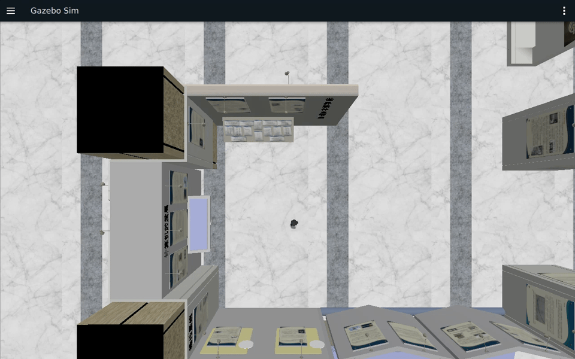

[巡航连续录像](images/ch06/ch06-patrol-gazebo.mp4)与[实际速度及停止反馈](images/ch06/ch06-patrol-gazebo.cast)。

需要定时结束巡航时，停止上一轮后同时设置 `drive_loop:=false` 和 `drive_duration`（秒）：

```bash
bash "$CH06" stop "$RUN_ID"
RUN_ID=$(date -u +%Y%m%dT%H%M%SZ)-ch06-timed
bash "$CH06" start "$RUN_ID" gazebo_ch06.launch.py \
  gui:=true rviz:=false drive:=true drive_loop:=false drive_duration:=12.0
```

计时从巡航节点启动时开始。12 秒后该节点发送零速度并退出，Gazebo 保持运行，便于检查 `/odom` 停止反馈。`drive_loop:=true` 时持续巡航；`drive_duration:=0.0` 表示不设时限。结束后停止该 RUN_ID。

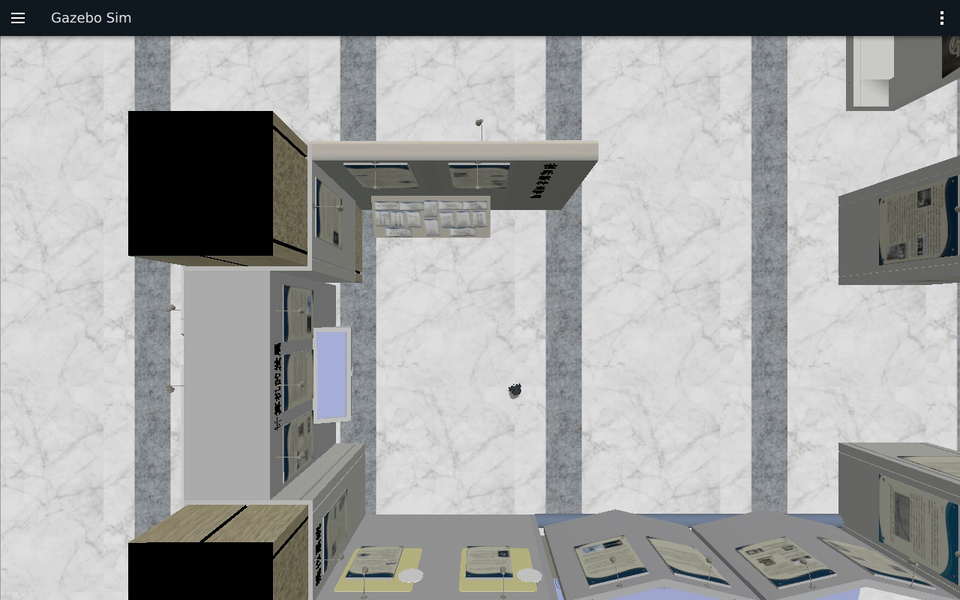

[完整启动与停车录像](images/ch06/ch06-patrol-timed.mp4)及[四种配置的实际验证记录](images/ch06/ch06-patrol-options.cast)。GIF 为原片第 8 秒起的 7.5 秒连续原速画面。

> **实验课时**：2 课时（90 分钟） | TurtleBot3 Burger Gazebo 仿真

---

## 实验目标
1. 声明、读取、设置参数
2. 实现参数动态回调验证
3. 编写 YAML 参数文件和 Python Launch 文件
4. 条件启动与组合启动

---

## 练习 3.1：参数 CRUD 操作（约 30 分钟）

创建 `param_demo` 节点，声明 robot_name、max_speed、sensor_list 三个参数，每秒输出参数值。使用 `ros2 param` 命令行动态修改参数。

**参考代码**：`src_k3_com260_kit/param_demo_cpp/`
**创建 param_demo_cpp 功能包**

已有工作区时先核对内容，不覆盖已有练习。下面每个 COM260 终端均先加载公共环境，编译后再加载本章工作区。

```bash
source ~/.config/ros2-course-com260/env.bash
mkdir -p ~/my_params_com260_ws/src
cd ~/my_params_com260_ws/src
ros2 pkg create param_demo_cpp --build-type ament_cmake --license Apache-2.0 \
  --dependencies rclcpp rcl_interfaces geometry_msgs
```

**创建 Launch 和 YAML 配置目录：**

```bash
cd ~/my_params_com260_ws/src/param_demo_cpp
mkdir -p launch config maps rviz
```

**配置功能包公共文件**

**package.xml**

```bash
nano ~/my_params_com260_ws/src/param_demo_cpp/package.xml
```


```xml
<?xml version="1.0"?>
<package format="3">
  <name>param_demo_cpp</name>
  <version>0.1.0</version>
  <description>COM260 Kit ROS 2 course examples.</description>
  <maintainer email="student@example.com">Student</maintainer>
  <license>Apache-2.0</license>
  <buildtool_depend>ament_cmake</buildtool_depend>
  <depend>rclcpp</depend>
  <depend>rcl_interfaces</depend>
  <depend>geometry_msgs</depend>
  <exec_depend>launch</exec_depend>
  <exec_depend>launch_ros</exec_depend>
  <exec_depend>ament_index_python</exec_depend>
  <exec_depend>demo_nodes_cpp</exec_depend>
  <export><build_type>ament_cmake</build_type></export>
</package>
```

**CMakeLists.txt**

先只注册本练习的 `param_node`，后面的速度练习再添加对应目标。

```bash
nano ~/my_params_com260_ws/src/param_demo_cpp/CMakeLists.txt
```


```cmake
cmake_minimum_required(VERSION 3.8)
project(param_demo_cpp)

find_package(ament_cmake REQUIRED)
find_package(rclcpp REQUIRED)
find_package(rcl_interfaces REQUIRED)
find_package(geometry_msgs REQUIRED)

add_compile_options(-Wall -Wextra -Wpedantic)

add_executable(param_node src/param_node.cpp)
target_compile_features(param_node PRIVATE cxx_std_17)
ament_target_dependencies(param_node rclcpp rcl_interfaces geometry_msgs)

install(TARGETS param_node DESTINATION lib/${PROJECT_NAME})
install(DIRECTORY launch config maps rviz DESTINATION share/${PROJECT_NAME})

ament_package()
```

**编写 param_node.cpp**

每秒读取并输出参数；参数回调的句柄保存在成员变量中，保证回调持续有效。数组先复制到局部变量再遍历，避免临时 Parameter 对象销毁后留下悬空引用。启动时加载的覆盖值和运行时更新都检查范围。

```bash
nano ~/my_params_com260_ws/src/param_demo_cpp/src/param_node.cpp
```


```cpp
#include <chrono>
#include <cmath>
#include <memory>
#include <stdexcept>
#include <string>
#include <vector>

#include "rclcpp/rclcpp.hpp"
#include "rcl_interfaces/msg/set_parameters_result.hpp"

using namespace std::chrono_literals;

class ParamDemo : public rclcpp::Node
{
public:
  ParamDemo() : Node("param_demo")
  {
    declare_parameter("robot_name", "burger");
    declare_parameter("max_speed", 2.0);
    declare_parameter("sensor_list", std::vector<std::string>{"lidar", "camera"});
    declare_parameter("mode", "auto");
    declare_parameter("enable_debug", false);
    const auto initial = validate(get_parameters({"max_speed", "mode"}));
    if (!initial.successful) {throw std::invalid_argument(initial.reason);}
    callback_ = add_on_set_parameters_callback(
      [this](const std::vector<rclcpp::Parameter> & params) {return validate(params);});
    timer_ = create_wall_timer(1s, [this]() {
      std::string sensors;
      const auto sensor_list = get_parameter("sensor_list").as_string_array();
      for (const auto & sensor : sensor_list) {
        if (!sensors.empty()) {sensors += ", ";}
        sensors += sensor;
      }
      RCLCPP_INFO(get_logger(),
        "robot_name=%s | max_speed=%.2f m/s | sensor_list=[%s] | mode=%s | enable_debug=%s",
        get_parameter("robot_name").as_string().c_str(), get_parameter("max_speed").as_double(),
        sensors.c_str(), get_parameter("mode").as_string().c_str(),
        get_parameter("enable_debug").as_bool() ? "true" : "false");
    });
  }

private:
  rcl_interfaces::msg::SetParametersResult validate(const std::vector<rclcpp::Parameter> & params)
  {
    rcl_interfaces::msg::SetParametersResult result;
    result.successful = true;
    for (const auto & param : params) {
      if (param.get_name() == "max_speed" &&
        (param.get_type() != rclcpp::ParameterType::PARAMETER_DOUBLE ||
        !std::isfinite(param.as_double()) || param.as_double() < 0.0 || param.as_double() > 10.0))
      {
        result.successful = false;
        result.reason = "max_speed 必须是 [0.0, 10.0] 范围内的有限浮点数";
      }
      if (param.get_name() == "mode" &&
        (param.get_type() != rclcpp::ParameterType::PARAMETER_STRING ||
        (param.as_string() != "auto" && param.as_string() != "manual" && param.as_string() != "hybrid")))
      {
        result.successful = false;
        result.reason = "mode 必须是 auto、manual 或 hybrid";
      }
      if (!result.successful) {break;}
    }
    return result;
  }
  OnSetParametersCallbackHandle::SharedPtr callback_;
  rclcpp::TimerBase::SharedPtr timer_;
};

int main(int argc, char ** argv)
{
  rclcpp::init(argc, argv);
  int status = 0;
  try {rclcpp::spin(std::make_shared<ParamDemo>());}
  catch (const std::exception & error) {
    RCLCPP_ERROR(rclcpp::get_logger("param_demo"), "%s", error.what());
    status = 1;
  }
  rclcpp::shutdown();
  return status;
}
```

**编译功能包**

```bash
cd ~/my_params_com260_ws
source ~/.config/ros2-course-com260/env.bash
python3 -m colcon build --packages-select param_demo_cpp --symlink-install
source install/setup.bash
```

**运行参数节点**

终端 1

```bash
source ~/.config/ros2-course-com260/env.bash
source ~/my_params_com260_ws/install/setup.bash
ros2 run param_demo_cpp param_node
```
终端 2

```bash
source ~/.config/ros2-course-com260/env.bash
source ~/my_params_com260_ws/install/setup.bash
```
**检查节点**

```bash
ros2 node list
```
**列出全部参数**

```bash
ros2 param list /param_demo
```

**读取字符串参数**

```bash
ros2 param get /param_demo robot_name
```

**读取浮点参数**

```bash
ros2 param get /param_demo max_speed
```
**读取字符串数组**

```bash
ros2 param get /param_demo sensor_list
```

**查看参数说明和类型**

```bash
ros2 param describe /param_demo max_speed
ros2 param describe /param_demo sensor_list
```

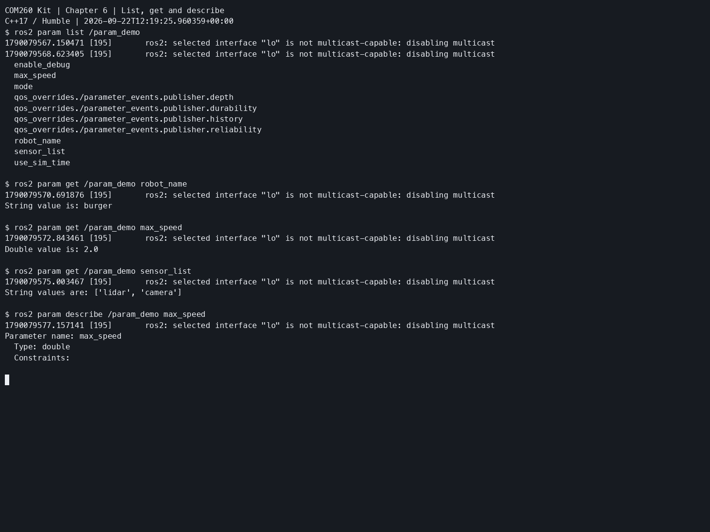

**动态修改参数**

**修改机器人名称**
```bash
ros2 param set /param_demo robot_name burger_lab
```

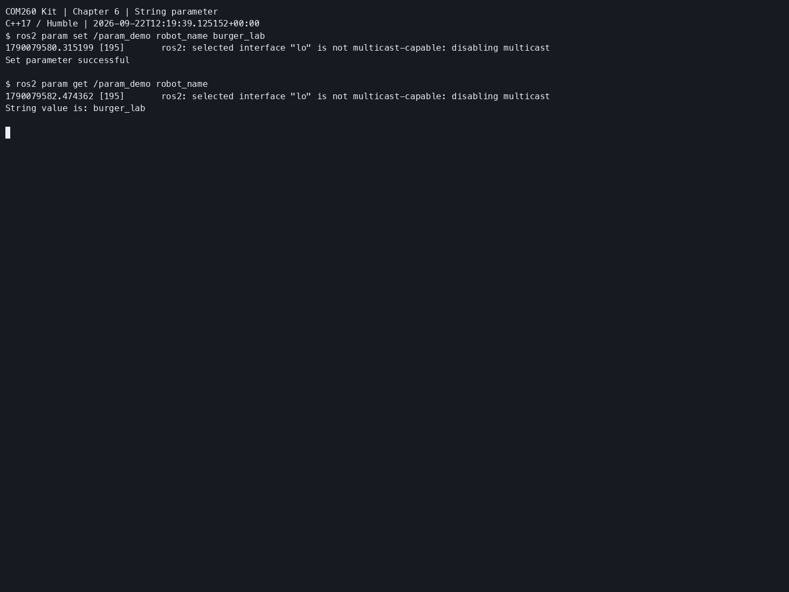

**修改最大速度**

```bash
ros2 param set /param_demo max_speed 4.5
```
```bash
ros2 param get /param_demo max_speed
```


**修改传感器数组**
```bash
ros2 param set /param_demo sensor_list "['lidar', 'camera', 'imu']"
```
```bash
ros2 param get /param_demo sensor_list
```

**修改布尔参数**

```bash
ros2 param set /param_demo enable_debug true
```

关闭调试：

```bash
ros2 param set /param_demo enable_debug false
```

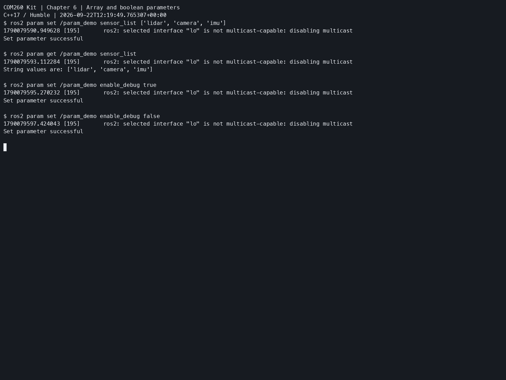

**导出当前参数**
```bash
ros2 param dump /param_demo
```

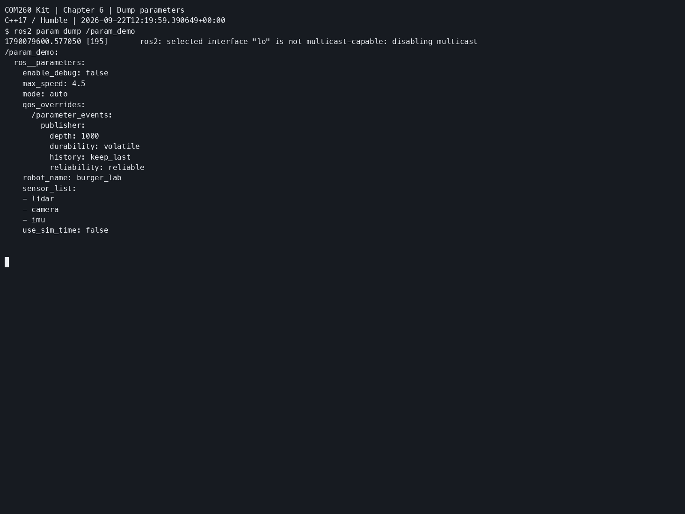

## 练习 3.2：参数回调验证（约 30 分钟）

实现 `add_on_set_parameters_callback`：验证 max_speed 范围 [0.0, 10.0] 和 mode 值 {"auto","manual","hybrid"}。


```cpp
callback_ = add_on_set_parameters_callback(
  [this](const std::vector<rclcpp::Parameter> & params) {return validate(params);});
```

`validate()` 在参数写入前返回 `rcl_interfaces::msg::SetParametersResult`。前一练习完整代码已经实现本节要求；max_speed 必须为有限浮点数并落在 [0.0, 10.0]，mode 只能为 auto、manual、hybrid。回调拒绝时旧值保持不变。Humble 的 `ros2 param set` 可能打印失败信息但退出码仍为 0，因此同时检查响应文字和随后 get 的值。

终端 1

```bash
source ~/.config/ros2-course-com260/env.bash
source ~/my_params_com260_ws/install/setup.bash
ros2 run param_demo_cpp param_node
```

终端 2

```bash
source ~/.config/ros2-course-com260/env.bash
source ~/my_params_com260_ws/install/setup.bash
```
**测试 max_speed**

**设置合法值**

```bash
ros2 param set /param_demo max_speed 8.0
```
```bash
ros2 param get /param_demo max_speed
```

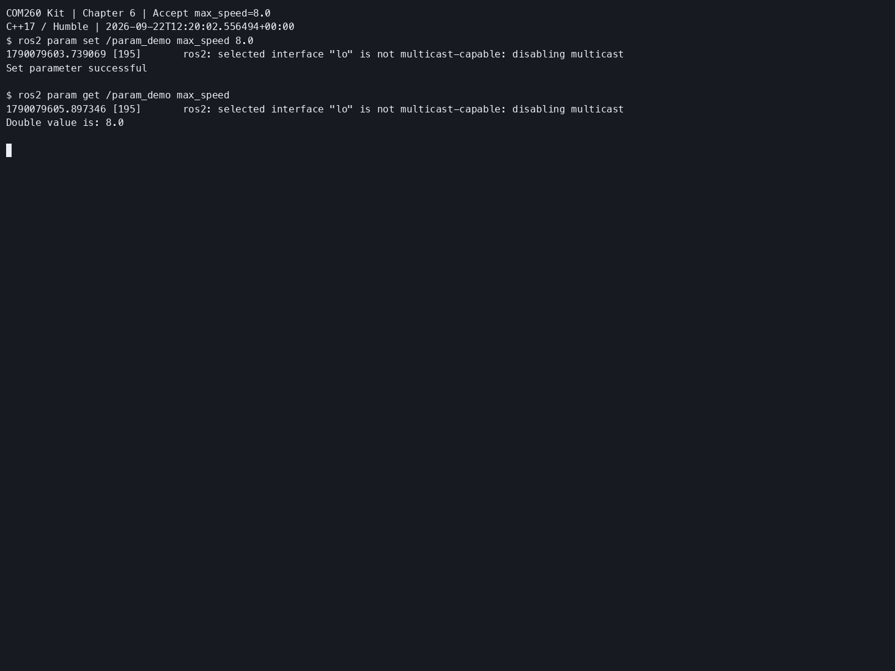

**测试小于下限的值**

```bash
ros2 param set /param_demo max_speed -1.0
```
```bash
ros2 param get /param_demo max_speed
```

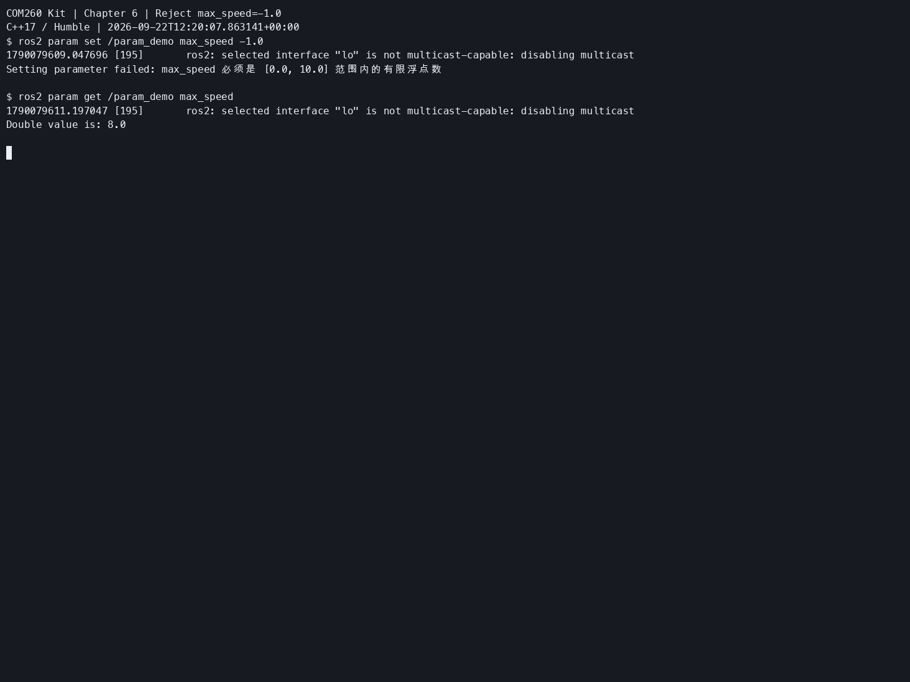

**测试大于上限的值**

```bash
ros2 param set /param_demo max_speed 15.0
```

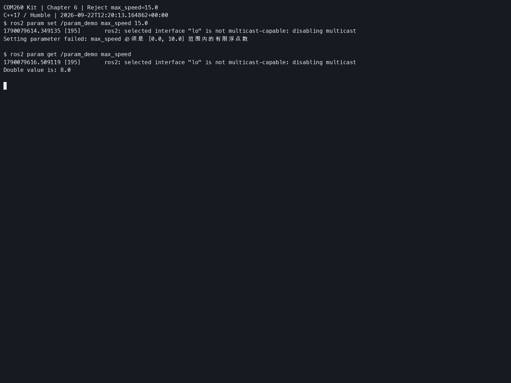

**测试边界值**
```bash
ros2 param set /param_demo max_speed 0.0
ros2 param set /param_demo max_speed 10.0
ros2 param set /param_demo max_speed 10.1
```

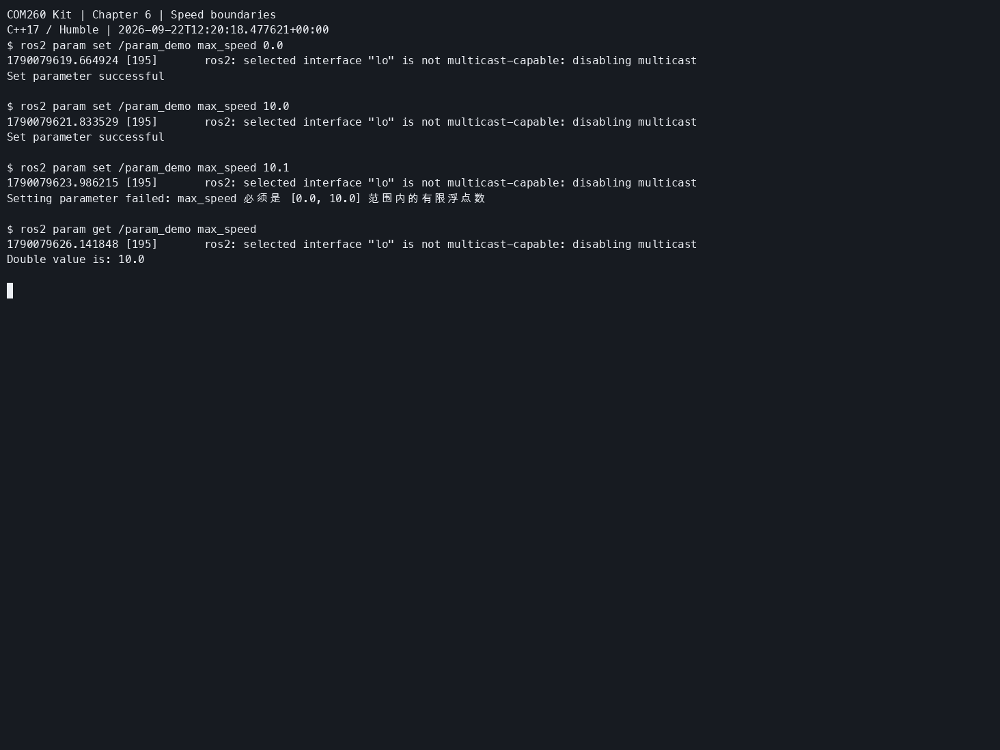

**17. 测试 mode**

**测试三个合法模式**

```bash
ros2 param set /param_demo mode auto
ros2 param set /param_demo mode manual
ros2 param set /param_demo mode hybrid
```
**测试非法模式**

```bash
ros2 param set /param_demo mode sport
ros2 param get /param_demo mode
```
```bash
ros2 param set /param_demo mode AUTO
```

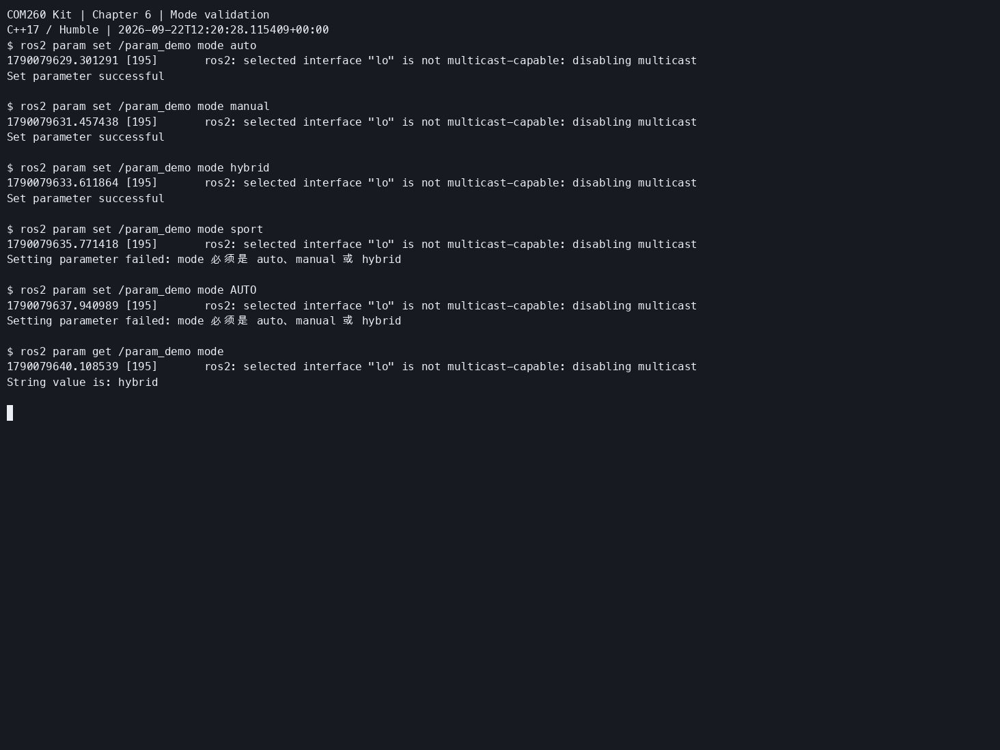

---
**YAML 参数文件实验**

**创建 params.yaml**

文件路径：

```text
~/my_params_com260_ws/src/param_demo_cpp/config/params.yaml
```

完整内容：

```yaml
/param_demo:
  ros__parameters:
    robot_name: 'burger'
    max_speed: 3.5
    sensor_list: ['lidar', 'camera', 'imu']
    mode: 'hybrid'
    enable_debug: true
```

**通过命令行加载 YAML**

先停止之前运行的 `/param_demo` 节点，避免出现同名节点
终端 1 中执行：

```bash
source ~/.config/ros2-course-com260/env.bash
source ~/my_params_com260_ws/install/setup.bash
ros2 run param_demo_cpp param_node --ros-args \
  --params-file ~/my_params_com260_ws/src/param_demo_cpp/config/params.yaml
```

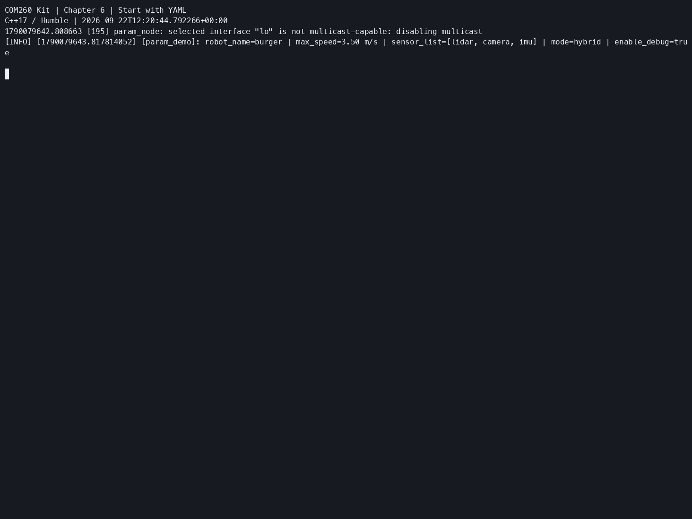

启动后应读取到 robot_name=burger、max_speed=3.5、三个传感器、mode=hybrid、enable_debug=true。YAML 顶层使用 `/param_demo`，同时匹配 Humble 的启动加载和 `ros2 param load /param_demo`。
**向运行中的节点加载 YAML**

保持节点运行，终端 2 执行：

```bash
ros2 param load /param_demo \
  ~/my_params_com260_ws/src/param_demo_cpp/config/params.yaml
```

```bash
ros2 param get /param_demo robot_name
ros2 param get /param_demo max_speed
ros2 param get /param_demo sensor_list
ros2 param get /param_demo mode
ros2 param get /param_demo enable_debug
```

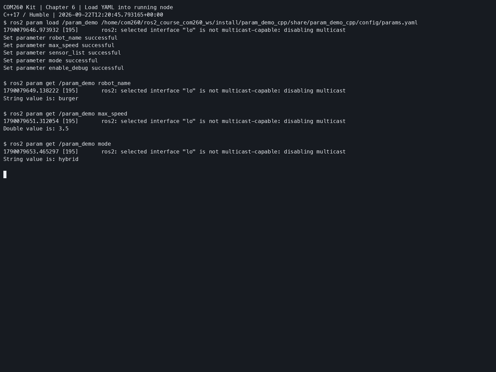

## 练习 3.3：Launch 文件实战（约 30 分钟）

1. 编写 Python Launch 文件，同时启动 talker + listener
2. 添加 `use_rviz` 启动参数控制 RViz 是否启动
3. 组合仿真 Launch：IncludeLaunchDescription 引用 Burger 仿真 + 自主导航节点

Python Launch 用于组织进程，课程节点仍为 C++。本节 GUI 与 Nav2 在 x86 运行，官方 `demo_nodes_cpp` 提供 talker/listener。x86 课程副本中的本章包与 COM260 参数练习工作区分开构建。

**启动 talker、listener 和 RViz**

【x86】在课程副本编写 `launch/demo.launch.py`：

```bash
nano ~/ROS2_RISCV_COM260/src_k3_com260_kit/param_demo_cpp/launch/demo.launch.py
```


```python
#!/usr/bin/env python3

from launch import LaunchDescription
from launch.actions import DeclareLaunchArgument
from launch.conditions import IfCondition
from launch.substitutions import LaunchConfiguration
from launch_ros.actions import Node


def generate_launch_description():
    use_rviz = LaunchConfiguration('use_rviz')

    return LaunchDescription([
        DeclareLaunchArgument(
            'use_rviz',
            default_value='false',
            description='是否启动 RViz2',
        ),

        Node(
            package='demo_nodes_cpp',
            executable='talker',
            name='my_talker',
            output='screen',
        ),

        Node(
            package='demo_nodes_cpp',
            executable='listener',
            name='my_listener',
            output='screen',
        ),

        Node(
            package='rviz2',
            executable='rviz2',
            name='rviz2',
            output='screen',
            condition=IfCondition(use_rviz),
        ),
    ])
```

**使用 Launch 加载 params.yaml**

【COM260】在本章练习包编写此文件，重新构建后可在板端直接运行，不依赖 GUI。

```bash
nano ~/my_params_com260_ws/src/param_demo_cpp/launch/param_with_yaml.launch.py
```


```python
#!/usr/bin/env python3

import os

from ament_index_python.packages import get_package_share_directory
from launch import LaunchDescription
from launch.actions import DeclareLaunchArgument
from launch.substitutions import LaunchConfiguration
from launch_ros.actions import Node


def generate_launch_description():
    default_params_file = os.path.join(
        get_package_share_directory('param_demo_cpp'),
        'config',
        'params.yaml',
    )

    params_file = LaunchConfiguration('params_file')

    return LaunchDescription([
        DeclareLaunchArgument(
            'params_file',
            default_value=default_params_file,
            description='param_demo 节点使用的 YAML 参数文件',
        ),

        Node(
            package='param_demo_cpp',
            executable='param_node',
            name='param_demo',
            output='screen',
            parameters=[params_file],
        ),
    ])
```

**编写组合仿真与导航 Launch**

【x86】编写以下文件。它包含已有 Burger 仿真入口和 Humble 官方 Nav2 bringup；官方 C++ lifecycle manager 负责配置与激活 Nav2 节点。地图沿用原课程 Software_Museum，Nav2 配置采用本章镜像实际安装的 Humble 示例，并匹配 base_link 与初始位姿，不能混用 Jazzy 插件配置。

```bash
nano ~/ROS2_RISCV_COM260/src_k3_com260_kit/param_demo_cpp/launch/combined_sim_nav.launch.py
```


```python
"""Compose Burger simulation and the Humble Nav2 lifecycle nodes on x86."""
import os

from ament_index_python.packages import get_package_share_directory
from launch import LaunchDescription
from launch.actions import DeclareLaunchArgument, IncludeLaunchDescription
from launch.conditions import IfCondition
from launch.launch_description_sources import PythonLaunchDescriptionSource
from launch.substitutions import LaunchConfiguration, PythonExpression
from launch_ros.actions import Node


def generate_launch_description():
    share = get_package_share_directory('param_demo_cpp')
    sim = get_package_share_directory('robot_sim_demo')
    nav2 = get_package_share_directory('nav2_bringup')
    use_rviz = LaunchConfiguration('use_rviz')
    use_gazebo = LaunchConfiguration('use_gazebo')
    gz_headless = LaunchConfiguration('gz_headless')
    use_sim_time = LaunchConfiguration('use_sim_time')
    return LaunchDescription([
        DeclareLaunchArgument('use_rviz', default_value='true'),
        DeclareLaunchArgument('use_gazebo', default_value='true'),
        DeclareLaunchArgument('gz_headless', default_value='false'),
        DeclareLaunchArgument('use_sim_time', default_value='true'),
        DeclareLaunchArgument('gz_partition', default_value='com260_ch06'),
        IncludeLaunchDescription(
            PythonLaunchDescriptionSource(os.path.join(sim, 'launch', 'gazebo2.launch.py')),
            condition=IfCondition(use_gazebo),
            launch_arguments={
                'gui': PythonExpression(["'false' if '", gz_headless, "' == 'true' else 'true'"]),
                'rviz': 'false', 'drive': 'false', 'use_sim_time': use_sim_time,
                'gz_partition': LaunchConfiguration('gz_partition'),
            }.items(),
        ),
        IncludeLaunchDescription(
            PythonLaunchDescriptionSource(os.path.join(nav2, 'launch', 'bringup_launch.py')),
            launch_arguments={
                'map': os.path.join(share, 'maps', 'Software_Museum.yaml'),
                'params_file': os.path.join(share, 'config', 'nav2_params.yaml'),
                'use_sim_time': use_sim_time, 'autostart': 'true',
                'use_composition': 'False',
            }.items(),
        ),
        Node(package='rviz2', executable='rviz2', name='navigation_rviz',
             condition=IfCondition(use_rviz), output='screen',
             arguments=['-d', os.path.join(share, 'rviz', 'navigation.rviz')],
             parameters=[{'use_sim_time': use_sim_time}]),
    ])
```

**重新编译 Launch 文件**

【COM260】安装刚写入的 YAML Launch：

```bash
cd ~/my_params_com260_ws
source ~/.config/ros2-course-com260/env.bash
python3 -m colcon build --base-paths src/param_demo_cpp --packages-select param_demo_cpp --symlink-install
source install/setup.bash
```

【x86】安装 GUI 与组合 Launch：

```bash
cd ~/ROS2_RISCV_COM260
CH06=course_support/k3_com260_kit/scripts/x86-ch06.bash
bash "$CH06" build
```

**测试 talker 和 listener**

【x86】先停止上一轮仿真，再开始默认不启用 RViz 的 Launch：

```bash
RUN_ID=$(date -u +%Y%m%dT%H%M%SZ)-ch06-demo
bash "$CH06" start "$RUN_ID" demo.launch.py
bash "$CH06" exec "$RUN_ID" ros2 node list
bash "$CH06" exec "$RUN_ID" ros2 topic list
```

应看到 /my_talker、/my_listener。使用容器日志观察 Publishing 和 I heard：

```bash
podman logs --tail 20 "ros2-com260-$RUN_ID"
```

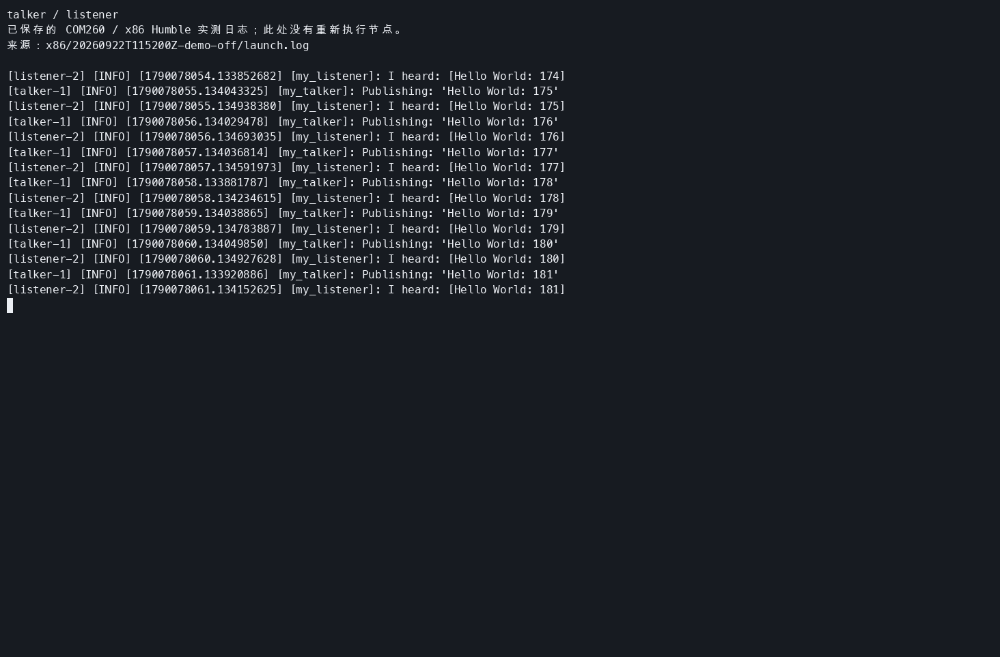


```bash
bash "$CH06" exec "$RUN_ID" ros2 topic echo /chatter std_msgs/msg/String --once
```

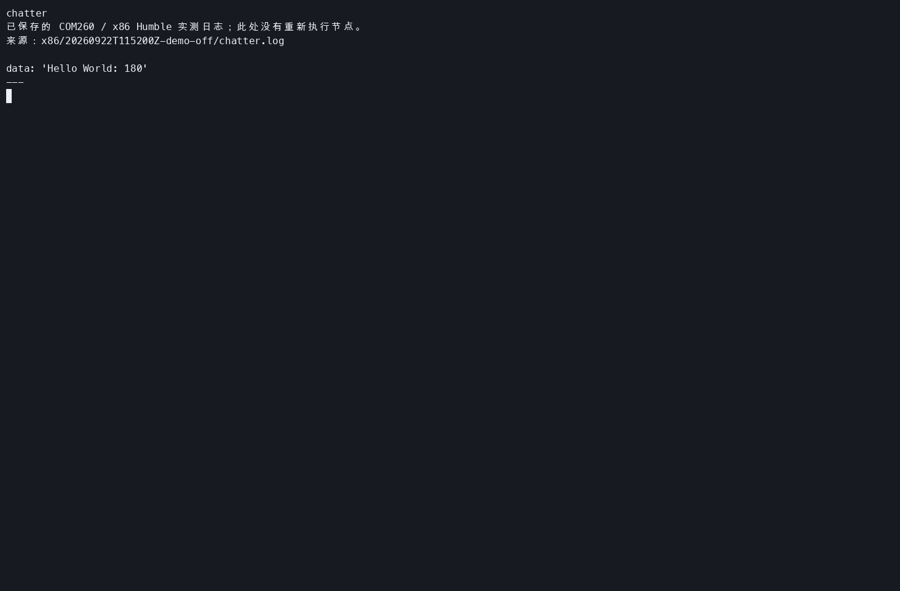

**测试 use_rviz 条件启动**

**不启动 RViz**

```bash
bash "$CH06" stop "$RUN_ID"
RUN_ID=$(date -u +%Y%m%dT%H%M%SZ)-ch06-rviz-off
bash "$CH06" start "$RUN_ID" demo.launch.py use_rviz:=false
bash "$CH06" exec "$RUN_ID" ros2 node list
```

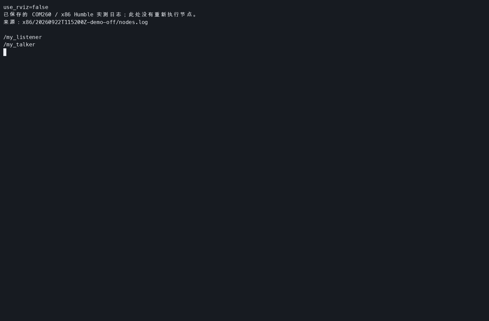

**启动 RViz**

```bash
bash "$CH06" stop "$RUN_ID"
RUN_ID=$(date -u +%Y%m%dT%H%M%SZ)-ch06-rviz-on
bash "$CH06" start "$RUN_ID" demo.launch.py use_rviz:=true
bash "$CH06" exec "$RUN_ID" ros2 node list
bash "$CH06" exec "$RUN_ID" ros2 launch param_demo_cpp demo.launch.py --show-args
```

确认 RViz 窗口与 /rviz2 节点出现；节点清单与画面两项都应核对。
该独立 talker/listener 示例没有地图和 TF，RViz 的 Fixed Frame 警告符合此时的节点内容；这里检查的是条件启动。

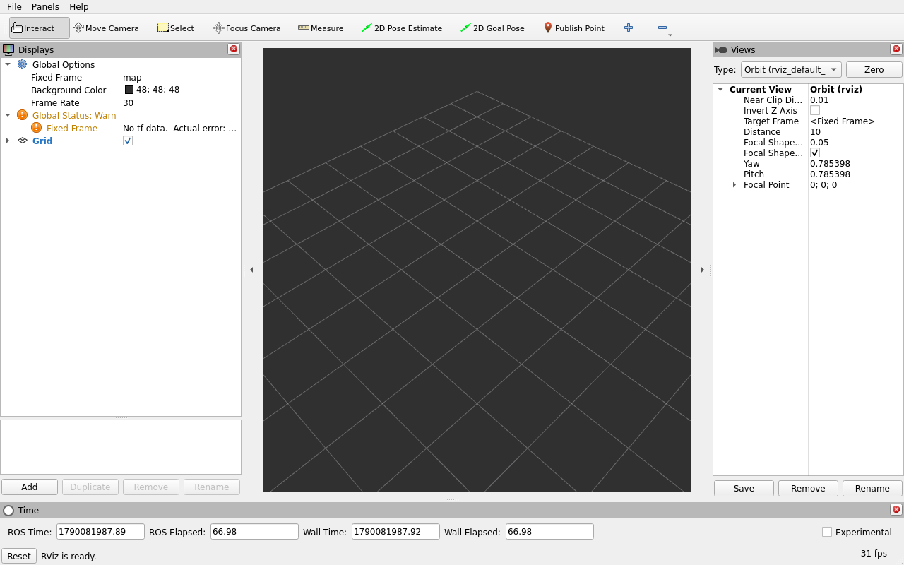

**测试 Launch 加载 YAML**

【COM260】先停止已有参数节点，避免同名节点：

```bash
source ~/.config/ros2-course-com260/env.bash
source ~/my_params_com260_ws/install/setup.bash
ros2 launch param_demo_cpp param_with_yaml.launch.py
```

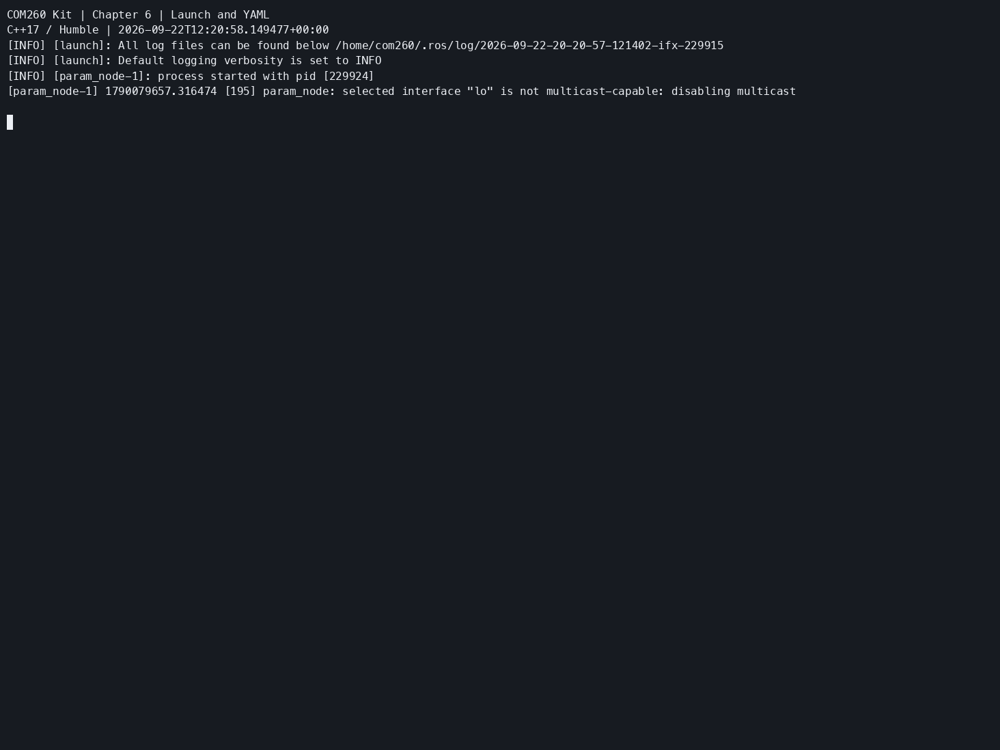

**测试组合 Launch**

**检查依赖包**

【x86】在当前 Humble 容器内检查：

```bash
bash "$CH06" exec "$RUN_ID" ros2 pkg prefix robot_sim_demo
bash "$CH06" exec "$RUN_ID" ros2 pkg prefix nav2_bringup
```

**启动组合系统**

```bash
bash "$CH06" stop "$RUN_ID"
RUN_ID=$(date -u +%Y%m%dT%H%M%SZ)-ch06-nav2
bash "$CH06" start "$RUN_ID" combined_sim_nav.launch.py \
  use_gazebo:=true gz_headless:=false use_rviz:=true use_sim_time:=true
```

正常启动会生成 Burger，加载地图，启动 Nav2 节点和 RViz；生命周期节点配置与激活需要时间。应实际查询到 active，而不是只凭出现窗口判断成功。

```bash
bash "$CH06" exec "$RUN_ID" ros2 lifecycle get /map_server
bash "$CH06" exec "$RUN_ID" ros2 lifecycle get /amcl
bash "$CH06" exec "$RUN_ID" ros2 lifecycle get /controller_server
bash "$CH06" exec "$RUN_ID" ros2 lifecycle get /planner_server
bash "$CH06" exec "$RUN_ID" ros2 lifecycle get /bt_navigator
bash "$CH06" exec "$RUN_ID" ros2 action list
```

不需要 RViz 时停止这一轮，再用新的 RUN_ID 和 `use_rviz:=false` 启动。不要让两个仿真实例或其他速度控制器同时运行。

RViz 使用 `map` 固定坐标系；如侧栏过宽，可拖动分隔条扩大三维视图。地图订阅使用 reliable／transient_local，机器人模型从 `/robot_description` 读取。

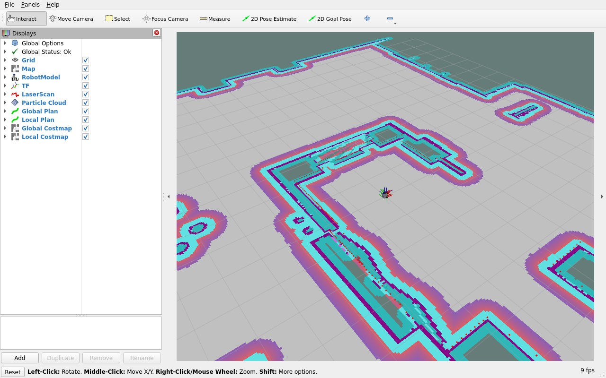

### 思考题
1. `LaunchConfiguration` 和 `DeclareLaunchArgument` 的区别？
2. 什么是 `GroupAction(scoped=True)`，何时使用？

---

## 练习 4：动态参数调速 — 运行时修改机器人速度（约 15 分钟）

### 目标
创建 `speed_controller` 节点，持续发布 `/cmd_vel` 控制机器人运动，通过动态参数实时调整线速度和角速度。

### 步骤
**编写 speed_controller.cpp**

【COM260】在练习包新增速度节点；以 10 Hz 读取已通过验证的参数，禁用时持续发布零速度。SIGINT/SIGTERM 先取消定时器并发送零速度，再关闭 ROS context，因此暂停仿真时也能退出。

```bash
nano ~/my_params_com260_ws/src/param_demo_cpp/src/speed_controller.cpp
```


```cpp
#include <chrono>
#include <cmath>
#include <csignal>
#include <memory>
#include <stdexcept>
#include <thread>
#include <vector>

#include "geometry_msgs/msg/twist.hpp"
#include "rclcpp/rclcpp.hpp"
#include "rcl_interfaces/msg/set_parameters_result.hpp"

using namespace std::chrono_literals;
namespace
{
volatile std::sig_atomic_t stop_requested = 0;
void request_stop(int) {stop_requested = 1;}
}

class SpeedController : public rclcpp::Node
{
public:
  SpeedController() : Node("speed_controller")
  {
    declare_parameter("linear_speed", 0.2);
    declare_parameter("angular_speed", 0.0);
    declare_parameter("enable_control", true);
    const auto initial = validate(get_parameters({"linear_speed", "angular_speed"}));
    if (!initial.successful) {throw std::invalid_argument(initial.reason);}
    callback_ = add_on_set_parameters_callback(
      [this](const std::vector<rclcpp::Parameter> & params) {return validate(params);});
    publisher_ = create_publisher<geometry_msgs::msg::Twist>("/cmd_vel", 10);
    timer_ = create_wall_timer(100ms, [this]() {
      geometry_msgs::msg::Twist command;
      const bool enabled = get_parameter("enable_control").as_bool();
      if (enabled) {
        command.linear.x = get_parameter("linear_speed").as_double();
        command.angular.z = get_parameter("angular_speed").as_double();
      }
      publisher_->publish(command);
      RCLCPP_INFO_THROTTLE(get_logger(), *get_clock(), 2000,
        "enable=%s, v=%.2f m/s, w=%.2f rad/s", enabled ? "true" : "false",
        command.linear.x, command.angular.z);
    });
  }

  void stop()
  {
    timer_->cancel();
    for (int i = 0; i < 5 && rclcpp::ok(); ++i) {
      publisher_->publish(geometry_msgs::msg::Twist());
      std::this_thread::sleep_for(100ms);
    }
  }

private:
  rcl_interfaces::msg::SetParametersResult validate(const std::vector<rclcpp::Parameter> & params)
  {
    rcl_interfaces::msg::SetParametersResult result;
    result.successful = true;
    for (const auto & param : params) {
      const auto & name = param.get_name();
      if (name != "linear_speed" && name != "angular_speed") {continue;}
      const double limit = name == "linear_speed" ? 1.0 : 2.0;
      if (param.get_type() != rclcpp::ParameterType::PARAMETER_DOUBLE ||
        !std::isfinite(param.as_double()) || std::abs(param.as_double()) > limit)
      {
        result.successful = false;
        result.reason = name == "linear_speed" ?
          "线速度必须是 [-1.0, 1.0] m/s 范围内的有限浮点数" :
          "角速度必须是 [-2.0, 2.0] rad/s 范围内的有限浮点数";
        break;
      }
    }
    return result;
  }
  OnSetParametersCallbackHandle::SharedPtr callback_;
  rclcpp::TimerBase::SharedPtr timer_;
  rclcpp::Publisher<geometry_msgs::msg::Twist>::SharedPtr publisher_;
};

int main(int argc, char ** argv)
{
  rclcpp::init(argc, argv, rclcpp::InitOptions(), rclcpp::SignalHandlerOptions::None);
  std::signal(SIGINT, request_stop);
  std::signal(SIGTERM, request_stop);
  int status = 0;
  try {
    auto node = std::make_shared<SpeedController>();
    rclcpp::executors::SingleThreadedExecutor executor;
    executor.add_node(node);
    while (!stop_requested && rclcpp::ok()) {executor.spin_once(100ms);}
    node->stop();
  } catch (const std::exception & error) {
    RCLCPP_ERROR(rclcpp::get_logger("speed_controller"), "%s", error.what());
    status = 1;
  }
  rclcpp::shutdown();
  return status;
}
```

在 CMakeLists.txt 的 `ament_package()` 之前添加：

```cmake
add_executable(speed_ctrl src/speed_controller.cpp)
target_compile_features(speed_ctrl PRIVATE cxx_std_17)
ament_target_dependencies(speed_ctrl rclcpp rcl_interfaces geometry_msgs)
install(TARGETS speed_ctrl DESTINATION lib/${PROJECT_NAME})
```

**创建初始速度 YAML**

```text
~/my_params_com260_ws/src/param_demo_cpp/config/speed_params.yaml
```

```yaml
/speed_controller:
  ros__parameters:
    linear_speed: 0.2
    angular_speed: 0.0
    enable_control: true
```

**创建 speed.launch.py**
```text
~/my_params_com260_ws/src/param_demo_cpp/launch/speed.launch.py
```
```python
#!/usr/bin/env python3

import os

from ament_index_python.packages import get_package_share_directory
from launch import LaunchDescription
from launch_ros.actions import Node


def generate_launch_description():
    params_file = os.path.join(
        get_package_share_directory('param_demo_cpp'),
        'config',
        'speed_params.yaml',
    )

    return LaunchDescription([
        Node(
            package='param_demo_cpp',
            executable='speed_ctrl',
            name='speed_controller',
            output='screen',
            parameters=[params_file],
        ),
    ])
```

**编译速度控制节点**
```bash
cd ~/my_params_com260_ws
source ~/.config/ros2-course-com260/env.bash
python3 -m colcon build --base-paths src/param_demo_cpp \
  --packages-select param_demo_cpp \
  --symlink-install
source ~/my_params_com260_ws/install/setup.bash
```
```bash
ros2 pkg executables param_demo_cpp
```
**启动 Gazebo 仿真**

【x86】停止组合导航，再用新 RUN_ID 启动无自动巡航的 Gazebo 场景。速度控制由 COM260 唯一发布：

```bash
bash "$CH06" stop "$RUN_ID"
RUN_ID=$(date -u +%Y%m%dT%H%M%SZ)-ch06-speed
bash "$CH06" start "$RUN_ID" gazebo_ch06.launch.py gui:=true rviz:=false drive:=false
```

**启动速度控制节点**

```bash
source ~/.config/ros2-course-com260/env.bash
source ~/my_params_com260_ws/install/setup.bash
ros2 run param_demo_cpp speed_ctrl
```

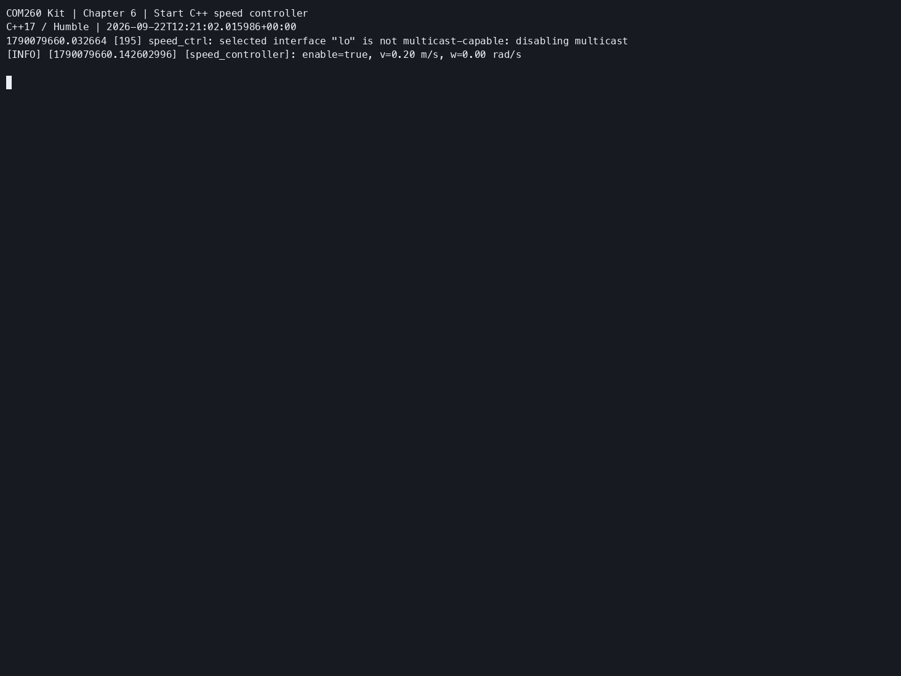

也可以使用 YAML Launch 启动：

```bash
ros2 launch param_demo_cpp speed.launch.py
```
**检查节点、参数和话题**

```bash
source ~/.config/ros2-course-com260/env.bash
source ~/my_params_com260_ws/install/setup.bash
```

检查节点：

```bash
ros2 node list
```
```bash
ros2 param list /speed_controller
```

读取初始值：

```bash
ros2 param get /speed_controller linear_speed
ros2 param get /speed_controller angular_speed
ros2 param get /speed_controller enable_control
```

检查 `/cmd_vel`：

```bash
ros2 topic info /cmd_vel
```

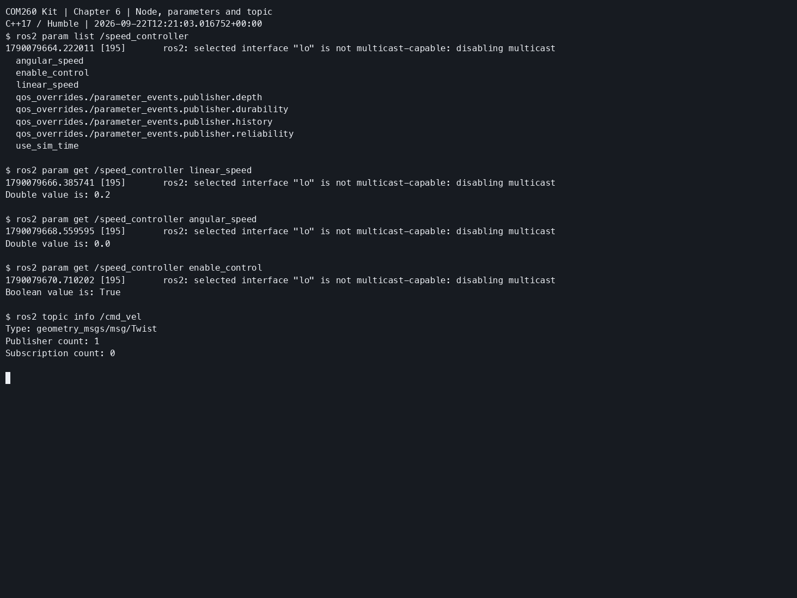

**动态修改速度**
**加速直行**

```bash
ros2 param set /speed_controller linear_speed 0.5
```

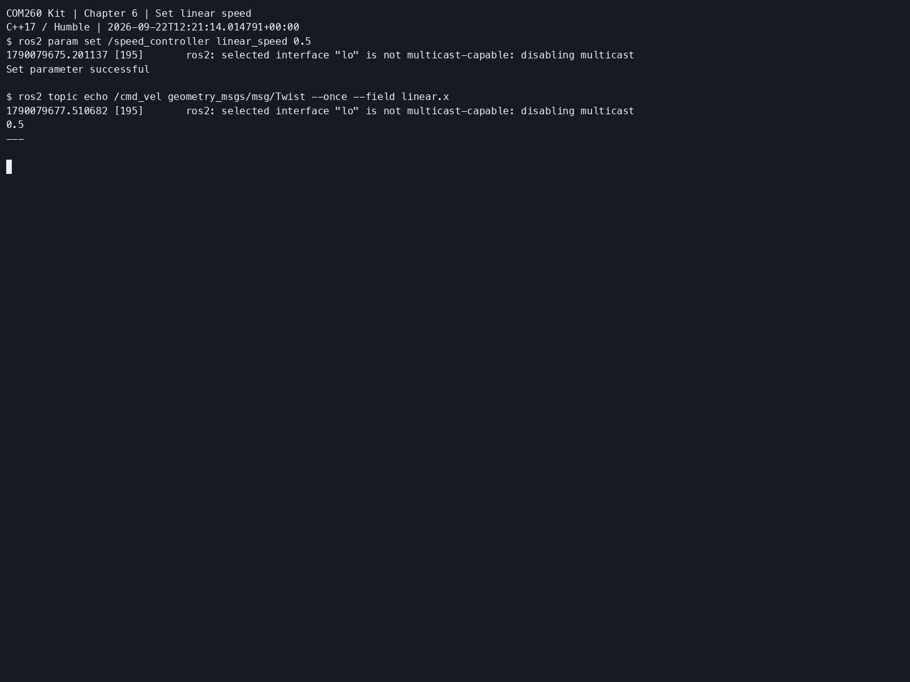

**一边前进一边左转**

```bash
ros2 param set /speed_controller angular_speed 1.0
```

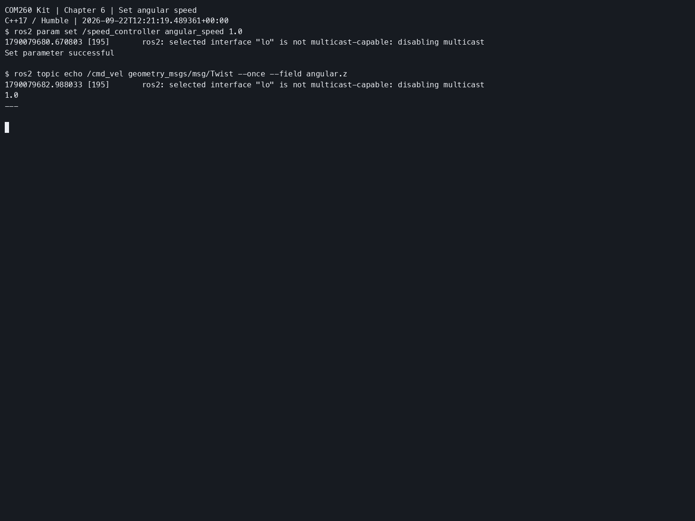

**一边前进一边右转**

```bash
ros2 param set /speed_controller angular_speed -1.0
```

**停止转动，继续直行**

```bash
ros2 param set /speed_controller angular_speed 0.0
```

**倒车**

```bash
ros2 param set /speed_controller linear_speed -0.3
```

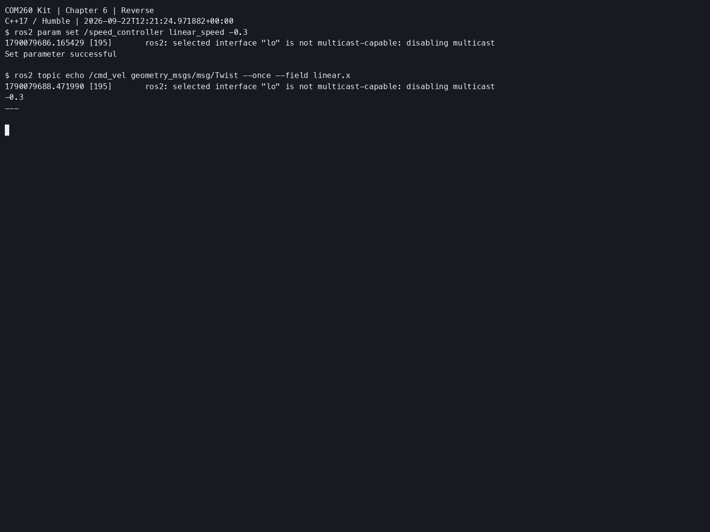

负线速度表示后退。

**完全停止**

同时把两个速度设置为零：

```bash
ros2 param set /speed_controller linear_speed 0.0
ros2 param set /speed_controller angular_speed 0.0
```

**暂停和恢复控制**

暂停控制：

```bash
ros2 param set /speed_controller enable_control false
```
在禁用状态下修改速度：

```bash
ros2 param set /speed_controller linear_speed 0.4
ros2 param set /speed_controller angular_speed 0.5
```

参数可以修改成功，但节点仍发布零速度，机器人不会运动。

恢复控制：

```bash
ros2 param set /speed_controller enable_control true
```

恢复后，节点会立即使用刚才保存的 `0.4` 和 `0.5`，机器人开始沿弧线运动。

实验结束前再次完全停止：

```bash
ros2 param set /speed_controller linear_speed 0.0
ros2 param set /speed_controller angular_speed 0.0
```

**测试超限参数**

**线速度超限**

```bash
ros2 param set /speed_controller linear_speed 3.0
```
**负线速度超限**

```bash
ros2 param set /speed_controller linear_speed -1.5
```

**角速度超限**

```bash
ros2 param set /speed_controller angular_speed 3.0
```
**负方向超限：**

```bash
ros2 param set /speed_controller angular_speed -2.5
```

**测试边界值**


```bash
ros2 param set /speed_controller linear_speed 1.0
ros2 param set /speed_controller linear_speed -1.0
ros2 param set /speed_controller angular_speed 2.0
ros2 param set /speed_controller angular_speed -2.0
```

完成测试后立即停止：

```bash
ros2 param set /speed_controller linear_speed 0.0
ros2 param set /speed_controller angular_speed 0.0
```

**/cmd_vel 数据**

在终端 3 中执行：

```bash
ros2 topic echo /cmd_vel
```

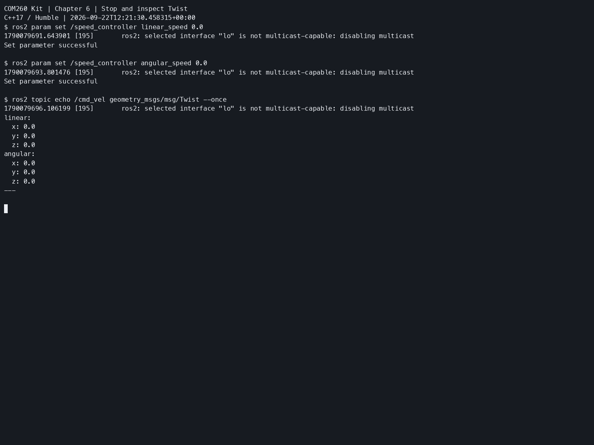

检查发布频率：

```bash
ros2 topic hz /cmd_vel
```

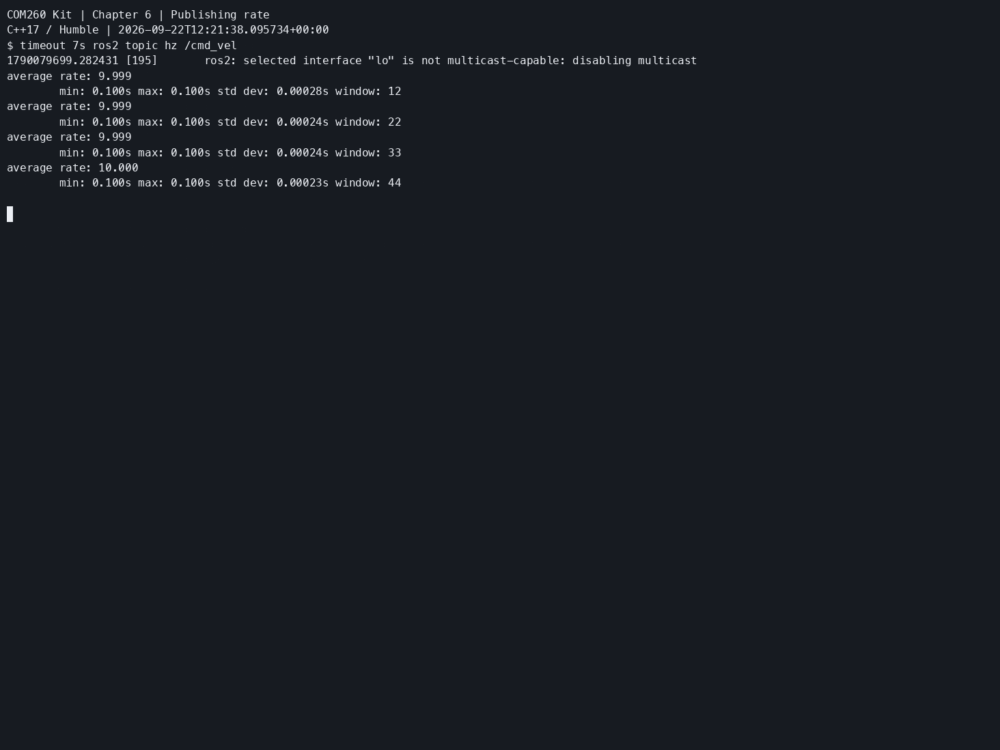

查看详细通信关系：

```bash
ros2 topic info /cmd_vel --verbose
```

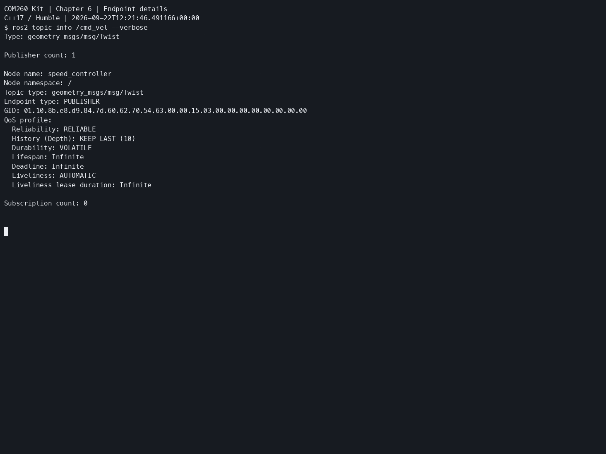

完成超限与边界参数检查时可先设置 enable_control=false，核对保存值后再恢复低速；运行时速度以 /odom 实际反馈为准。实验结束先禁用控制并观察速度归零，再停止 COM260 节点和 x86 容器。

## 实际运行证据

真实运行的参数列表、合法参数更新和非法边界值拒绝输出：


[参数终端记录](images/ch06/ch06-parameters.cast)、[动态调速连续录像](images/ch06/ch06-speed-gazebo.mp4)及[第六章实测记录](runtime_evidence.md#ch06)。
