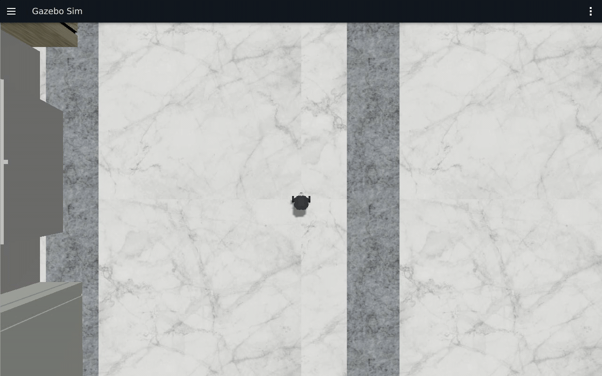
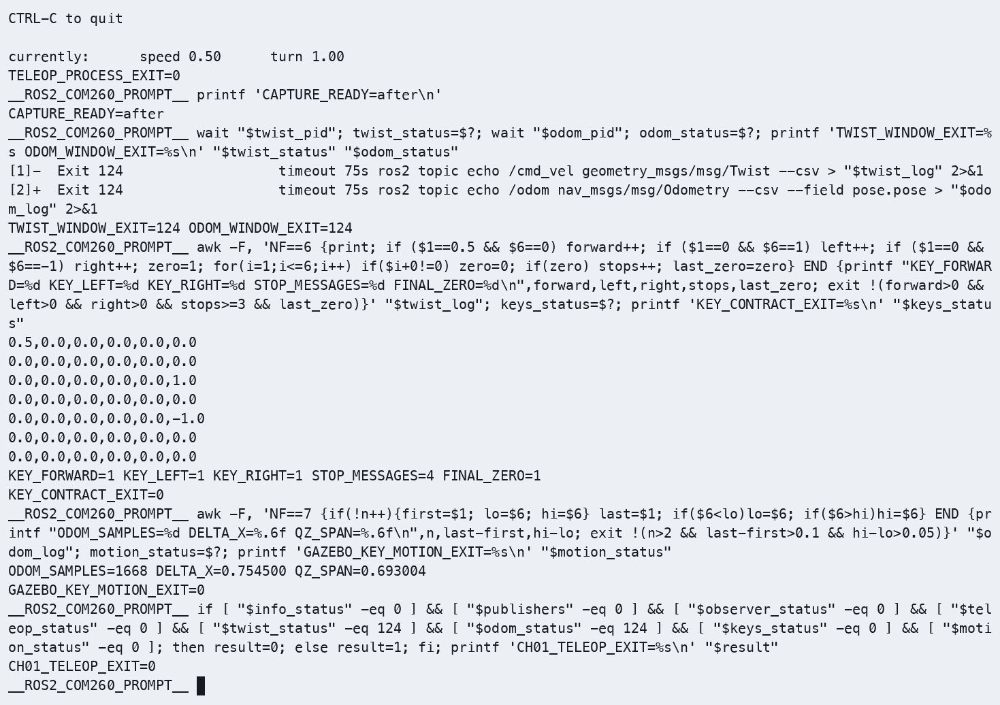
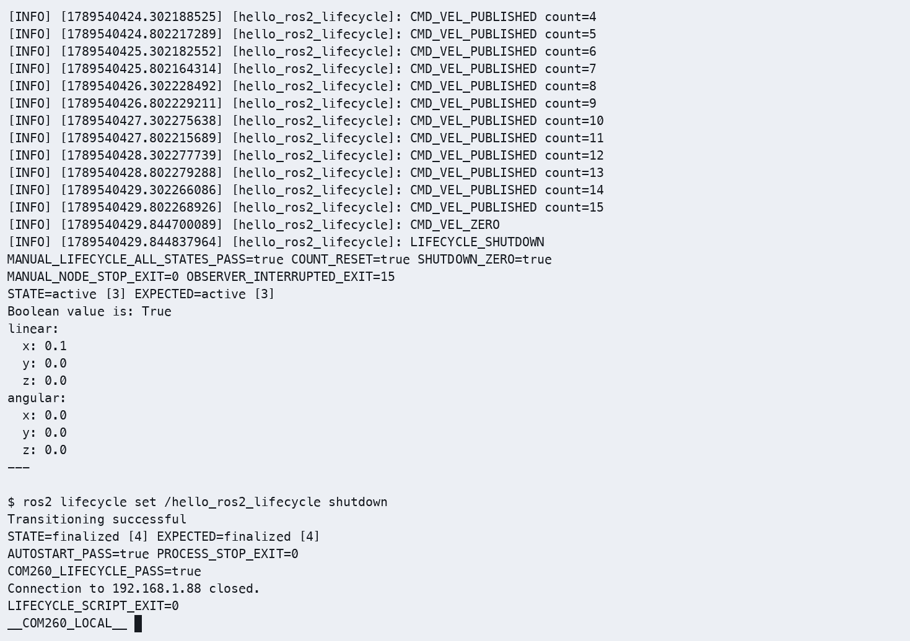
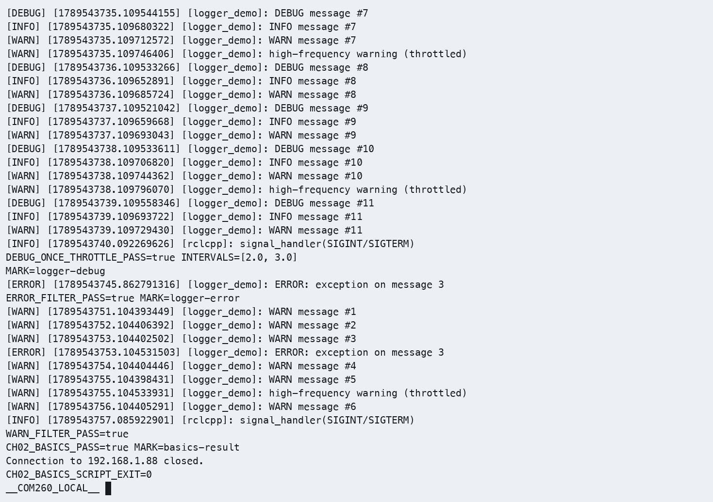
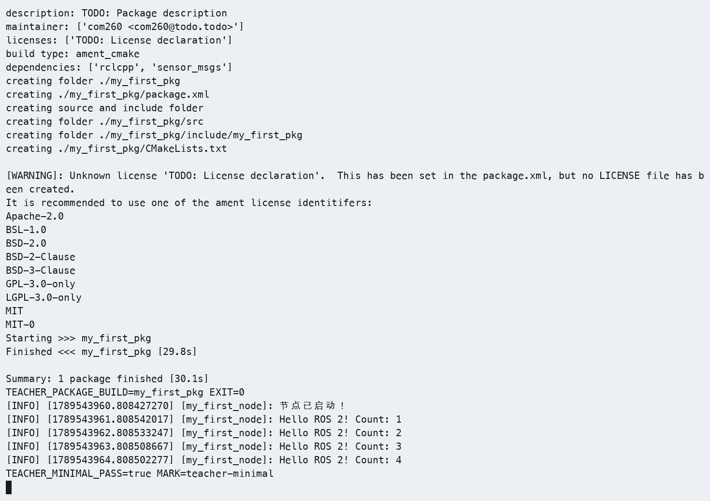
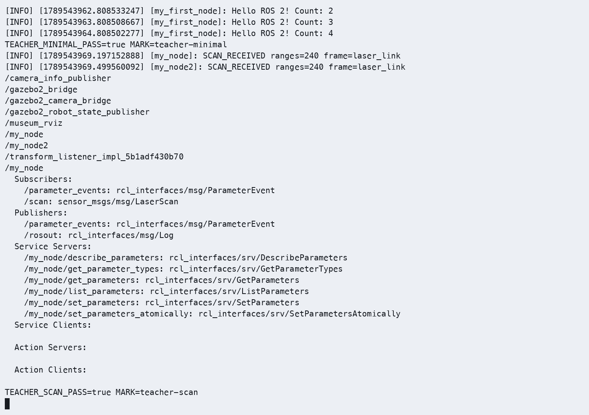
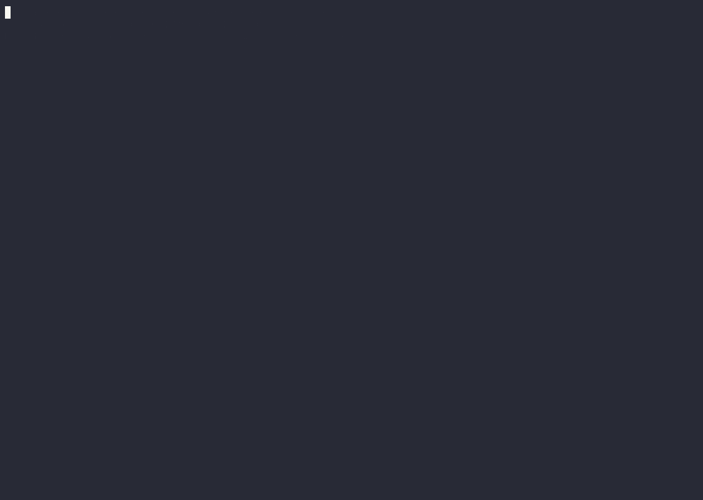
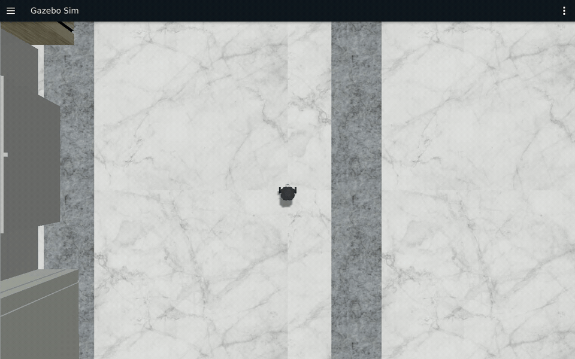

# COM260 实际运行证据

本版结果来自 COM260 当前环境，原版和 Pico 结果仅作参考。环境准备见[公共双端环境](ch00_common_setup.md)。

## 第一章：COM260 实测通过

2026-09-16，起始提交 `96d9c90490573aeb8e06c8c32bf421a40544f3a5`，工作分支 `feat/com260-kit-validation`。章节入口：[实验手册](ch01_lab.md)、[教师教案](../teaching_docs_k3_com260_kit/ch01_ROS2概述与架构.md)。

| 验证项 | 本轮结果 |
|---|---|
| COM260 连接及系统 | SSH 公钥连接成功；设备为 SpacemiT K3 Com260 IFX，Bianbu 4.0.6，riscv64，内核 6.18.3-generic |
| COM260 工具 | 用户完成依赖安装；ROS 2 Humble，CycloneDDS 0.10.5，Python 3.14.4，CMake 4.2.3，GDB 17.1，clangd 21 |
| 第一章依赖解析 | 安装前 apt 模拟退出码 0；新增 312 个包，升级 0、删除 0；安装后核对依赖与入口 |
| x86 环境 | Ubuntu 24.04.4 宿主；rootless Ubuntu 22.04.5/Humble 容器；X11 `:1` 可读取 |
| COM260 构建 | 原样复用 `lifecycle_demo_cpp` 和 `robot_sim_demo`；Debug 构建及测试退出码 0；10 项资源 pytest 通过，colcon 实际汇总 60 项、0 错误、0 失败、0 跳过 |
| x86 构建和测试 | 独立工作区构建 `robot_sim_demo` 成功；10 项 pytest 通过，colcon 汇总 11 项、0 失败 |
| 最终源码身份 | COM260 58 个、x86 54 个源码／支持文件与本地 SHA-256 一致。核对范围包含最终视图配置，较初始构建多出独立设置文件；教学源码始终未改动 |
| 1.1 安装验证 | C++ talker/listener 收发递增消息；节点、话题及 `/chatter` 查询通过 |
| 1.2 建包 | 独立新建 `~/my_ros2_com260_ws`，空工作区构建、ament_cmake 建包、编译及加载查询均成功 |
| 1.3 域隔离 | Domain 0 收到；Domain 1 观察 10 秒未收到（预期 timeout 124）；恢复 Domain 0 后收到；教案 Domain 42 设置和恢复通过 |
| 双端基线 | 双向消息、互相发现、跨端参数查询、隔离与恢复、x86 `/clock` 到 COM260 全部通过 |
| 1.5 仿真和传感器 | Museum/Burger、RViz 模型及相机显示正常；COM260 收到 clock、scan、image、CameraInfo、odom、tf、tf_static 七个话题 |
| 1.5 键盘 | i/j/l/k 前进、左右转、停止通过；最终速度为零；1668 条 odom 样本，Δx=0.754500 m，四元数 z 分量跨度 0.693004（不是 yaw 角）；遥控程序与验收脚本退出码 0 |
| 生命周期 | 默认未配置，完整手动迁移、cleanup 后计数重置、再次激活、shutdown、独立 autostart 均通过；激活速度 0.1，停用／关闭归零；C++ 节点退出码 0 |
| 1.6 IDE | Remote-SSH 连接 COM260；RuyiSDK 扩展、clangd 补全、Native Debug/GDB、configure/activate 断点及 Watch 0→1 单步通过 |
| 文档与媒体 | 原实验手册 18 处、教案 4 处素材位置均对应本轮证据；IDE/RViz 截图、Gazebo 连续录像及内嵌 GIF 已归档；4 份 CAST 均以退出事件 0 结束，5 份 MP4、Gazebo 和生命周期 GIF 完整解码通过 |
| 结束状态 | x86 本轮容器已停止；COM260 节点图为空、生命周期进程退出；构建目录与 IDE 环境保留供下次使用 |

镜像 ID：`442a2715c72365056f1028363f4bbbc6cea5ac3ae93d0268cea64fd82cf3d1b1`；Gazebo Sim 8.15.0、RViz 11.2.28。容器使用软件渲染；同轮一个 30 秒观察窗口内仿真时间推进约 10.397 秒，本轮不将墙上时间等同于仿真时间。

### 本轮素材与运行编号

| 范围 | 本地记录编号 | 可直接打开的素材 |
|---|---|---|
| 环境、同步和构建 | `20260916T060019Z`；成功构建 `20260916-build-module` | [构建 CAST](images/ch01/ch01-build.cast)、[构建终端视频](images/ch01/ch01-build.mp4) |
| 安装验证、建包、域隔离 | `20260916T061640Z-foundations` | [基础练习 CAST](images/ch01/ch01-foundations.cast)、[终端视频](images/ch01/ch01-foundations.mp4) |
| 双端 DDS 和生命周期 | 仿真实例 `20260916T0630-com260-ch01`；生命周期记录 `20260916-lifecycle-cli-stop` | [生命周期 CAST](images/ch01/ch01-lifecycle.cast)、[终端视频](images/ch01/ch01-lifecycle.mp4) |
| IDE | `20260916-ide` | [configure](images/ch01/ide-configure-breakpoint.png)、[activate](images/ch01/ide-activate-breakpoint.png)、[Watch 0](images/ch01/ide-count-zero.png)、[Watch 1](images/ch01/ide-count-one.png) |
| GUI、传感器和遥控 | `20260916T064703Z-com260-teleop` | [Gazebo 连续录像](images/ch01/ch01-gazebo.mp4)、[配对终端 CAST](images/ch01/ch01-teleop.cast)、[配对终端视频](images/ch01/ch01-teleop.mp4) |

Gazebo 原始录制时间为 06:55:25～06:57:55 UTC，共 150 秒；正式 MP4 保留开头连续 56 秒，原速、无拼接，覆盖静止、前进、左右转和最终停止。正文开始／结束图取自原录像第 2／54 秒。后半段重开 RViz 后存在窗口遮挡，完整原片保存在本地原始采集目录，未作为正文演示。配对 COM260 CAST 起点为 06:55:21 UTC，遥控进程约在其第 50 秒正常退出。

GIF 取自上述录像第 30～56 秒，连续 26 秒、原速、12 帧/秒、1280×800，保留前进、左右转与停止过程。

RViz 前后图来自同一仿真实例，按顺序采集；为保证 Gazebo 录制不被遮挡，期间暂时关闭本轮 RViz，运动结束后重新打开。模型放大图随后使用同一实例的 1900×1000 窗口配置采集；之前的前后图窗口为 1200×800。IDE、基础练习和生命周期分别采集，不合称同一轮同步演示。

### 可复核的运行记录与实际差异

- 键盘消息与运动反馈：最后一条 Twist 六个分量均为 0；限时观察进程的 124 是预期观察窗口结束。
- 生命周期：实际发布端为 RELIABLE、VOLATILE、KEEP_LAST(10)。主动停止 ROS CLI 观察者时退出码 15，与 C++ 节点的正常退出码 0 分别记录。
- IDE 控制端：RuyiSDK VSCode 扩展已安装；使用原生 GCC/GDB，未安装 RuyiSDK CLI。clangd 的 5 项 unused-includes 提示保留，未修改课程头文件。
- Bianbu 的 colcon 模块存在，但初始没有独立 `colcon` 命令；安装器和板端步骤已使用 `python3 -m colcon`，复跑成功。建包练习的许可证占位提示与 CMake 弃用警告保留。
- 跨机查询的短发现窗口曾漏报远端节点，恢复域后的 5 秒观察也曾不足；最终使用 `--no-daemon --spin-time 10`，恢复接收窗口 20 秒。初次传感器探针的 JSON 布尔类型转换和生命周期零值解析错误仅涉及验证脚本，修正后重新采集。

失败尝试与完整原始采集留在验证者本地。本页和章节正文引用的正式素材均在仓库相对路径内，阅读不依赖本地隐藏目录。

## 第二章：COM260 实测通过

2026-09-16，在同一 `feat/com260-kit-validation` 分支完成下表原有实测；章节入口：[实验手册](ch02_lab.md)、[教师教案](../teaching_docs_k3_com260_kit/ch02_核心编程基础.md)。课程内容、练习编号与输入值沿用原章，节点采用 C++17／rclcpp。新增两个包位于 `src_k3_com260_kit/`，仿真继续原样复用 `src_k3_pico_itx/robot_sim_demo`。

随后 `odom_monitor` 新增从 `/odom` 消息的 `twist.twist` 字段读取线速度、角速度的输出，并为位置、航向及速度标注单位。该修改已在本页下方“速度输出补验”中单独记录；下表原有构建、源码指纹和媒体结论对应修改前版本。新增输出的板端构建、已知输入验证和 Gazebo 静止／运动／停止联动均已通过。

| 验证项 | 本轮结果与证据 |
|---|---|
| 构建 | `--build-ch02` 构建 `hello_pkg_cpp`、`name_demo_cpp` 成功；独立新建 `~/my_hello_com260_ws` 并编译练习包；[受管构建截图](images/ch02/ch02-course-build.png)与[基础 CAST](images/ch02/ch02-basics.cast)。这两个包未注册单元测试，本章结论来自以下运行验收 |
| 源码一致性（修改前） | 原实测时 COM260 65 个、x86 54 个源码和支持文件与本地 SHA-256 一致。三个 lab 完整 C++ 程序与实际编译源码一致；两个教案程序和 CMake 共 4 个文件也与板端一致。新增速度输出后的 `odom_monitor.cpp` 指纹见下方补验记录 |
| 定时节点与重命名 | 启动标记、从 1 开始的递增计数通过，实测回调间隔约 1 秒。`/hello_node`、`/hello2` 同时存在 |
| 命名空间和参数 | `/student/name_demo`、命名空间 `/student`、`serial=7`；未传入的 `global_serial` 实际为 -1 |
| 日志级别 | 默认 INFO 不含 DEBUG；节点 DEBUG 含四个级别，第 3 次 ERROR 仅一次；全局 ERROR 和节点 WARN 过滤正确 |
| 节流 | 源码阈值为 2000 ms；本轮节流警告相邻间隔为 2.0、3.0 秒，均不短于阈值。它限制最短间隔，并不保证每隔恰好 2 秒输出 |
| rqt_graph | 真实 GUI 显示 `/talker → /chatter → /listener`，并显示仿真传感器与 RViz 的连接；[连续 GUI 录像](images/ch02/ch02-rqt-graph.mp4)。[完整 talker 接口截图](images/ch02/ch02-talker-node-info.png)、[CLI CAST](images/ch02/ch02-graph.cast) |
| rqt_console | 收到 COM260 `logger_demo` 的 Debug、Info、Warn、Error；第 3 次 ERROR 与节流警告可见；[GUI 录像](images/ch02/ch02-rqt-console.mp4) |
| RViz | 同轮仿真中的 RobotModel 状态为 Ok，激光与相机可见；[无遮挡截图](images/ch02/ch02-rviz.png) |
| 原输入运动 | `linear.x=0.2 m/s`、`angular.z=0.5 rad/s`；收到 102 条对应速度消息和 1053 条位姿样本；从约 `(0, 0, 0)` 到 `(0.281051 m, 0.686597 m, 2.374500 rad)`；yaw 使用完整四元数公式计算 |
| 里程计速度输出（补验通过） | 原有运动记录未覆盖 `twist.twist` 速度反馈。新版已完成板端构建、已知输入和独立 Gazebo 联动验证，详见下方补验记录 |
| 停止 | 显式零速度发布退出 0；最后一条 Twist 六个分量均为 0；末尾 30 条位姿的 x、y、yaw 跨度均为 0 |
| 教案独立程序 | `my_robot_pkg/my_node` 构建并逐秒计数；`my_first_pkg/my_node` 与重命名的 `/my_node2` 均收到 `/scan`，每帧 240 点、frame 为 `laser_link` |
| 退出与清理 | 课程 C++ 节点均正常退出 0；有限观察窗口为预期 timeout 124。COM260 节点图为空。临时图形容器超时后由 Podman 强制结束，课程仿真停止成功；回环服务及本机 SSH 隧道已关闭，练习工作空间保留 |
| 媒体交付 | 原 lab 11 处、教案 2 处素材位置均已替换为本轮证据；另补充 Gazebo 和教案程序证明。5 份 CAST 均以退出 0 结束；7 份 MP4、4 份 GIF 完整解码通过 |

### 连续录像与实际运行编号

仿真实例为 `20260916T0730-com260-ch02`。Gazebo、rqt_console、rqt_graph 是该实例运行期间先后录制的独立片段，不是同步拼接画面。

| 范围 | 运行编号／采集时间（UTC） | 正式素材 |
|---|---|---|
| 建包、节点、命名空间、日志 | `20260916-ch02-basics` | [CAST](images/ch02/ch02-basics.cast)、[完整终端 MP4](images/ch02/ch02-basics.mp4)；内嵌 GIF 为第 87～117 秒的连续片段 |
| ERROR 过滤清屏补拍 | `20260916-ch02-error-filter` | [CAST](images/ch02/ch02-error-filter.cast)，重新运行并正常退出，避免上一轮 DEBUG 输出残留干扰截图 |
| 教案最小节点与 `/scan` | `20260916-ch02-teacher` | [CAST](images/ch02/ch02-teacher.cast)、[MP4](images/ch02/ch02-teacher.mp4) |
| 运动与停止 | `20260916-ch02-motion` | [CAST](images/ch02/ch02-motion.cast)、[MP4](images/ch02/ch02-motion.mp4) |
| Gazebo GUI | 原片 07:39:37～07:41:17 | [MP4](images/ch02/ch02-gazebo.mp4)、[GIF](images/ch02/ch02-gazebo.gif)，均取原片第 18～53 秒，35 秒、原速、连续无拼接，覆盖静止、运动、停止 |
| rqt_console GUI | 原片 07:49:45 起，40 秒 | [MP4](images/ch02/ch02-rqt-console.mp4)、[GIF](images/ch02/ch02-rqt-console.gif)，均为开头连续 25 秒；COM260 日志节点在本段中重新启动和正常停止 |
| rqt_graph GUI | 原片 07:52:37 起，40 秒 | [MP4](images/ch02/ch02-rqt-graph.mp4)、[GIF](images/ch02/ch02-rqt-graph.gif)，均为开头连续 30 秒，包含刷新后出现 talker/listener；配对[节点查询 CAST](images/ch02/ch02-graph.cast)、[MP4](images/ch02/ch02-graph.mp4) |

### 本轮修正与复现边界

- 保留原课程内容与编号。补齐教案要求的真正 `/scan` 订阅程序；原先只有通用定时器和 `/chatter` listener，不能证明激光订阅。命名空间说明修正为影响相对名称，不会隔离 DDS 域和绝对话题。
- 板端继续使用 `python3 -m colcon`；独立建包保留 ROS 工具生成的许可证占位警告，CMake 弃用警告未影响构建。未安装第三章或更后面的依赖。
- x86 使用第一章同一基础镜像，rqt_graph 1.3.2、rqt_console 2.0.3。录制时另开临时 rootless GUI 容器，用独立虚拟桌面显示 rqt，通过仅绑定回环地址的 SSH 转发操作；正式课程仍可直接在 x86 桌面运行这两个工具。
- 最初在禁用 capabilities 的仿真容器内安装录制工具失败，未改变基础镜像；之后改用临时 GUI 容器。第一次跨容器录屏因共享内存录成黑屏，改用 `ximagesrc remote=true` 后重新录制并逐帧解码、抽帧检查。一次脚本同步未完成就启动的失败记录也单独保留。正式材料只引用成功的新记录。
- Gazebo 使用软件渲染，墙上时间与仿真时间不同；上表位置与角度取自实际 `/odom`，未按输入速度乘以墙上时间推算。RViz 图在同一仿真运动停止后重新打开窗口采集。

本章原始记录保留在验证者本地；正文和本页引用的正式资料均为仓库内相对路径。

### 速度输出补验：COM260 与 Gazebo 联动通过

运行编号 `20260916T153020Z-ch02-velocity`，日期 2026-09-16。本轮只更新课程和独立练习目录中的 `odom_monitor.cpp`；原文件分别备份，未改动其他章节。源码 SHA-256 为 `a3f1de4ea13e1ccdcdd323ae6150a344be70c67ed8aa95e36ce35c642080a228`，本地与 COM260 两处副本一致。

| 验证项 | 结果 |
|---|---|
| 课程工作区构建 | `~/ros2_course_com260_ws` 仅重编译 `hello_pkg_cpp`，退出码 0 |
| 独立练习构建 | `~/my_hello_com260_ws` 重编译 `hello_pkg_cpp`，退出码 0 |
| 已知输入验证 | 两个新版可执行文件均在 COM260 运行；将 `/odom` 重映射到隔离话题 `/com260_velocity_check/odom`，使用 Domain 171、仅本机通信 |
| 静止消息 | 输入 `vx=0、wz=0`；两个可执行文件分别收到并正确输出 30 条 |
| 运动消息 | 输入 `vx=0.2 m/s、wz=0.5 rad/s`；两个可执行文件分别收到并正确输出 30 条 |
| 停止消息 | 输入 `vx=0、wz=0`；两个可执行文件分别收到并正确输出 30 条 |
| 位置与航向 | 三组已知位置和四元数转换后的 yaw 均与节点输出一致；每个可执行文件共核对 90 条输出 |
| 退出与清理 | 两个节点退出码均为 0；隔离域和课程域查询为空，无本轮节点残留 |
| Gazebo 联动 | 起初 x86 主机两次连接超时；用户确认开机后连接成功，启动本轮独立容器并完成下述真实速度补验 |

[本轮 COM260 真实终端记录（CAST）](images/ch02/ch02-velocity-input.cast)。记录保留 CycloneDDS 在本机回环接口上禁用组播的提示；同机发现和消息接收成功。已知输入验证只证明新版程序能正确读取并输出消息字段，不能代替 Gazebo 运动验收。

真实 Gazebo 补验使用同一运行编号。x86 中实际安装的 Burger 模型、启动文件与本地 SHA-256 一致；容器镜像 ID 为 `442a2715c72365056f1028363f4bbbc6cea5ac3ae93d0268cea64fd82cf3d1b1`。COM260 在 15:43:39～15:44:17 UTC 运行补验：先静止 6 秒，再持续发送 `linear.x=0.2、angular.z=0.5` 约 12 秒，最后发送零速度并观察约 12 秒，结束前再次归零。

| 原始 `/odom` 验证项 | 本次实际结果 |
|---|---|
| 数据来源 | `/odom`，frame 为 `odom`、child frame 为 `base_footprint`；记录位置、完整四元数、六个速度分量和消息时间戳 |
| 样本 | 共 847 条原始消息，其中发现阶段 10 条、静止 210 条、运动 306 条、停止观察 321 条；C++ 输出 757 条 |
| 静止 | 线速度和角速度均接近 0，仅有浮点残差 |
| 运动 | 稳定段速度中位数为 `0.199999999978 m/s`、`0.499999999949 rad/s`，起步阶段有加速过程 |
| 停止 | 发送零速度后进入静止；末尾 30 条样本的速度为 0，x、y 跨度均为 0 |
| 位姿变化 | 从约 `(0, 0, 0)` 到 `(0.028218 m, 0.799155 m, 3.081000 rad)`，平面位移约 0.799653 m |
| 程序输出 | 各阶段原始消息的 `x、y、yaw、vx、wz` 按日志显示精度可与 C++ 输出对应；节点退出码为 0 |
| 清理 | x86 仅停止本轮命名容器；剩余课程容器为 0，COM260 课程域节点与本轮验证进程均为 0 |

[完整终端 CAST](images/ch02/ch02-velocity.cast)、[Gazebo 连续 MP4](images/ch02/ch02-velocity-gazebo.mp4)。终端 GIF 从本次真实 CAST 回放生成；GUI 原片录于 15:43:18～15:44:58 UTC，正式 MP4/GIF 取约第 24～62 秒，共约 38 秒、原速且无拼接，与同轮终端的三个阶段对应。全长原片、原始消息、构建日志和验证脚本归档于本地工作目录。

### 评审修订补验：构建规则与支持脚本

2026-09-17，运行编号 `20260917T075120Z-review-fixes`。参考包的三个目标改用与手册一致的 `target_compile_features(... cxx_std_17)`；安装器和 x86 辅助脚本补充失败原因、容器状态判断及 `linear.x` 数值解析；GDB 包装脚本移除重复环境加载。四个 C++ 源文件、RViz 配置及已有 71 份媒体均未改动。本节是修订后的独立验证，不将旧录像登记为本轮新录制。

| 验证项 | 实际结果 |
|---|---|
| 源码身份 | COM260 的 65 个、x86 的 54 个源码与支持文件逐项 SHA-256 与本地一致；同步前保存原文件副本 |
| 课程工作区 | 修订安装器 `--build-ch02` 构建两个包成功，总计约 42.0 秒 |
| 独立练习工作区 | 更新并备份练习包 CMake，构建 `hello_pkg_cpp` 成功，约 29.1 秒 |
| 里程计已知输入 | 两个重新构建的程序各收到并正确输出 90 条静止、运动、停止夹具消息；Domain 171、仅本机通信，均退出 0；此项不等同 Gazebo 运动反馈补验 |
| 节点检查 | `hello_node` 从 1 递增且启动标记仅一次；DEBUG 运行包含四个级别、第 3 次 ERROR 仅一次及节流警告；ERROR 过滤正确；`/student/name_demo` 持续运行期间可查询 `serial=7`，四次节点运行均退出 0 |
| GDB 环境 | 实际调用安装后的包装脚本，确认 CycloneDDS、Domain 0、`ROS_LOCALHOST_ONLY=0` 均正确加载 |
| x86 真实运行 | 用户开机后连接成功；在本轮独立仿真容器内，修订脚本读取 COM260 的 `linear.x=0.1`，确认生命周期 `active [3]` 与节点可见 |
| 停止 | COM260 生命周期 shutdown 成功、发布零速度并退出 0；x86 正常停止成功，第二次停止明确报告实例已不存在并返回 0 |
| 最终清理 | COM260 的 Domain 0／171 节点和课程 C++ 进程均为 0；x86 本轮容器已移除，剩余课程容器为 0 |
| 错误路径 | 本地 15 项检查通过，其中 11 项使用替身命令覆盖容器缺失、查询失败、标签不符、停止失败、数值和状态判定；其余 4 项检查 Mac 实际入口及错误提示。替身检查与上述真实双端运行分别记录 |
| 媒体 | 当前 13 份 MP4、8 份 GIF 完整解码通过；11 份 CAST 结束码为 0；文件哈希均与本轮修订前一致 |

本次 `hello_pkg_cpp/CMakeLists.txt` SHA-256 为 `fb8e38a5a9dcb01c02b38f4fcf9949d743636890b0d857a3a82249ba4ace89cd`；`x86-gazebo.bash` SHA-256 为 `8298c5d79237a2106c7651c36c30aea04096fb7607744c15843cb451af732647`。完整构建、替身检查、节点输出、文件指纹和分阶段媒体校验索引保留在验证者本地。
