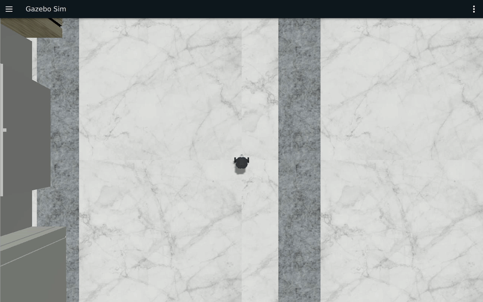
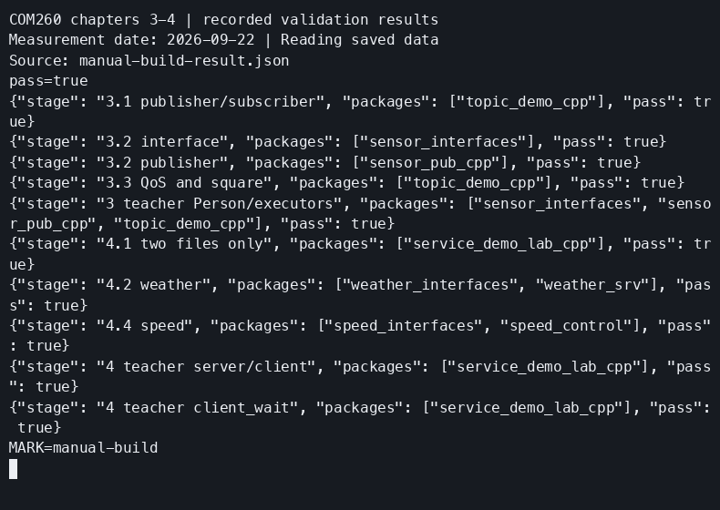
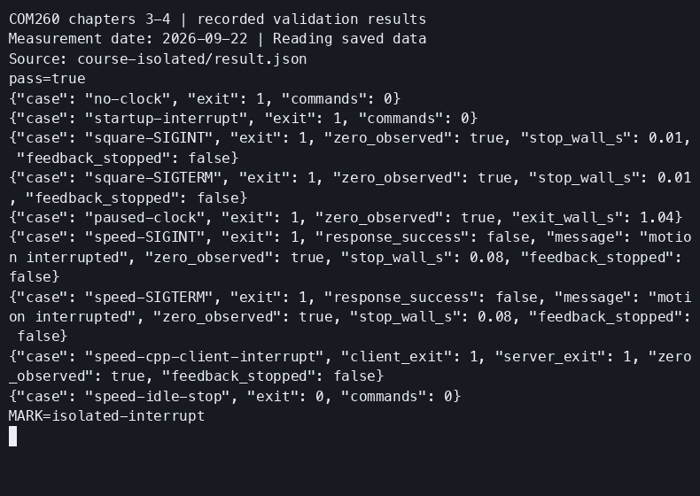
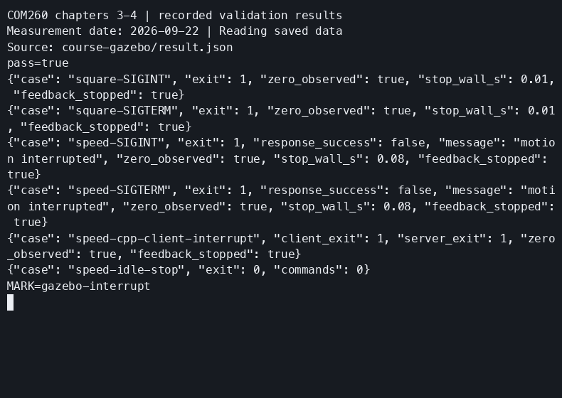

# COM260 实际运行证据

本版结果来自 COM260 当前环境，原版和 Pico 结果仅作参考。环境准备见[公共双端环境](ch00_common_setup.md)。

## 第一章：COM260 实测通过

验证日期：2026-09-16；源码基线：`96d9c90490573aeb8e06c8c32bf421a40544f3a5`。章节入口：[实验手册](ch01_lab.md)、[教师教案](../teaching_docs_k3_com260_kit/ch01_ROS2概述与架构.md)。

| 验证项 | 本轮结果 |
|---|---|
| COM260 连接及系统 | SSH 公钥连接成功；设备为 SpacemiT K3 Com260 IFX，Bianbu 4.0.6，riscv64，内核 6.18.3-generic |
| COM260 工具 | ROS 2 Humble，CycloneDDS 0.10.5，Python 3.14.4，CMake 4.2.3，GDB 17.1，clangd 21 |
| 第一章依赖解析 | 安装前 apt 模拟退出码 0；新增 312 个包，升级 0、删除 0；安装后核对依赖与入口 |
| x86 环境 | Ubuntu 24.04.4 宿主；rootless Ubuntu 22.04.5/Humble 容器；X11 `:1` 可读取 |
| COM260 构建 | 原样复用 `lifecycle_demo_cpp` 和 `robot_sim_demo`；Debug 构建及测试退出码 0；10 项资源 pytest 通过，colcon 实际汇总 60 项、0 错误、0 失败、0 跳过 |
| x86 构建和测试 | 独立工作区构建 `robot_sim_demo` 成功；10 项 pytest 通过，colcon 汇总 11 项、0 失败 |
| 最终源码身份 | COM260 58 个、x86 54 个源码／支持文件与本地 SHA-256 一致。核对范围包含最终视图配置，较初始构建多出独立设置文件；教学源码始终未改动 |
| 1.1 安装验证 | C++ talker/listener 收发递增消息；节点、话题及 `/chatter` 查询通过 |
| 1.2 建包 | 独立新建 `~/my_ros2_com260_ws`，空工作区构建、ament_cmake 建包、编译及加载查询均成功 |
| 1.3 域隔离 | Domain 0 收到；Domain 1 观察 10 秒未收到（预期 timeout 124）；恢复 Domain 0 后收到；教案 Domain 42 设置和恢复通过 |
| 双端基线 | 双向消息、互相发现、跨端参数查询、隔离与恢复、x86 `/clock` 到 COM260 全部通过 |
| 1.5 仿真和传感器 | Museum/Burger、RViz 模型及相机显示正常；COM260 收到 clock、scan、image、CameraInfo、odom、tf、tf_static 七个话题 |
| 1.5 键盘 | i/j/l/k 前进、左右转、停止通过；最终速度为零；1668 条 odom 样本，Δx=0.754500 m，四元数 z 分量跨度 0.693004（不是 yaw 角）；遥控程序与验收脚本退出码 0 |
| 生命周期 | 默认未配置，完整手动迁移、cleanup 后计数重置、再次激活、shutdown、独立 autostart 均通过；激活速度 0.1，停用／关闭归零；C++ 节点退出码 0 |
| 1.6 IDE | Remote-SSH 连接 COM260；RuyiSDK 扩展、clangd 补全、Native Debug/GDB、configure/activate 断点及 Watch 0→1 单步通过 |
| 文档与媒体 | 原实验手册 18 处、教案 4 处素材位置均对应本轮证据；IDE/RViz 截图、Gazebo 连续录像及内嵌 GIF 已归档；4 份 CAST 均以退出事件 0 结束，5 份 MP4、Gazebo 和生命周期 GIF 完整解码通过 |
| 结束状态 | x86 本轮容器已停止；COM260 节点图为空、生命周期进程退出；构建目录与 IDE 环境保留供下次使用 |

镜像 ID：`442a2715c72365056f1028363f4bbbc6cea5ac3ae93d0268cea64fd82cf3d1b1`；Gazebo Sim 8.15.0、RViz 11.2.28。容器使用软件渲染；同轮一个 30 秒观察窗口内仿真时间推进约 10.397 秒，本轮不将墙上时间等同于仿真时间。

### 本轮素材与运行编号

| 范围 | 本地记录编号 | 可直接打开的素材 |
|---|---|---|
| 环境、同步和构建 | `20260916T060019Z`；成功构建 `20260916-build-module` | [构建 CAST](images/ch01/ch01-build.cast)、[构建终端视频](images/ch01/ch01-build.mp4) |
| 安装验证、建包、域隔离 | `20260916T061640Z-foundations` | [基础练习 CAST](images/ch01/ch01-foundations.cast)、[终端视频](images/ch01/ch01-foundations.mp4) |
| 双端 DDS 和生命周期 | 仿真实例 `20260916T0630-com260-ch01`；生命周期记录 `20260916-lifecycle-cli-stop` | [生命周期 CAST](images/ch01/ch01-lifecycle.cast)、[终端视频](images/ch01/ch01-lifecycle.mp4) |
| IDE | `20260916-ide` | [configure](images/ch01/ide-configure-breakpoint.png)、[activate](images/ch01/ide-activate-breakpoint.png)、[Watch 0](images/ch01/ide-count-zero.png)、[Watch 1](images/ch01/ide-count-one.png) |
| GUI、传感器和遥控 | `20260916T064703Z-com260-teleop` | [Gazebo 连续录像](images/ch01/ch01-gazebo.mp4)、[配对终端 CAST](images/ch01/ch01-teleop.cast)、[配对终端视频](images/ch01/ch01-teleop.mp4) |

Gazebo 原始录制时间为 06:55:25～06:57:55 UTC，共 150 秒；正式 MP4 保留开头连续 56 秒，原速、无拼接，覆盖静止、前进、左右转和最终停止。正文开始／结束图取自原录像第 2／54 秒。后半段重开 RViz 后存在窗口遮挡，完整原片保存在本地原始采集目录，未作为正文演示。配对 COM260 CAST 起点为 06:55:21 UTC，遥控进程约在其第 50 秒正常退出。

GIF 取自上述录像第 30～56 秒，连续 26 秒、原速、12 帧/秒、1280×800，保留前进、左右转与停止过程。

RViz 前后图来自同一仿真实例，按顺序采集；为保证 Gazebo 录制不被遮挡，期间暂时关闭本轮 RViz，运动结束后重新打开。模型放大图随后使用同一实例的 1900×1000 窗口配置采集；之前的前后图窗口为 1200×800。IDE、基础练习和生命周期分别采集，不合称同一轮同步演示。

### 可复核的运行记录与实际差异

- 键盘消息与运动反馈：最后一条 Twist 六个分量均为 0；限时观察进程的 124 是预期观察窗口结束。
- 生命周期：实际发布端为 RELIABLE、VOLATILE、KEEP_LAST(10)。主动停止 ROS CLI 观察者时退出码 15，与 C++ 节点的正常退出码 0 分别记录。
- IDE 控制端：RuyiSDK VSCode 扩展已安装；使用原生 GCC/GDB，未安装 RuyiSDK CLI。clangd 的 5 项 unused-includes 提示保留，未修改课程头文件。
- Bianbu 的 colcon 模块存在，但初始没有独立 `colcon` 命令；安装器和板端步骤已使用 `python3 -m colcon`，复跑成功。建包练习的许可证占位提示与 CMake 弃用警告保留。
- 跨机查询的短发现窗口曾漏报远端节点，恢复域后的 5 秒观察也曾不足；最终使用 `--no-daemon --spin-time 10`，恢复接收窗口 20 秒。初次传感器探针的 JSON 布尔类型转换和生命周期零值解析错误仅涉及验证脚本，修正后重新采集。

## 第二章：COM260 实测通过

验证日期：2026-09-16；章节入口：[实验手册](ch02_lab.md)、[教师教案](../teaching_docs_k3_com260_kit/ch02_核心编程基础.md)。课程内容、练习编号与输入值沿用原章，节点采用 C++17／rclcpp。新增两个包位于 `src_k3_com260_kit/`，仿真继续原样复用 `src_k3_pico_itx/robot_sim_demo`。

`odom_monitor` 从 `/odom` 的 `twist.twist` 字段读取线速度、角速度，并为位置、航向及速度标注单位。下表记录基础节点与位置／航向验证；速度输出的源码指纹、构建、已知输入和 Gazebo 联动结果见“速度输出验证”一节。

| 验证项 | 本轮结果与证据 |
|---|---|
| 构建 | `--build-ch02` 构建 `hello_pkg_cpp`、`name_demo_cpp` 成功；独立新建 `~/my_hello_com260_ws` 并编译练习包；[受管构建截图](images/ch02/ch02-course-build.png)与[基础 CAST](images/ch02/ch02-basics.cast)。这两个包未注册单元测试，本章结论来自以下运行验收 |
| 源码一致性（修改前） | 原实测时 COM260 65 个、x86 54 个源码和支持文件与本地 SHA-256 一致。三个 lab 完整 C++ 程序与实际编译源码一致；两个教案程序和 CMake 共 4 个文件也与板端一致。新增速度输出后的 `odom_monitor.cpp` 指纹见下方验证记录 |
| 定时节点与重命名 | 启动标记、从 1 开始的递增计数通过，实测回调间隔约 1 秒。`/hello_node`、`/hello2` 同时存在 |
| 命名空间和参数 | `/student/name_demo`、命名空间 `/student`、`serial=7`；未传入的 `global_serial` 实际为 -1 |
| 日志级别 | 默认 INFO 不含 DEBUG；节点 DEBUG 含四个级别，第 3 次 ERROR 仅一次；全局 ERROR 和节点 WARN 过滤正确 |
| 节流 | 源码阈值为 2000 ms；本轮节流警告相邻间隔为 2.0、3.0 秒，均不短于阈值。它限制最短间隔，并不保证每隔恰好 2 秒输出 |
| rqt_graph | 真实 GUI 显示 `/talker → /chatter → /listener`，并显示仿真传感器与 RViz 的连接；[连续 GUI 录像](images/ch02/ch02-rqt-graph.mp4)。[完整 talker 接口截图](images/ch02/ch02-talker-node-info.png)、[CLI CAST](images/ch02/ch02-graph.cast) |
| rqt_console | 收到 COM260 `logger_demo` 的 Debug、Info、Warn、Error；第 3 次 ERROR 与节流警告可见；[GUI 录像](images/ch02/ch02-rqt-console.mp4) |
| RViz | 同轮仿真中的 RobotModel 状态为 Ok，激光与相机可见；[无遮挡截图](images/ch02/ch02-rviz.png) |
| 原输入运动 | `linear.x=0.2 m/s`、`angular.z=0.5 rad/s`；收到 102 条对应速度消息和 1053 条位姿样本；从约 `(0, 0, 0)` 到 `(0.281051 m, 0.686597 m, 2.374500 rad)`；yaw 使用完整四元数公式计算 |
| 里程计速度输出（验证通过） | 原有运动记录未覆盖 `twist.twist` 速度反馈。包含速度输出的程序已完成板端构建、已知输入和独立 Gazebo 联动验证，详见下方验证记录 |
| 停止 | 显式零速度发布退出 0；最后一条 Twist 六个分量均为 0；末尾 30 条位姿的 x、y、yaw 跨度均为 0 |
| 教案独立程序 | `my_robot_pkg/my_node` 构建并逐秒计数；`my_first_pkg/my_node` 与重命名的 `/my_node2` 均收到 `/scan`，每帧 240 点、frame 为 `laser_link` |
| 退出与清理 | 课程 C++ 节点均正常退出 0；有限观察窗口为预期 timeout 124。COM260 节点图为空。临时图形容器超时后由 Podman 强制结束，课程仿真停止成功；回环服务及本机 SSH 隧道已关闭，练习工作空间保留 |
| 媒体交付 | 原 lab 11 处、教案 2 处素材位置均已替换为本轮证据；另补充 Gazebo 和教案程序证明。5 份 CAST 均以退出 0 结束；7 份 MP4、4 份 GIF 完整解码通过 |

### 连续录像与实际运行编号

仿真实例为 `20260916T0730-com260-ch02`。Gazebo、rqt_console、rqt_graph 是该实例运行期间先后录制的独立片段，不是同步拼接画面。

| 范围 | 运行编号／采集时间（UTC） | 正式素材 |
|---|---|---|
| 建包、节点、命名空间、日志 | `20260916-ch02-basics` | [CAST](images/ch02/ch02-basics.cast)、[完整终端 MP4](images/ch02/ch02-basics.mp4)；内嵌 GIF 为第 87～117 秒的连续片段 |
| ERROR 过滤清屏补拍 | `20260916-ch02-error-filter` | [CAST](images/ch02/ch02-error-filter.cast)，重新运行并正常退出，避免上一轮 DEBUG 输出残留干扰截图 |
| 教案最小节点与 `/scan` | `20260916-ch02-teacher` | [CAST](images/ch02/ch02-teacher.cast)、[MP4](images/ch02/ch02-teacher.mp4) |
| 运动与停止 | `20260916-ch02-motion` | [CAST](images/ch02/ch02-motion.cast)、[MP4](images/ch02/ch02-motion.mp4) |
| Gazebo GUI | 原片 07:39:37～07:41:17 | [MP4](images/ch02/ch02-gazebo.mp4)、[GIF](images/ch02/ch02-gazebo.gif)，均取原片第 18～53 秒，35 秒、原速、连续无拼接，覆盖静止、运动、停止 |
| rqt_console GUI | 原片 07:49:45 起，40 秒 | [MP4](images/ch02/ch02-rqt-console.mp4)、[GIF](images/ch02/ch02-rqt-console.gif)，均为开头连续 25 秒；COM260 日志节点在本段中重新启动和正常停止 |
| rqt_graph GUI | 原片 07:52:37 起，40 秒 | [MP4](images/ch02/ch02-rqt-graph.mp4)、[GIF](images/ch02/ch02-rqt-graph.gif)，均为开头连续 30 秒，包含刷新后出现 talker/listener；配对[节点查询 CAST](images/ch02/ch02-graph.cast)、[MP4](images/ch02/ch02-graph.mp4) |

### 本轮修正与复现边界

- 保留原课程内容与编号。补齐教案要求的真正 `/scan` 订阅程序；原先只有通用定时器和 `/chatter` listener，不能证明激光订阅。命名空间说明修正为影响相对名称，不会隔离 DDS 域和绝对话题。
- 板端继续使用 `python3 -m colcon`；独立建包保留 ROS 工具生成的许可证占位警告，CMake 弃用警告未影响构建。未安装第三章或更后面的依赖。
- x86 使用第一章同一基础镜像，rqt_graph 1.3.2、rqt_console 2.0.3。录制时另开临时 rootless GUI 容器，用独立虚拟桌面显示 rqt，通过仅绑定回环地址的 SSH 转发操作；正式课程仍可直接在 x86 桌面运行这两个工具。
- 最初在禁用 capabilities 的仿真容器内安装录制工具失败，未改变基础镜像；之后改用临时 GUI 容器。第一次跨容器录屏因共享内存录成黑屏，改用 `ximagesrc remote=true` 后重新录制并逐帧解码、抽帧检查。一次脚本同步未完成就启动的失败记录也单独保留。正式材料只引用成功的新记录。
- Gazebo 使用软件渲染，墙上时间与仿真时间不同；上表位置与角度取自实际 `/odom`，未按输入速度乘以墙上时间推算。RViz 图在同一仿真运动停止后重新打开窗口采集。

### 速度输出验证：COM260 与 Gazebo 联动通过

运行编号 `20260916T153020Z-ch02-velocity`，日期 2026-09-16。本轮只更新课程和独立练习目录中的 `odom_monitor.cpp`。源码 SHA-256 为 `a3f1de4ea13e1ccdcdd323ae6150a344be70c67ed8aa95e36ce35c642080a228`，本地与 COM260 两处副本一致。

| 验证项 | 结果 |
|---|---|
| 课程工作区构建 | `~/ros2_course_com260_ws` 仅重编译 `hello_pkg_cpp`，退出码 0 |
| 独立练习构建 | `~/my_hello_com260_ws` 重编译 `hello_pkg_cpp`，退出码 0 |
| 已知输入验证 | 两个工作区的可执行文件均在 COM260 运行；将 `/odom` 重映射到隔离话题 `/com260_velocity_check/odom`，使用 Domain 171、仅本机通信 |
| 静止消息 | 输入 `vx=0、wz=0`；两个可执行文件分别收到并正确输出 30 条 |
| 运动消息 | 输入 `vx=0.2 m/s、wz=0.5 rad/s`；两个可执行文件分别收到并正确输出 30 条 |
| 停止消息 | 输入 `vx=0、wz=0`；两个可执行文件分别收到并正确输出 30 条 |
| 位置与航向 | 三组已知位置和四元数转换后的 yaw 均与节点输出一致；每个可执行文件共核对 90 条输出 |
| 退出与清理 | 两个节点退出码均为 0；隔离域和课程域查询为空，无本轮节点残留 |
| Gazebo 联动 | 在独立 x86 容器中完成下述速度与反馈验证 |

[本轮 COM260 真实终端记录（CAST）](images/ch02/ch02-velocity-input.cast)。记录保留 CycloneDDS 在本机回环接口上禁用组播的提示；同机发现和消息接收成功。已知输入验证只证明程序能正确读取并输出消息字段，不能代替 Gazebo 运动验收。

真实 Gazebo 验证使用同一运行编号。x86 中实际安装的 Burger 模型、启动文件与本地 SHA-256 一致；容器镜像 ID 为 `442a2715c72365056f1028363f4bbbc6cea5ac3ae93d0268cea64fd82cf3d1b1`。COM260 在 15:43:39～15:44:17 UTC 运行验证：先静止 6 秒，再持续发送 `linear.x=0.2、angular.z=0.5` 约 12 秒，最后发送零速度并观察约 12 秒，结束前再次归零。

| 原始 `/odom` 验证项 | 本次实际结果 |
|---|---|
| 数据来源 | `/odom`，frame 为 `odom`、child frame 为 `base_footprint`；记录位置、完整四元数、六个速度分量和消息时间戳 |
| 样本 | 共 847 条原始消息，其中发现阶段 10 条、静止 210 条、运动 306 条、停止观察 321 条；C++ 输出 757 条 |
| 静止 | 线速度和角速度均接近 0，仅有浮点残差 |
| 运动 | 稳定段速度中位数为 `0.199999999978 m/s`、`0.499999999949 rad/s`，起步阶段有加速过程 |
| 停止 | 发送零速度后进入静止；末尾 30 条样本的速度为 0，x、y 跨度均为 0 |
| 位姿变化 | 从约 `(0, 0, 0)` 到 `(0.028218 m, 0.799155 m, 3.081000 rad)`，平面位移约 0.799653 m |
| 程序输出 | 各阶段原始消息的 `x、y、yaw、vx、wz` 按日志显示精度可与 C++ 输出对应；节点退出码为 0 |
| 清理 | x86 仅停止本轮命名容器；剩余课程容器为 0，COM260 课程域节点与本轮验证进程均为 0 |

[完整终端 CAST](images/ch02/ch02-velocity.cast)、[Gazebo 连续 MP4](images/ch02/ch02-velocity-gazebo.mp4)。终端 GIF 从本次真实 CAST 回放生成；GUI 原片录于 15:43:18～15:44:58 UTC，正式 MP4/GIF 取约第 24～62 秒，共约 38 秒、原速且无拼接，与同轮终端的三个阶段对应。全长原片、原始消息、构建日志和验证脚本归档于本地工作目录。

### 构建规则与支持脚本验证

2026-09-17，运行编号 `20260917T075120Z-review-fixes`。参考包的三个目标改用与手册一致的 `target_compile_features(... cxx_std_17)`；安装器和 x86 辅助脚本补充失败原因、容器状态判断及 `linear.x` 数值解析；GDB 包装脚本移除重复环境加载。四个 C++ 源文件、RViz 配置及已有 71 份媒体均未改动。本节记录构建和脚本验证，运动录像的采集时间见各素材条目。

| 验证项 | 实际结果 |
|---|---|
| 源码身份 | COM260 的 65 个、x86 的 54 个源码与支持文件逐项 SHA-256 与本地一致 |
| 课程工作区 | 安装器 `--build-ch02` 构建两个包成功，总计约 42.0 秒 |
| 独立练习工作区 | 更新并备份练习包 CMake，构建 `hello_pkg_cpp` 成功，约 29.1 秒 |
| 里程计已知输入 | 两个重新构建的程序各收到并正确输出 90 条静止、运动、停止夹具消息；Domain 171、仅本机通信，均退出 0；此项不等同 Gazebo 运动反馈验证 |
| 节点检查 | `hello_node` 从 1 递增且启动标记仅一次；DEBUG 运行包含四个级别、第 3 次 ERROR 仅一次及节流警告；ERROR 过滤正确；`/student/name_demo` 持续运行期间可查询 `serial=7`，四次节点运行均退出 0 |
| GDB 环境 | 实际调用安装后的包装脚本，确认 CycloneDDS、Domain 0、`ROS_LOCALHOST_ONLY=0` 均正确加载 |
| x86 真实运行 | 在本轮独立仿真容器内，脚本读取 COM260 的 `linear.x=0.1`，确认生命周期 `active [3]` 与节点可见 |
| 停止 | COM260 生命周期 shutdown 成功、发布零速度并退出 0；x86 正常停止成功，第二次停止明确报告实例已不存在并返回 0 |
| 最终清理 | COM260 的 Domain 0／171 节点和课程 C++ 进程均为 0；x86 本轮容器已移除，剩余课程容器为 0 |
| 错误路径 | 本地 15 项检查通过，其中 11 项使用替身命令覆盖容器缺失、查询失败、标签不符、停止失败、数值和状态判定；其余 4 项检查 Mac 实际入口及错误提示。替身检查与上述真实双端运行分别记录 |
| 媒体 | 当前 13 份 MP4、8 份 GIF 完整解码通过；11 份 CAST 结束码为 0；文件哈希与采集记录一致 |

本次 `hello_pkg_cpp/CMakeLists.txt` SHA-256 为 `fb8e38a5a9dcb01c02b38f4fcf9949d743636890b0d857a3a82249ba4ace89cd`；`x86-gazebo.bash` SHA-256 为 `8298c5d79237a2106c7651c36c30aea04096fb7607744c15843cb451af732647`。

## 第三章：COM260 实测通过

2026-09-21 完成第三章 C++17／rclcpp 适配与实测。入口为[实验手册](ch03_lab.md)和[教师教案](../teaching_docs_k3_com260_kit/ch03_话题通信.md)。新增四包位于 `src_k3_com260_kit/`；仿真原样复用 `src_k3_pico_itx/robot_sim_demo`，本章另用 `ch03_square.rviz` 观察轨迹。

### 环境、源码与逐项结果

| 项目 | 本轮实际结果 |
|---|---|
| 环境 | COM260：SpacemiT K3 Com260 IFX、riscv64、Bianbu 4.0.6、ROS 2 Humble；x86：Ubuntu 24.04、rootless Podman、Humble/Harmonic 课程镜像。两端 CycloneDDS，跨机 Domain 0；消息数值与 QoS 隔离验收使用 Domain 171 |
| 源码身份 | 本地与 COM260 的 31 个文件、x86 的 81 个文件 SHA-256 一致；独立练习目录中 14 个 C++／消息定义文件与交付一致。构建和运行均使用这些文件 |
| 课程构建 | `--build-ch03` 构建 `topic_demo_interfaces`、`topic_demo_cpp`、`sensor_interfaces`、`sensor_pub_cpp`；COM260 初次约 2 分 55 秒，最终增量构建 4.13 秒；x86 四包约 23.2 秒。均成功 |
| 接口测试 | `sensor_interfaces` 的一个 pytest 用例通过。最终只汇总本章目录：`2 tests, 0 errors, 0 failures, 0 skipped` 包括 pytest 用例及其 CTest 包装，不是两个独立测试。其他三个包未注册单元测试，其功能由以下运行验收覆盖 |
| 独立建包 | 在 `~/my_topics_com260_ws` 实际创建三个练习包，构建约 2 分 18 秒成功，接口测试通过。首次裸 `colcon` 返回 127；保留已创建目录，改用 `python3 -m colcon` 继续构建成功 |
| GPS Point | `/gps_position` 从 `(0,1,0)` 开始，x 逐次加 1、y=2x+1；七个已知样本全部一致，均值周期约 1.00003 秒。C++ 订阅者距离输出与 `hypot(x,y)` 一致；独立练习也通过 |
| 核心 Gps | `/gps_info` 首条为 `working,1,2`，先发布再按 1.03／1.01 缩放；七个样本及订阅日志吻合，周期约 1 秒 |
| SensorData／Person | SensorData 为 `25.5,60,1013.25,sensor_01`；Person 为 `Li Ming,20,1.75`，类型为 string／int32／float64。课程与独立练习均通过，周期约 1 秒 |
| 教案 String | `teacher_talker` 与 `teacher_listener` 从 `Hello ROS 2: 0` 收发，七个样本，课程均值周期约 0.49997 秒；与核心 Gps 示例分别命名 |
| QoS 四组 | A（可靠→可靠）、B（可靠→尽力）、C（尽力→尽力）收到消息，CLI 退出 0；D（尽力→可靠）报告 RELIABILITY 不兼容，8 秒内无数据、退出 124，为预期负例。两工作区均通过 |
| 执行器 | 0.8 秒回调下，单线程最大同时执行数为 1；四线程执行器观察到 2 个回调重叠、多个线程 ID；四节点可发现。课程与独立练习均通过 |
| 真实传感器 | C++ `scan_subscriber` 收到 240 个距离采样点，frame=`laser_link`，角度约 -3.14159～3.14159 rad，正常退出。CLI 实际 `/scan` 发布者为 `gazebo2_bridge`，RELIABLE／KEEP_LAST(10)；SensorDataQoS 订阅兼容 |
| 接收频率 | 06:53:15 UTC 起验证，`hz --spin-time 10 --window 20`：`/scan` 各次报告 2.562～2.710 Hz，末次 2.638 Hz；`/camera/image_raw` 0.645～1.298 Hz，末次 1.292 Hz。这是本轮软件渲染及网络下按墙钟测得的接收频率，不是模型的标称频率 |
| rqt_graph | x86 实际显示 `/gps_publisher → /gps_position → /gps_subscriber` 与 `/sensor_publisher → /sensor_data`；保留刷新前后连续录像。选择 `Nodes/Topics (all)` 并取消隐藏叶子话题，CLI 观察节点仍被 Debug 过滤器隐藏 |
| 无时钟负例 | 隔离 Domain 171 中无 `/clock`；`square_driver use_sim_time:=true` 等待 5 秒后报告未收到仿真时钟，退出 1，不发送运动命令 |
| 方形与速度订阅 | COM260 C++ 控制器完成四边后退出 0，C++ Twist 订阅者实际收到直行 0.2 m/s、转弯 1.57 rad/s 和零速。详细 `/odom` 结果见下表 |

### 完整方形运动

仿真运行编号 `20260921T0610-ch03`，`drive=false`，运动前检查 `/cmd_vel` 无其他发布者、`/odom` 恰有一个发布者。控制端使用 ROS `/clock` 计时；启动等待仍使用 5 秒墙钟，软件渲染较慢时不会按墙钟提前结束运动。

| 观察量 | 实际值 |
|---|---|
| 四段直行 | 速度 0.2 m/s；按收到的命令与仿真时钟测得 4.999、5.001、5.000、5.000 秒 |
| 四次转弯 | 角速度 1.57 rad/s；测得 0.999、0.998、1.000、1.000 秒 |
| `/odom` 轨迹跨度 | x=1.005672 m，y=1.004887 m |
| 终点 `/odom` | x=-0.044779 m，y=0.005092 m，yaw=-0.003185 rad |
| `/odom` 起终点距离 | 0.045068 m；表示里程计闭合误差，不代表 Gazebo 世界坐标真值的误差 |
| 停止 | 最后 30 个样本的绝对速度均小于 0.01，末条 vx=0、wz=0；控制器退出 0 |
| 采样量 | `/odom` 1488 条、`/cmd_vel` 230 条、`/clock` 6593 条 |

本轮验收允许跨度 0.85～1.2 m、里程计闭合误差小于 0.15 m。它验证开环方形练习及结束停止，不表示精密定位或无打滑控制。Gazebo 画面保留实际运动和最终位置，不修饰成理想闭合轨迹。

### 素材与复核入口

| 内容 | 本轮素材与时间边界 |
|---|---|
| 消息、接口、QoS、执行器 | [原始 CAST](images/ch03/ch03-topics.cast)，119.839 秒；[GIF](images/ch03/ch03-topics.gif)约 53.37 秒、[MP4](images/ch03/ch03-topics.mp4)约 53.35 秒。终端回放压缩超过 2 秒的空闲等待；终端截图直接从该 CAST 导出。标为“对应课程入口”的节点由已安装 C++ 二进制启动，CLI 查询命令实际执行 |
| 方形完整终端 | [CAST](images/ch03/ch03-square.cast)，包括运动前检查、实时 `/odom`、控制器日志和最终断言；[结果展示 CAST](images/ch03/ch03-square-result.cast)在板端读取同轮保存的日志与 JSON，用于清晰展示截图，未重新执行运动 |
| Gazebo GUI | [连续 MP4](images/ch03/ch03-square-gazebo.mp4)约 94.92 秒，[GIF](images/ch03/ch03-square-gazebo.gif)47.5 秒。原片从 06:39:29 UTC 起，取第 10～105 秒连续片段，覆盖完整四边运动和停止；MP4 原速，GIF 为同片段 2 倍速预览 |
| RViz GUI | [连续 MP4](images/ch03/ch03-square-rviz.mp4)约 94.92 秒，[GIF](images/ch03/ch03-square-rviz.gif)47.5 秒。同一仿真实例、同为 06:39:29 UTC 起录制，取第 10～105 秒，MP4 原速、GIF 2 倍速；在课程专用虚拟显示上显示实际 ROS 话题 |
| rqt_graph GUI | [连续 MP4](images/ch03/ch03-rqt-graph.mp4)65 秒，06:46:52 UTC 起，包含话题节点重新启动后刷新出现 GPS／SensorData 的过程；[截图](images/ch03/ch03-rqt-graph.png)。与方形录像属于同一仿真实例的不同时间段 |
| 传感器与时钟 | [节点／QoS／无时钟负例 CAST](images/ch03/ch03-simulation-checks.cast)保留初次测频未收到数据的告警；[延长发现窗口后的测频 CAST](images/ch03/ch03-sensor-rates.cast)实际出现频率样本。不能仅凭 timeout=124 判断测频成功 |

所有 GUI 录像来自连续窗口采集，未用静态截图拼接。终端展示与 GUI 录像分别标记来源。2026-09-21 采集的 31 份本章素材已做哈希及格式校验：19 张 PNG、4 份 MP4、3 份 GIF、5 份 CAST；视频／GIF 全量解码无错误，CAST 均以退出事件 0 结束。已目检全部截图及 GUI 首／中／末抽帧，并在运行时观察 RViz 和 rqt_graph；建包、停止行为与有线运动的结果见[专项验证](#ch03-ch04-validation)。

### 复现说明

- 板端入口使用 `python3 -m colcon`；首次失败构建与后续成功记录分别保存，不覆盖失败事实。
- 测频初次只等待 10 秒，未取得数据；本轮延长发现窗口并要求实际出现频率样本后通过。CLI 可见节点不等于已接收消息。
- RViz 的 Odometry 箭头尺寸应放在 `Shape` 子项，修正后实际重新加载并录制。固定系为 `odom`，500 个历史箭头覆盖本次运动；第一章配置保持原状。
- QoS A 显式传入 `--qos-reliability reliable`，避免依赖 CLI 默认策略。教案同步澄清共享指针生命周期、RMW 默认 QoS、接口变更后的依赖重编译，以及丢消息提示不等于 QoS 不兼容。

结束检查：COM260 的 Domain 0／171 均无节点，本轮课程 C++ 进程为空；x86 的本轮仿真与临时 GUI 容器均已释放。

## 第四章：COM260 实测通过

2026-09-22 在 COM260 与 x86 Humble 容器完成服务通信实测。章节入口：[实验手册](ch04_lab.md)、[教师教案](../teaching_docs_k3_com260_kit/ch04_服务通信.md)。

### 构建与服务验收

| 项目 | 本轮实际结果 |
|---|---|
| 环境与源码 | COM260：K3 Com260 IFX、riscv64、Bianbu 4.0.6、Humble／CycloneDDS；x86：Ubuntu 24.04、rootless Humble/Harmonic 课程容器。七个新包及安装器／仿真辅助脚本共 31 个文件，两端与本地 SHA-256 一致；独立练习源码亦一致 |
| 双端构建 | COM260 `--build-ch04` 与 x86 Humble 容器均完成七包构建；所有 C++ 节点按目标要求至少 C++17，结合编译命令和 CMake 检测的默认标准核对。`teacher_client` 已在两端编译通过 |
| 独立练习 | 新建 `~/my_services_com260_ws`，真实创建并编译 `service_demo_lab_cpp`、`weather_interfaces`、`weather_srv`、`speed_interfaces`、`speed_control` 五包 |
| 统计边界 | 七包没有注册单元测试。本轮课程工作区 26 组、独立练习 25 组服务行为检查通过；一组可能含多个输入，并非 51 个单元测试。隔离使用 Domain 171／172、LOCALHOST_ONLY=1 |
| AddTwoInts | 5+10=15，默认 5+3=8，-5+3=-2；非法整数退出 2；`service list/type/find/call` 全部通过 |
| 超时与重试 | 3 秒服务延迟，1 秒等待、3 次尝试、2 秒间隔：客户端约 7.241 秒退出 1，三次超时符合预期。清理未决请求不会取消已发送的远端工作 |
| 等待上线 | `client_wait` 服务缺失时三次尝试失败；在启动客户端 3 秒后启动服务，第二次尝试返回 15、退出 0。独立工作区也通过 |
| 多客户端 | 两个异步客户端同时发 11+12 与 21+22，得到 23、43；课程和练习均约在 3.002／6.002 秒完成。服务端日志确认回调串行处理 |
| WeatherQuery | Beijing=26.5/Sunny、Shanghai=24/Cloudy、Shenzhen=30/Rainy；首尾空白和混合大小写归一化通过；空值及未知城市返回 0/Unknown city |
| 教案程序 | `teacher_server`、`teacher_client sync/async/timeout/retry` 四种正常模式均返回 30；异步日志先打印请求已发出，再处理响应。6 秒服务延迟触发教案 5 秒轮询超时；无服务的 retry 有限三次失败；非法模式退出 2 |
| 速度输入边界 | 14 组非法请求涵盖三字段各自的 NaN、±inf，超出线／角速度正负边界及负时长，均返回 false，未产生运动消息。±1.0／±2.0 与零时长合法，后者只发布零速度；非法 CLI 数字退出 2、业务拒绝退出 1 |
| 隔离域速度消息 | 0.2/0/3 与 0/1/2 分别采集 31／21 条 Twist，末条均为零；这部分仅证明发布行为，实际运动另由下方 Gazebo `/odom` 验证 |

### 实际运动与跨机请求

仿真实例 `20260922T0332-ch04`，`drive=false`。开始前 `/cmd_vel` 没有其他发布者，`/odom` 恰有一个发布者。服务端保持原章墙钟计时，未改成第三章的仿真时钟计时。

| 请求 | `/odom` 变化 | 消息与停止 |
|---|---|---|
| linear=0.2，angular=0，duration=3 | 前进 0.400000 m，航向基本不变 | 31 条速度消息，首条到零速约 3.005547 s；客户端退出 0；最终 vx=0、wz=0 |
| linear=0，angular=1，duration=2 | 航向增加 0.992000 rad，位置基本不变 | 21 条速度消息，首条到零速约 2.003421 s；客户端退出 0；最终 vx=0、wz=0 |

同轮统计 `/odom` 580 条、`/clock` 1078 条、`/scan` 109 条、`/tf` 668 条；停止清理期间追加的零速和样本不并入这一汇总。最终里程计约 `(x=0.400000 m, y=0, yaw=0.992000 rad)`。软件渲染下仿真慢于实时，不能将墙钟 3 秒／2 秒等同于仿真 3 秒／2 秒，因此不预设 0.6 m／2 rad 的结果。

Greeting 使用真实 C++ `server`／`client` 双向跨机运行，固定请求 HAN／20，响应均为 `Hi HAN. I'm server!`。同一探针持续订阅仿真 Topic，累计样本为：

| 方向 | `/scan`：前／基线／调用期间／后 | `/odom` | `/tf` |
|---|---|---|---|
| COM260 Server → x86 Client | 5 / 15 / 62 / 71 | 34 / 92 / 368 / 424 | 42 / 120 / 468 / 538 |
| x86 Server → COM260 Client | 5 / 11 / 15 / 23 | 28 / 83 / 103 / 153 | 37 / 104 / 130 / 197 |

这里箭头表示服务提供端与调用端的组合；两方向都是客户端发请求、服务器返回响应。持续 Topic 数据没有被服务调用替代。

### 素材与复核入口

| 内容 | 本轮素材 |
|---|---|
| 实际构建 | [COM260 七包 CAST](images/ch04/ch04-course-build.cast)、[独立建包与五包构建 CAST](images/ch04/ch04-practice-build.cast) |
| 服务完整行为检查 | [课程工作区 CAST](images/ch04/ch04-services-course.cast)、[独立练习 CAST](images/ch04/ch04-services-practice.cast)，保留真实执行路径及预期负例退出码 |
| 原章截图与终端展示 | [展示 CAST](images/ch04/ch04-services-display.cast)、[GIF](images/ch04/ch04-services.gif)、[MP4](images/ch04/ch04-services.mp4)。在板端读取同轮保存的日志与 JSON，明确标记为结果展示；截图直接导出自该 CAST，没有重写节点输出 |
| Gazebo | [连续原速 MP4](images/ch04/ch04-gazebo.mp4)为 03:27:47～03:28:47 UTC 连续 60 秒、1280×800、12 fps；[GIF](images/ch04/ch04-gazebo.gif)取第 8～48 秒，以 2 倍速播放 20 秒、960×600 |
| 同轮速度与反馈 | [速度请求／里程计 CAST](images/ch04/ch04-speed-sim.cast)，03:27:53 UTC 启动板端探针；两次请求都在上述录像内完成 |
| COM260 服务端 → x86 客户端 | [板端传感器与服务 CAST](images/ch04/ch04-greeting-board-server.cast)、[x86 客户端 CAST](images/ch04/ch04-greeting-x86-client.cast) |
| x86 服务端 → COM260 客户端 | [x86 服务端 CAST](images/ch04/ch04-greeting-x86-server.cast)、[板端客户端与传感器 CAST](images/ch04/ch04-greeting-board-client.cast) |

2026-09-22 服务通信验证的 26 份素材完成哈希及格式校验：12 张 PNG、10 份 CAST、2 份 MP4、2 份 GIF。CAST 均为 v3、最终退出事件为 0；预期失败案例的实际 1／2 退出码另在验收内部核对。MP4／GIF 全量解码通过；终端 GIF 约 26.19 秒、MP4 约 26.20 秒，压缩了超过 2 秒的空闲。已目检全部 PNG 和 Gazebo 首／中／末抽帧，确认 Burger 位置与朝向变化；原章 lab 五个截图槽位和教案两个槽位均保留对应新素材，另补充教案模式、并发、跨机和边界证据。建包、停止行为与有线运动的结果见[专项验证](#ch03-ch04-validation)。

### 复现说明

- 首轮默认自动发现没有让 COM260 收到仿真数据；x86 容器内部里程计正常，UFW 配置为未启用。仅指定远端地址后恢复跨机节点发现，但关闭组播时同机节点还需要回环对端。最终两端使用 `127.0.0.1` 加对端地址、自动 ParticipantIndex 的单播配置，速度与双向 Greeting 都通过；未断言具体路由器或无线硬件故障。复现步骤见[公共环境](ch00_common_setup.md#dds-unicast)。
- 改变 DDS 配置后，旧 CLI daemon 曾返回 `!rclpy.ok()`；检查使用独立节点／`--no-daemon`，最终已停止本轮 daemon。单播配置只作用于课程进程，未修改系统网络、防火墙或持久环境文件。
- 反向 Greeting 的首轮验收服务器先达到 45 秒自动退出期限，客户端随后未收到响应；协调两端同时启动后验证通过。
- CMake 按目标声明 C++17。实验客户端超时后清理未决请求；教案的同步、异步、超时及重试模式使用独立可执行入口。

结束检查：COM260 的 Domain 0／171／172 无节点，第四章课程 C++ 进程为 0；x86 本轮命名容器已停止，课程仿真容器列表为空。

## 第三、四章：建包、停止行为与有线运动验证

验证日期：2026-09-22；运行记录：`20260922T-review-fixes`。检查范围包括从空目录按手册逐步建包、运动中止后的返回值与零速度反馈，以及有线连接下的完整方形运动和速度服务。

### 建包、源码与中止行为

| 检查 | 本次实际结果 |
|---|---|
| 源码身份与构建 | 11 包共 58 文件在本地、COM260 与 x86 的 SHA-256 一致。COM260 第三章四包与第四章七包构建成功；x86 的 `topic_demo_cpp` 和 `speed_control` 构建成功。第三章接口测试通过，第四章仍未注册单元测试 |
| 学生逐步建包 | 从两个空工作区执行手册 `ros2 pkg create`，按当时步骤写入源码／XML／CMake，10 个构建阶段全部通过。第四章第一次构建时目录只有 server.cpp、client.cpp；之后才加入教案目标。此项不复制最终参考包配置 |
| 学生程序运行 | 新工作区 GPS 前三组为 `(0,1,0)`、`(1,3,0)`、`(2,5,0)`；SensorData、Person、5+10=15、Beijing=26.5/Sunny 均通过 |
| 隔离中止检查 | 课程与新练习工作区各 9 项通过：无时钟、启动等待中止、方形 SIGINT／SIGTERM、仿真时钟暂停后中止、速度服务 SIGINT／SIGTERM、C++ 客户端收到中断失败，以及空闲服务停止。Domain 179，无时钟及尚未运动时未发运动命令 |
| 中止语义 | 方形中止退出 1，不打印 DONE；速度服务返回 `success=false / motion interrupted`，服务端及实际 C++ 客户端均退出 1。空闲服务停止退出 0。暂停时钟的方形也能退出 |
| 速度正常值与边界回归 | 两工作区各 4 组行为检查，涵盖原两组运动、正负边界零时长、14 个非法请求及 CLI 返回码；非法请求不发 Twist。31／21 条正常速度消息的末条均为零 |
| 真实 Gazebo 中止反馈 | 6 项检查通过，其中 5 项涉及运动中止，最后 10 个 `/odom` 样本的绝对线／角速度均小于 0.01；另 1 项为空闲停止。反馈断言在测试清理补发零速之前执行 |

隔离检查没有 Gazebo，其日志字段 `feedback_stopped=false` 表示本项未检查里程计，不作为运动反馈结论；真实反馈在下图及独立 Gazebo CAST 中核对。

### 有线路径下的正常运动

无线链路的 25 次 ping 平均约 266 ms、最大约 743 ms，方形轨迹未达到跨度门槛。有线连接平均约 0.331 ms、最大约 0.386 ms，按相同轨迹阈值验证通过。两端课程进程显式绑定有线地址，配置方法见[多网卡选择有线路径](ch00_common_setup.md#dds-wired)。

方形仿真实例 `20260922T-review-wired-square`，05:17:36 UTC 启动板端验收。四段直行仍为 0.2 m/s × 5 秒仿真时间，四次转弯仍为 1.57 rad/s × 1 秒；实测各段约 5.002～5.007 秒与 0.999～1.004 秒，程序完成后退出 0。

| 观察量 | 实际结果 |
|---|---|
| `/odom` 跨度 | x=1.006820 m，y=1.004632 m；仍使用 0.85～1.2 m 门槛 |
| 闭合误差 | 0.002019 m，仍使用小于 0.15 m 门槛；仅表示里程计结果 |
| 终点 | x=-0.001020 m，y=0.001742 m，yaw=0.006235 rad；vx=0、wz=0 |
| 正常停止复核 | 原始探针共记录 257 条 Twist，其中控制器 238 条（含 5 条约隔 100 ms 的零速），随后测试清理另外记录 19 条零速。按原始 JSONL 独立复核清理前窗口：停止后有 76 条里程计反馈，末 30 条速度均小于 0.01；不把清理零速计为控制器停止证明 |

[方形原速 MP4](images/ch03/ch03-square-wired.mp4) · [实际运行 CAST](images/ch03/ch03-square-wired.cast) · [停止画面](images/ch03/ch03-square-wired.png)。原片从 05:17:15.813 UTC 开始，保留第 15～93 秒的连续 78 秒，覆盖完整运动与停止；GIF 为同段 2 倍速、39 秒。未修改 Gazebo 画面或轨迹。

速度仿真实例 `20260922T-review-wired-speed`，05:28:05 UTC 开始速度请求与录像采集；沿用原章墙钟计时。开始时里程计约 `(0.383200, 0, 0.937000)`，来自该实例此前一次通过的请求；下表位移和转角按各请求的起终点差值计算。

| 请求 | `/odom` 变化 | 命令和停止 |
|---|---|---|
| 0.2 m/s，0 rad/s，3 s | 前进 0.218600 m | 31 条 Twist，首条至零速约 3.005756 s；客户端退出 0，反馈归零 |
| 0 m/s，1 rad/s，2 s | 航向增加 0.723000 rad | 21 条 Twist，首条至零速约 2.003690 s；客户端退出 0，反馈归零 |

本轮停止清理前累计 `/odom` 492 条、`/clock` 9731 条、`/scan` 78 条、`/tf` 653 条。软件渲染及录屏下仿真慢于实时，实际位移和转角不写成理想的 0.6 m／2 rad。

[速度原速 MP4](images/ch04/ch04-speed-wired.mp4) · [同轮请求与里程计 CAST](images/ch04/ch04-speed-wired.cast) · [停止画面](images/ch04/ch04-speed-wired.png)。原片从 05:28:01.654 UTC 开始，保留前 33 秒连续画面；GIF 为同段 2 倍速、约 16.5 秒。两组请求均在录像内完成。

### 验证素材与统计范围

| 内容 | 原始记录 |
|---|---|
| 双端构建 | [COM260 CAST](images/ch04/ch03-ch04-validation-board-build.cast)、[x86 CAST](images/ch04/ch03-ch04-validation-x86-build.cast) |
| 手册逐步建包 | [10 阶段 CAST](images/ch04/ch03-ch04-validation-manual-build.cast) |
| 运行与隔离中止 | [课程工作区 CAST](images/ch04/ch03-ch04-validation-course-checks.cast)、[新练习工作区 CAST](images/ch04/ch03-ch04-validation-practice-checks.cast) |
| 真实中止反馈 | [Gazebo 中止 CAST](images/ch04/ch03-ch04-validation-gazebo-interrupt.cast) |
| 已保存结果展示 | [CAST](images/ch04/ch03-ch04-validation-results.cast)、[GIF](images/ch04/ch03-ch04-validation-results.gif)、[MP4](images/ch04/ch03-ch04-validation-results.mp4)；明确标为读取已测结果，没有重新执行实验 |

第三章素材共 34 份（19 PNG／6 CAST／5 MP4／4 GIF），第四章共 40 份（14 PNG／18 CAST／4 MP4／4 GIF）。74 份素材的哈希、格式、视频全量解码和 CAST 退出事件核对通过；GUI 画面完成首／中／末抽帧检查。各项数据按运行编号与采集时间对应，本地链接、锚点和完整 C++ 示例与源码一致性检查通过。

结束检查：COM260 的 Domain 0／171／172／179／182 无其他节点，课程 C++ 进程为空；x86 仿真与录制进程已退出，活动课程仿真容器为 0。
