<!-- K3 adaptation baseline: source=../lab_manuals/ch01_lab.md; baseline commit=ea386a9471fae4568524b038d718a14fce99ed3f -->

# 第1章 实验指导书：ROS 2 环境搭建与课程仿真入门

## 当前仓库仿真验证：ROS 2 图、仿真时钟与传感器桥

### 实验目标

用当前仓库的 `robot_sim_demo` 验证 ROS 2 环境是否正确加载，以及 Gazebo、ROS-Gazebo Bridge、机器人状态发布器和传感器话题能否被自动发现。

### 运行步骤

【x86 课程容器，仿真终端；先按第 0 章进入容器，已启动仿真时不要重复运行】

```bash
source /opt/ros/humble/setup.bash
source /workspace/install/setup.bash
ros2 launch robot_sim_demo gazebo2.launch.py \
  gui:=false rviz:=false drive:=false
```

【K3 板端，观察终端；先加载第 0 章课程环境】

```bash
source /opt/ros/humble/setup.bash
source ~/ros2_course_ws/install/setup.bash
ros2 node list
ros2 topic echo /clock --once
ros2 topic info /scan
ros2 topic echo /odom --once
```

### 观察与验收

应能看到 Gazebo 桥接节点、`/clock` 仿真时钟、`/scan` 激光和 `/odom` 里程计。该验证证明环境和基础数据链路可用；RViz/Gazebo 图形界面在 x86 的 X11 桌面显示。

源码：`src/robot_sim_demo/launch/gazebo2.launch.py`、`src/robot_sim_demo/config/gazebo2_bridge.yaml`。

> **实验课时**：2 课时（90 分钟）
> **实验平台**：K3 Pico-ITX（Bianbu >= 4.0.1 / riscv64 / Humble）+ x86 Ubuntu 22.04/Humble/Harmonic 课程容器
> 公共连接、环境加载和仿真容器启动见 [第 0 章](ch00_common_setup.md)。

---

## 实验目标

完成本实验后，学员应能够：
1. 验证 ROS 2 安装并运行基本节点
2. 编译课程源码包完整工作空间
3. 启动课程仿真（Gazebo + RViz + LiDAR + 相机）
4. 使用 VS Code/VSCodium + RuyiSDK VSCode 插件 + Remote-SSH 进行开发调试

---

## 实验准备

### 硬件环境
- K3 Pico-ITX 一台，安装 Bianbu >= 4.0.1
- x86 PC 一台（Ubuntu 24.04，≥8GB RAM，推荐 16GB），使用课程 Humble 容器
- 支持 OpenGL 3.3+ 的显卡（用于 Gazebo 渲染）
- 网络连接正常

### 软件环境
- 双端 ROS 2 Humble（已安装）
- 本机 VS Code/VSCodium + RuyiSDK VSCode 插件 + Remote-SSH
- 终端模拟器（推荐 Terminator 或 tmux，支持多窗口）

---

## 练习 1.1：ROS 2 安装验证（约 15 分钟）

### 目标
验证 ROS 2 安装正确，环境变量已加载。

### 步骤

**步骤1：验证环境变量**

【K3 板端，终端 1；先加载第 0 章课程环境】
```bash
echo $ROS_DISTRO
# 期望输出：humble

ros2 --help
# 期望：显示 ros2 命令列表
```

**步骤2：运行 talker / listener 验证**

【K3 板端，终端 1～3；每个终端均加载课程环境，观察后 Ctrl+C 停止】
```bash
# 终端1：启动发布者
source /opt/ros/humble/setup.bash
ros2 run demo_nodes_cpp talker
# 期望：[INFO] Publishing: "Hello World: 0"

# 终端2：启动订阅者
source /opt/ros/humble/setup.bash
ros2 run demo_nodes_cpp listener
# 期望：[INFO] I heard: "Hello World: X"

# 终端3：查看节点和话题
ros2 node list        # 期望：/talker /listener
ros2 topic echo /chatter   # 期望：data: 'Hello World: X'
```

**✓ 验证**：talker 发布消息，listener 接收消息，`ros2 topic echo` 能看到实时数据。

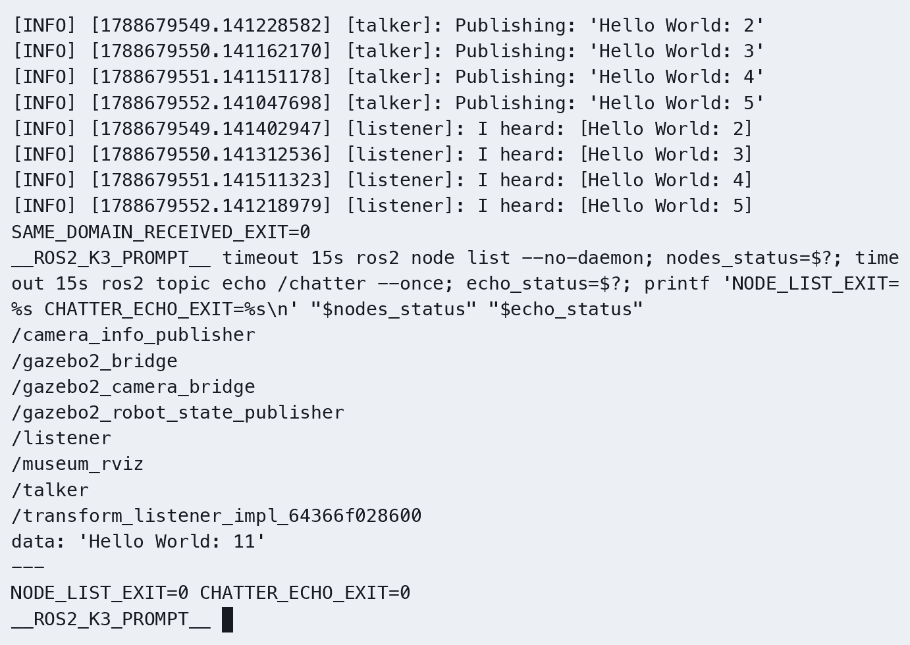

K3 上 talker 发布、listener 接收，节点列表显示两个节点。

---

## 练习 1.2：工作空间创建与编译（约 15 分钟）

### 目标
创建 ROS 2 工作空间，掌握 colcon 构建工具链。

### 步骤

【K3 板端，独立练习终端；若包已存在，检查并复编译，不覆盖原文件】

```bash
# 1. 创建工作空间
mkdir -p ~/my_ros2_ws/src
cd ~/my_ros2_ws

# 2. 编译空工作空间
colcon build --symlink-install

# 3. 创建测试包
cd src
ros2 pkg create my_first_pkg --build-type ament_cmake \
  --dependencies rclcpp std_msgs

# 4. 编译测试包
cd ~/my_ros2_ws
colcon build --packages-select my_first_pkg --symlink-install
source install/setup.bash

# 5. 验证
ros2 pkg list | grep my_first
```

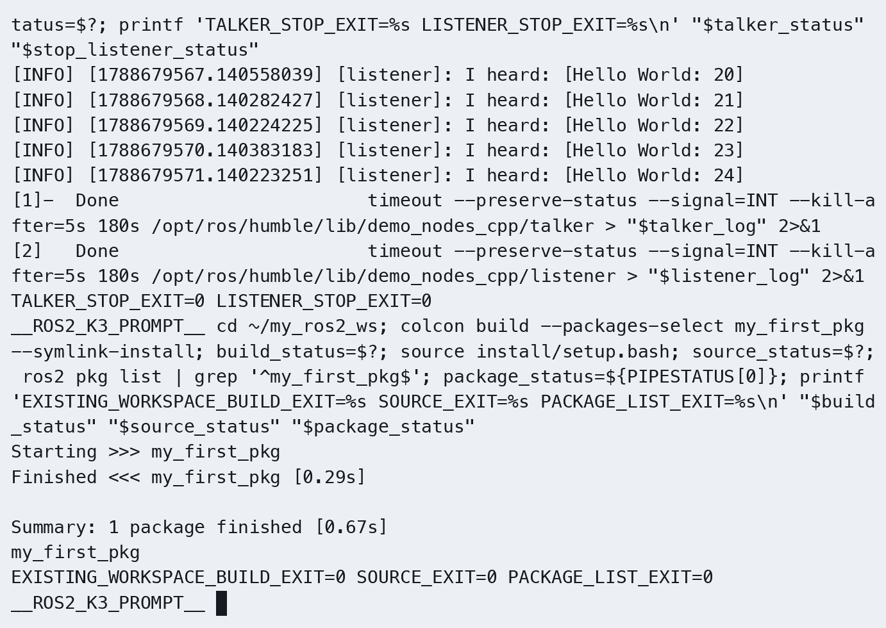

K3 现有 my_first_pkg 复编译通过，加载 setup.bash 后可查询到该包。

**✓ 验证**：`ros2 pkg list` 显示 my_first_pkg。

---

## 练习 1.3：DDS 域 ID 实验（约 15 分钟）

### 目标
理解 `ROS_DOMAIN_ID` 的通信隔离作用。

### 步骤

【K3 板端，终端 1/2；加载课程环境】

```bash
# 终端1：域0 talker
export ROS_DOMAIN_ID=0
ros2 run demo_nodes_cpp talker

# 终端2：域0 listener → 正常接收
export ROS_DOMAIN_ID=0
ros2 run demo_nodes_cpp listener
# Ctrl+C 停止
```

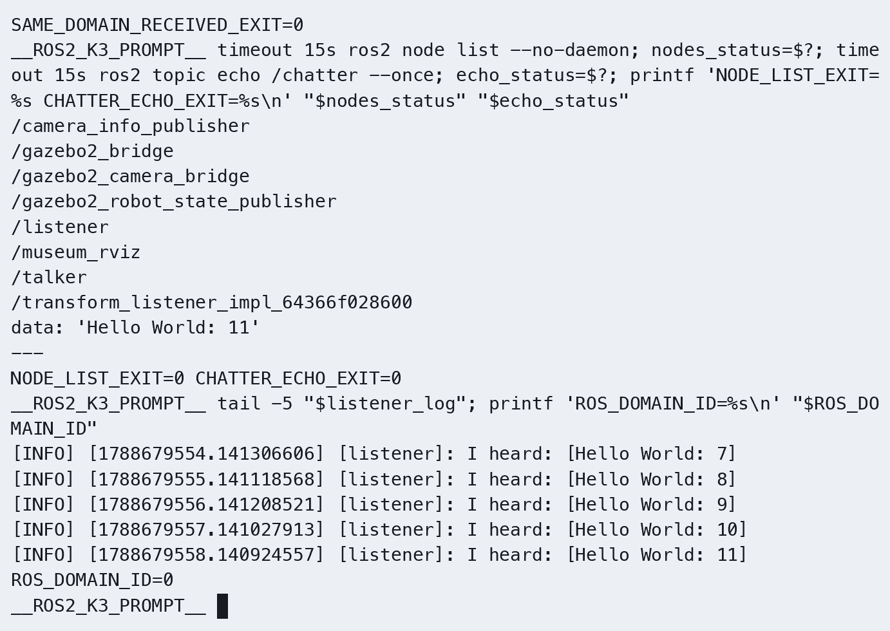

K3 的 Domain 0 listener 收到同域 talker 消息。

```bash
# 终端2：域1 listener → 无输出（域隔离）
export ROS_DOMAIN_ID=1
ros2 run demo_nodes_cpp listener
# 期望：无任何输出（无法跨域通信）
```

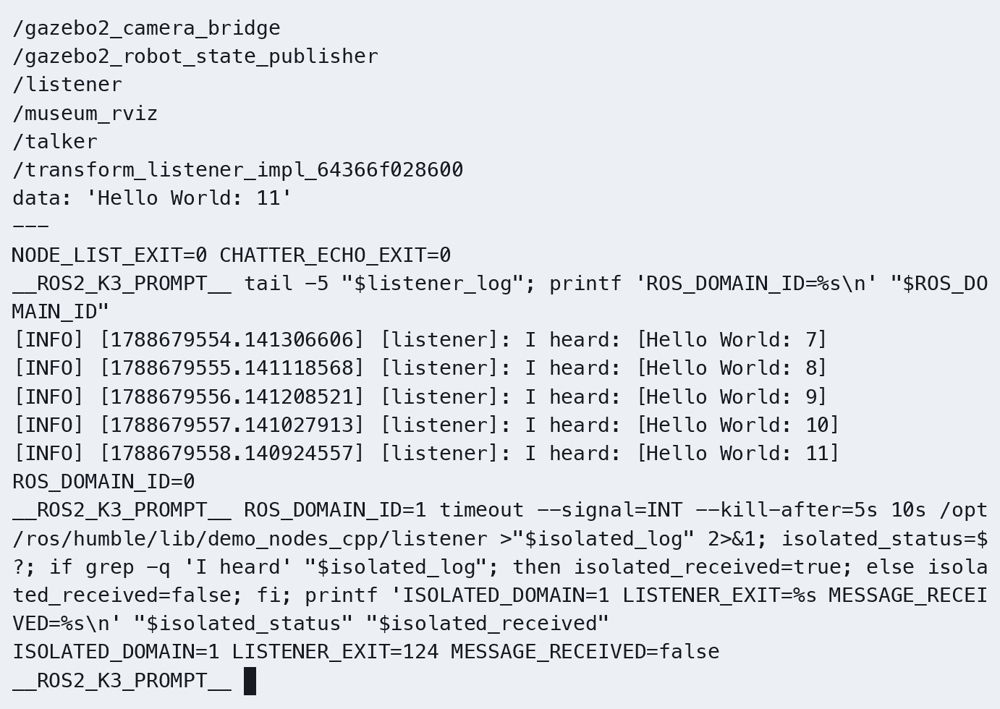

K3 的 Domain 1 listener 在 10 秒观察窗口内未收到 Domain 0 消息，timeout 返回 124。

【K3 板端，终端 2】观察隔离后 Ctrl+C 停止 listener，执行 `export ROS_DOMAIN_ID=0`，重新运行 listener 确认恢复，再停止两个节点。

**✓ 验证**：同域通信正常，跨域通信隔离。

---

## 练习 1.4：课程源码包编译与运行（约 15 分钟）

### 目标
将本机课程源码同步到 K3 受管工作空间，完成完整编译，在 x86 运行基础仿真。

### 步骤

**步骤1：复制课程源码**

【本机访问端】按 [公共环境的源码同步步骤](ch00_common_setup.md#本地编辑同步与-remote-ssh) 核对 dry-run 清单并同步，再检查源码指纹。

【K3 板端，构建终端】

```bash
cd ~/ros2_course_ws
ls src/course/ src/labs/
```

**步骤2：安装系统依赖**

【K3 板端，安装终端】课程专用安装器使用已核对的 Bianbu 依赖清单，处理受管工作区；先预检，存在未解决的依赖项时保留错误并确认。

```bash
cd ~/ROS2_RISCV
bash setup_course_k3.sh --dry-run
bash setup_course_k3.sh
```

**步骤3：编译全部课程包**

【K3 板端，构建终端】

```bash
source ~/.config/ros2-course/env.bash
cd ~/ros2_course_ws
colcon build --base-paths src/course src/labs --symlink-install --executor sequential
source install/setup.bash
ros2 pkg list | grep demo
```

构建摘要中的包数须与当次源码清单一致，退出码为 0；同时记录实际警告。

**步骤4：验证仿真基础节点**

【x86 课程容器，仿真终端】按 [公共环境](ch00_common_setup.md#启动与进入课程仿真容器) 启动 Burger 仿真和 RViz。当前入口将模型及传感器与 Gazebo 联动，观察 RViz 的 TurtleBot3 Burger 模型与 TF；运动节点保持关闭。

```bash
source /opt/ros/humble/setup.bash
source /workspace/install/setup.bash
ros2 launch robot_sim_demo gazebo2.launch.py gui:=true rviz:=true drive:=false
```

公共 helper 已启动仿真时不重复执行本命令；本次仿真可继续用于练习 1.5，实验结束按第 0 章停止对应容器。

**✓ 验证**：
- 截图1：`colcon build` 编译成功（Summary 中当次全部课程包 finished）

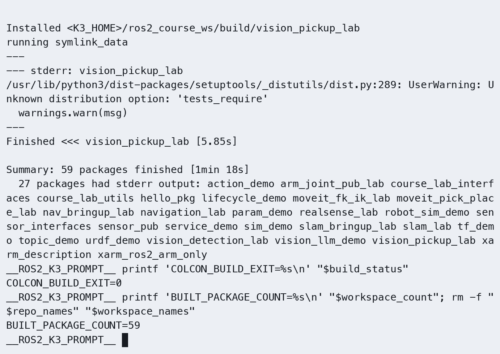

K3 全量构建完成 59 个包，退出码为 0；27 个包的 stderr 提示保留在日志中。此为此前完整工作区的历史结果；本章提交仅包含本章源码及必要共享依赖，包数以当前源码清单为准，不以 59 作为验收条件。

- 截图2：`ros2 pkg list | grep demo` 显示课程包列表

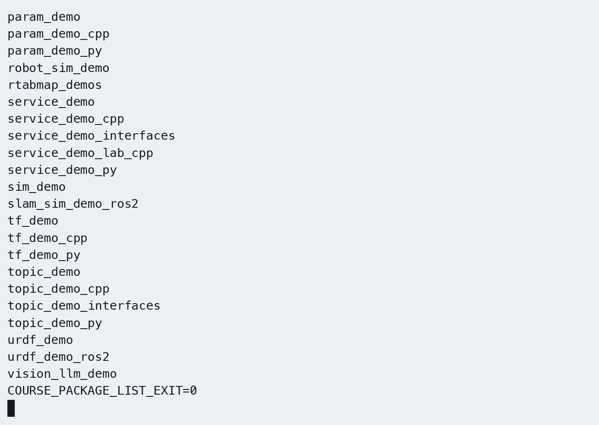

K3 加载课程工作区后，ros2 pkg list 可查询到课程包。

- 截图3：RViz 中 TurtleBot3 Burger 机器人模型正常显示

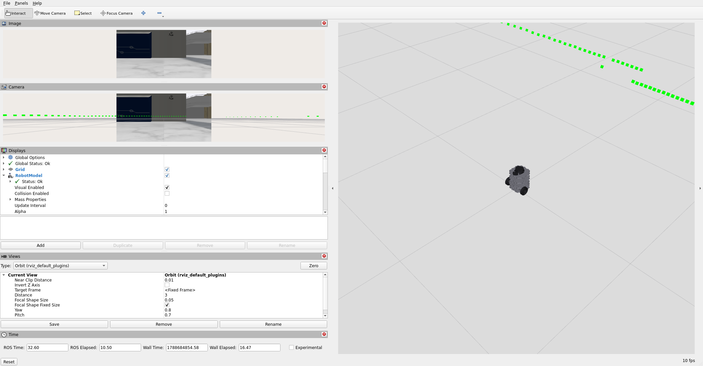

图中使用浅色背景、Distance 3，并关闭 TF 显示以避免遮挡。RViz 模型材质已调亮，几何及运动参数不变。同轮 K3 收到相机图像、CameraInfo、激光及推进中的仿真时钟；相机帧名为 `camera_optical_frame`。本图为独立静态补验，录像及截图见[K3 实际运行证据](runtime_evidence.md)。

### 常见问题

| 问题 | 原因 | 解决方法 |
|------|------|---------|
| 依赖安装报错 | 缺少依赖包 | 保留安装器报错，核对 Bianbu 包候选和已确认依赖清单 |
| 编译失败（找不到 gazebo） | 环境或依赖不对应 | Gazebo 在 x86 Humble/Harmonic 容器中构建，按第 0 章核对环境；K3 不安装 GUI |
| RViz 无机器人模型 | 未加载环境或模型/TF 未就绪 | 在 x86 容器加载 `/workspace/install/setup.bash`，检查 RobotModel 状态、`/robot_description` 与 TF |

---

## 练习 1.5：课程仿真启动与使用（约 15 分钟）

### 目标
启动 Gazebo 仿真环境，在 RViz 中添加激光雷达、机器人模型、摄像头等显示项。

### 步骤

**步骤1：启动 Gazebo 仿真（含界面）**

【x86 课程容器，仿真终端】沿用练习 1.4 的仿真；首次启动见第 0 章，等效入口如下。

```bash
source /opt/ros/humble/setup.bash
source /workspace/install/setup.bash
ros2 launch robot_sim_demo gazebo2.launch.py gui:=true rviz:=true drive:=false
# 期望：Gazebo 窗口 + RViz 窗口同时打开
# Gazebo 中显示 Museum 场景 + TurtleBot3 Burger 机器人
```

**步骤2：在 RViz 中添加激光雷达显示**
- 左侧 "Displays" → Add → 选择 "LaserScan"
- 在新增的 LaserScan 项中设置 Topic：`/scan`
- 期望：看到绿色激光扫描点组成的轮廓线

**步骤3：添加机器人模型显示**
- Displays → Add → 选择 "RobotModel"
- 期望：看到 TurtleBot3 Burger 机器人 3D 模型

**步骤4：添加摄像头显示（需要启用深度相机）**
- Displays → Add → 选择 "Camera"
- 在 Camera 项中设置 Topic：`/camera/image_raw`
- 期望：看到摄像头实时画面

**步骤5：键盘遥控测试**

【K3 板端，遥控终端；先停止其他 `/cmd_vel` 发布者】
```bash
# 新开终端
source ~/ros2_course_ws/install/setup.bash
ros2 run teleop_twist_keyboard teleop_twist_keyboard
# 按 i 前进，k 停止，j/l 左右转
# 观察 RViz 和 Gazebo 中机器人运动
```

**✓ 验证**：
- 截图1：Gazebo 窗口（Museum 场景 + TurtleBot3 Burger 机器人）

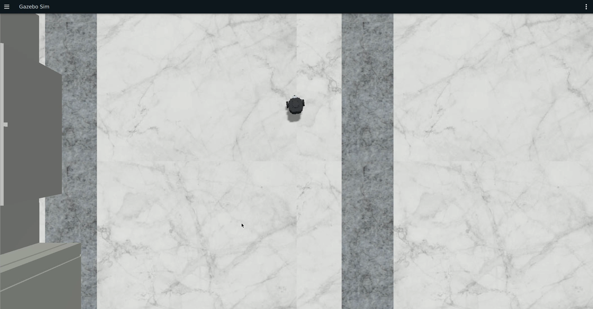

x86 Gazebo 中的 Museum 与 Burger；本图为 Gazebo 原始遥控录像第 5 秒，K3 尚未开始本轮运动。

- 截图2：RViz 窗口（RobotModel + LaserScan 正常显示）

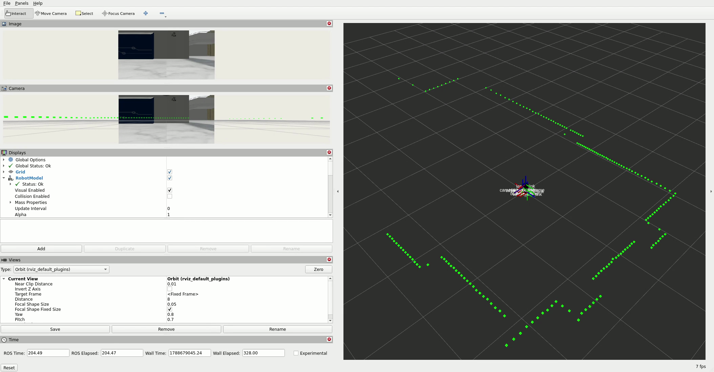

x86 RViz 的 Image/Camera 有实际相机画面，激光扫描可见，Global Status 为 OK；本图为 RViz 独立补验第 5 秒。

- 截图3：键盘遥控后机器人位置改变

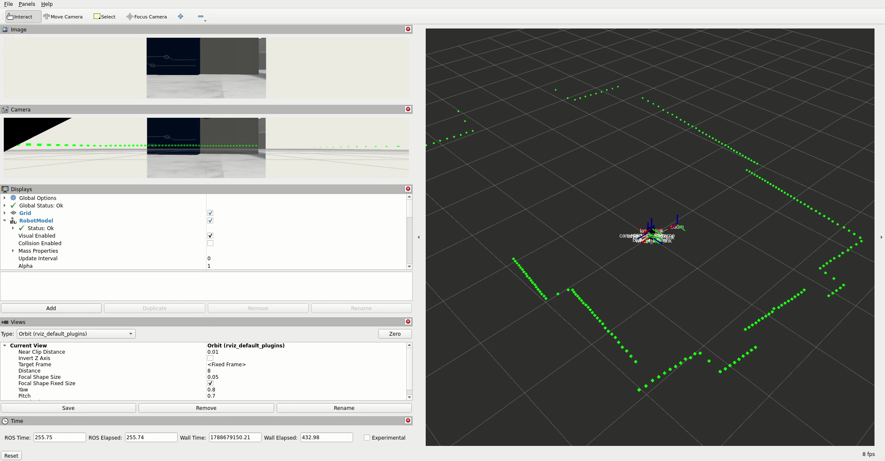

同一段 RViz 补验第 110 秒：K3 遥控后，激光分布和相机画面已变化。Fixed Frame 为 base_link，车体保持在视图中心。

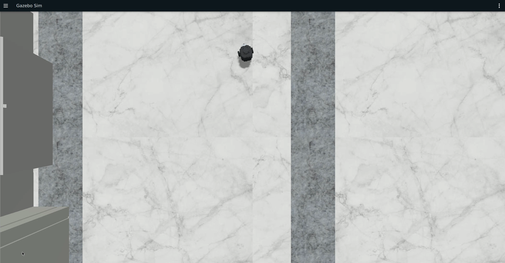

同一段 Gazebo 原始遥控录像第 110 秒，与上方第 5 秒对比，车体位置和朝向已变化。
[Gazebo 连续演示（18 秒）](https://gitee.com/chuachuaa/ROS2_RISCV/releases/download/k3-ch01-04-media-20260908/ch01--burger-gazebo-demo.mp4) 与
[配对 K3 终端录像](https://gitee.com/chuachuaa/ROS2_RISCV/releases/download/k3-ch01-04-media-20260908/ch01--burger-gazebo-terminal.mp4) 记录了前进、左右转和停止；
两次 GUI 补验分别进行，不能当作同一轮同步画面。


**补充：验证激光雷达与深度相机话题**

【x86 课程容器】沿用上面已启动的仿真。当前 Burger 的雷达、相机及 CameraInfo 由 `gazebo2.launch.py` 与 `gazebo2_bridge.yaml` 启动和桥接，不再启动第二组桥。相机图像和 CameraInfo 使用 `camera_optical_frame`。

【K3 板端，观察终端；每条频率命令分别观察后 Ctrl+C】

```bash
source ~/.config/ros2-course/env.bash
source ~/ros2_course_ws/install/setup.bash
ros2 topic list -t | grep -E "scan|rgbd|camera|image|depth|camera_info"
ros2 topic hz /scan
ros2 topic hz /camera/image_raw
ros2 topic hz /camera/camera_info
```

- 在 x86 RViz 中依次选择 Displays → Add → Image。
- 将 Topic 设置为 `/camera/image_raw`。
- 操作结束，先停止 K3 遥控和观察终端，再按第 0 章停止本轮课程容器。


---


## 练习 1.6：VS Code + ROS 2 插件编程（约 15 分钟）

### 目标
配置 VS Code/VSCodium 开发环境，安装 RuyiSDK VSCode 插件与 Remote-SSH，创建、编译、调试 ROS 2 C++ 节点。

### 步骤

**步骤1：安装 VS Code 和 ROS 插件**

【本机访问端】按第 0 章准备 VS Code/VSCodium、RuyiSDK VSCode 插件及 Remote-SSH；远程调试使用已有 Native Debug（`webfreak.debug`）和 K3 上的 GDB。

**步骤2：打开课程工作空间**

【本机访问端】打开本机 `ROS2_RISCV` 完成编辑；同步后通过 Remote-SSH 连接 `pico`，打开 `/home/pico/ROS2_RISCV` 进行构建和调试。

**步骤3：创建测试节点**

【本机访问端】在课程 `src/lifecycle_demo_cpp/src/lifecycle_demo.cpp` 创建 C++ 生命周期节点。该包已存在时核对已有文件，保留已有实现。包的 `CMakeLists.txt` 注册 `lifecycle_demo` 入口并声明 `rclcpp`、`rclcpp_lifecycle`、`lifecycle_msgs`、`geometry_msgs` 依赖。

```cpp
#include <chrono>
#include <functional>
#include <memory>

#include "geometry_msgs/msg/twist.hpp"
#include "lifecycle_msgs/msg/state.hpp"
#include "lifecycle_msgs/msg/transition.hpp"
#include "rclcpp/rclcpp.hpp"
#include "rclcpp_lifecycle/lifecycle_node.hpp"

using namespace std::chrono_literals;
using CallbackReturn = rclcpp_lifecycle::node_interfaces::LifecycleNodeInterface::CallbackReturn;

class LifecycleDemo : public rclcpp_lifecycle::LifecycleNode
{
public:
  LifecycleDemo()
  : LifecycleNode("hello_ros2_lifecycle"), count_(0)
  {
    const bool autostart = declare_parameter<bool>("autostart", false);
    RCLCPP_INFO(get_logger(), "LIFECYCLE_READY autostart=%s", autostart ? "true" : "false");
  }

  bool autostart()
  {
    if (!get_parameter("autostart").as_bool()) {
      return true;
    }
    return trigger_transition(lifecycle_msgs::msg::Transition::TRANSITION_CONFIGURE).id() ==
           lifecycle_msgs::msg::State::PRIMARY_STATE_INACTIVE &&
           trigger_transition(lifecycle_msgs::msg::Transition::TRANSITION_ACTIVATE).id() ==
           lifecycle_msgs::msg::State::PRIMARY_STATE_ACTIVE;
  }

  CallbackReturn on_configure(const rclcpp_lifecycle::State &)
  {
    publisher_ = create_publisher<geometry_msgs::msg::Twist>(
      "/cmd_vel", rclcpp::QoS(10).reliable().durability_volatile());
    timer_ = create_wall_timer(500ms, std::bind(&LifecycleDemo::publish, this));
    RCLCPP_INFO(get_logger(), "LIFECYCLE_CONFIGURED");
    return CallbackReturn::SUCCESS;
  }

  CallbackReturn on_activate(const rclcpp_lifecycle::State &)
  {
    publisher_->on_activate();
    RCLCPP_INFO(get_logger(), "LIFECYCLE_ACTIVE");
    return CallbackReturn::SUCCESS;
  }

  CallbackReturn on_deactivate(const rclcpp_lifecycle::State &)
  {
    publish_zero();
    publisher_->on_deactivate();
    RCLCPP_INFO(get_logger(), "LIFECYCLE_INACTIVE");
    return CallbackReturn::SUCCESS;
  }

  CallbackReturn on_cleanup(const rclcpp_lifecycle::State &)
  {
    timer_.reset();
    publisher_.reset();
    count_ = 0;
    RCLCPP_INFO(get_logger(), "LIFECYCLE_CLEANED_UP");
    return CallbackReturn::SUCCESS;
  }

  CallbackReturn on_shutdown(const rclcpp_lifecycle::State &)
  {
    publish_zero();
    if (publisher_ && publisher_->is_activated()) {
      publisher_->on_deactivate();
    }
    RCLCPP_INFO(get_logger(), "LIFECYCLE_SHUTDOWN");
    return CallbackReturn::SUCCESS;
  }

private:
  void publish()
  {
    if (!publisher_ || !publisher_->is_activated()) {
      return;
    }
    geometry_msgs::msg::Twist message;
    message.linear.x = 0.1;
    publisher_->publish(message);
    ++count_;
    RCLCPP_INFO(get_logger(), "CMD_VEL_PUBLISHED count=%zu", count_);
  }

  void publish_zero()
  {
    if (publisher_ && publisher_->is_activated()) {
      publisher_->publish(geometry_msgs::msg::Twist());
      RCLCPP_INFO(get_logger(), "CMD_VEL_ZERO");
    }
  }

  rclcpp_lifecycle::LifecyclePublisher<geometry_msgs::msg::Twist>::SharedPtr publisher_;
  rclcpp::TimerBase::SharedPtr timer_;
  std::size_t count_;
};

int main(int argc, char ** argv)
{
  rclcpp::init(argc, argv);
  auto node = std::make_shared<LifecycleDemo>();
  if (!node->autostart()) {
    RCLCPP_ERROR(node->get_logger(), "LIFECYCLE_AUTOSTART_FAILED");
    rclcpp::shutdown();
    return 1;
  }
  rclcpp::spin(node->get_node_base_interface());
  rclcpp::shutdown();
  return 0;
}
```
ROS 2 + LifecycleNode + QoS，可以体现生命周期节点的配置、激活、停用和清理过程。
- 在 `on_configure()` 阶段创建 `/cmd_vel` 发布者和定时器；
- 在 `on_activate()` 阶段激活生命周期发布者，开始周期发布速度控制消息；
- 在 `on_deactivate()` 阶段停止发布；
- 在 `on_cleanup()` 阶段销毁定时器和发布者资源。
- `KEEP_LAST + depth=10`：保留最近 10 条消息；
- `RELIABLE`：尽量保证控制消息可靠传输；
- `VOLATILE`：不保存历史消息，只向当前在线订阅者发送。

按第 0 章将本机源码同步到 K3；在 K3 构建终端执行：

```bash
source ~/.config/ros2-course/env.bash
cd ~/ros2_course_ws
colcon build --base-paths src/course src/labs --packages-select lifecycle_demo_cpp
source install/setup.bash
```

**步骤4：配置调试（launch.json）**
- 先检查远程课程目录的 `.vscode/launch.json`，避免覆盖个人配置；采用下列已验证的 GDB 配置。先按[公共环境中的运行支持文件放置](ch00_common_setup.md#运行支持文件放置)安装仓库提供的 `gdb.bash` 到 K3 的 `~/.config/ros2-course/gdb.bash`，用于加载 ROS 环境。

```json
{
  "version": "0.2.0",
  "configurations": [
    {
      "name": "K3: lifecycle C++ (GDB)",
      "type": "gdb",
      "request": "launch",
      "target": "${env:HOME}/ros2_course_ws/install/lifecycle_demo_cpp/lib/lifecycle_demo_cpp/lifecycle_demo",
      "cwd": "${workspaceFolder}",
      "gdbpath": "${env:HOME}/.config/ros2-course/gdb.bash",
      "pathSubstitutions": {
        "${env:HOME}/ros2_course_ws/src/course": "${workspaceFolder}/src"
      },
      "autorun": ["set debuginfod enabled off", "set non-stop on"],
      "stopAtEntry": true
    }
  ]
}
```

【K3 板端，ch01 编译完成后】为 clangd 生成本包的实际编译参数：

```bash
source ~/.config/ros2-course/env.bash
source ~/ros2_course_ws/install/setup.bash
cd ~/ros2_course_ws/build/lifecycle_demo_cpp
cmake -DCMAKE_EXPORT_COMPILE_COMMANDS=ON .
# 课程根目录尚无编译数据库时建立链接；已有文件先检查，不覆盖。
if [ -e ~/ROS2_RISCV/compile_commands.json ] || [ -L ~/ROS2_RISCV/compile_commands.json ]; then
  ls -ld ~/ROS2_RISCV/compile_commands.json
  printf '编译数据库已存在，请核对是否适用于本包。\n'
else
  ln -s ~/ros2_course_ws/build/lifecycle_demo_cpp/compile_commands.json \
    ~/ROS2_RISCV/compile_commands.json
fi
```

在现有 `get_logger` 标识符内放置光标，执行命令面板的 **Trigger Suggest**，
可看到 `get_logger() const` 等语义补全。按 Esc 关闭候选，不改变源码。
本轮 clangd 检查为 0 个错误；编辑器的 5 项 `unused-includes` 提示保留，未据此删改课程头文件。

**步骤5：断点调试**
- 在 `on_configure()` 的发布者创建、`on_activate()` 的激活及 `publish()` 的发布行左侧单击设置断点（红点）
- 按 `F5` 启动调试,新建终端，依次执行`ros2 lifecycle set /hello_ros2_lifecycle configure`
`ros2 lifecycle set /hello_ros2_lifecycle activate`
- 期望：程序在断点处暂停，可查看变量值、单步执行，节点激活后程序周期性进入 `publish()`，可以通过`ros2 topic echo /cmd_vel`验证话题是否正常发布

当前 RelWithDebInfo 构建中，前两个断点实际停在回调内的日志语句（第 40、47 行）；单步可能经过标准库头文件，再回到课程源码。在 Watch 添加 `this->count_`，继续/单步观察 0→1。调试结束取消周期断点，在 K3 控制终端执行 deactivate、cleanup 并停止调试；确认速度已归零。

**✓ 验证**：
- 截图1：VS Code 扩展列表（RuyiSDK、Remote-SSH 与 C++ 调试扩展已安装）

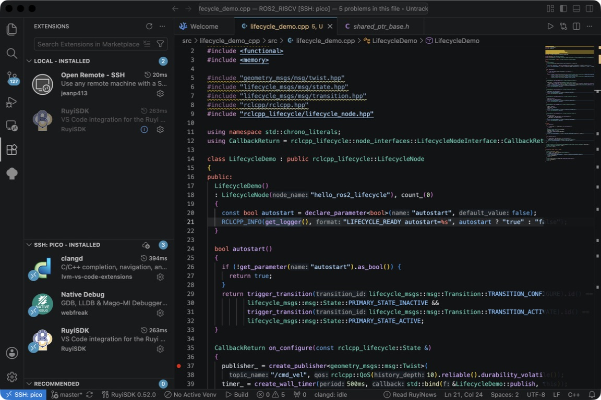

Mac VSCodium 本地安装 Remote-SSH、RuyiSDK；SSH: pico 端安装 clangd、Native Debug 与 RuyiSDK。

- 截图2：lifecycle_demo.cpp 代码编辑界面（含代码补全提示）

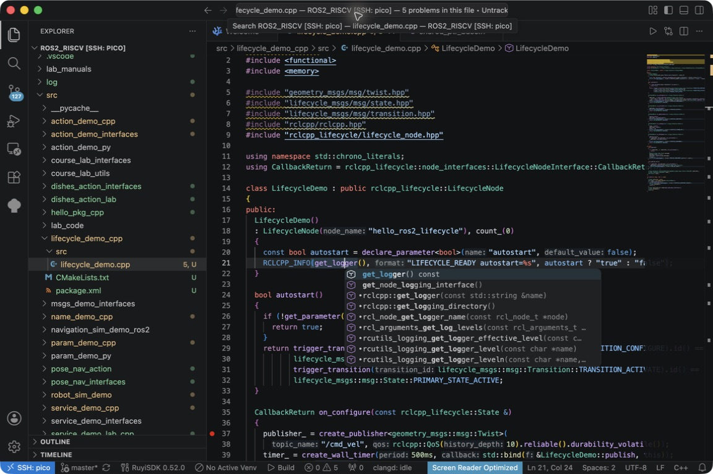

clangd 对现有 get_logger 前缀给出 get_logger() const 等语义补全；本次未插入或修改源码。

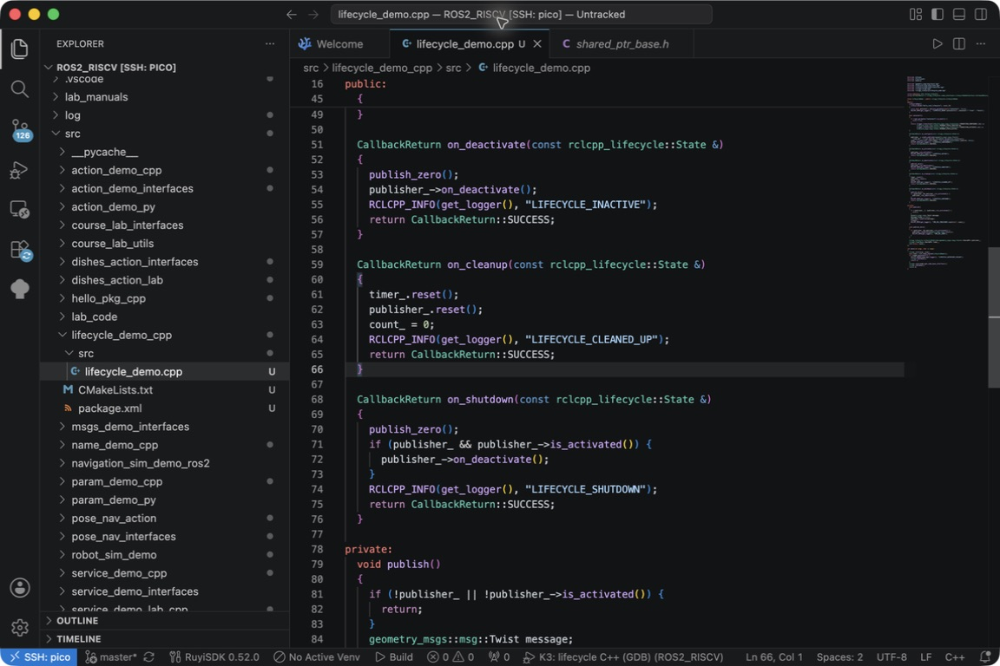

C++ 停用、清理与关闭回调：停止发布、释放资源并清零计数。

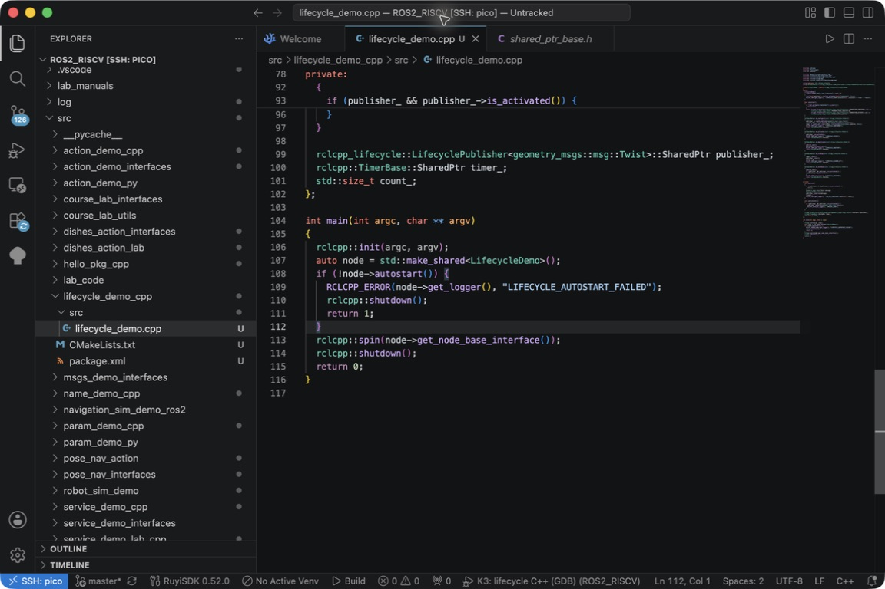

C++ main 创建生命周期节点，检查自动启动结果并进入 rclcpp::spin。

- 截图3：F5 调试运行中，断点处暂停，左侧显示变量面板

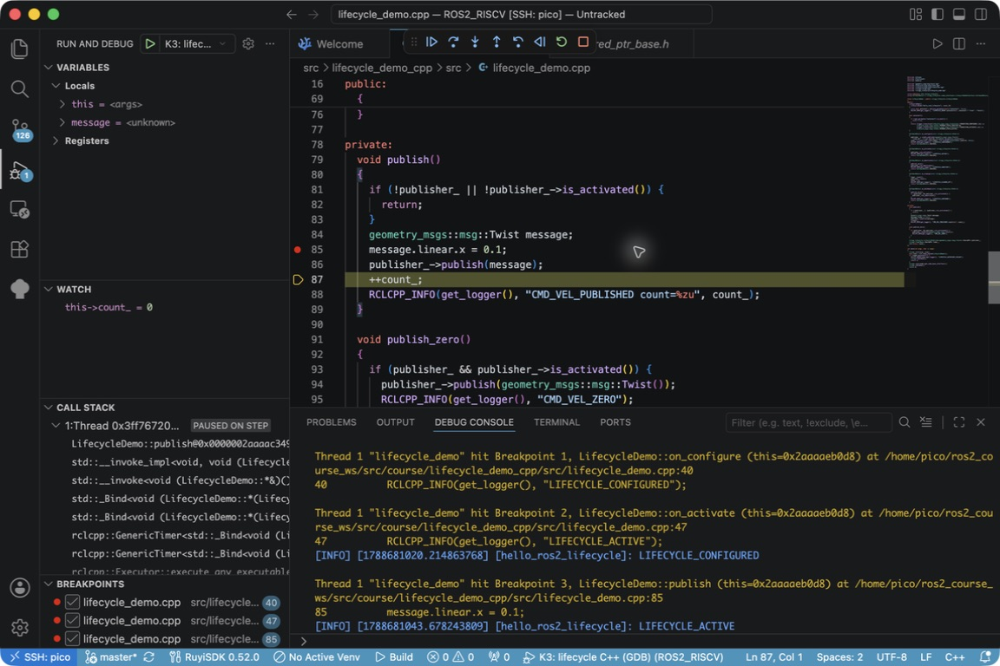

Mac VSCodium 调试 K3 节点：首次发布后暂停在计数自增前，Watch 中 this->count_=0。

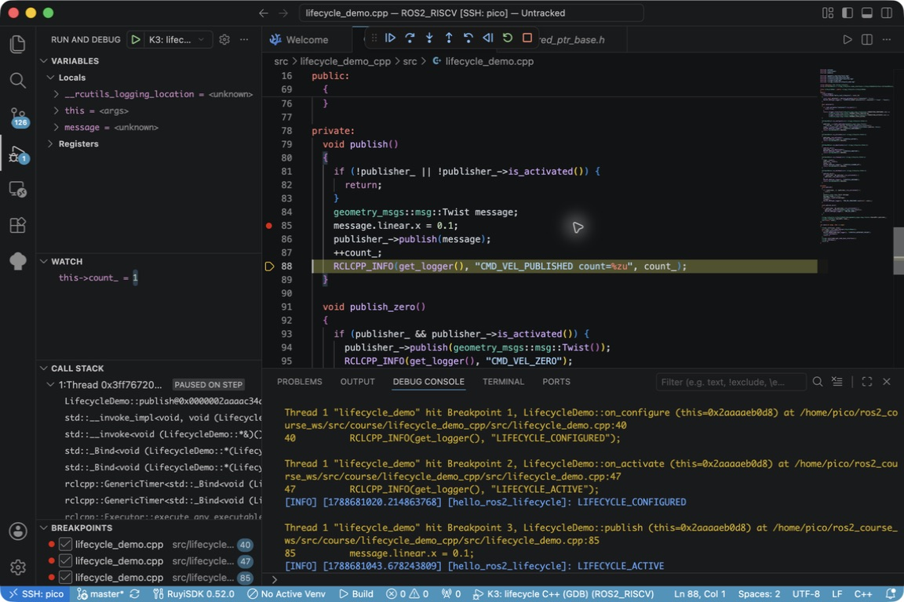

同一轮按 F10 执行 ++count_ 后，Watch 中 this->count_=1。

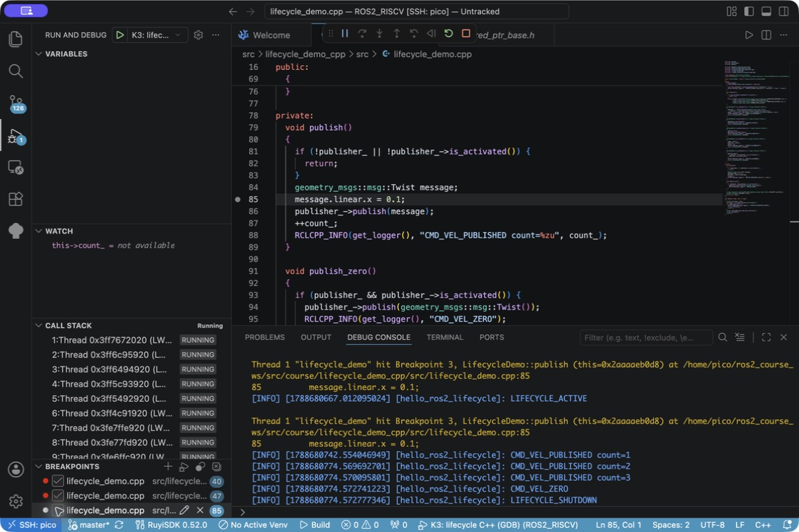

另一次 K3 调试补验中，日志显示发布计数 1、2、3，随后发送零速度并完成 shutdown。

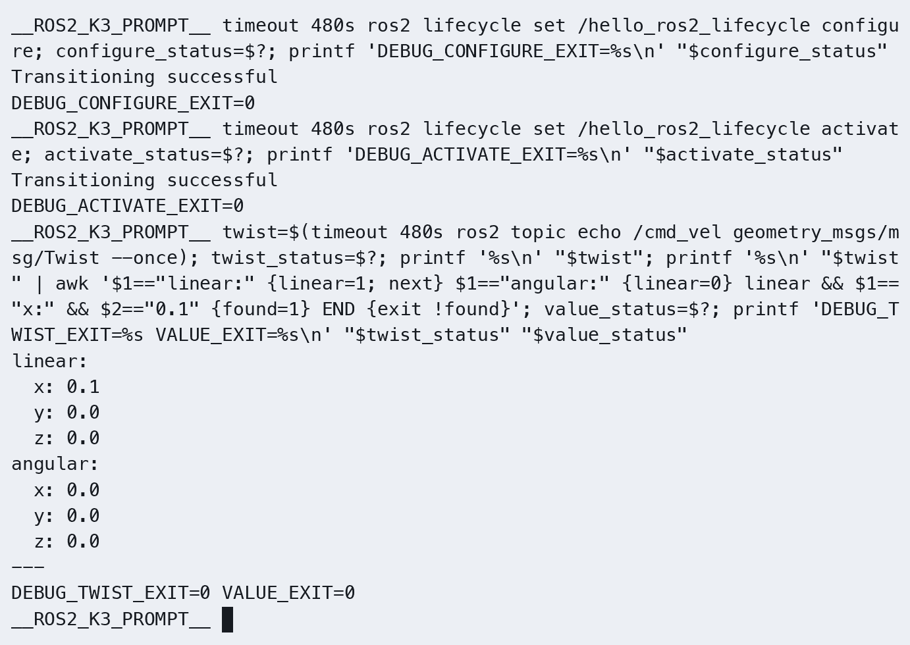

同一轮清晰断点补验的 K3 控制终端：configure、activate 成功，/cmd_vel 的 linear.x=0.1，验证退出码均为 0。

---

## 本章实验总结

| 练习 | 核心技能 | 时长 |
|------|---------|:--:|
| 1.1 | ROS 2 安装验证 | 15min |
| 1.2 | 工作空间 + colcon 构建 | 15min |
| 1.3 | DDS 域 ID 通信隔离 | 15min |
| 1.4 | 课程源码包编译与运行 | 15min |
| 1.5 | Gazebo + RViz 仿真启动 | 15min |
| 1.6 | VS Code + ROS2 插件调试 | 15min |

### 思考题

1. 仿真中 TurtleBot3 Burger 机器人的 `/cmd_vel` 话题有什么作用？速度控制，像机器人发送geometry_msgs/msg/Twist类型消息，实现前进后退等运动指令
2. 如果 Gazebo 无法启动（黑屏/崩溃），可能的原因有哪些？渲染环境有问题，卡死了或者不稳定；相关依赖没完整安装
3. VS Code 断点调试与传统 `print()` 调试相比有哪些优势？可以直接查看当前变量值、对象状态、函数调用过程以及程序执行顺序

## 实际运行证据

ROS 2 生命周期节点、状态查询和 `/cmd_vel` 输出的真实限时运行记录：


K3 实测 configure、activate 与速度消息；对应 [控制终端录像](https://gitee.com/chuachuaa/ROS2_RISCV/releases/download/k3-ch01-04-media-20260908/ch01--ide-control-terminal.mp4) 还包含 shutdown 成功结果。

既有生命周期、建包、IDE 和 Burger 联动运行通过结论保留；当前截图及连续 GUI 录像交付状态见 [K3 实际运行证据](runtime_evidence.md#ch01)。
