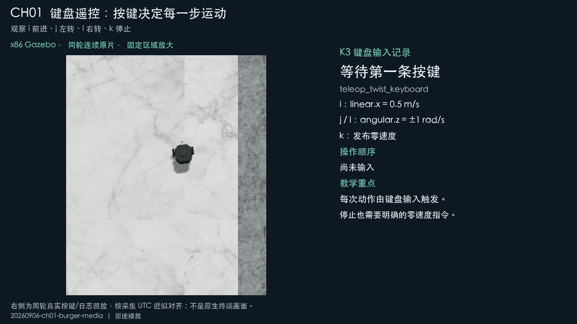
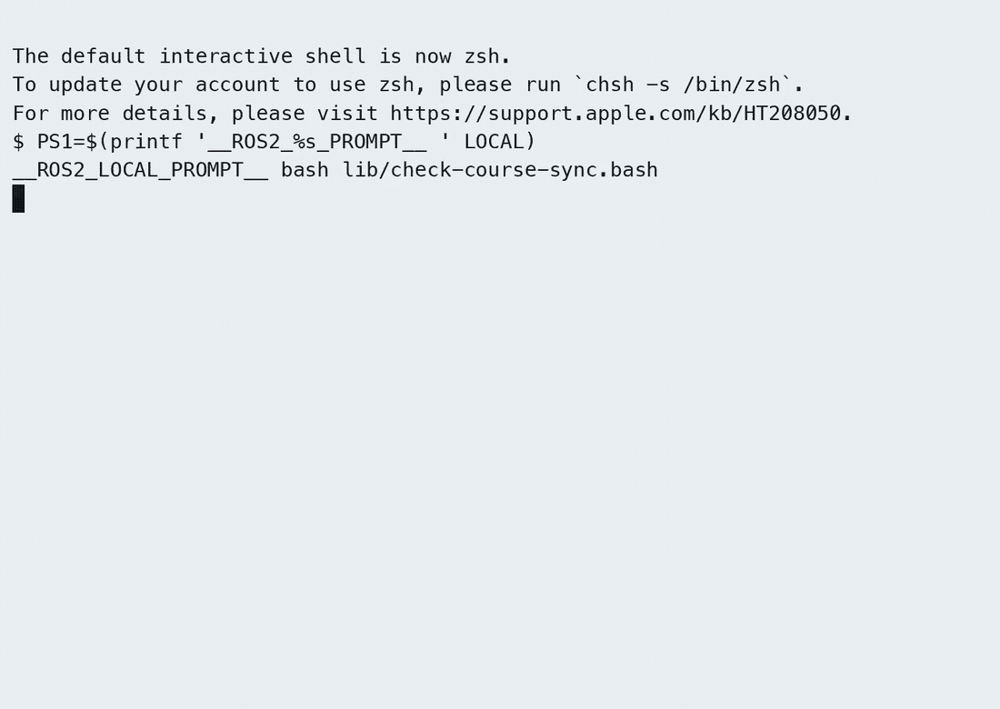
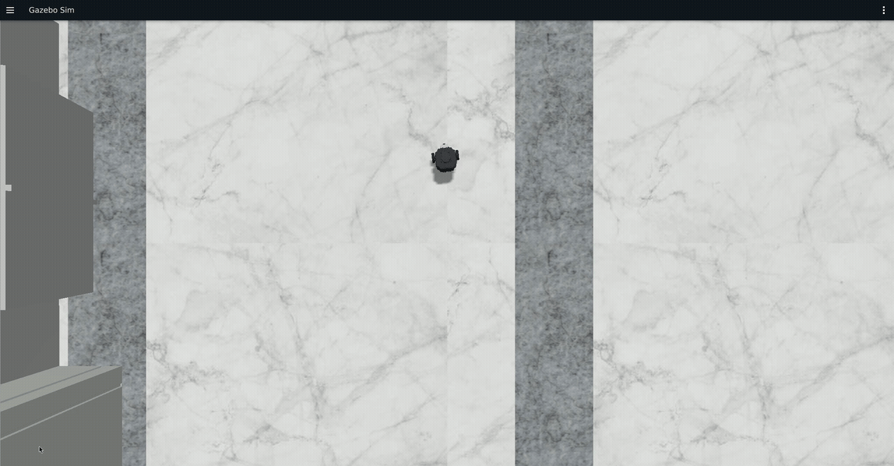
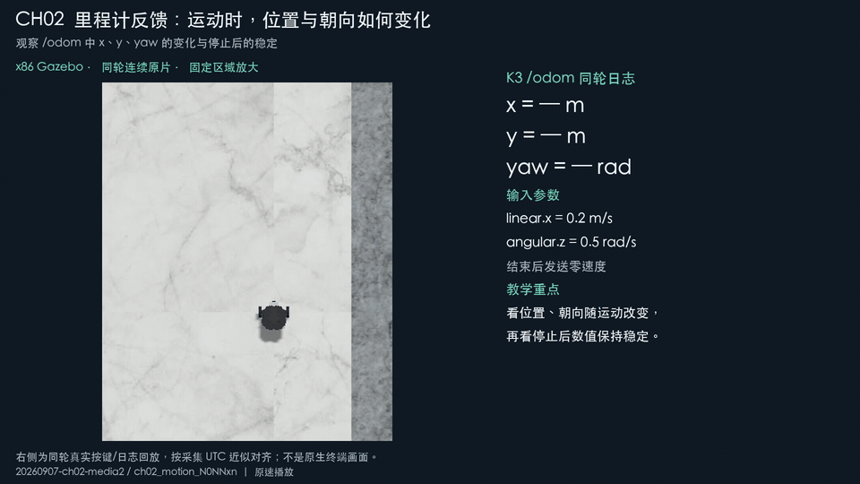
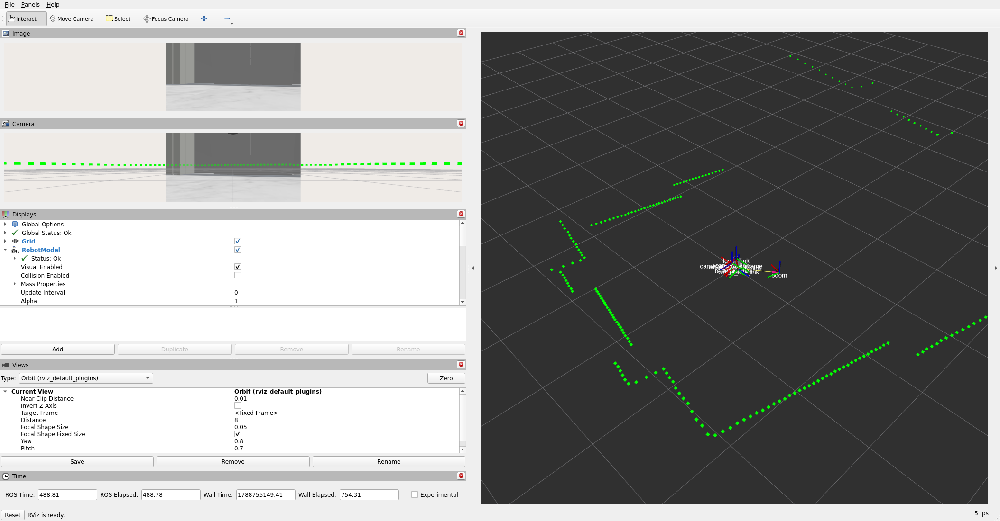
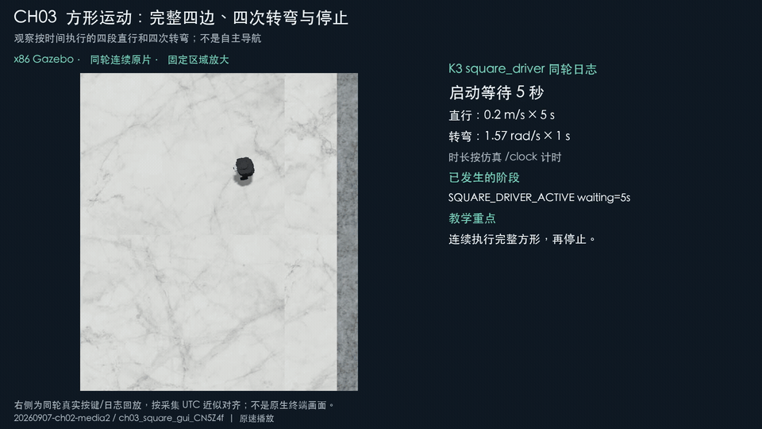
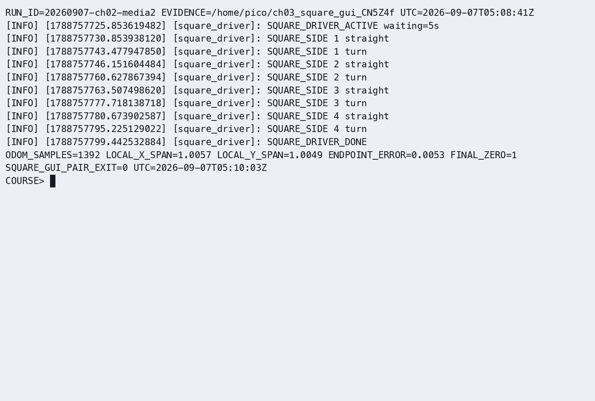
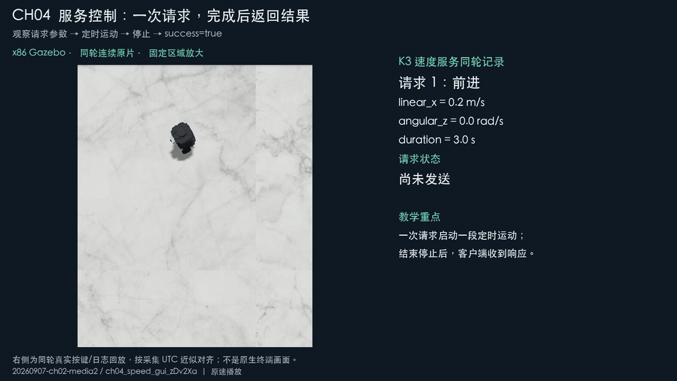
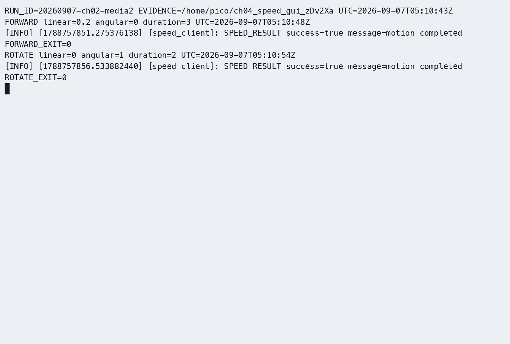

# K3 实际运行证据

MP4 和 CAST 存放于[运行证据附件](https://gitee.com/chuachuaa/ROS2_RISCV/releases/tag/k3-ch01-04-media-20260908)，下方链接可直接下载；GIF 和截图随课程文档保留。

本页登记课程在 K3 Pico-ITX / Bianbu 4.0.1 / riscv64 / ROS 2 Humble 上的实际运行结果。Gazebo、RViz 由 x86 Ubuntu 22.04 / Humble / Harmonic 课程容器承担，跨机使用 CycloneDDS、DDS 域 0。当前 K3 账号为 `pico`。

GIF 由实际终端录像或 GUI 录像转换，直接嵌入本页；CAST 为原始终端录制，终端 MP4 与 GUI 录像分别标明。分次补验不作为同一次运行。本页持续登记各章媒介、适用范围及待办状态。IDE、RViz 按截图交付；Gazebo、rqt 等其他 GUI 保留连续录屏要求。

## ch01 环境与入门

### 章节差异演示：键盘遥控

左侧连续显示 Burger，右侧回放同轮实际按键：i 前进、k 停止、j 左转、k 停止、l 右转、k 停止。重点是每次动作由输入触发。

[播放完整演示 MP4（18 秒）](https://gitee.com/chuachuaa/ROS2_RISCV/releases/download/k3-ch01-04-media-20260908/ch01--chapter-demo.mp4)

左侧是同轮 Gazebo 原片的固定区域放大，右侧是实际按键/日志的后期回放，**不是原生终端录像**。按原始 UTC 近似对齐，用于解释输入与结果，不用于测量通信延迟。原片始于 2026-09-06 07:20:58 UTC，本演示连续取第 41–59 秒；不改变播放速度。下方原始 GUI、CAST 和独立截图保留供核对。

### 基础实验与构建

K3 talker/listener 收发、节点与话题查询、DDS 同域接收及异域隔离、工作空间构建与环境加载已验证。首次建包沿用已有成功记录，当前录像展示既有包复编译。

[终端 MP4](https://gitee.com/chuachuaa/ROS2_RISCV/releases/download/k3-ch01-04-media-20260908/ch01--foundations-terminal.mp4) · [原始 CAST](https://gitee.com/chuachuaa/ROS2_RISCV/releases/download/k3-ch01-04-media-20260908/ch01--foundations-terminal.cast)

当次全量构建完成 59 包、退出码 0；27 包 stderr 提示保留在录制中。后续相机 C++ 变更包在 K3 和 x86 均构建通过。

2026-09-07 按 `origin/master` 基线加本章候选差异，在 K3 新建独立工作区构建 `lifecycle_demo_cpp` 与 `robot_sim_demo`：2 包通过，colcon 测试汇总 60 项、0 失败（其中仿真资产检查 10 项）。生命周期 configure/activate/deactivate/cleanup/再次激活/shutdown 全部通过，相机节点启动与 SIGINT 退出通过；验证使用仅本机通信的独立 DDS 域 91。本次候选源码与此前 GUI 验证版本一致，未重录 GUI；59 包记录属于历史完整工作区，不代表本章候选包数。

2026-09-08 review 修复复验：使用当前 ch01 两包源码，在 K3 与 x86 Humble 容器的独立目录重新构建。K3 2 包构建、60 项测试通过；x86 2 包构建、11 项测试通过，均为 0 错误、0 失败、0 跳过。两端安装目录的缓存及 Zone.Identifier 排除检查通过。K3 保留一条 CMake 兼容性弃用提示。键盘遥控包 2.4.1-1jammybb1 已安装、ROS 入口可用，apt 模拟安装为 0 新装/升级/删除；测试实际使用域 93。x86 现有 Gazebo 镜像验证通过，独立空镜像存储测试按预期退出 1，并提示先运行 `--gazebo`。本次执行构建、测试和脚本复验；GUI 演示沿用本页既有录制。

[构建截图](images/ch01/course-build-result.png) · [构建终端 MP4](https://gitee.com/chuachuaa/ROS2_RISCV/releases/download/k3-ch01-04-media-20260908/ch01--course-build-terminal.mp4) · [原始 CAST](https://gitee.com/chuachuaa/ROS2_RISCV/releases/download/k3-ch01-04-media-20260908/ch01--course-build-terminal.cast)

### C++ 生命周期与 IDE

生命周期配置、激活、发布及停止通过；`/cmd_vel` 发布 `linear.x=0.1`，停止时归零。Mac VSCodium 通过 Remote-SSH 调试 K3，断点、单步、Watch 计数 0→1 及 clangd 语义补全已验证。

[单步前截图](images/ch01/ide-count-zero-clear.jpg) · [单步后截图](images/ch01/ide-count-one-clear.jpg) · [补全截图](images/ch01/ide-completion.jpg) · [控制终端 MP4](https://gitee.com/chuachuaa/ROS2_RISCV/releases/download/k3-ch01-04-media-20260908/ch01--ide-control-terminal.mp4) · [原始 CAST](https://gitee.com/chuachuaa/ROS2_RISCV/releases/download/k3-ch01-04-media-20260908/ch01--ide-control-terminal.cast)

### Burger 仿真与 K3 联动

K3 键盘控制 Burger 前进、左右转与停止；x86 Gazebo 显示真实位姿变化。18 秒 GUI 演示连续截取原录像第 41–59 秒，原速保留运动前和停止后画面。

[Gazebo 连续 GUI 演示（18 秒）](https://gitee.com/chuachuaa/ROS2_RISCV/releases/download/k3-ch01-04-media-20260908/ch01--burger-gazebo-demo.mp4) · [配对终端 MP4](https://gitee.com/chuachuaa/ROS2_RISCV/releases/download/k3-ch01-04-media-20260908/ch01--burger-gazebo-terminal.mp4) · [原始 CAST](https://gitee.com/chuachuaa/ROS2_RISCV/releases/download/k3-ch01-04-media-20260908/ch01--burger-gazebo-terminal.cast)

模型截图来自独立补验 `20260906-ch01-rviz-material`：同轮 K3 收到 45 条 CameraInfo、37 帧图像、74 条激光消息，仿真时间从 49 秒推进至 58 秒。相机尺寸为 320×180，帧名为 `camera_optical_frame`。本图不作为上述 Gazebo 遥控录像的同轮截图。

相机内参发布器已等价转为 C++，默认参数、自定义标定、低频限幅、仿真时钟暂停及推进的新旧实现对比均通过。

### 对应源码

- [生命周期节点](../src_k3_pico_itx/lifecycle_demo_cpp/src/lifecycle_demo.cpp)：K3 上的 C++17/rclcpp 实现。
- [相机内参发布器](../src_k3_pico_itx/robot_sim_demo/src/camera_info_publisher.cpp)：x86 课程容器中的 C++17 实现。
- [仿真启动入口](../src_k3_pico_itx/robot_sim_demo/launch/gazebo2.launch.py)：Python Launch，组织仿真、桥接与显示节点。

### 补充媒介

Gazebo 遥控记录包含 4 条停止消息、末条全零，odom Δx=0.406801。RViz 遥控为另一轮运行（07:17:20–07:19:50 UTC），同样记录 4 条停止消息和末条全零；可选录像如下。

[RViz GUI MP4](https://gitee.com/chuachuaa/ROS2_RISCV/releases/download/k3-ch01-04-media-20260908/ch01--burger-rviz-optional.mp4) · [配对终端 MP4](https://gitee.com/chuachuaa/ROS2_RISCV/releases/download/k3-ch01-04-media-20260908/ch01--burger-rviz-terminal.mp4) · [原始 CAST](https://gitee.com/chuachuaa/ROS2_RISCV/releases/download/k3-ch01-04-media-20260908/ch01--burger-rviz-terminal.cast)

[IDE 扩展截图](images/ch01/ide-extensions.jpg)：Mac 本地 Remote-SSH、RuyiSDK；K3 端 Native Debug、clangd 与 RuyiSDK。

## 各章状态与待办

ch01 对应本分支课程源码；ch02～04 的补验对应本地候选源码。

2026-09-07 ch01～04 精确提交候选在 K3 独立构建：15 包完成，62 项测试通过（0 错误、0 失败、0 跳过）；两个包保留 CMake 版本提示。受影响的 4 包另已同步到受管工作空间并构建通过。正文及共享入口 228 个链接检查通过，选定的 43 份 MP4/GIF 完整解码通过。ch01～04 的运行通过结论保留；本轮已补充四段章节差异演示，并完成画面、时间来源及解码检查。

| 章节 | 运行验收 | 文档、媒介交付 |
|---|---|---|
| ch01 | 既有通过结论保留；本轮构建、基础实验、Burger 遥控、IDE 及相机 C++ 补验通过 |正文已按原章恢复；IDE 截图与 Gazebo 遥控连续录像已选入，原图 22/22 已逐项对应，RViz 清晰模型图及同轮 K3 接收补验通过；已补充章节差异演示，按键/日志回放与原始 GUI 区分标注 |
| ch02 | 既有运行通过；本轮节点、重命名、日志过滤与 odom 运动/停止补验通过 |原指导书 10 处、教案 1 处 PNG 已对应；rqt_console、rqt_graph、Gazebo 连续录像与 RViz 截图齐全；已补充章节差异演示，按键/日志回放与原始 GUI 区分标注 |
| ch03 | 既有运行通过；独立 SensorData/Person、GPS/QoS、执行器与方形运动补验通过 |原指导书 14 处、教案 4 处 PNG 已对应；rqt/Gazebo 连续录像齐全，RViz 独立轨迹截图保留并标明来源；已补充章节差异演示，按键/日志回放与原始 GUI 区分标注 |
| ch04 | 既有运行通过；标准加法、天气、超时/等待重试、速度请求与拒绝补验通过 |原指导书 5 处、教案 2 处 PNG 已对应；速度控制连续 Gazebo 录像齐全，已确认修正写入正文；已补充章节差异演示，按键/日志回放与原始 GUI 区分标注 |

## ch02 节点、命名空间与调试工具

### 章节差异演示：运动与里程计反馈

左侧显示运动，右侧从同轮 odom_monitor 日志按时间回放 x、y、yaw，保留停止后数值稳定的画面。输入为 0.2 m/s 与 0.5 rad/s。

[播放完整演示 MP4（30 秒）](https://gitee.com/chuachuaa/ROS2_RISCV/releases/download/k3-ch01-04-media-20260908/ch02--chapter-demo.mp4)

左侧是同轮 Gazebo 原片的固定区域放大，右侧是实际按键/日志的后期回放，**不是原生终端录像**。按原始 UTC 近似对齐，用于解释输入与结果，不用于测量通信延迟。原片始于 2026-09-07 04:24:10 UTC，本演示连续取第 9–39 秒；不改变播放速度。下方原始 GUI、CAST 和独立截图保留供核对。

[ch02 终端录像（MP4）](https://gitee.com/chuachuaa/ROS2_RISCV/releases/download/k3-ch01-04-media-20260908/ch02--run-20260905T161121Z--ch02-rqt-graph.mp4)

| 实验内容 | 终端录像 | 图形或终端截图 | 可用范围与限制 |
|---|---|---|---|
| C++ 节点与日志过滤 | [MP4](https://gitee.com/chuachuaa/ROS2_RISCV/releases/download/k3-ch01-04-media-20260908/ch02--run-20260905T151813Z--03-ch02-node.mp4) · [CAST](https://gitee.com/chuachuaa/ROS2_RISCV/releases/download/k3-ch01-04-media-20260908/ch02--run-20260905T151813Z--03-ch02-node.cast) | [PNG](images/ch02/run-20260905T151813Z--snapshots--ch02-log-filter.png) | 节点存活、计数、一次性/节流及日志等级；不是运动录像。 |
| 练习包复编译与命名空间 | [MP4](https://gitee.com/chuachuaa/ROS2_RISCV/releases/download/k3-ch01-04-media-20260908/ch02--run-20260905T152213Z--ch02-package-name.mp4) · [GIF](images/runtime/ch02/run-20260905T152213Z--ch02-package-name.gif) · [CAST](https://gitee.com/chuachuaa/ROS2_RISCV/releases/download/k3-ch01-04-media-20260908/ch02--run-20260905T152213Z--ch02-package-name.cast) | [PNG](images/ch02/run-20260905T152213Z--snapshots--ch02-namespace-result.png) | 已有练习包一致性、复编译、节点重命名及 serial=7；不是首次创建全流程。 |
| rqt_console 与运动/停止 | [MP4](https://gitee.com/chuachuaa/ROS2_RISCV/releases/download/k3-ch01-04-media-20260908/ch02--run-20260905T153014Z--ch02-tools-motion.mp4) · [CAST](https://gitee.com/chuachuaa/ROS2_RISCV/releases/download/k3-ch01-04-media-20260908/ch02--run-20260905T153014Z--ch02-tools-motion.cast) | [PNG](images/ch02/run-20260905T153014Z--before-rqt_console.png) | 只采用日志窗口、运动及归零结果；该轮 rqt_graph 旧图不可用。 |
| talker/chatter/listener 通信图 | [MP4](https://gitee.com/chuachuaa/ROS2_RISCV/releases/download/k3-ch01-04-media-20260908/ch02--run-20260905T161121Z--ch02-rqt-graph.mp4) · [CAST](https://gitee.com/chuachuaa/ROS2_RISCV/releases/download/k3-ch01-04-media-20260908/ch02--run-20260905T161121Z--ch02-rqt-graph.cast) | [PNG](images/ch02/run-20260905T161121Z--graph-refreshed.png) | 使用刷新后的真实通信图，双端节点/消息查询通过。 |

### 2026-09-07 原图对应与连续 GUI 补验

重新验证 hello_node、DEBUG/ERROR/WARN 日志过滤、首次建包、节点重命名和节点接口；对应截图已放回指导书原步骤。

[终端 MP4](https://gitee.com/chuachuaa/ROS2_RISCV/releases/download/k3-ch01-04-media-20260908/ch02--delivery-logger.mp4) · [CAST](https://gitee.com/chuachuaa/ROS2_RISCV/releases/download/k3-ch01-04-media-20260908/ch02--delivery-logger.cast) · [双节点重命名与里程计日志回看](https://gitee.com/chuachuaa/ROS2_RISCV/releases/download/k3-ch01-04-media-20260908/ch02--delivery-auxiliary.mp4) · [CAST](https://gitee.com/chuachuaa/ROS2_RISCV/releases/download/k3-ch01-04-media-20260908/ch02--delivery-auxiliary.cast)

同一仿真实例 `20260907-ch02-media2` 的分次补验：

| 观察点 | 连续 GUI 录像 | 同轮截图与结果 |
|---|---|---|
| rqt_console 接收 K3 日志 | [rqt_console MP4](https://gitee.com/chuachuaa/ROS2_RISCV/releases/download/k3-ch01-04-media-20260908/ch02--delivery-rqt-console-gui.mp4) | [Debug、Info、Warn](images/ch02/delivery-rqt-console.png)；04:21:43–04:22:23 UTC |
| talker → /chatter → listener | [rqt_graph MP4](https://gitee.com/chuachuaa/ROS2_RISCV/releases/download/k3-ch01-04-media-20260908/ch02--delivery-rqt-graph-final-gui.mp4) | [完整通信图](images/ch02/delivery-rqt-graph.png)；04:29:19–04:29:49 UTC |
| 0.2 m/s、0.5 rad/s 运动及停止 | [Gazebo MP4，23 秒](https://gitee.com/chuachuaa/ROS2_RISCV/releases/download/k3-ch01-04-media-20260908/ch02--delivery-gazebo-motion-gui.mp4) | [odom 日志首尾](images/ch02/delivery-odom-output.png)：(0, 0, 0) → (0.39, 0.49, 1.81)，69 条运动指令，最终归零；原片 04:24:10 UTC 开始，原速截取第 9–32 秒 |

里程计截图与辅助终端录像是对上述已保存日志的回看，保留原始时间戳；不是第二次运动。yaw 使用已确认的完整四元数 atan2 公式。

## ch03 话题、自定义消息与轨迹

### 章节差异演示：完整方形与执行阶段

固定区域保留完整四边与停止，右侧按 square_driver 日志显示当前直行/转弯阶段。原速展示；5 s 直行和 1 s 转弯按仿真时钟计时。RViz 历史轨迹仍见下方独立截图。

[播放完整演示 MP4（约 77 秒）](https://gitee.com/chuachuaa/ROS2_RISCV/releases/download/k3-ch01-04-media-20260908/ch03--chapter-demo.mp4)

左侧是同轮 Gazebo 原片的固定区域放大，右侧是实际按键/日志的后期回放，**不是原生终端录像**。按原始 UTC 近似对齐，用于解释输入与结果，不用于测量通信延迟。原片始于 2026-09-07 05:08:31 UTC，本演示连续取第 18–95 秒；不改变播放速度。下方原始 GUI、CAST 和独立截图保留供核对。

[ch03 终端录像（MP4）](https://gitee.com/chuachuaa/ROS2_RISCV/releases/download/k3-ch01-04-media-20260908/ch03--run-20260906T050801Z--ch03-odom-trace.mp4)

| 实验内容 | 终端录像 | 图形或终端截图 | 可用范围与限制 |
|---|---|---|---|
| 建包、自定义消息、1 Hz 与 QoS B | [MP4](https://gitee.com/chuachuaa/ROS2_RISCV/releases/download/k3-ch01-04-media-20260908/ch03--run-20260905T170334Z--ch03-package-frequency.mp4) · [CAST](https://gitee.com/chuachuaa/ROS2_RISCV/releases/download/k3-ch01-04-media-20260908/ch03--run-20260905T170334Z--ch03-package-frequency.cast) | [PNG](images/ch03/run-20260905T170334Z--snapshots--ch03-frequency-qos.png) | 两包创建/编译、消息字段、频率与 RELIABLE→BEST_EFFORT。 |
| scan/odom 与单次速度指令 | [MP4](https://gitee.com/chuachuaa/ROS2_RISCV/releases/download/k3-ch01-04-media-20260908/ch03--run-20260906T051327Z--ch03-scan-odom.mp4) · [CAST](https://gitee.com/chuachuaa/ROS2_RISCV/releases/download/k3-ch01-04-media-20260908/ch03--run-20260906T051327Z--ch03-scan-odom.cast) | [PNG](images/ch03/run-20260906T051327Z--snapshots--ch03-scan-odom.png) | 类型、消息、单次 0.1 指令及全零停止；不是定长运动。 |
| 方形运动与 RViz 历史轨迹 | [MP4](https://gitee.com/chuachuaa/ROS2_RISCV/releases/download/k3-ch01-04-media-20260908/ch03--run-20260906T050801Z--ch03-odom-trace.mp4) · [CAST](https://gitee.com/chuachuaa/ROS2_RISCV/releases/download/k3-ch01-04-media-20260908/ch03--run-20260906T050801Z--ch03-odom-trace.cast) | [PNG](images/ch03/run-20260906T050801Z--after-rviz.png) | 四边轨迹可见，闭合误差 5.3 mm，最终归零；采用 Fixed Frame=odom 的补验。 |
| GPS 与 SensorData 通信图 | [MP4](https://gitee.com/chuachuaa/ROS2_RISCV/releases/download/k3-ch01-04-media-20260908/ch03--run-20260906T051714Z--ch03-rqt-pair.mp4) · [GIF](images/runtime/ch03/run-20260906T051714Z--ch03-rqt-pair.gif) · [CAST](https://gitee.com/chuachuaa/ROS2_RISCV/releases/download/k3-ch01-04-media-20260908/ch03--run-20260906T051714Z--ch03-rqt-pair.cast) | [PNG](images/ch03/run-20260906T051714Z--graph-refreshed.png) | 两条发布/订阅链完整；实际 Nodes only，话题显示为边标签。 |

### 独立传感器发布包补验（2026-09-07）

`SensorPublisher` 已从 `topic_demo_cpp` 移入独立 `sensor_pub_cpp`，恢复原章单独建包练习；消息接口与发布逻辑保持一致。K3 独立构建的 4 个相关包通过，2 项测试通过；确认旧包不再注册重复入口，消息为温度 25.5、湿度 60.0、气压 1013.25、设备 `sensor_01`，节点正常停止。另一次首次建包练习的创建、编译、运行截图已归档。

[终端 MP4](https://gitee.com/chuachuaa/ROS2_RISCV/releases/download/k3-ch01-04-media-20260908/ch03--sensor-independent.mp4) · [原始 CAST](https://gitee.com/chuachuaa/ROS2_RISCV/releases/download/k3-ch01-04-media-20260908/ch03--sensor-independent.cast) · [接口截图](images/ch03/delivery-sensor-interface.png) · [消息截图](images/ch03/delivery-sensor-message.png)。本次独立拆包记录与下方补验分别归档。

### 2026-09-07 Person、执行器、QoS 与连续 GUI 补验

Person 接口采用本章确认的 `string name`、`int32 age`、`float64 height`；独立包发布/接收 Li Ming、20、1.75。执行器示例在相同的 800 ms 回调下：单线程最大并行回调数 1、使用 1 个线程；多线程最大并行回调数 2、观察到 4 个工作线程。

[终端 MP4](https://gitee.com/chuachuaa/ROS2_RISCV/releases/download/k3-ch01-04-media-20260908/ch03--delivery-person-executor.mp4) · [CAST](https://gitee.com/chuachuaa/ROS2_RISCV/releases/download/k3-ch01-04-media-20260908/ch03--delivery-person-executor.cast)

GPS 消息字段、约 1 Hz 频率及 QoS A/B/C 通信通过；D 为 BEST_EFFORT 发布者与 RELIABLE 订阅者不兼容，超时退出 124 是预期结果。

[终端 MP4](https://gitee.com/chuachuaa/ROS2_RISCV/releases/download/k3-ch01-04-media-20260908/ch03--delivery-gps-qos.mp4) · [CAST](https://gitee.com/chuachuaa/ROS2_RISCV/releases/download/k3-ch01-04-media-20260908/ch03--delivery-gps-qos.cast) · [rqt_graph 连续 GUI MP4](https://gitee.com/chuachuaa/ROS2_RISCV/releases/download/k3-ch01-04-media-20260908/ch03--delivery-rqt-graph-gui.mp4) · [通信图](images/ch03/delivery-rqt-graph.png)

rqt_graph 原片于 04:54:49 UTC 开始，展示刷新后的 GPS 发布/订阅链与 SensorData 发布话题，选用连续前 15 秒；CLI 订阅者被界面过滤，不以该图声称它可见。

方形运动配对编号为 `20260907-ch02-media2 / ch03_square_gui_CN5Z4f`。K3 记录 1392 条里程计，局部两轴跨度 1.0057 m × 1.0049 m，闭合误差 0.0053 m，末条速度全零。Gazebo 原片于 05:08:31 UTC 开始，原速截取第 18–95 秒，覆盖四边运动及停止。

[Gazebo 连续 GUI MP4，77 秒](https://gitee.com/chuachuaa/ROS2_RISCV/releases/download/k3-ch01-04-media-20260908/ch03--delivery-square-gui.mp4) · [Gazebo 截图](images/ch03/delivery-square-gazebo.png) · [同轮程序日志回看 MP4](https://gitee.com/chuachuaa/ROS2_RISCV/releases/download/k3-ch01-04-media-20260908/ch03--delivery-motion-log-review.mp4) · [日志回看 CAST](https://gitee.com/chuachuaa/ROS2_RISCV/releases/download/k3-ch01-04-media-20260908/ch03--delivery-motion-log-review.cast)

RViz 轨迹继续使用上表的 2026-09-06 独立补验截图，不与此轮混作同次采集。完整实时终端录制和 GUI 原片本地归档。

## ch04 服务、自定义接口与速度控制

### 章节差异演示：服务请求到完成响应

显示两次真实请求：0.2 m/s 前进 3 s、1.0 rad/s 旋转 2 s；右侧从请求日志切换到等待响应，再显示 success=true / motion completed。

[播放完整演示 MP4（14 秒）](https://gitee.com/chuachuaa/ROS2_RISCV/releases/download/k3-ch01-04-media-20260908/ch04--chapter-demo.mp4)

左侧是同轮 Gazebo 原片的固定区域放大，右侧是实际按键/日志的后期回放，**不是原生终端录像**。按原始 UTC 近似对齐，用于解释输入与结果，不用于测量通信延迟。原片始于 2026-09-07 05:10:34 UTC，本演示连续取第 11–25 秒；不改变播放速度。下方原始 GUI、CAST 和独立截图保留供核对。

[ch04 终端录像（MP4）](https://gitee.com/chuachuaa/ROS2_RISCV/releases/download/k3-ch01-04-media-20260908/ch04--run-20260906T052519Z--05-ch04-service.mp4)

| 实验内容 | 终端录像 | 图形或终端截图 | 可用范围与限制 |
|---|---|---|---|
| 五包创建与自定义 srv 编译 | [MP4](https://gitee.com/chuachuaa/ROS2_RISCV/releases/download/k3-ch01-04-media-20260908/ch04--run-20260906T052315Z--ch04-package-interfaces.mp4) · [CAST](https://gitee.com/chuachuaa/ROS2_RISCV/releases/download/k3-ch01-04-media-20260908/ch04--run-20260906T052315Z--ch04-package-interfaces.cast) | [PNG](images/ch04/run-20260906T052315Z--snapshots--ch04-created-interfaces.png) | 五包创建/编译、WeatherQuery/SpeedControl 字段及入口检查。 |
| 加法、天气、超时重试与速度控制 | [MP4](https://gitee.com/chuachuaa/ROS2_RISCV/releases/download/k3-ch01-04-media-20260908/ch04--run-20260906T052519Z--05-ch04-service.mp4) · [CAST](https://gitee.com/chuachuaa/ROS2_RISCV/releases/download/k3-ch01-04-media-20260908/ch04--run-20260906T052519Z--05-ch04-service.cast) | [PNG](images/ch04/run-20260906T052519Z--after-gazebo.png) | 5+10、天气、预期失败边界、直行/旋转和全零停止。 |
| Greeting 与仿真传感器并行 | [MP4](https://gitee.com/chuachuaa/ROS2_RISCV/releases/download/k3-ch01-04-media-20260908/ch04--run-20260906T052829Z--ch04-greeting-simulation.mp4) · [GIF](images/runtime/ch04/run-20260906T052829Z--ch04-greeting-simulation.gif) · [CAST](https://gitee.com/chuachuaa/ROS2_RISCV/releases/download/k3-ch01-04-media-20260908/ch04--run-20260906T052829Z--ch04-greeting-simulation.cast) | [PNG](images/ch04/run-20260906T052829Z--snapshots--ch04-x86-greeting-sensors.png) | 双端发现与服务响应、scan/odom 时间推进；Greeting 不是运动控制服务。 |

### 2026-09-07 原练习补验

标准 AddTwoInts 请求 5+10，响应只有 `sum=15`；原教案误写的 `message` 字段已改为日志说明。天气 Beijing 返回 26.5 / Sunny。3 秒服务延迟对照客户端 1 秒响应等待，3 次尝试均超时，退出 1；这是原练习预期负例。`client_wait` 的缺席等待与重试期间服务上线两条路径均通过。

[终端 MP4](https://gitee.com/chuachuaa/ROS2_RISCV/releases/download/k3-ch01-04-media-20260908/ch04--delivery-services.mp4) · [CAST](https://gitee.com/chuachuaa/ROS2_RISCV/releases/download/k3-ch01-04-media-20260908/ch04--delivery-services.cast)

速度配对编号为 `20260907-ch02-media2 / ch04_speed_gui_zDv2Xa`。前进请求为 0.2 m/s、3 s，旋转为 1.0 rad/s、2 s，分别收到 30 和 20 条指令，运动结束自动归零。超限线速度 1.1 被拒绝，客户端退出 1，未发布该超限指令。有限数、非负时长及速度上限是本章明确保留的输入修正。

[Gazebo 连续 GUI MP4，16 秒](https://gitee.com/chuachuaa/ROS2_RISCV/releases/download/k3-ch01-04-media-20260908/ch04--delivery-speed-gui.mp4) · [拒绝及归零结果](images/ch04/delivery-speed-complete.png) · [同轮程序日志回看 MP4](https://gitee.com/chuachuaa/ROS2_RISCV/releases/download/k3-ch01-04-media-20260908/ch03--delivery-motion-log-review.mp4) · [日志回看 CAST](https://gitee.com/chuachuaa/ROS2_RISCV/releases/download/k3-ch01-04-media-20260908/ch03--delivery-motion-log-review.cast)

GUI 原片于 05:10:34 UTC 开始，原速截取第 11–27 秒，保留运动前、两次运动与停止。日志回看读取当次保存的程序输出，不作为另一次实时调用。
