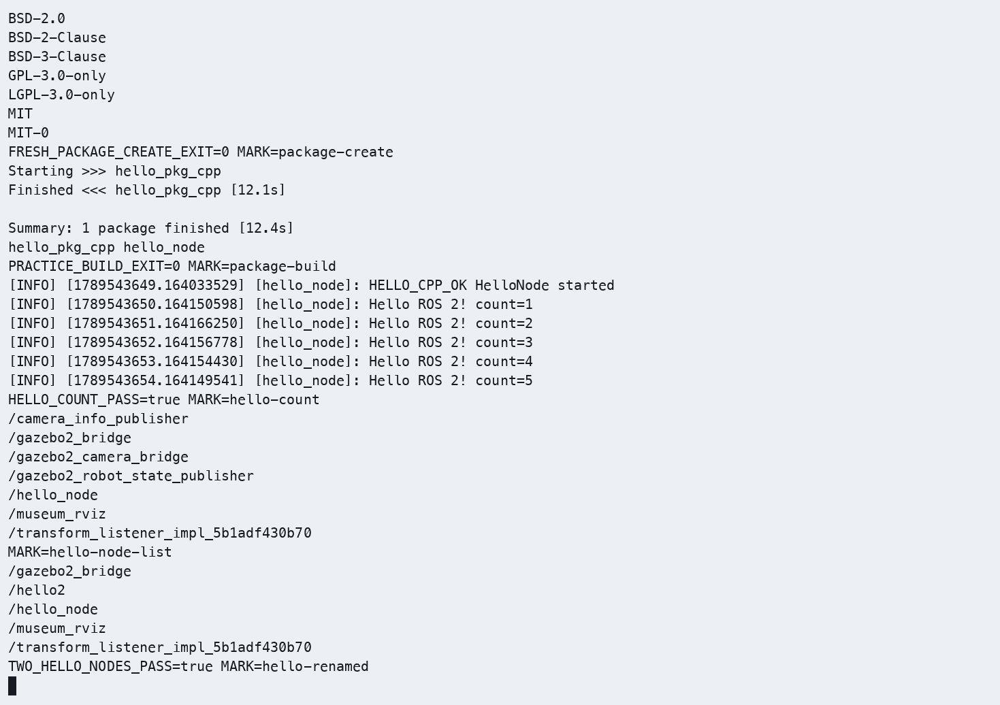
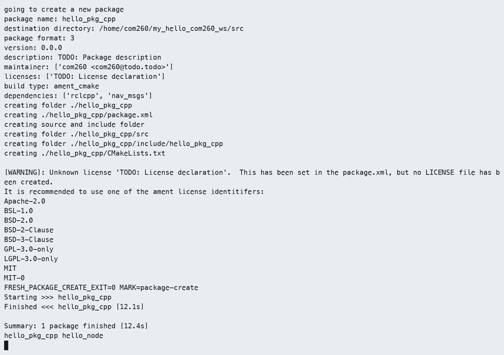

# 第2章：ROS 2 核心编程基础

> **课程**：ROS 2 C++17 编程
> **章节**：第2章  
> **课时**：2 课时（90 分钟）  
> **教学方式**：讲授 + 演示  

连接与双端环境见[公共环境](../lab_manuals_k3_com260_kit/ch00_common_setup.md)。节点与编译命令在 COM260 执行，Gazebo、rqt 和 RViz 在 x86 Humble 课程容器执行。

---

## 2.1 创建 C++ 包与节点

### 知识点 2.1.1：ROS 2 C++17 包结构

ROS 2 C++17 包使用 ament_cmake 构建系统，标准目录结构如下：

```text
my_robot_pkg/                     # 包根目录
├── package.xml                   # 包元数据和依赖
├── CMakeLists.txt                # 编译与安装规则
├── src/
│   └── my_node.cpp               # C++ 节点代码
├── launch/
│   └── demo.launch.py            # ROS 2 Launch 文件
└── test/                         # 测试代码
```

图 2-1：ROS 2 C++17 包的标准目录结构。

先在独立目录创建包，再按下文填写三个文件；已有同名目录时先核对并保留。

【COM260 板端】

```bash
source ~/.config/ros2-course-com260/env.bash
mkdir -p ~/my_robot_com260_ws/src
cd ~/my_robot_com260_ws/src
ros2 pkg create my_robot_pkg --build-type ament_cmake --dependencies rclcpp std_msgs
mkdir -p my_robot_pkg/launch
```

### 知识点 2.1.2：package.xml 配置

```xml
<?xml version="1.0"?>
<package format="3">
  <name>my_robot_pkg</name>
  <version>0.1.0</version>
  <description>My first ROS 2 C++ package</description>
  <maintainer email="student@example.com">Student Name</maintainer>
  <license>Apache-2.0</license>
  <buildtool_depend>ament_cmake</buildtool_depend>
  <depend>rclcpp</depend>
  <depend>std_msgs</depend>
  <test_depend>ament_copyright</test_depend>
  <test_depend>ament_lint_auto</test_depend>
  <export><build_type>ament_cmake</build_type></export>
</package>
```

### 知识点 2.1.3：CMakeLists.txt 编译与安装入口

```cmake
cmake_minimum_required(VERSION 3.10)
project(my_robot_pkg)
find_package(ament_cmake REQUIRED)
find_package(rclcpp REQUIRED)
find_package(std_msgs REQUIRED)
add_executable(my_node src/my_node.cpp)
target_compile_features(my_node PUBLIC cxx_std_17)
ament_target_dependencies(my_node rclcpp std_msgs)
install(TARGETS my_node DESTINATION lib/${PROJECT_NAME})
install(DIRECTORY launch DESTINATION share/${PROJECT_NAME})
ament_package()
```

> **注意**：`add_executable` 创建可执行目标，`install(TARGETS ... DESTINATION lib/${PROJECT_NAME})` 将其安装到 `ros2 run` 查找的位置。

### 知识点 2.1.4：官方要点——包的结构与创建

官方 Creating a package 教程指出，一个 ROS 2 包是可编译、可安装、可分享的最小单元，C++ 包的典型结构包括 `package.xml`（包元数据与依赖声明）与 `CMakeLists.txt`（编译与安装规则）。创建方式为 `ros2 pkg create my_pkg --build-type ament_cmake --dependencies rclcpp`，其中 `--dependencies` 会把依赖提前写入 `package.xml`。

教程特别强调两点实践规范：第一，`package.xml` 中的 `depend` 标签必须与实际包含头文件和链接库的依赖一致，否则在纯二进制安装环境中会因缺少依赖而无法运行；第二，C++ 包在 `CMakeLists.txt` 中使用 `add_executable` 和 `install(TARGETS ...)` 声明编译及安装入口。这与本章 2.1-2.2 节示范的模板一致，Articulated Robotics 的视频教程还演示了 `--symlink-install` 带来的符号链接安装效果；C++ 源码修改后仍须重新编译。

---

## 2.2 编写第一个 ROS 2 C++17 节点

### 知识点 2.2.1：最小节点模板

```cpp
#include <chrono>
#include <memory>
#include "rclcpp/rclcpp.hpp"

class MyFirstNode : public rclcpp::Node
{
public:
  MyFirstNode() : Node("my_first_node")
  {
    timer_ = create_wall_timer(std::chrono::seconds(1), [this]() {
      RCLCPP_INFO(get_logger(), "Hello ROS 2! Count: %d", ++count_);
    });
    RCLCPP_INFO(get_logger(), "节点已启动！");
  }
private:
  int count_{0};
  rclcpp::TimerBase::SharedPtr timer_;
};

int main(int argc, char ** argv)
{
  rclcpp::init(argc, argv);
  auto node = std::make_shared<MyFirstNode>();
  rclcpp::spin(node);
  node.reset();
  rclcpp::shutdown();
  return 0;
}
```

程序 2-1：ROS 2 C++17 最小节点模板。`main` 函数遵循"初始化→创建→spin→销毁→关闭"的标准流程。

### 知识点 2.2.2：节点名称与命名空间

```cpp
// 方式 1：直接创建带命名空间的节点
// 所需头文件：<memory> 和 "rclcpp/rclcpp.hpp"
auto newnode = std::make_shared<rclcpp::Node>("node_name", "my_ns");

// 方式 2：命令行重映射
// ros2 run my_robot_pkg my_node --ros-args -r __ns:=/new_ns -r __node:=new_name

// 方式 3：在派生类构造函数中指定
class MyNode : public rclcpp::Node
{
public:
  MyNode() : Node("node_name", "my_ns") {}
};
```

> **命名规则**：节点名称只能包含字母、数字和下划线，不能包含空格。
> 完整节点标识 = `{namespace}/{node_name}`，如 `/my_ns/node_name`。

### 知识点 2.2.3：日志系统

ROS 2 提供分级日志系统，优先级从低到高：

| 日志级别 | C++ API | 用途 |
|---------|-----------|------|
| DEBUG | `RCLCPP_DEBUG(get_logger(), ...)` | 调试信息（默认不输出） |
| INFO | `RCLCPP_INFO(get_logger(), ...)` | 一般信息 |
| WARN | `RCLCPP_WARN(get_logger(), ...)` | 警告信息 |
| ERROR | `RCLCPP_ERROR(get_logger(), ...)` | 错误信息 |
| FATAL | `RCLCPP_FATAL(get_logger(), ...)` | 致命错误 |

```cpp
// 日志级别通过运行参数设置：--ros-args --log-level DEBUG
// 以下语句放在节点成员函数中。
RCLCPP_INFO_THROTTLE(get_logger(), *get_clock(), 1000,
  "此消息每秒最多输出一次");
RCLCPP_INFO_ONCE(get_logger(), "此消息只输出一次");
```

### 知识点 2.2.4：官方要点——编写并运行节点、重映射与命名空间

官方以 `talker`/`listener` 为例演示最小节点：节点类继承自 `Node`，在构造函数中 `create_publisher`，再用 `create_wall_timer` 驱动周期发布；运行方式为 `ros2 run demo_nodes_cpp talker`。教程同步展示 `ros2 node list --no-daemon --spin-time 10` 与 `ros2 node info <node>` 的用法——后者能显示节点的订阅者/发布者列表、服务端与客户端，是日后排查节点间「连不上」问题的第一工具。QoS 配置另用 `ros2 topic info --verbose <话题>` 查看。

CLI Tools 教程的多篇页面（Understanding ROS 2 nodes 等）详细解释了三件事：一是节点名（Node Name）与可执行文件名是两回事，同一可执行文件可通过重映射生成多个节点实例；二是 `--ros-args -r __ns:=/sensor` 与 `__node:=new_name` 分别用于命名空间与节点名重映射，重映射后话题名会受命名空间影响；三是命名空间影响相对话题和服务名称，但不隔离 DDS 域或绝对话题，同名节点会使 CLI 查询和管理产生歧义，应使用不同名称。

这些机制在 DDS 层面体现为：每个节点在发现阶段广播自己的参与者信息，RMW 层将其映射为实体；`ros2 node list --no-daemon --spin-time 10` 之所以能跨命名空间列出全部节点，正是因为发现机制是全局的。理解这一层，对后续章节的多机器人仿真与分布式部署大有裨益。

---

## 2.3 开发工具链

### 知识点 2.3.1：命令行工具

```bash
# 构建与运行
cd ~/my_robot_com260_ws
python3 -m colcon build --packages-select my_robot_pkg --symlink-install
source install/setup.bash
ros2 run my_robot_pkg my_node

# 查看节点
ros2 node list --no-daemon --spin-time 10                          # 列出所有节点
ros2 node info /my_first_node           # 查看节点详情

# 查看话题
ros2 topic list                         # 列出所有话题
ros2 topic echo /topic_name             # 监听话题消息
ros2 topic info /topic_name             # 查看话题信息
ros2 topic hz /topic_name               # 查看话题频率

# 查看包信息
ros2 pkg list                           # 列出所有包
ros2 pkg xml my_robot_pkg               # 查看包 XML
```

### 知识点 2.3.2：rqt_graph 可视化

```bash
# 启动 rqt_graph 可视化节点通信图
rqt_graph
# 或通过 ros2 命令启动
ros2 run rqt_graph rqt_graph
```

图 2-2：rqt_graph 界面示意图，安装命令为 `sudo apt install ros-humble-rqt-graph`。图中椭圆表示节点，矩形表示话题，连线表示发布/订阅关系，选择「Nodes/Topics (all)」可以查看完整的通信图。

### 知识点 2.3.3：RViz2 可视化

```bash
# 启动 RViz2
rviz2
# 或指定配置文件
rviz2 -d /path/to/config.rviz
```

图 2-3：RViz2 界面布局，安装命令为 `sudo apt install ros-humble-rviz2`。其中左侧面板为 Displays（显示项配置），可添加 RobotModel、TF、LaserScan 等显示项；右侧面板为 Views（视图控制），支持 Orbit、TopDownOrtho 等多种视角。

### 知识点 2.3.4：官方要点——生命周期节点实现（进阶）

官方 Concepts 与 ros2/examples 提供了生命周期节点的最小实现：继承 `rclcpp_lifecycle::LifecycleNode`，重写 `on_configure`、`on_activate`、`on_deactivate` 等回调，即可响应外部状态迁移请求。CLI 侧使用 `ros2 lifecycle get /node` 查询状态、`ros2 lifecycle set /node configure` 触发迁移。

The Construct 的课程将生命周期节点与「系统准备就绪」需求关联讲解：在启动阶段只有全部组件进入 Active 状态后，导航等任务级应用才允许发送控制指令。这与第1章 1.4 节演示的生命周期状态机及截图输出逐状态对应，建议读者对照官方 C++ lifecycle talker 示例重写一遍状态回调。

---

## 2.4 本章小结

本章的核心知识点包括六个方面：ROS 2 C++17 包标准结构包含 package.xml（元数据）、CMakeLists.txt（编译与安装入口）和源码目录；CMake 的目标与安装规则将 C++ 源码构建为 ROS 2 可执行命令；节点遵循"init → create_node → spin → destroy → shutdown"的生命周期；日志系统提供 DEBUG/INFO/WARN/ERROR/FATAL 五个级别，支持节流和一次性输出；`ros2 node/cli/topic/pkg` 命令行工具是调试 ROS 2 系统的核心手段；rqt_graph 可视化节点通信拓扑，RViz2 可视化机器人传感器和执行器数据。

---

## 2.5 练习题

**练习 2.1**：创建一个名为 `hello_pkg_cpp` 的 ROS 2 C++17 包，包含一个名为 `hello_node` 的节点，每秒输出一句问候语。3.1

**练习 2.2**：修改练习 2.1 的节点，添加日志级别参数 `--ros-args --log-level DEBUG`，观察不同日志级别的输出差异。

**练习 2.3**：运行两个 `hello_node` 节点，使用 `--ros-args -r __node:=hello2` 重命名第二个节点，用 `ros2 node list --no-daemon --spin-time 10` 验证。

（从3.2里改）ros2 run hello_pkg_cpp hello_node
ros2 run hello_pkg_cpp hello_node --ros-args -r __node:=hello2
ros2 node list --no-daemon --spin-time 10



**练习 2.4**：使用 `ros2 node info` 查看 talker 节点的发布者和订阅者信息，画出其通信拓扑图。3.3

**练习 2.5**：启动 `demo_nodes_cpp talker` 和 `listener`，使用 rqt_graph 可视化节点通信关系。3.3

**练习 2.6**：安装并启动 RViz2，加载默认配置，认识 RViz2 的显示面板和视角控制。3.3

---

## 仿真结合实例（当前仓库）：在 Gazebo 仿真中运行自己的 C++ 节点

### 目标与知识点对应

第2章讲解如何创建 C++ 包、用 CMake 注册可执行节点，并通过 `ros2 node list` 和 `ros2 node info` 与 RViz2 观察节点。这里我们在运行时复用 `robot_sim_demo` 启动的 Gazebo 仿真，然后**自行创建并运行一个 C++ 节点**，订阅仿真发布的 `/scan`，验证"用 `ros2 run` 启动自己的节点、被 DDS 自动发现"这一套开发流程。

### 运行命令

【x86 课程容器，终端 1】

```bash
source /opt/ros/humble/setup.bash
source /workspace/install/setup.bash

# 终端 1：启动 Gazebo 仿真（无界面更省资源）
ros2 launch robot_sim_demo gazebo2.launch.py gui:=false rviz:=false drive:=false
```

【COM260】另开终端运行 `demo_nodes_cpp` 自带的 C++ 节点来体会节点发现与重命名（对应练习 2.3）：

```bash
source ~/.config/ros2-course-com260/env.bash
source ~/ros2_course_com260_ws/install/setup.bash
ros2 run demo_nodes_cpp listener
```

【COM260】再开一个终端并加载同样环境，查询持续运行中的节点：

```bash
ros2 node list --no-daemon --spin-time 10          # 会看到 listener 以及其他仿真节点
ros2 node info /listener
```

【COM260，独立练习工作空间】创建一个实际订阅 `/scan` 的包。该示例使用 `my_first_pkg/my_node`，与第一章练习目录分开；本轮使用 `~/my_scan_com260_ws`。目录已存在时先核对内容，保留已有练习。

```bash
source ~/.config/ros2-course-com260/env.bash
mkdir -p ~/my_scan_com260_ws/src
cd ~/my_scan_com260_ws/src
ros2 pkg create my_first_pkg --build-type ament_cmake \
  --dependencies rclcpp sensor_msgs
```

将以下完整程序写入 `my_first_pkg/src/my_node.cpp`：

```cpp
#include <memory>
#include "rclcpp/rclcpp.hpp"
#include "sensor_msgs/msg/laser_scan.hpp"

class ScanNode : public rclcpp::Node
{
public:
  ScanNode() : Node("my_node")
  {
    subscription_ = create_subscription<sensor_msgs::msg::LaserScan>(
      "/scan", rclcpp::SensorDataQoS(),
      [this](sensor_msgs::msg::LaserScan::ConstSharedPtr message) {
        RCLCPP_INFO_THROTTLE(get_logger(), *get_clock(), 1000,
          "SCAN_RECEIVED ranges=%zu frame=%s", message->ranges.size(),
          message->header.frame_id.c_str());
      });
  }
private:
  rclcpp::Subscription<sensor_msgs::msg::LaserScan>::SharedPtr subscription_;
};

int main(int argc, char ** argv)
{
  rclcpp::init(argc, argv);
  auto node = std::make_shared<ScanNode>();
  rclcpp::spin(node);
  node.reset();
  rclcpp::shutdown();
  return 0;
}
```

`my_first_pkg/CMakeLists.txt`：

```cmake
cmake_minimum_required(VERSION 3.10)
project(my_first_pkg)
find_package(ament_cmake REQUIRED)
find_package(rclcpp REQUIRED)
find_package(sensor_msgs REQUIRED)
add_executable(my_node src/my_node.cpp)
target_compile_features(my_node PUBLIC cxx_std_17)
ament_target_dependencies(my_node rclcpp sensor_msgs)
install(TARGETS my_node DESTINATION lib/${PROJECT_NAME})
ament_package()
```

```bash
cd ~/my_scan_com260_ws
python3 -m colcon build --packages-select my_first_pkg --symlink-install
source install/setup.bash
ros2 run my_first_pkg my_node
```

在另一 COM260 终端加载课程环境及这个练习工作空间，查询节点和订阅接口；测试重命名时保持第一个实例运行：

```bash
ros2 node info /my_node
ros2 run my_first_pkg my_node --ros-args -r __node:=my_node2
# 在第三个同环境终端查询两个实例。
ros2 node list --no-daemon --spin-time 10
```

观察 `SCAN_RECEIVED` 的扫描数组长度及帧名，最后在两个节点终端分别 Ctrl+C。`demo_nodes_cpp/listener` 订阅的是 `/chatter`，不能用它证明 `/scan` 订阅成功。

### 需要观察到的现象

运行上述命令后应重点观察三类现象：其一，`ros2 node list --no-daemon --spin-time 10` 中，你自己的节点和仿真节点（`gazebo2_robot_state_publisher` 等）在同一 DDS 域内被自动发现，无需任何中心节点；其二，`ros2 node info /listener` 显示其订阅关系，`ros2 node info /my_node` 显示真实 `/scan` 订阅，节点日志持续输出 `SCAN_RECEIVED`；其三，用 `--ros-args -r __node:=my_node2` 运行副本，验证命名空间/节点重映射（对应 2.2.2 节）。

### 源码与相关位置

`src_k3_pico_itx/robot_sim_demo/launch/gazebo2.launch.py` 是仿真启动入口；节点包模板与 `CMakeLists.txt` 见 2.1-2.2 节示例，真实 `/scan` 话题由 `src_k3_pico_itx/robot_sim_demo/config/gazebo2_bridge.yaml` 桥接发布。

> 本轮传感器订阅和同域节点发现的结果见 [本章运行证据](../lab_manuals_k3_com260_kit/runtime_evidence.md#ch02) 中 `/scan` 的桥接证据。



---

学习材料：
- ROS 2 Documentation (Humble) —— Creating a package：https://docs.ros.org/en/humble/Tutorials/Beginner-Client-Libraries/Creating-Your-First-ROS2-Package.html
- ROS 2 Documentation (Humble) —— Writing a simple publisher and subscriber (C++)：https://docs.ros.org/en/humble/Tutorials/Beginner-Client-Libraries/Writing-A-Simple-Cpp-Publisher-And-Subscriber.html
- ROS 2 Documentation (Humble) —— Understanding ROS 2 nodes：https://docs.ros.org/en/humble/Tutorials/Beginner-CLI-Tools/Understanding-ROS2-Nodes.html
- ROS 2 Documentation (Humble) —— About Lifecycle Nodes：https://docs.ros.org/en/humble/Concepts/About-Lifecycle-Nodes.html
- ROS 2 官方示例包 ros2/examples（含 lifecycle 示例）：https://github.com/ros2/examples
- The Construct —— ROS 2 Basics in 5 Days：https://www.theconstructsim.com/
- Articulated Robotics —— ROS 2 Basics 系列视频：https://www.youtube.com/@ArticulatedRobotics