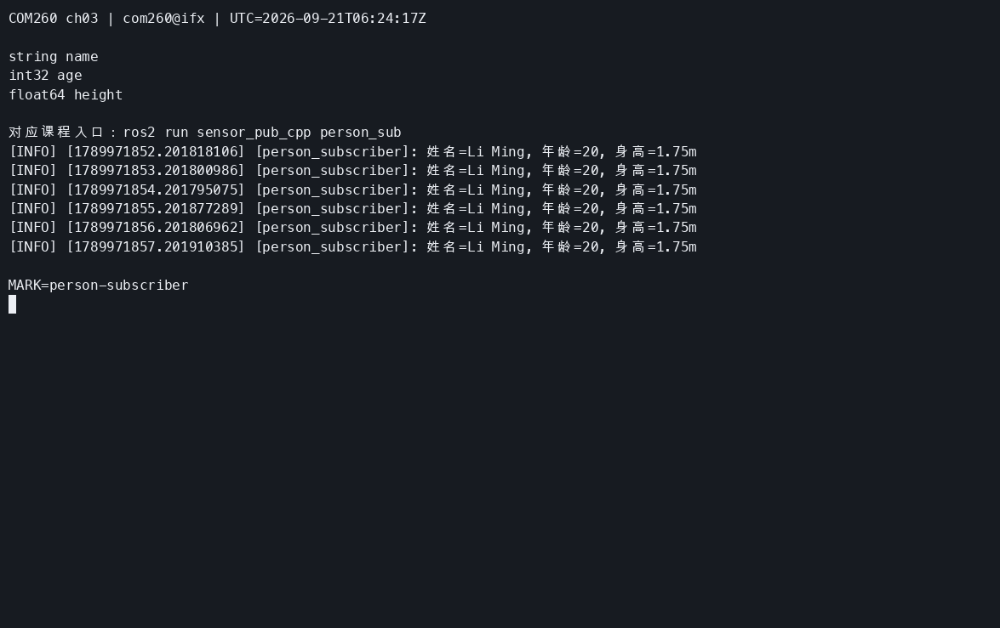
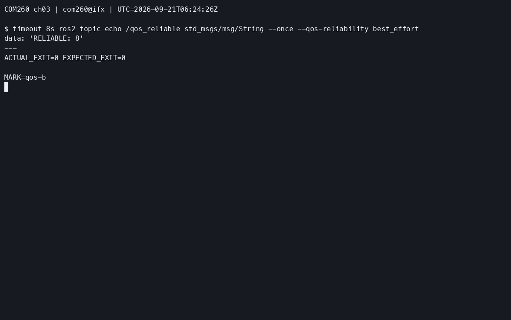
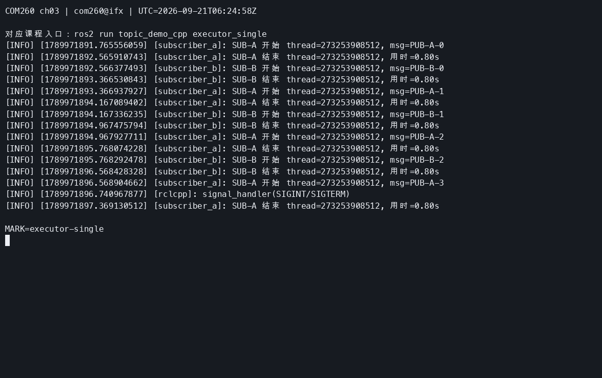
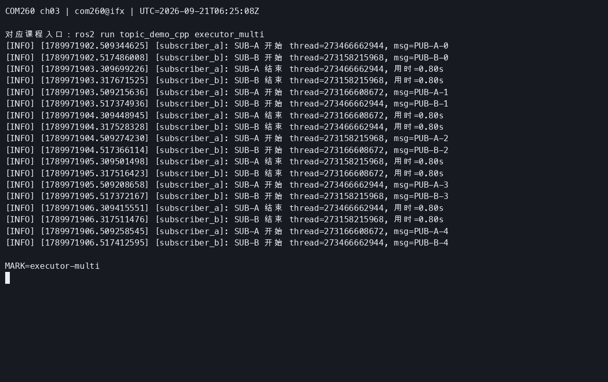

# 第3章：话题通信（Topics）

> **课程**：ROS 2 C++17 编程
> **章节**：第3章<br>
> **课时**：2 课时（90 分钟）<br>
> **教学方式**：讲授 + 演示<br>

连接、环境与分工见[公共环境](../lab_manuals_k3_com260_kit/ch00_common_setup.md)。本章节点在 COM260 运行，GUI 在 x86 课程容器运行；SensorData 与 Person 发布者使用独立 `sensor_pub_cpp` 包。

---

## 3.1 发布-订阅模型原理

### 知识点 3.1.1：话题通信架构

话题通信是 ROS 2 中最基本的通信方式，采用**异步、多对多**的发布-订阅模式：

```
Publisher 1 ─────┐
                 ├──►  Topic: "/camera/image"  ──► Subscriber A
Publisher 2 ─────┘                                  Subscriber B
                                                    Subscriber C
```

图 3-1：话题通信的多对多发布-订阅模型。发布者与订阅者完全解耦，互不知晓对方的存在。

### 知识点 3.1.2：C++ Publisher API

```cpp
#include <chrono>
#include <memory>
#include <string>
#include "rclcpp/rclcpp.hpp"
#include "std_msgs/msg/string.hpp"

class TalkerNode : public rclcpp::Node
{
public:
  TalkerNode() : Node("talker")
  {
    publisher_ = create_publisher<std_msgs::msg::String>("chatter", 10);
    timer_ = create_wall_timer(std::chrono::milliseconds(500), [this]() {
      std_msgs::msg::String message;
      message.data = "Hello ROS 2: " + std::to_string(count_++);
      publisher_->publish(message);
      RCLCPP_INFO(get_logger(), "发布: %s", message.data.c_str());
    });
  }
private:
  int count_{0};
  rclcpp::Publisher<std_msgs::msg::String>::SharedPtr publisher_;
  rclcpp::TimerBase::SharedPtr timer_;
};
int main(int argc, char ** argv)
{
  rclcpp::init(argc, argv);
  rclcpp::spin(std::make_shared<TalkerNode>());
  rclcpp::shutdown();
  return 0;
}
```

程序 3-1：C++ Publisher 完整示例。`create_publisher` 的三个核心参数：模板参数中的消息类型，以及话题名称、QoS 队列深度。

### 知识点 3.1.3：C++ Subscriber API

```cpp
#include <memory>
#include "rclcpp/rclcpp.hpp"
#include "std_msgs/msg/string.hpp"

class ListenerNode : public rclcpp::Node
{
public:
  ListenerNode() : Node("listener")
  {
    subscription_ = create_subscription<std_msgs::msg::String>("chatter", 10,
      [this](std_msgs::msg::String::ConstSharedPtr message) {
        RCLCPP_INFO(get_logger(), "收到: %s", message->data.c_str());
      });
  }
private:
  rclcpp::Subscription<std_msgs::msg::String>::SharedPtr subscription_;
};
int main(int argc, char ** argv)
{
  rclcpp::init(argc, argv);
  rclcpp::spin(std::make_shared<ListenerNode>());
  rclcpp::shutdown();
  return 0;
}
```

将上述两个完整程序分别保存为 `teacher_talker.cpp` 和 `teacher_listener.cpp`，加入 ament_cmake 构建目标；本章参考包已注册同名入口，两个 COM260 终端加载课程环境后分别运行 `ros2 run topic_demo_cpp teacher_talker` 和 `ros2 run topic_demo_cpp teacher_listener`。这些 String 示例与核心 `Gps` 示例的 `talker` / `listener` 分开命名。

程序 3-2：C++ Subscriber 完整示例。`create_subscription` 的本示例的回调参数为 `std_msgs::msg::String::ConstSharedPtr msg`，`msg` 为消息共享指针。

### 知识点 3.1.4：官方要点——编写发布者与订阅者

官方发布/订阅教程的 talker/listener 是核心范例：发布端用 `create_publisher<std_msgs::msg::String>("topic", 10)` 创建发布者，`create_wall_timer(std::chrono::milliseconds(500), timer_callback)` 以 0.5 秒周期发布；订阅端用 `create_subscription<std_msgs::msg::String>("topic", 10, listener_callback)` 注册回调。这里需要注意：回调参数为共享指针，保存共享指针副本可以延长消息生命周期；不要保存脱离所有权的悬空引用。`String` 属于 `std_msgs`，自定义类型需要在接口包中定义（见 3.3 节）。

初学者最常见的错误是把 定时器写成 while 循环加 `std::this_thread::sleep_for`——这会导致节点阻塞、无法处理回调，官方教程通过「timer_callback + spin」的模式强调回调驱动的编程范式。对比 Python 版本（`rclpy`）可以体会到，相同话题两端可用不同语言实现，跨语言互通是 ROS 2 中间件层的天然能力。

---

## 3.2 标准消息类型

### 知识点 3.2.1：常用标准消息

ROS 2 提供丰富的标准消息类型，按功能包分类：

```
std_msgs/                 # 基础类型
├── String                # 字符串 (data: string)
├── Int32, Int64          # 整数
├── Float32, Float64      # 浮点数
├── Bool                  # 布尔值
├── Empty                 # 空消息（用作信号）
└── Header                # 标准头 (stamp: time, frame_id: string)

sensor_msgs/              # 传感器消息
├── Image                 # 图像（rgb, depth）
├── LaserScan             # 激光雷达扫描
├── PointCloud2           # 3D 点云
├── Imu                   # IMU 数据
└── Joy                   # 手柄数据

geometry_msgs/            # 几何消息
├── Twist                 # 速度指令 (linear + angular)
├── Pose                  # 位姿 (position + orientation)
├── Vector3               # 三维向量
└── Quaternion            # 四元数
```

### 知识点 3.2.2：查看消息定义

```bash
# 查看消息类型定义
ros2 interface show std_msgs/msg/String
# 输出：string data

ros2 interface show geometry_msgs/msg/Twist
# 输出：
# Vector3 linear
#   float64 x
#   float64 y
#   float64 z
# Vector3 angular
#   float64 x
#   float64 y
#   float64 z

# 查看消息属性
ros2 interface proto std_msgs/msg/String
# 输出："data: ''\n"
```

### 知识点 3.2.3：官方要点——话题模型与命令行工具

官方 Understanding ROS 2 topics 教程以小乌龟记乌龟位置为例说明：话题（Topic）是节点之间传递消息的通道，消息类型是通信双方的唯一协议，发布者与订阅者互不知晓对方存在。Articulated Robotics 用「广播电台」作类比——发布者只负责播音，订阅者只负责收听，频道（话题名）与节目单（消息类型）必须一致才能收到内容。

教程要求掌握的话题命令与本章 3.2 节完全一致：`ros2 topic list -t`（含类型）、`ros2 topic echo`（查看消息流）、`ros2 topic info`（查看发布/订阅计数与 QoS）、`ros2 topic hz`（测频率）、`ros2 topic bw`（测带宽）。其中 `info -v` 输出的 QoS 行是排查「订阅不到数据」问题的关键——RELIABLE 发布者与 BEST_EFFORT 订阅者兼容，而 BEST_EFFORT 发布者无法满足 RELIABLE 订阅者的要求，这正是本章练习 3.5 的实验动机。

---

## 3.3 自定义消息接口

### 知识点 3.3.1：创建自定义 .msg 文件

自定义消息接口需要单独创建一个包（仅支持 CMake 构建）：

```
custom_interfaces/
├── CMakeLists.txt
├── package.xml
└── msg/
    └── SensorData.msg     # 自定义消息定义文件
```

```cmake
# CMakeLists.txt 关键配置
cmake_minimum_required(VERSION 3.8)
project(custom_interfaces)

find_package(rosidl_default_generators REQUIRED)

# 声明消息文件
rosidl_generate_interfaces(${PROJECT_NAME}
  "msg/SensorData.msg"
)
```

```text
# msg/SensorData.msg 内容
float64 temperature    # 温度 (℃)
float64 humidity       # 湿度 (%)
float64 pressure       # 气压 (hPa)
string device_id       # 设备ID
```

### 知识点 3.3.2：在 C++ 中使用自定义消息

```cpp
// package.xml: <depend>custom_interfaces</depend>
// CMakeLists.txt: find_package(custom_interfaces REQUIRED)，并加入目标依赖
#include "custom_interfaces/msg/sensor_data.hpp"

// 在节点成员函数中创建并发布自定义消息
custom_interfaces::msg::SensorData message;
message.temperature = 25.5;
message.humidity = 60.0;
message.pressure = 1013.25;
message.device_id = "sensor_01";
publisher_->publish(message);
```

### 知识点 3.3.3：官方要点——自定义消息类型与接口包

官方 Creating custom msg and srv files 教程以自定义消息为例，演示完整的接口包工作流：在 `msg/` 目录编写 `.msg` 文件（如 `Person.msg`：`string name, int32 age, float64 height`（本章已确认类型）），在 `package.xml` 声明 `rosidl_default_generators` 依赖，在 `CMakeLists.txt` 调用 `rosidl_generate_interfaces()`，编译后即可用 `ros2 interface show` 查看、生成供其他包包含的 C++ 消息头文件。

值得注意的是，ROS 2 的接口定义语言（IDL）支持默认值、数组与嵌套类型，`.msg` 中还允许引用其他接口包的类型（如 `geometry_msgs/Point position`）。这与本章 3.3 节及练习 3.3 自定义 `Person.msg` 的流程一致；Articulated Robotics 强调接口包应单独建包、独立编译，使多个功能包复用同一接口；接口变更后，依赖它的功能包仍需重新构建。

---

## 3.4 QoS 配置实战

### 知识点 3.4.1：QoS 兼容性规则

```
           Publisher ╲ Subscriber │ RELIABLE │ BEST_EFFORT
           ───────────────────────┼──────────┼─────────────
           RELIABLE               │    ✓     │     ✓
           BEST_EFFORT            │    ✗     │     ✓
```

图 3-2：QoS Reliability 兼容性矩阵。Publisher 的可靠级别必须 >= Subscriber 的可靠级别。

### 知识点 3.4.2：C++ 中配置 QoS

```cpp
// 节点成员函数中使用；包含 rclcpp/rclcpp.hpp、sensor_msgs/msg/image.hpp
// 和 sensor_msgs/msg/laser_scan.hpp，并声明相应发布者、订阅者成员。
publisher_ = create_publisher<sensor_msgs::msg::Image>(
  "camera/image", rclcpp::SensorDataQoS());

auto custom_qos = rclcpp::QoS(rclcpp::KeepLast(5))
  .best_effort().durability_volatile();
subscription_ = create_subscription<sensor_msgs::msg::LaserScan>(
  "scan", custom_qos,
  [this](sensor_msgs::msg::LaserScan::ConstSharedPtr message) {callback(message);});
```

### 知识点 3.4.3：官方要点——QoS 深入：可靠性、历史深度与生命周期

官方 About QoS 页面定义了五类策略：可靠性（Reliability，RELIABLE 保证送达/BEST_EFFORT 尽力而为）、历史记录（History，KEEP_LAST + depth 队列长度或 KEEP_ALL）、持久性（Durability，消息是否在节点迟到时补发）、期限（Deadline）与活跃度（Liveness）。ROS 2 还公开预置了三种默认档案：`sensor_data`（BEST_EFFORT + KEEP_LAST(5)，适合激光、图像）、`system_default`（使用 RMW 的系统默认策略）、`params`（参数用）。

The Construct 的课程用「电话通话 vs 对讲机」比喻两种可靠性：控制指令像电话需要保证接通（RELIABLE），传感器流像对讲机一条条播报，丢一条接着听（BEST_EFFORT）。`Incompatible QoS policies` 表示存在不兼容策略；单独出现丢消息提示也可能来自队列积压或网络丢包，不能直接判定 QoS 不兼容——`ros2 topic info -v` 可直接查看双方的 QoS 详情用于排障。

---

## 3.5 多线程执行器与回调组

### 知识点 3.5.1：执行器类型

```cpp
// 两种执行器分别运行，node 是已经创建的节点 shared_ptr。
rclcpp::executors::SingleThreadedExecutor single;
single.add_node(node);
single.spin();

// 另一次运行使用 4 个工作线程。
rclcpp::executors::MultiThreadedExecutor multi(rclcpp::ExecutorOptions(), 4);
multi.add_node(node);
multi.spin();
```

### 知识点 3.5.2：回调组

```cpp
// 在节点构造函数中创建，并将回调组保存为类成员。
group1_ = create_callback_group(rclcpp::CallbackGroupType::MutuallyExclusive);
group2_ = create_callback_group(rclcpp::CallbackGroupType::Reentrant);
rclcpp::SubscriptionOptions options;
options.callback_group = group2_;
subscription_ = create_subscription<sensor_msgs::msg::Image>("camera", 10,
  [this](sensor_msgs::msg::Image::ConstSharedPtr message) {callback(message);}, options);
```

---

## 3.6 本章小结

本章的核心知识点包括六个方面：话题通信采用异步多对多的发布-订阅模型，发布者与订阅者完全解耦；`create_publisher<Msg>(topic, qos)` 创建发布者，`create_subscription<Msg>(topic, qos, callback)` 创建订阅者；ROS 2 提供丰富的标准消息类型（std_msgs、sensor_msgs、geometry_msgs 等）；自定义消息接口需要在独立的 CMake 包中定义 .msg 文件；QoS 兼容性取决于可靠性策略，RELIABLE 发布者可与 BEST_EFFORT 订阅者通信，反之不行；多线程执行器和回调组可实现并行消息处理，提高吞吐量。

---

## 3.7 练习题

**练习 3.1**：编写 Publisher 节点发布 Twist 消息控制机器人运动，包含线速度和角速度设置。

**练习 3.2**：编写 Subscriber 节点订阅 /cmd_vel 话题，打印收到的速度指令。

完整参考实现为 `src_k3_com260_kit/topic_demo_cpp/src/cmd_vel_subscriber.cpp`。在 COM260 新终端加载课程环境后运行 `ros2 run topic_demo_cpp cmd_vel_subscriber`；练习 3.1 使用 `square_driver` 发布的 Twist，观察线速度、角速度及最终零速度。


**练习 3.3**：创建一个自定义消息接口包，定义包含姓名、年龄、身高字段的 Person.msg。

**练习 3.4**：基于 Person.msg 编写发布者和订阅者节点。



按确认的接口类型，在 `sensor_interfaces/msg/Person.msg` 写入：

```text
string name
int32 age
float64 height
```

在接口包的 `rosidl_generate_interfaces()` 文件列表中添加 `"msg/Person.msg"`。

创建 `sensor_pub_cpp/src/person_publisher.cpp`：

```cpp
#include <chrono>
#include <memory>

#include "rclcpp/rclcpp.hpp"
#include "sensor_interfaces/msg/person.hpp"

class PersonPublisher : public rclcpp::Node
{
public:
  PersonPublisher() : Node("person_publisher")
  {
    publisher_ = create_publisher<sensor_interfaces::msg::Person>("/person_info", 10);
    timer_ = create_wall_timer(std::chrono::seconds(1), [this]() {
      sensor_interfaces::msg::Person message;
      message.name = "Li Ming";
      message.age = 20;
      message.height = 1.75;
      publisher_->publish(message);
      RCLCPP_INFO(get_logger(), "发布: %s", message.name.c_str());
    });
  }

private:
  rclcpp::Publisher<sensor_interfaces::msg::Person>::SharedPtr publisher_;
  rclcpp::TimerBase::SharedPtr timer_;
};

int main(int argc, char ** argv)
{
  rclcpp::init(argc, argv);
  rclcpp::spin(std::make_shared<PersonPublisher>());
  rclcpp::shutdown();
  return 0;
}
```

创建 `sensor_pub_cpp/src/person_subscriber.cpp`：

```cpp
#include <memory>

#include "rclcpp/rclcpp.hpp"
#include "sensor_interfaces/msg/person.hpp"

class PersonSubscriber : public rclcpp::Node
{
public:
  PersonSubscriber() : Node("person_subscriber")
  {
    subscription_ = create_subscription<sensor_interfaces::msg::Person>(
      "/person_info", 10, [this](sensor_interfaces::msg::Person::ConstSharedPtr message) {
        RCLCPP_INFO(get_logger(), "姓名=%s, 年龄=%d, 身高=%.2fm",
          message->name.c_str(), message->age, message->height);
      });
  }

private:
  rclcpp::Subscription<sensor_interfaces::msg::Person>::SharedPtr subscription_;
};

int main(int argc, char ** argv)
{
  rclcpp::init(argc, argv);
  rclcpp::spin(std::make_shared<PersonSubscriber>());
  rclcpp::shutdown();
  return 0;
}
```

在 `sensor_pub_cpp/CMakeLists.txt` 的 `ament_package()` 前添加：

```cmake
add_executable(person_pub src/person_publisher.cpp)
target_compile_features(person_pub PUBLIC cxx_std_17)
ament_target_dependencies(person_pub rclcpp sensor_interfaces)
add_executable(person_sub src/person_subscriber.cpp)
target_compile_features(person_sub PUBLIC cxx_std_17)
ament_target_dependencies(person_sub rclcpp sensor_interfaces)
install(TARGETS person_pub person_sub DESTINATION lib/${PROJECT_NAME})
```

检查、编译与运行：

```bash
source ~/.config/ros2-course-com260/env.bash
source ~/my_topics_com260_ws/install/setup.bash
cd ~/my_topics_com260_ws
python3 -m colcon build --packages-select sensor_interfaces sensor_pub_cpp --symlink-install
source install/setup.bash
ros2 interface show sensor_interfaces/msg/Person
# COM260 终端 1
ros2 run sensor_pub_cpp person_sub
# COM260 终端 2：同样加载环境后执行
ros2 run sensor_pub_cpp person_pub
```

**练习 3.5**：测试 RELIABLE 和 BEST_EFFORT 兼容性，验证不同 QoS 组合下的通信结果。



·B
终端1
ros2 run topic_demo_cpp qos_publisher
终端2
ros2 topic echo /qos_reliable --qos-reliability best_effort

**练习 3.6**：使用 MultiThreadedExecutor 同时运行 2 个 Publisher + 2 个 Subscriber，验证并发性能。

创建 `topic_demo_cpp/src/multi_topic_demo.cpp`：

```cpp
#include <chrono>
#include <memory>
#include <sstream>
#include <string>
#include <thread>
#include <vector>

#include "rclcpp/rclcpp.hpp"
#include "std_msgs/msg/string.hpp"

class DemoPublisher : public rclcpp::Node
{
public:
  DemoPublisher(const std::string & name, const std::string & topic,
    const std::string & label)
  : Node(name), label_(label)
  {
    publisher_ = create_publisher<std_msgs::msg::String>(topic, 10);
    timer_ = create_wall_timer(std::chrono::seconds(1), [this]() {
      std_msgs::msg::String message;
      message.data = label_ + "-" + std::to_string(count_++);
      publisher_->publish(message);
    });
  }

private:
  std::string label_;
  int count_{0};
  rclcpp::Publisher<std_msgs::msg::String>::SharedPtr publisher_;
  rclcpp::TimerBase::SharedPtr timer_;
};

class DemoSubscriber : public rclcpp::Node
{
public:
  DemoSubscriber(const std::string & name, const std::string & topic,
    const std::string & label)
  : Node(name), label_(label)
  {
    group_ = create_callback_group(rclcpp::CallbackGroupType::Reentrant);
    rclcpp::SubscriptionOptions options;
    options.callback_group = group_;
    subscription_ = create_subscription<std_msgs::msg::String>(topic, 10,
      [this](std_msgs::msg::String::ConstSharedPtr message) {
        std::ostringstream thread;
        thread << std::this_thread::get_id();
        const auto start = std::chrono::steady_clock::now();
        RCLCPP_INFO(get_logger(), "%s 开始 thread=%s, msg=%s",
          label_.c_str(), thread.str().c_str(), message->data.c_str());
        std::this_thread::sleep_for(std::chrono::milliseconds(800));
        const double elapsed = std::chrono::duration<double>(
          std::chrono::steady_clock::now() - start).count();
        RCLCPP_INFO(get_logger(), "%s 结束 thread=%s, 用时=%.2fs",
          label_.c_str(), thread.str().c_str(), elapsed);
      }, options);
  }

private:
  std::string label_;
  rclcpp::CallbackGroup::SharedPtr group_;
  rclcpp::Subscription<std_msgs::msg::String>::SharedPtr subscription_;
};

int main(int argc, char ** argv)
{
  rclcpp::init(argc, argv);
  std::vector<rclcpp::Node::SharedPtr> nodes{
    std::make_shared<DemoPublisher>("publisher_a", "/multi_a", "PUB-A"),
    std::make_shared<DemoPublisher>("publisher_b", "/multi_b", "PUB-B"),
    std::make_shared<DemoSubscriber>("subscriber_a", "/multi_a", "SUB-A"),
    std::make_shared<DemoSubscriber>("subscriber_b", "/multi_b", "SUB-B")};
#ifdef USE_MULTI_EXECUTOR
  rclcpp::executors::MultiThreadedExecutor executor(rclcpp::ExecutorOptions(), 4);
#else
  rclcpp::executors::SingleThreadedExecutor executor;
#endif
  for (const auto & node : nodes) {
    executor.add_node(node);
  }
  executor.spin();
  rclcpp::shutdown();
  return 0;
}
```

在 `topic_demo_cpp/CMakeLists.txt` 的 `ament_package()` 前添加两个入口，使用同一份演示源码：

先确认 `topic_demo_cpp/package.xml` 已有 `<depend>std_msgs</depend>`；仅在缺少时添加，避免重复声明。

```cmake
find_package(std_msgs REQUIRED)
add_executable(executor_single src/multi_topic_demo.cpp)
target_compile_features(executor_single PUBLIC cxx_std_17)
ament_target_dependencies(executor_single rclcpp std_msgs)
add_executable(executor_multi src/multi_topic_demo.cpp)
target_compile_features(executor_multi PUBLIC cxx_std_17)
target_compile_definitions(executor_multi PRIVATE USE_MULTI_EXECUTOR)
ament_target_dependencies(executor_multi rclcpp std_msgs)
install(TARGETS executor_single executor_multi DESTINATION lib/${PROJECT_NAME})
```

检查并编译：

```bash
cd ~/my_topics_com260_ws
python3 -m colcon build --packages-select topic_demo_cpp --symlink-install
source install/setup.bash
```

先运行单线程：

ros2 run topic_demo_cpp executor_single



再运行多线程：

ros2 run topic_demo_cpp executor_multi



另开终端验证四个节点：
ros2 node list
应包含：
/publisher_a
/publisher_b
/subscriber_a
/subscriber_b

---

## 仿真结合实例（当前仓库）：订阅 Gazebo 机器人话题验证发布-订阅模型

### 目标与知识点对应

第3章讲解 Publisher/Subscriber 的异步多对多模型、自定义消息与 QoS。这里使用 `robot_sim_demo` 启动的 Gazebo 仿真作为真实数据源，订阅底盘的 `/cmd_vel`、里程计 `/odom`、激光雷达 `/scan`，直接观察"仿真 → Bridge → ROS 2 话题 → 你自己的订阅节点"这条链路，把第3章的 API 应用到真实传感器数据。

### 运行命令

【x86 主机，终端 1】沿用第三章实验的仿真实例；如果尚未启动：

```bash
bash ~/ROS2_RISCV_COM260/course_support/k3_com260_kit/scripts/x86-gazebo.bash start-ch03 ch03-course
```

【COM260，终端 2】查看传感器话题（对应 3.2 节 ros2 topic 工具）：

```bash
source ~/.config/ros2-course-com260/env.bash
ros2 node list --no-daemon --spin-time 8
ros2 topic list
ros2 topic echo /odom nav_msgs/msg/Odometry --once
ros2 topic info /scan --verbose
ros2 topic hz /camera/image_raw --spin-time 10
```

【COM260，终端 3】运行完整扫描订阅程序：

```bash
source ~/.config/ros2-course-com260/env.bash
ros2 run topic_demo_cpp scan_subscriber
```

默认 `drive:=false`。先在静止时核对消息，再按实验 3.4 运行方形控制器观察 `/odom` 变化；同一时刻只运行一个 `/cmd_vel` 控制发布者。Ctrl+C 停止查询／订阅节点，最后在 COM260 发布零速度，并在 x86 用相同 RUN_ID 停止容器。

在自己创建的订阅节点（参考 3.1.3 节 `ListenerNode` 模板）中订阅 `/scan`，把 `sensor_msgs/msg/LaserScan` 的 `angle_min`/`angle_max`/`ranges` 长度打印出来：

```cpp
subscription_ = create_subscription<sensor_msgs::msg::LaserScan>(
  "/scan", rclcpp::SensorDataQoS(),
  [this](sensor_msgs::msg::LaserScan::ConstSharedPtr message) {
    RCLCPP_INFO(get_logger(), "angle_min=%.3f angle_max=%.3f ranges=%zu",
      message->angle_min, message->angle_max, message->ranges.size());
  });
```

### 需要观察到的现象

运行上述命令后应重点观察三类现象：其一，`/odom` 的 `position.x/y` 随时间变化（或在 `drive:=false` 时基本为 0），体现发布的持续消息流；其二，`ros2 topic info /scan` 显示 `sensor_msgs/msg/LaserScan` 与 "Publisher count: 1"，由 `gazebo2_bridge` 桥接（发布端来自 Gazebo 侧）；其三，你的订阅节点回调不断打印扫描帧，与 `ros2 topic hz` 测到的频率一致，验证 QoS 深度和传感器高频话题的订阅关系。

### 源码与相关位置

仿真入口位于 `src_k3_pico_itx/robot_sim_demo/launch/gazebo2.launch.py`；桥接话题配置位于 `src_k3_pico_itx/robot_sim_demo/config/gazebo2_bridge.yaml`（含 `/scan`、`/odom`、`/tf`、`/clock`）；相机内参发布器位于 `src_k3_pico_itx/robot_sim_demo/src/camera_info_publisher.cpp`（`/camera/camera_info`）；巡航驱动示例（订阅/发布 Twist 逻辑）位于 `src_k3_pico_itx/robot_sim_demo/robot_sim_demo/patrol_driver.py`。

> 说明：`/scan` 等话题的桥接证据见 [本章运行证据](../lab_manuals_k3_com260_kit/runtime_evidence.md#ch03)。


---

学习材料：
- ROS 2 Documentation (Humble) —— Understanding ROS 2 topics：https://docs.ros.org/en/humble/Tutorials/Beginner-CLI-Tools/Understanding-ROS2-Topics.html
- ROS 2 Documentation (Humble) —— Writing a simple publisher and subscriber (C++)：https://docs.ros.org/en/humble/Tutorials/Beginner-Client-Libraries/Writing-A-Simple-Cpp-Publisher-And-Subscriber.html
- ROS 2 Documentation (Humble) —— About Quality of Service settings：https://docs.ros.org/en/humble/Concepts/About-Quality-of-Service-Settings.html
- ROS 2 Documentation (Humble) —— Creating custom msg and srv files：https://docs.ros.org/en/humble/Tutorials/Beginner-Client-Libraries/Custom-ROS2-Interfaces.html
- The Construct —— ROS 2 Basics in 5 Days：https://www.theconstructsim.com/
- Articulated Robotics —— ROS 2 Basics 系列视频：https://www.youtube.com/@ArticulatedRobotics