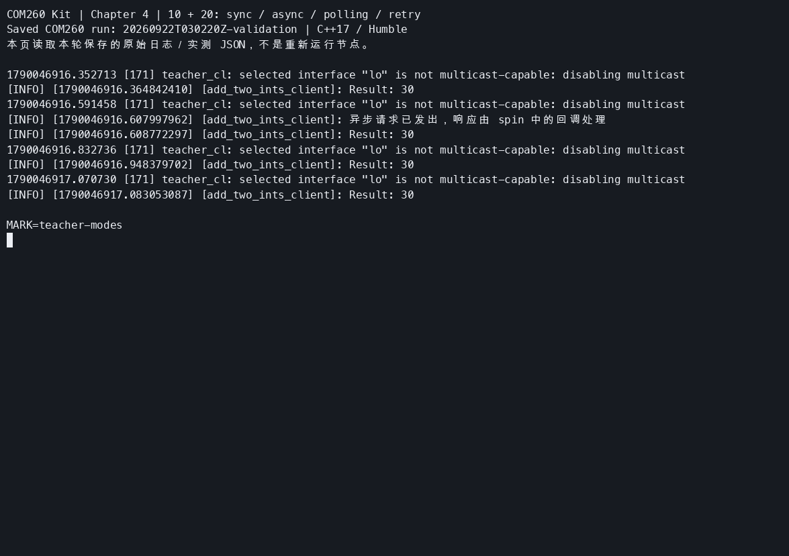
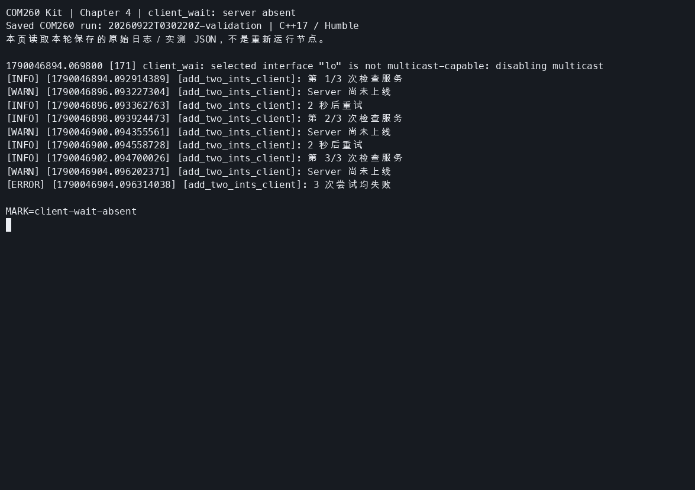
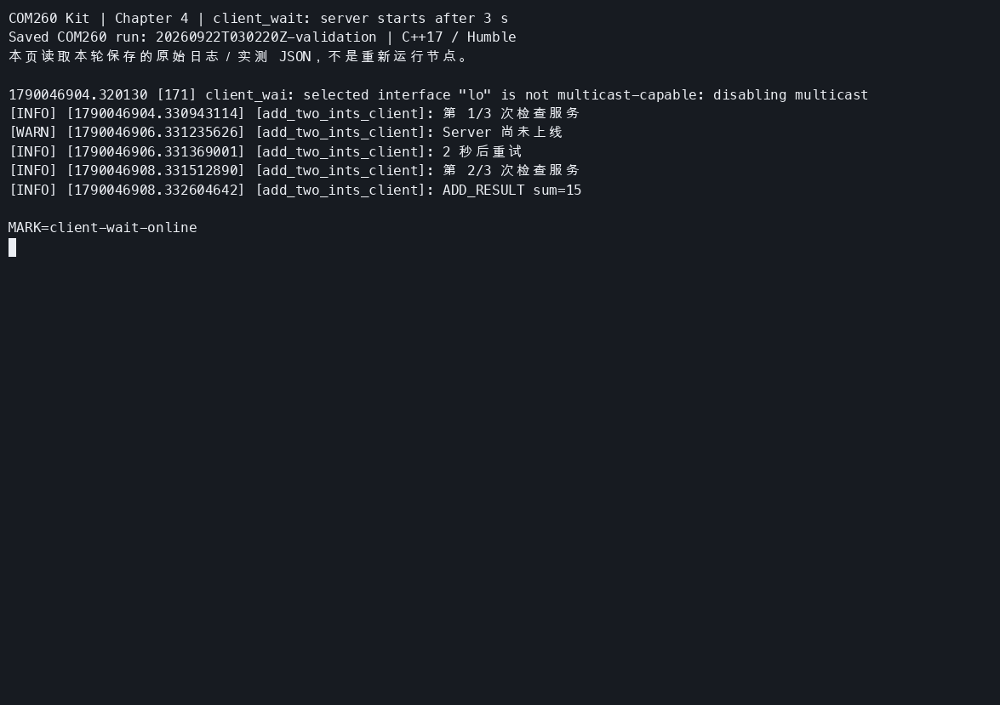
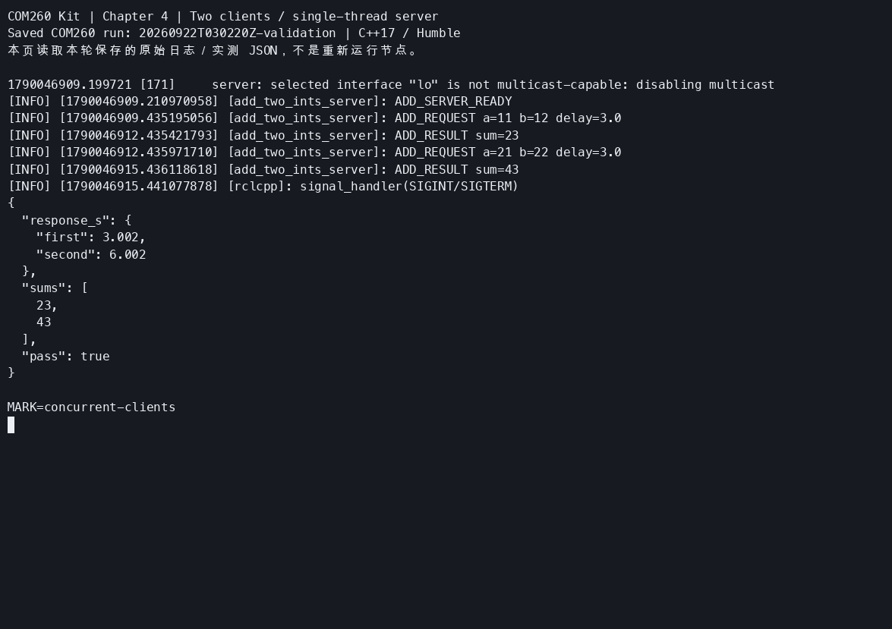

# 第4章：服务通信（Services）

> **课程**：ROS 2 C++17 编程
> **章节**：第4章<br>
> **课时**：2 课时（90 分钟）<br>
> **教学方式**：讲授 + 演示<br>

连接和双端分工见[公共环境](../lab_manuals_k3_com260_kit/ch00_common_setup.md)。服务和客户端在 COM260 执行；Gazebo 在 x86 Humble 课程容器执行。跨机运行需按[公共环境的单播配置步骤](../lab_manuals_k3_com260_kit/ch00_common_setup.md#dds-unicast)为两端课程终端设置对端。

---

## 4.1 请求-响应模型

### 知识点 4.1.1：服务通信架构

服务通信采用 **请求-响应** 模式，客户端可以同步等待或异步处理响应，适用于需要立即获取结果的一次性操作：

```
Client                                   Server
  │                                         │
  │ ──── Request (call_id, args) ────────►  │
  │                                         │ process_request()
  │ ◄──── Response (call_id, result) ────   │
  │                                         │
```

图 4-1：服务通信请求-响应时序图。一个 Server 可以接收多个 Client 的请求；是否并行执行取决于 Executor 与 Callback Group。本章单线程服务端逐个执行回调。

### 知识点 4.1.2：服务接口定义 (.srv 文件)

```text
# example_interfaces/srv/AddTwoInts
int64 a
int64 b
---
int64 sum
```

> 分隔线 `---` 上方定义 **Request** 字段，下方定义 **Response** 字段。

### 知识点 4.1.3：C++ Server API

```cpp
#include <memory>
#include "rclcpp/rclcpp.hpp"
#include "example_interfaces/srv/add_two_ints.hpp"
using AddTwoInts = example_interfaces::srv::AddTwoInts;

class AddTwoIntsServer : public rclcpp::Node
{
public:
  AddTwoIntsServer() : Node("add_two_ints_server")
  {
    service_ = create_service<AddTwoInts>("add_two_ints",
      [this](const AddTwoInts::Request::SharedPtr request,
        AddTwoInts::Response::SharedPtr response) {
        response->sum = request->a + request->b;
        RCLCPP_INFO(get_logger(), "收到请求: %ld + %ld = %ld",
          request->a, request->b, response->sum);
      });
  }
private:
  rclcpp::Service<AddTwoInts>::SharedPtr service_;
};

int main(int argc, char ** argv)
{
  rclcpp::init(argc, argv);
  rclcpp::spin(std::make_shared<AddTwoIntsServer>());
  rclcpp::shutdown();
  return 0;
}
```

程序 4-1：可独立编译的 Service Server 示例（`teacher_server.cpp`）。按已确认的修正，标准 AddTwoInts 响应仅含 `sum`；原文误写的 `message` 字段已改为日志说明。

### 知识点 4.1.4：C++ Client API

```cpp
#include <chrono>
#include <cstdint>
#include <future>
#include <iostream>
#include <memory>
#include <string>

#include "example_interfaces/srv/add_two_ints.hpp"
#include "rclcpp/rclcpp.hpp"

using AddTwoInts = example_interfaces::srv::AddTwoInts;
using namespace std::chrono_literals;

class AddTwoIntsClient : public rclcpp::Node
{
public:
  AddTwoIntsClient() : Node("add_two_ints_client")
  {
    client_ = create_client<AddTwoInts>("add_two_ints");
  }

  bool wait_for_service()
  {
    while (rclcpp::ok() && !client_->wait_for_service(1s)) {
      RCLCPP_INFO(get_logger(), "等待服务上线...");
    }
    return rclcpp::ok();
  }

  int run_sync()
  {
    auto future = client_->async_send_request(request());
    if (rclcpp::spin_until_future_complete(shared_from_this(), future, 5s) ==
      rclcpp::FutureReturnCode::SUCCESS)
    {
      RCLCPP_INFO(get_logger(), "Result: %ld", future.get()->sum);
      return 0;
    }
    client_->remove_pending_request(future);
    RCLCPP_ERROR(get_logger(), "服务调用超时或中断");
    return 1;
  }

  void send_request_async()
  {
    client_->async_send_request(request(),
      [this](rclcpp::Client<AddTwoInts>::SharedFuture future) {
        try {
          RCLCPP_INFO(get_logger(), "Result: %ld", future.get()->sum);
          async_result_ = 0;
        } catch (const std::exception & error) {
          RCLCPP_ERROR(get_logger(), "调用失败: %s", error.what());
        }
        rclcpp::shutdown();
      });
    RCLCPP_INFO(get_logger(), "异步请求已发出，响应由 spin 中的回调处理");
  }

  int run_timeout()
  {
    auto future = client_->async_send_request(request());
    const auto start = std::chrono::steady_clock::now();
    while (rclcpp::ok()) {
      rclcpp::spin_some(shared_from_this());
      if (future.wait_for(100ms) == std::future_status::ready) {
        RCLCPP_INFO(get_logger(), "Result: %ld", future.get()->sum);
        return 0;
      }
      if (std::chrono::steady_clock::now() - start > 5s) {
        RCLCPP_ERROR(get_logger(), "服务调用超时！");
        client_->remove_pending_request(future);
        return 1;
      }
    }
    client_->remove_pending_request(future);
    return 1;
  }

  int run_retry()
  {
    for (int attempt = 0; attempt < 3; ++attempt) {
      if (client_->wait_for_service(2s) && run_sync() == 0) {
        return 0;
      }
      RCLCPP_WARN(get_logger(), "重试 %d/%d...", attempt + 1, 3);
    }
    RCLCPP_ERROR(get_logger(), "所有重试均失败！");
    return 1;
  }

  int async_result() const {return async_result_;}

private:
  static AddTwoInts::Request::SharedPtr request()
  {
    auto message = std::make_shared<AddTwoInts::Request>();
    message->a = 10;
    message->b = 20;
    return message;
  }

  rclcpp::Client<AddTwoInts>::SharedPtr client_;
  int async_result_{1};
};

int main(int argc, char ** argv)
{
  const std::string mode = argc == 1 ? "sync" : argv[1];
  if (argc > 2 || (mode != "sync" && mode != "async" && mode != "timeout" && mode != "retry")) {
    std::cerr << "Usage: teacher_client [sync|async|timeout|retry]\n";
    return 2;
  }
  rclcpp::init(argc, argv);
  auto node = std::make_shared<AddTwoIntsClient>();
  int result = 1;
  if (mode == "retry") {
    result = node->run_retry();
  } else if (node->wait_for_service()) {
    if (mode == "sync") {
      result = node->run_sync();
    } else if (mode == "timeout") {
      result = node->run_timeout();
    } else {
      node->send_request_async();
      rclcpp::spin(node);
      result = node->async_result();
    }
  }
  if (rclcpp::ok()) {rclcpp::shutdown();}
  return result;
}
```

程序 4-2：完整客户端 `teacher_client.cpp`。使用 `async_send_request` 发送异步请求，返回 future；四种模式对应后续知识点，均以 10+20 演示。`sync`、`async`、`timeout` 先等待服务器上线，可用 Ctrl+C 中断等待；`retry` 的服务发现也受三次尝试限制。

若在独立练习工作区逐步编写，将上述完整示例分别保存为 `service_demo_lab_cpp/src/teacher_server.cpp` 和 `teacher_client.cpp`，再在该包 CMake 的 `ament_package()` 前添加：

```cmake
add_executable(teacher_server src/teacher_server.cpp)
target_compile_features(teacher_server PUBLIC cxx_std_17)
ament_target_dependencies(teacher_server rclcpp example_interfaces)
add_executable(teacher_client src/teacher_client.cpp)
target_compile_features(teacher_client PUBLIC cxx_std_17)
ament_target_dependencies(teacher_client rclcpp example_interfaces)
install(TARGETS teacher_server teacher_client DESTINATION lib/${PROJECT_NAME})
```

随后在 `~/my_services_com260_ws` 执行 `python3 -m colcon build --packages-select service_demo_lab_cpp` 并加载 `install/setup.bash`。课程参考包已包含这些入口，不重复添加。

同名 `/add_two_ints` 服务只保留一个 Server；切换示例前先在旧服务端终端按 Ctrl+C。

完成[第四章构建](../lab_manuals_k3_com260_kit/ch00_common_setup.md#ch04)后，在 COM260 两个终端分别执行：

```bash
source ~/.config/ros2-course-com260/env.bash
ros2 run service_demo_lab_cpp teacher_server
```

```bash
source ~/.config/ros2-course-com260/env.bash
ros2 run service_demo_lab_cpp teacher_client sync
ros2 run service_demo_lab_cpp teacher_client async
ros2 run service_demo_lab_cpp teacher_client timeout
ros2 run service_demo_lab_cpp teacher_client retry
```

正常应均返回 `Result: 30`。


后续代码块是这个完整客户端的对应方法，不能单独作为一个源文件编译。同步等待函数应在未被其他 Executor 管理的节点上调用，不直接放入已有 `spin` 的回调中。

### 知识点 4.1.5：官方要点——服务模型与命令行工具

官方 Understanding ROS 2 services 以小乌龟的 `/spawn`、`/clear`、`/set_pen` 等服务为例说明：服务（Service）是一种请求-响应通信模式，适合「查询状态、触发一次性动作」这类短任务，与长时程的任务型动作（Action）形成互补。教程要求掌握 `ros2 service list`（列出服务）、`ros2 service type`（查询类型）、`ros2 service find`（按类型找服务）与 `ros2 service call`（命令行直接调用）。

命令行调用是调试服务端最快捷的手段：`ros2 service call /spawn turtlesim/srv/Spawn "{x: 2.0, y: 2.0, theta: 0.0, name: ''}"` 会立即生成一只新乌龟——不写一行代码即可验证服务端逻辑。Articulated Robotics 强调：服务适合「一问一答」；如果任务耗时数秒且有进度，就该改用第 5 章的动作通信。

### 知识点 4.1.6：官方要点——自定义服务消息与接口包

Creating custom msg and srv files 教程补充了 `.srv` 文件的写法：文件内用 `---` 分隔请求（上半部分）与响应（下半部分），例如 `int64 a\nint64 b\n---\nint64 sum`。这与本章 4.1.2 节 `.srv` 文件的定义方式一致。接口包编译后即可被服务端与客户端共同引用，跨包引用其他包定义的类型（如 `sensor_msgs/Image`）也在此教程中示范。

一个实用细节：接口类型定义改动后，所有依赖它的包都必须重新 `python3 -m colcon build`，否则运行时会出现「接口不匹配」的隐晦错误。因此本课程将接口放在独立包中，并在接口修改后重新构建依赖包。

---

## 4.2 同步调用 vs 异步调用

### 知识点 4.2.1：同步调用

```cpp
  int run_sync()
  {
    auto future = client_->async_send_request(request());
    if (rclcpp::spin_until_future_complete(shared_from_this(), future, 5s) ==
      rclcpp::FutureReturnCode::SUCCESS)
    {
      RCLCPP_INFO(get_logger(), "Result: %ld", future.get()->sum);
      return 0;
    }
    client_->remove_pending_request(future);
    RCLCPP_ERROR(get_logger(), "服务调用超时或中断");
    return 1;
  }
```

### 知识点 4.2.2：异步调用

```cpp
  void send_request_async()
  {
    client_->async_send_request(request(),
      [this](rclcpp::Client<AddTwoInts>::SharedFuture future) {
        try {
          RCLCPP_INFO(get_logger(), "Result: %ld", future.get()->sum);
          async_result_ = 0;
        } catch (const std::exception & error) {
          RCLCPP_ERROR(get_logger(), "调用失败: %s", error.what());
        }
        rclcpp::shutdown();
      });
    RCLCPP_INFO(get_logger(), "异步请求已发出，响应由 spin 中的回调处理");
  }
```

### 知识点 4.2.3：官方要点——编写 Service 与 Client

官方服务教程以 add_two_ints 为例：服务端构造 `create_service<AddTwoInts>("add_two_ints", callback)`，回调接收请求与响应指针，并填充响应；客户端构造 `create_client` 后先 `wait_for_service(2s)` 等待服务上线，再 `async_send_request(request)` 发起异步调用，最后用 `spin_until_future_complete` 等待结果。服务端尚未被发现时，请求可能无法得到响应，而不是保证立即报错；先等待服务可用，再发送请求并设置等待上限。

官方还演示了在回调中记日志的规范写法：服务回调运行在 `spin` 的执行线程内，复杂工作应移到独立线程或使用 Action，避免阻塞其他回调——这一点与本章 4.2 节关于同步/异步调用阻塞行为的说明完全对应。

---

## 4.3 服务超时与重试机制

### 知识点 4.3.1：超时处理

```cpp
  int run_timeout()
  {
    auto future = client_->async_send_request(request());
    const auto start = std::chrono::steady_clock::now();
    while (rclcpp::ok()) {
      rclcpp::spin_some(shared_from_this());
      if (future.wait_for(100ms) == std::future_status::ready) {
        RCLCPP_INFO(get_logger(), "Result: %ld", future.get()->sum);
        return 0;
      }
      if (std::chrono::steady_clock::now() - start > 5s) {
        RCLCPP_ERROR(get_logger(), "服务调用超时！");
        client_->remove_pending_request(future);
        return 1;
      }
    }
    client_->remove_pending_request(future);
    return 1;
  }
```

程序 4-3：服务调用超时处理模式。`remove_pending_request` 释放本地未决记录，不会取消服务器回调；重试有副作用的服务前需考虑幂等性。

验证轮询超时：停止 `teacher_server`，改为运行 `ros2 run service_demo_lab_cpp server --ros-args -p delay_sec:=6.0`，再执行 `teacher_client timeout`，约 5 秒后应退出 1。这里 6 秒仅用于触发教案的 5 秒超时；实验 4.3 仍保留服务延迟 3 秒、客户端超时 1 秒。

### 知识点 4.3.2：重试机制

```cpp
  int run_retry()
  {
    for (int attempt = 0; attempt < 3; ++attempt) {
      if (client_->wait_for_service(2s) && run_sync() == 0) {
        return 0;
      }
      RCLCPP_WARN(get_logger(), "重试 %d/%d...", attempt + 1, 3);
    }
    RCLCPP_ERROR(get_logger(), "所有重试均失败！");
    return 1;
  }
```

### 知识点 4.3.3：官方要点——调用模式与容错实践

rclcpp 客户端库文档系统介绍了 Future 的用法：`async_send_request` 返回的 Future 可在 `async_send_request` 的回调参数中处理完成结果，也可以配合 `spin_until_future_complete` 阻塞等待。在真实机器人系统中，服务端可能未启动、网络可能抖动，因此工程实践普遍要求在调用侧实现「超时 + 重试 + 降级」三层容错：第一层是超时，`spin_until_future_complete(node, future, timeout)` 超过时限即放弃（对应本章 4.3.1 节的超时处理）；第二层是重试，对超时或网络错误进行有限次退避重试（对应 4.3.2 节的 `run_retry`）；第三层是降级，多次失败后切换到备用策略（如本地默认值），避免任务中断。

可将本章练习 4.5 的并发测试与上述模式结合，观察服务端在并发请求下的行为。

---

## 4.4 本章小结

本章围绕服务通信总结了六个要点：Client 发送 Request，Server 返回 Response；`.srv` 文件以 `---` 分隔两部分；Server 使用 `create_service<ServiceT>(name, callback)`，回调填写响应；Client 使用 `create_client<ServiceT>(name)` 和 `async_send_request()`；同步等待使用 `spin_until_future_complete()`，异步响应通过 `async_send_request()` 的回调参数处理，并由 `spin` 执行；调用方需要有限超时和重试，并区分本地等待结束与远端任务取消。

---

## 4.5 练习题

**练习 4.1**：基于 `example_interfaces/srv/AddTwoInts` 编写 Server 和 Client 节点，验证加法功能。

**练习 4.2**：设计一个 `.srv` 文件 `WeatherQuery.srv`（输入：城市名 string，输出：温度 float64 + 天气 string），实现查询服务。

**练习 4.3**：测试服务超时：Client 设置 1 秒超时，Server 处理时间设为 3 秒，观察超时行为。

**练习 4.4**：编写带重试机制的 Client，当 Server 不在线时自动重试 3 次。

新建 `client_wait.cpp`：

保留原章每次等待服务 2 秒、响应等待 5 秒、最多 3 次及间隔 2 秒的行为。它与上面的教案 `retry` 模式区别在于增加了每次尝试间的 2 秒间隔。完整参考代码如下：
```cpp
#include <cerrno>
#include <chrono>
#include <cstdint>
#include <cstdlib>
#include <iostream>
#include <memory>
#include <thread>

#include "example_interfaces/srv/add_two_ints.hpp"
#include "rclcpp/rclcpp.hpp"

using namespace std::chrono_literals;

bool parse_integer(const char * text, std::int64_t & value)
{
  errno = 0;
  char * end = nullptr;
  const long long parsed = std::strtoll(text, &end, 10);
  if (errno == ERANGE || end == text || *end != '\0') {
    return false;
  }
  value = static_cast<std::int64_t>(parsed);
  return true;
}

class AddWaitClient : public rclcpp::Node
{
public:
  AddWaitClient()
  : Node("add_two_ints_client")
  {
    client_ = create_client<example_interfaces::srv::AddTwoInts>("add_two_ints");
  }

  int run(std::int64_t a, std::int64_t b)
  {
    for (int attempt = 1; attempt <= 3; ++attempt) {
      RCLCPP_INFO(get_logger(), "第 %d/3 次检查服务", attempt);
      if (client_->wait_for_service(2s)) {
        auto request = std::make_shared<example_interfaces::srv::AddTwoInts::Request>();
        request->a = a;
        request->b = b;
        auto future = client_->async_send_request(request);
        if (rclcpp::spin_until_future_complete(shared_from_this(), future, 5s) ==
          rclcpp::FutureReturnCode::SUCCESS)
        {
          try {
            RCLCPP_INFO(get_logger(), "ADD_RESULT sum=%ld", future.get()->sum);
            return 0;
          } catch (const std::exception & error) {
            RCLCPP_ERROR(get_logger(), "服务调用失败：%s", error.what());
          }
        } else {
          client_->remove_pending_request(future);
          RCLCPP_WARN(get_logger(), "等待服务响应超时");
        }
      } else {
        RCLCPP_WARN(get_logger(), "Server 尚未上线");
      }
      if (attempt < 3) {
        RCLCPP_INFO(get_logger(), "2 秒后重试");
        std::this_thread::sleep_for(2s);
      }
    }
    RCLCPP_ERROR(get_logger(), "3 次尝试均失败");
    return 1;
  }

private:
  rclcpp::Client<example_interfaces::srv::AddTwoInts>::SharedPtr client_;
};

int main(int argc, char ** argv)
{
  if (argc > 3) {
    std::cerr << "Usage: ros2 run service_demo_lab_cpp client_wait [a] [b]\n";
    return 2;
  }
  std::int64_t a = 5;
  std::int64_t b = 3;
  if ((argc > 1 && !parse_integer(argv[1], a)) ||
    (argc > 2 && !parse_integer(argv[2], b)))
  {
    std::cerr << "a and b must be integers\n";
    return 2;
  }
  rclcpp::init(argc, argv);
  auto node = std::make_shared<AddWaitClient>();
  const int result = node->run(a, b);
  rclcpp::shutdown();
  return result;
}
```
在 `service_demo_lab_cpp/CMakeLists.txt` 的 `ament_package()` 前注册入口（若该入口已存在则不重复添加）：

```cmake
add_executable(client_wait src/client_wait.cpp)
target_compile_features(client_wait PUBLIC cxx_std_17)
ament_target_dependencies(client_wait rclcpp example_interfaces)
install(TARGETS client_wait DESTINATION lib/${PROJECT_NAME})
```

编译：

```bash
cd ~/my_services_com260_ws
python3 -m colcon build --packages-select service_demo_lab_cpp --symlink-install
source install/setup.bash
```
先不启动 `server`，只启动 `client_wait`：

```bash
ros2 run service_demo_lab_cpp client_wait 5 10
```



再次启动 `client_wait`，在首次重试间隔内另开终端启动 `server`。若前一次客户端已退出，必须重新运行客户端。

```bash
source ~/.config/ros2-course-com260/env.bash
source ~/my_services_com260_ws/install/setup.bash
ros2 run service_demo_lab_cpp server --ros-args -p delay_sec:=0.0
```



**练习 4.5**：测试多个 Client 同时向同一个 Server 发送请求时的并发处理行为。

先以 `delay_sec:=3.0` 启动 `server`，再在两个终端近乎同时执行下列两次调用：

```bash
ros2 service call /add_two_ints example_interfaces/srv/AddTwoInts '{a: 11, b: 12}'
ros2 service call /add_two_ints example_interfaces/srv/AddTwoInts '{a: 21, b: 22}'
```

预期分别为 23 和 43；比较服务端请求和响应时间。当前实现单线程，第二个请求会排队，不能把两个客户端同时发起请求写成服务端并行执行。



**练习 4.6**：使用 `ros2 service call` 命令行调用服务，验证 Server 响应。

```bash
source ~/.config/ros2-course-com260/env.bash
ros2 service list
ros2 service type /add_two_ints
ros2 service find example_interfaces/srv/AddTwoInts
ros2 service call /add_two_ints example_interfaces/srv/AddTwoInts '{a: 5, b: 10}'
```

---

## 仿真结合实例（当前仓库）：服务节点与 Gazebo 巡检仿真并行运行

### 目标与知识点对应

服务适合执行一次性的请求-响应操作。本实例让服务客户端/服务器与 `robot_sim_demo` 处于同一个 ROS 2 图中：Gazebo 持续发布机器人传感器数据，服务节点完成一次任务请求，借此区分持续的 Topic 数据流和一次性的 Service 调用。

### 运行步骤

【COM260】服务端和客户端各开一个终端，先加载：

```bash
# COM260 服务终端环境
source ~/.config/ros2-course-com260/env.bash
source ~/ros2_course_com260_ws/install/setup.bash
```

【x86 主机，终端 1】按[第四章手册开头](../lab_manuals_k3_com260_kit/ch04_lab.md#运行步骤)启动带 `RUN_ID` 的 Gazebo；已启动则复用，保持 `drive:=false`。课程结束按手册停止本轮容器。

```bash
# 终端 2：启动服务端
ros2 run service_demo_cpp server
```

```bash
# 终端 3：查询服务并发送请求
ros2 service list | grep greetings
ros2 run service_demo_cpp client
```

### 观察结果

运行后应看到三类现象：`ros2 service list` 能发现 `/greetings`，客户端返回服务器的响应文本；Gazebo 仍独立发布 `/scan`、`/odom` 和 `/tf`，服务调用不会替代传感器话题；本章运行的是 COM260 C++ 服务节点。

### 源码与边界

服务实现位于 `src_k3_com260_kit/service_demo_cpp/src/server.cpp`、`src_k3_com260_kit/service_demo_cpp/src/client.cpp`；仿真入口位于 `src_k3_pico_itx/robot_sim_demo/launch/gazebo2.launch.py`。

该实例验证服务通信和仿真系统的并行集成；`/greetings` 是教学服务，不代表已经为 Gazebo 增加了业务服务接口。

跨机验证分别运行 COM260 Server → x86 Client、x86 Server → COM260 Client，请求均为 HAN／20；两端须使用相同 Humble 接口包、CycloneDDS 与 Domain 0。`/scan`、`/odom`、`/tf` 在调用前、调用期间和调用后均持续接收。完整步骤、返回值与实测记录见[第四章证据](../lab_manuals_k3_com260_kit/runtime_evidence.md#ch04)。


---

学习材料：
- ROS 2 Documentation (Humble) —— Understanding ROS 2 services：https://docs.ros.org/en/humble/Tutorials/Beginner-CLI-Tools/Understanding-ROS2-Services.html
- ROS 2 Documentation (Humble) —— Writing a simple service and client (C++)：https://docs.ros.org/en/humble/Tutorials/Beginner-Client-Libraries/Writing-A-Simple-Cpp-Service-And-Client.html
- ROS 2 Documentation (Humble) —— Creating custom msg and srv files：https://docs.ros.org/en/humble/Tutorials/Beginner-Client-Libraries/Custom-ROS2-Interfaces.html
- ROS 2 API 文档 —— rclcpp 客户端库：https://docs.ros.org/en/humble/p/rclcpp/generated/classrclcpp_1_1Client.html
- The Construct —— ROS 2 Basics in 5 Days：https://www.theconstructsim.com/
- Articulated Robotics —— ROS 2 Basics 系列视频：https://www.youtube.com/@ArticulatedRobotics
