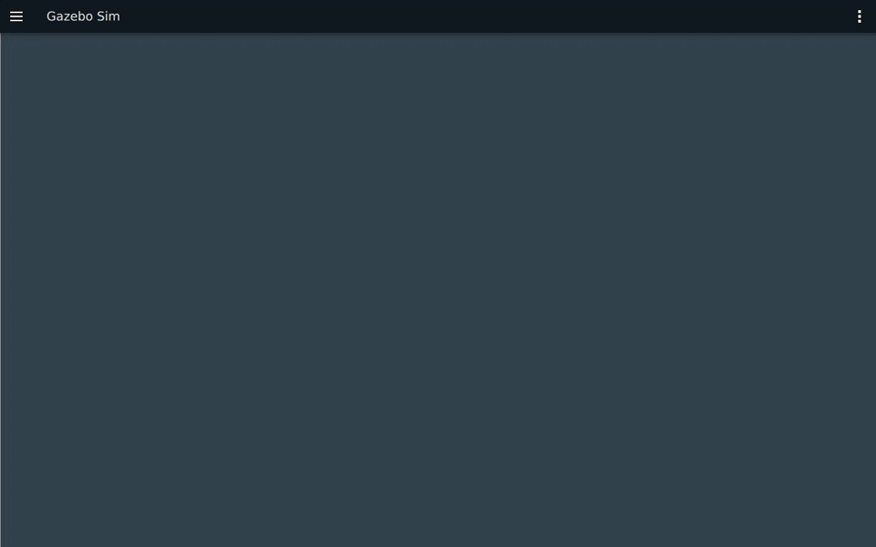

# 第5章：动作通信（Actions）

> **课程**：ROS 2 C++17 编程<br>
> **章节**：第5章<br>
> **课时**：2 课时（90 分钟）<br>
> **教学方式**：讲授 + 演示<br>

---

连接和双端分工见[公共环境](../lab_manuals_k3_com260_kit/ch00_common_setup.md#ch05)，完整建包与运行步骤见[第五章实验](../lab_manuals_k3_com260_kit/ch05_lab.md)。基础洗碗接口与核心例程接口不同，分别使用独立接口包。

## 5.1 动作通信架构

### 知识点 5.1.1：动作 vs 话题 vs 服务

| 特性 | 话题 (Topic) | 服务 (Service) | 动作 (Action) |
|------|-------------|---------------|--------------|
| 通信模式 | 异步多对多 | 同步一对一 | 异步+长期任务 |
| 时长 | 持续 | 短时 | 长时间（秒~分钟） |
| 反馈 | 无 | 无 | 有（进度反馈） |
| 取消 | 不支持 | 不支持 | 支持取消和抢占 |

### 知识点 5.1.2：动作通信时序图

```
Action Client                              Action Server
     │                                          │
     │ ──── Goal Request ◄── /send_goal ────   │
     │ ◄── Goal Accepted ◄── 服务 ──────────    │
     │                                          │ (开始执行)
     │ ◄── Feedback →→ /feedback 话题 →→─     │
     │ ◄── Feedback →→     ...       →→─     │
     │                                          │
     │ ──── Cancel Request  服务 ─────────►    │
     │ ◄── Cancel Done ◄── 服务 ───────────    │
     │                                          │
     │ ◄── Final Result ◄── 服务 ──────────    │
```

图 5-1：动作通信时序图。动作结合了话题（Feedback 流）和服务（Goal/Result/Cancel）的优势。

---

## 5.2 动作接口定义

### 知识点 5.2.1：.action 文件结构

```text
uint32 total_dishes
---
uint32 cleaned_dishes
bool success
---
float32 progress
uint32 current_dish
```

> 两条 `---` 分隔线分别定义：**Goal（目标）**、**Result（结果）**、**Feedback（反馈）**。

### 知识点 5.2.2：Action Server C++ API

```cpp
#include <chrono>
#include <csignal>
#include <memory>
#include <thread>
#include "rclcpp/rclcpp.hpp"
#include "rclcpp_action/rclcpp_action.hpp"
#include "action_demo_lab_interfaces/action/do_dishes.hpp"

using namespace std::chrono_literals;
namespace {
volatile std::sig_atomic_t stop_requested = 0;
void request_stop(int) {stop_requested = 1;}
}

class DishesServer : public rclcpp::Node
{
public:
  using Action = action_demo_lab_interfaces::action::DoDishes;
  using Handle = rclcpp_action::ServerGoalHandle<Action>;
  DishesServer() : Node("do_dishes_server")
  {
    server_ = rclcpp_action::create_server<Action>(this, "do_dishes",
      [this](const rclcpp_action::GoalUUID &, std::shared_ptr<const Action::Goal> goal) {
        if (busy_ || goal->total_dishes == 0) {
          RCLCPP_WARN(get_logger(), "拒绝目标：已有任务或盘子数量为零");
          return rclcpp_action::GoalResponse::REJECT;
        }
        busy_ = true;
        return rclcpp_action::GoalResponse::ACCEPT_AND_EXECUTE;
      },
      [this](const std::shared_ptr<Handle>) {
        RCLCPP_INFO(get_logger(), "收到取消请求");
        return rclcpp_action::CancelResponse::ACCEPT;
      },
      [this](const std::shared_ptr<Handle> handle) {
        goal_ = handle;
        cleaned_ = 0;
        next_ = std::chrono::steady_clock::now() + 1s;
        RCLCPP_INFO(get_logger(), "接受目标：%u", goal_->get_goal()->total_dishes);
      });
    timer_ = create_wall_timer(100ms, [this]() {tick();});
  }

  void stop()
  {
    timer_->cancel();
    if (goal_) {finish(false);}
  }

private:
  void finish(bool success)
  {
    auto result = std::make_shared<Action::Result>();
    result->cleaned_dishes = cleaned_;
    result->success = success && !goal_->is_canceling();
    if (goal_->is_canceling()) {goal_->canceled(result);}
    else if (success) {goal_->succeed(result);}
    else {goal_->abort(result);}
    RCLCPP_INFO(get_logger(), "任务结束：cleaned=%u success=%s", cleaned_, success ? "true" : "false");
    goal_.reset();
    busy_ = false;
  }

  void tick()
  {
    if (!goal_) {return;}
    if (stop_requested || goal_->is_canceling()) {finish(false); return;}
    if (std::chrono::steady_clock::now() < next_) {return;}
    if (cleaned_ == goal_->get_goal()->total_dishes) {finish(true); return;}
    ++cleaned_;
    auto feedback = std::make_shared<Action::Feedback>();
    feedback->progress = static_cast<float>(cleaned_) / goal_->get_goal()->total_dishes;
    feedback->current_dish = cleaned_;
    goal_->publish_feedback(feedback);
    RCLCPP_INFO(get_logger(), "进度: %.0f%%", feedback->progress * 100.0);
    next_ += 1s;
    if (cleaned_ == goal_->get_goal()->total_dishes) {finish(!goal_->is_canceling());}
  }

  rclcpp_action::Server<Action>::SharedPtr server_;
  rclcpp::TimerBase::SharedPtr timer_;
  std::shared_ptr<Handle> goal_;
  bool busy_{false};
  uint32_t cleaned_{0};
  std::chrono::steady_clock::time_point next_;
};

int main(int argc, char ** argv)
{
  rclcpp::init(argc, argv, rclcpp::InitOptions(), rclcpp::SignalHandlerOptions::None);
  std::signal(SIGINT, request_stop);
  std::signal(SIGTERM, request_stop);
  auto node = std::make_shared<DishesServer>();
  rclcpp::executors::SingleThreadedExecutor executor;
  executor.add_node(node);
  while (!stop_requested && rclcpp::ok()) {executor.spin_once(100ms);}
  node->stop();
  std::this_thread::sleep_for(100ms);
  rclcpp::shutdown();
  return 0;
}
```

程序 5-1：C++ Action Server 完整示例。目标与取消回调处理请求，定时器每 0.1 秒推进任务，每盘耗时 1 秒；不会阻塞执行器的取消处理。结果在成功、取消和中止三种终态中选择，最后一盘完成前也检查取消。

### 知识点 5.2.3：Action Client C++ API

```cpp
#include <chrono>
#include <cstdint>
#include <iostream>
#include <limits>
#include <memory>
#include <string>
#include "rclcpp/rclcpp.hpp"
#include "rclcpp_action/rclcpp_action.hpp"
#include "action_demo_lab_interfaces/action/do_dishes.hpp"

using namespace std::chrono_literals;
using Action = action_demo_lab_interfaces::action::DoDishes;
int main(int argc, char ** argv)
{
  uint32_t total = 10;
  try {
    const auto args = rclcpp::remove_ros_arguments(argc, argv);
    if (args.size() > 2) {throw std::invalid_argument("参数过多");}
    if (args.size() == 2) {
      size_t used = 0;
      const auto value = std::stoull(args[1], &used);
      if (args[1].empty() || args[1][0] == '-' || used != args[1].size() ||
        value == 0 || value > std::numeric_limits<uint32_t>::max())
      {throw std::invalid_argument("盘子数量必须为正 uint32 整数");}
      total = static_cast<uint32_t>(value);
    }
  } catch (const std::exception & error) {std::cerr << error.what() << '\n'; return 2;}
  rclcpp::init(argc, argv);
  auto node = std::make_shared<rclcpp::Node>("do_dishes_client");
  auto client = rclcpp_action::create_client<Action>(node, "do_dishes");
  int exit_code = 1;
  if (client->wait_for_action_server(10s)) {
    Action::Goal goal;
    goal.total_dishes = total;
    rclcpp_action::Client<Action>::SendGoalOptions options;
    options.feedback_callback = [node](auto, const auto feedback) {
      RCLCPP_INFO(node->get_logger(), "收到反馈：进度=%.0f%%，当前盘子=%u", feedback->progress * 100.0, feedback->current_dish);
    };
    auto sent = client->async_send_goal(goal, options);
    if (rclcpp::spin_until_future_complete(node, sent, 10s) == rclcpp::FutureReturnCode::SUCCESS) {
      auto handle = sent.get();
      if (!handle) {RCLCPP_WARN(node->get_logger(), "目标被 Server 拒绝");}
      else {
        RCLCPP_INFO(node->get_logger(), "目标已接受");
        rclcpp::TimerBase::SharedPtr cancel_timer;

        auto result = client->async_get_result(handle);
        if (rclcpp::spin_until_future_complete(node, result) == rclcpp::FutureReturnCode::SUCCESS) {
          const auto response = result.get();
          RCLCPP_INFO(node->get_logger(), "最终状态码=%d，已清洗=%u，成功=%s",
            static_cast<int>(response.code), response.result->cleaned_dishes, response.result->success ? "true" : "false");
          exit_code = response.code == rclcpp_action::ResultCode::SUCCEEDED ? 0 : 1;
        }
        if (cancel_timer) {cancel_timer->cancel();}
      }
    }
  } else {RCLCPP_ERROR(node->get_logger(), "没有找到 Action Server");}
  rclcpp::shutdown();
  return exit_code;
}
```

程序 5-2：C++ Action Client 完整示例。`async_send_goal` 发送目标，反馈回调读取进度，`async_get_result` 获取最终状态。需要取消时对已接受的 handle 调用 `async_cancel_goal(handle)`；第五章实验中的扩展客户端演示了定时取消。

### 知识点 5.2.4：官方要点——动作模型与命令行工具

官方 Understanding ROS 2 actions 教程指出：动作（Action）是面向「长时间运行、可反馈、可取消」任务的通信模式，由目标（Goal）、反馈（Feedback）、结果（Result）三部分组成，底层实现为「三个服务（发送目标、获取结果、取消目标）+ 两个话题（反馈、状态）」。教程要求掌握的动作命令与本章 5.2 节一致：`ros2 action list -t`、`ros2 action info`、`ros2 action send_goal`。其中 `send_goal` 加 `--feedback` 参数可在命令行实时打印反馈，如斐波那契示例 `ros2 action send_goal /fibonacci action_tutorials/action/Fibonacci "{order: 5}" --feedback`。

Articulated Robotics 用「点外卖并要求送货跟踪」作比喻：下单是发送目标，外卖 App 的进度推送是反馈，餐到是结果；中途取消订单对应动作的取消机制。这个比喻有助于区分服务（问一次答一次）与动作（任务全程有往返）。

### 知识点 5.2.5：官方要点——编写动作服务器与客户端

C++ 中使用 `rclcpp_action::create_server` 注册目标、取消和接受回调。目标回调返回 `GoalResponse`，取消回调返回 `CancelResponse`；执行过程创建 Result 后调用 `succeed()`、`canceled()` 或 `abort()`。客户端使用 `create_client`、`wait_for_action_server()`、`async_send_goal()`、`async_get_result()` 驱动请求与结果处理。

执行任务时应持续处理取消请求。单线程执行器中的长时间阻塞会使取消回调无法及时运行；本例用短周期定时器推进任务，扩展例程在五秒时发送取消并检查最终 CANCELED 状态。

### 知识点 5.2.6：官方要点——自定义动作接口

Creating an action 教程演示了 `.action` 文件的定义：三段式结构 `# Goal\n---\n# Result\n---\n# Feedback`，各段间以 `---` 分隔，例如 `uint32 order\n---\nint32[] sequence\n---\nint32[] partial_sequence`。这与本章 5.2.1 节的 `.action` 文件定义完全一致。接口包需在 `package.xml` 中声明 `rosidl_default_generators`，编译后即可用 `ros2 interface show action_tutorials/action/Fibonacci` 验证。

一个易错点：`.action` 文件必须放在接口包的 `action/` 目录下，且包类型须为纯接口包（`package.xml` 中 `rosidl_default_generators` + `rosidl_default_runtime` + `member_of_group` 三件套），否则编译期报「未找到 action 生成器」。The Construct 的课程建议把 `.msg`、`.srv`、`.action` 统一放在一个 interfaces 包中管理，便于跨项目复用。

---

## 5.3 取消与抢占机制

### 知识点 5.3.1：取消流程

```
Client 发送取消 ──► Server 定时器中检测 is_canceling()
                        ├── True  → goal_handle->canceled(result) → return
                        └── False → 继续执行
```

### 知识点 5.3.2：抢占机制

```cpp
// 目标回调中：忙碌时拒绝新目标，原目标继续执行。
if (busy_) {return rclcpp_action::GoalResponse::REJECT;}
busy_ = true;
return rclcpp_action::GoalResponse::ACCEPT_AND_EXECUTE;
```

### 知识点 5.3.3：官方要点——反馈、取消与抢占的工程实践

在真实机器人上，动作的典型应用是导航（Nav2 的 `navigate_to_pose`）、机械臂运动（MoveIt 2 的执行接口）与 SLAM 建图（slam_toolbox 的异步建图）。这些系统共同体现了三个工程准则：其一，反馈频率要适中（一般 1–10 Hz），过低客户端无进度感，过高则挤占通信带宽；其二，抢占语义必须明确——新目标到来时旧目标是中止还是排队，要在文档中写清楚，本章采用的「忙碌时拒绝新目标」与 Nav2 的抢占策略不同；其三，客户端要处理全部三种终态（SUCCEEDED、CANCELED、ABORTED），官方教程的 `get_result_callback` 正是这样写的。

建议读者将本章练习 5.4 的新目标处理测试与 Nav2 源码（`nav2_simple_commander`）对照阅读，体会同一套动作机制在工业级系统中的封装方式。

---

## 5.4 本章小结

动作通信可以概括为五个要点：动作通信 = 服务（Goal/Result/Cancel）+ 话题（Feedback），适用于长时间任务；`.action` 文件分 Goal / Result / Feedback 三部分；C++ Server 通过目标、取消回调和定时器处理任务；C++ Client 通过 `async_send_goal` 发送目标，`feedback_callback` 接收进度；支持取消（`async_cancel_goal`）和抢占（`GoalResponse.REJECT`）。

---

## 5.5 练习题

**练习 5.1**：基于 `action_demo_lab_interfaces/action/DoDishes` 编写完整的 Action Server 和 Client。

**练习 5.2**：设计自定义 Action `Tracking.action`（Goal：目标ID, speed; Result：成功与否; Feedback：当前位置、距离）。

**练习 5.3**：在 Client 中实现中途取消：发送目标后等待 3 秒，然后发送取消请求。

**练习 5.4**：测试抢占行为：Server 执行中收到新目标时的处理策略。

**练习 5.5**：使用 `ros2 action` 命令行工具查看动作列表、发送目标和获取结果。

---

## 仿真结合实例（当前仓库）：用 Action 编排一次巡检任务

### 目标与知识点对应

动作适合持续时间较长、需要反馈和最终结果的任务。本实例启动移动机器人仿真作为任务背景，同时运行 `DoDishes` Action Server/Client，观察目标接受、百分比反馈和最终结果，理解 Action 与 Gazebo 传感器 Topic 的分工。

### 运行步骤

按[第五章实验的双端启动步骤](../lab_manuals_k3_com260_kit/ch05_lab.md)在 x86 启动 Gazebo，然后在 COM260 分别运行：

```bash
source ~/.config/ros2-course-com260/env.bash
ros2 run action_demo_cpp dishes_server
```

```bash
source ~/.config/ros2-course-com260/env.bash
ros2 run action_demo_cpp dishes_client
ros2 action list
ros2 action info /dishes
```

### 观察结果

客户端收到 20% 到 100% 的五次反馈，并得到总数 10；Gazebo 同时提供 /odom、/scan。洗碗动作不驱动底盘。基础实验 `/do_dishes` 的目标字段是 total_dishes、反馈为 0～1 的进度；不要与核心 `/dishes` 的 dishwasher_id、0～100 百分比接口混用。

### 源码与边界

核心 C++ 节点位于 `src_k3_com260_kit/action_demo_cpp/`，接口位于 `action_demo_interfaces/`；基础教学版本为 `action_demo_lab_cpp/` 与 `action_demo_lab_interfaces/`，取消与拒绝新目标的扩展为 `dishes_action_lab/`。导航练习由独立 C++ Tracking 与位姿导航节点订阅 /odom、发布 /cmd_vel 完成，结果以真实反馈为准。




---

学习材料：
- ROS 2 Documentation (Humble) —— Understanding ROS 2 actions：https://docs.ros.org/en/humble/Tutorials/Beginner-CLI-Tools/Understanding-ROS2-Actions.html
- ROS 2 Documentation (Humble) —— Writing an action server and client (C++)：https://docs.ros.org/en/humble/Tutorials/Intermediate/Writing-an-Action-Server-Client/Cpp.html
- ROS 2 Documentation (Humble) —— Creating an action：https://docs.ros.org/en/humble/Tutorials/Intermediate/Creating-an-Action.html
- The Construct —— ROS 2 Basics in 5 Days：https://www.theconstructsim.com/
- Articulated Robotics —— ROS 2 Basics 系列视频：https://www.youtube.com/@ArticulatedRobotics
