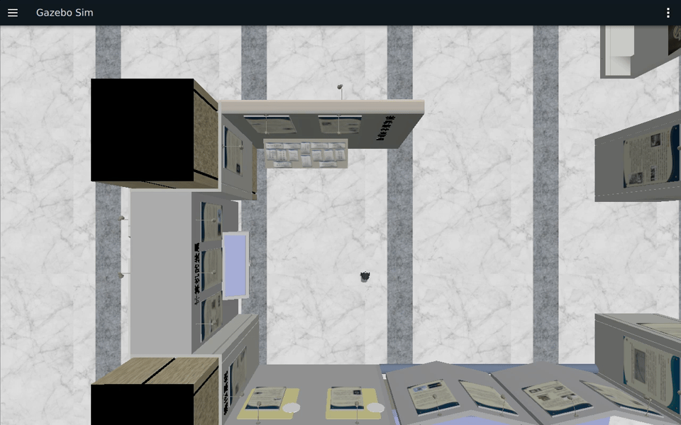

# 第6章：参数系统与 Launch 文件

> **课程**：ROS 2 C++17 编程<br>
> **章节**：第6章<br>
> **课时**：2 课时（90 分钟）<br>
> **教学方式**：讲授 + 演示<br>

---

参数和控制节点在 COM260 执行；含 GUI／Nav2 的 Launch 在 x86 Humble 容器运行。环境和入口见[公共环境](../lab_manuals_k3_com260_kit/ch00_common_setup.md#ch06)。

## 6.1 参数系统

### 知识点 6.1.1：参数声明与获取

```cpp
#include <chrono>
#include <memory>
#include <vector>
#include "rclcpp/rclcpp.hpp"
using namespace std::chrono_literals;
class ParamDemoNode : public rclcpp::Node
{
public:
  ParamDemoNode() : Node("param_demo")
  {
    declare_parameter("robot_name", "burger");
    declare_parameter("max_speed", 2.0);
    declare_parameter("enable_debug", true);
    declare_parameter("sensor_list", std::vector<std::string>{"lidar", "camera"});
    timer_ = create_wall_timer(1s, [this]() {
      RCLCPP_INFO(get_logger(), "机器人: %s, 最大速度: %.2f m/s",
        get_parameter("robot_name").as_string().c_str(), get_parameter("max_speed").as_double());
    });
  }
  double read_param_dynamic() {return get_parameter("max_speed").as_double();}
private:
  rclcpp::TimerBase::SharedPtr timer_;
};
int main(int argc, char ** argv)
{
  rclcpp::init(argc, argv);
  rclcpp::spin(std::make_shared<ParamDemoNode>());
  rclcpp::shutdown();
}
```

### 知识点 6.1.2：参数回调与动态重配置

```cpp
#include <chrono>
#include <cmath>
#include <memory>
#include <vector>
#include "rclcpp/rclcpp.hpp"
#include "rcl_interfaces/msg/set_parameters_result.hpp"
using namespace std::chrono_literals;
class DynamicParamNode : public rclcpp::Node
{
public:
  DynamicParamNode() : Node("dynamic_param")
  {
    declare_parameter("speed", 1.0);
    callback_ = add_on_set_parameters_callback(
      [](const std::vector<rclcpp::Parameter> & params) {
        rcl_interfaces::msg::SetParametersResult result;
        result.successful = true;
        for (const auto & param : params) {
          if (param.get_name() == "speed" &&
            (param.get_type() != rclcpp::ParameterType::PARAMETER_DOUBLE ||
            !std::isfinite(param.as_double()) || param.as_double() < 0.0 || param.as_double() > 10.0))
          {
            result.successful = false;
            result.reason = "speed 必须为 [0.0, 10.0] 的有限浮点数";
            break;
          }
        }
        return result;
      });
    timer_ = create_wall_timer(1s, [this]() {
      RCLCPP_INFO(get_logger(), "speed=%.2f", get_parameter("speed").as_double());
    });
  }
private:
  OnSetParametersCallbackHandle::SharedPtr callback_;
  rclcpp::TimerBase::SharedPtr timer_;
};
int main(int argc, char ** argv)
{
  rclcpp::init(argc, argv);
  rclcpp::spin(std::make_shared<DynamicParamNode>());
  rclcpp::shutdown();
}
```

程序 6-1：参数动态回调模式。回调返回 `SetParametersResult` 告知验证结果。

### 知识点 6.1.3：YAML 参数文件

```yaml
# config/params.yaml
/param_demo:
  ros__parameters:
    robot_name: 'burger'
    max_speed: 2.0
    enable_debug: true
    sensor_list: ['lidar', 'camera', 'imu']
```

```bash
# 通过 Launch 文件加载 YAML 参数
# 或命令行直接加载
ros2 run param_demo_cpp param_node \
  --ros-args --params-file config/params.yaml
```

### 知识点 6.1.4：官方要点——参数机制与命令行工具

官方 Understanding ROS 2 parameters 教程将参数定义为「每个节点的键值对配置项」，类型涵盖布尔、整数、浮点、字符串及四者的数组，可携带描述与默认值。命令行工具与本章 6.1 节对应：`ros2 param list` 列出参数、`ros2 param get <node> <name>` 读取、`ros2 param set <node> <name> <value>` 运行时修改、`ros2 param dump` 将参数快照保存为 YAML 文件。教程用小乌龟 `background_b`（背景蓝色分量）演示了「set 之后画面立即变色」的动态生效过程。

The Construct 的课程把参数分成两类理解：启动时静态配置（如分辨率、串口号）与运行时可调项（如速度上限）。前者求稳，后者求灵活——`param set` 让调试无需重启节点，而 `dump/load` 则保证调好的参数可固化复现。

### 知识点 6.1.5：官方要点——在节点类中使用参数

C++ 参数节点通常在构造函数中用 `declare_parameter()` 声明默认值，再用 `get_parameter().as_string()`、`as_double()` 等类型接口读取。`rcl_interfaces::msg::ParameterDescriptor` 可添加描述和类型约束；需要 `undeclare_parameter()` 删除的动态参数，要在 Humble 中显式设置 `dynamic_typing=true`。课程核心例程 `param_demo_cpp/param_demo` 在第二轮删除 param5，第三轮参数列表中不再出现它。

回调返回 SetParametersResult 只负责检查拟写入的值。避免在验证回调中提前修改驱动状态，因为同一请求还可能被其他校验拒绝；控制循环读取成功提交后的参数。完整实验节点同时检查启动覆盖值、运行时数值范围、字符串枚举及浮点有限性。

---

## 6.2 Launch 文件系统

### 知识点 6.2.1：Python Launch 文件基础结构

```python
#!/usr/bin/env python3

from launch import LaunchDescription
from launch.actions import DeclareLaunchArgument
from launch.conditions import IfCondition
from launch.substitutions import LaunchConfiguration
from launch_ros.actions import Node


def generate_launch_description():
    use_rviz = LaunchConfiguration('use_rviz')

    return LaunchDescription([
        DeclareLaunchArgument(
            'use_rviz',
            default_value='false',
            description='是否启动 RViz2',
        ),

        Node(
            package='demo_nodes_cpp',
            executable='talker',
            name='my_talker',
            output='screen',
        ),

        Node(
            package='demo_nodes_cpp',
            executable='listener',
            name='my_listener',
            output='screen',
        ),

        Node(
            package='rviz2',
            executable='rviz2',
            name='rviz2',
            output='screen',
            condition=IfCondition(use_rviz),
        ),
    ])
```

程序 6-2：Python Launch 文件最小示例。

### 知识点 6.2.2：高级 Launch 功能

```python
from launch import LaunchDescription
from launch.actions import DeclareLaunchArgument, LogInfo
from launch.substitutions import LaunchConfiguration
from launch.conditions import IfCondition
from launch_ros.actions import Node
from launch_ros.parameter_descriptions import ParameterValue

def generate_launch_description():
    # 声明可配置参数
    use_rviz = LaunchConfiguration('use_rviz', default='false')
    robot_speed = LaunchConfiguration('robot_speed', default='1.0')

    return LaunchDescription([
        # 声明命令行参数
        DeclareLaunchArgument('use_rviz', default_value='false',
                              description='是否启动 RViz'),
        DeclareLaunchArgument('robot_speed', default_value='1.0',
                              description='机器人最大速度'),

        # 条件启动：仅当 use_rviz=true 时启动 RViz
        Node(
            package='rviz2',
            executable='rviz2',
            condition=IfCondition(use_rviz),
        ),

        # 启动节点并传入参数
        Node(
            package='param_demo_cpp',
            executable='param_node',
            name='param_demo',
            parameters=[{'max_speed': ParameterValue(robot_speed, value_type=float)}],
            output='screen',
        ),

        # 启动信息日志
        LogInfo(msg=['启动完成，速度=', robot_speed]),
    ])
```

### 知识点 6.2.3：IncludeLaunchDescription 组合启动

```python
"""Compose Burger simulation and the Humble Nav2 lifecycle nodes on x86."""
import os

from ament_index_python.packages import get_package_share_directory
from launch import LaunchDescription
from launch.actions import DeclareLaunchArgument, IncludeLaunchDescription
from launch.conditions import IfCondition
from launch.launch_description_sources import PythonLaunchDescriptionSource
from launch.substitutions import LaunchConfiguration, PythonExpression
from launch_ros.actions import Node


def generate_launch_description():
    share = get_package_share_directory('param_demo_cpp')
    sim = get_package_share_directory('robot_sim_demo')
    nav2 = get_package_share_directory('nav2_bringup')
    use_rviz = LaunchConfiguration('use_rviz')
    use_gazebo = LaunchConfiguration('use_gazebo')
    gz_headless = LaunchConfiguration('gz_headless')
    use_sim_time = LaunchConfiguration('use_sim_time')
    return LaunchDescription([
        DeclareLaunchArgument('use_rviz', default_value='true'),
        DeclareLaunchArgument('use_gazebo', default_value='true'),
        DeclareLaunchArgument('gz_headless', default_value='false'),
        DeclareLaunchArgument('use_sim_time', default_value='true'),
        DeclareLaunchArgument('gz_partition', default_value='com260_ch06'),
        IncludeLaunchDescription(
            PythonLaunchDescriptionSource(os.path.join(sim, 'launch', 'gazebo2.launch.py')),
            condition=IfCondition(use_gazebo),
            launch_arguments={
                'gui': PythonExpression(["'false' if '", gz_headless, "' == 'true' else 'true'"]),
                'rviz': 'false', 'drive': 'false', 'use_sim_time': use_sim_time,
                'gz_partition': LaunchConfiguration('gz_partition'),
            }.items(),
        ),
        IncludeLaunchDescription(
            PythonLaunchDescriptionSource(os.path.join(nav2, 'launch', 'bringup_launch.py')),
            launch_arguments={
                'map': os.path.join(share, 'maps', 'Software_Museum.yaml'),
                'params_file': os.path.join(share, 'config', 'nav2_params.yaml'),
                'use_sim_time': use_sim_time, 'autostart': 'true',
                'use_composition': 'False',
            }.items(),
        ),
        Node(package='rviz2', executable='rviz2', name='navigation_rviz',
             condition=IfCondition(use_rviz), output='screen',
             arguments=['-d', os.path.join(share, 'rviz', 'navigation.rviz')],
             parameters=[{'use_sim_time': use_sim_time}]),
    ])
```

### 知识点 6.2.4：官方要点——Launch 基础与参数文件

官方 Creating a launch file 教程介绍了 Launch 系统的三种语法（Python 为首选）与核心概念：`Node` 动作描述单个节点（package、executable、name、namespace、parameters、remappings 六大常用项），`LaunchDescription` 容纳全部启动动作，`launch_ros` 提供节点级封装。教程特别演示了把参数直接写在 `parameters=[{'background_r': 150, ...}]` 里传入节点的方式。

批量参数推荐 YAML 文件方案：`parameters=['path/to/params.yaml']`。官方给出了 YAML 结构约定——首层为节点名（或 `/**` 通配），其下 `ros__parameters:` 键再列参数，且需在 `Node` 中用 `name` 指定节点名以匹配。这与本章 6.1.3 节的 `robot_params.yaml` 结构完全一致；`ros2 param dump` 生成的文件即可直接复用为启动参数文件。

### 知识点 6.2.5：官方要点——Launch 进阶与工程化实践

进阶用法集中在官方 Using launch files 系列与 `launch` 包 API 文档中：`IncludeLaunchDescription` 组合多个 launch 文件（如「驱动 + SLAM + RViz」拼装为系统级启动）；`DeclareLaunchArgument` + `LaunchConfiguration` 实现命令行传参 `ros2 launch pkg file.launch.py map:=warehouse.yaml`；`IfCondition`/`UnlessCondition` 控制节点启停；`RegisterEventHandler` 监听进程退出等事件实现失败重启。本章 6.2.2~6.2.3 节的高级 Launch 功能正是这些特性的综合运用。

Articulated Robotics 总结的分工模式值得记住：参数解决「节点的内部配置」，Launch 解决「系统的组合编排」，二者合用即可做到一份仓库适配仿真与实机多套场景。建议读者在完成练习 6.6 后，尝试用 `param dump` 导出调好的参数，再写一个带 `DeclareLaunchArgument` 的启动文件把参数文件路径开放为启动选项。

---

## 6.3 本章小结

本章总结了参数与 Launch 的五个要点：参数声明用 `declare_parameter(name, default)`，获取用 `get_parameter(name).as_double()` 等类型接口；参数回调 `add_on_set_parameters_callback()` 实现动态重配置和验证；YAML 文件存储参数，通过 `--params-file` 或 Launch 加载；Python Launch 文件使用 `Node()` 启动节点，`LaunchConfiguration()` 传递参数；`IfCondition` 实现条件启动，`IncludeLaunchDescription` 组合多个 Launch。

---

## 6.4 练习题

**练习 6.1**：编写节点 `param_demo`，声明 name、speed、mode 三个参数，每秒输出参数值。

**练习 6.2**：实现参数回调验证：speed 必须在 0.0~10.0 范围内，mode 只能是 "auto"/"manual"/"hybrid"。

**练习 6.3**：编写 YAML 参数文件，通过 `--params-file` 加载覆盖默认参数。

**练习 6.4**：编写 Python Launch 文件，同时启动 talker、listener 两个节点。

**练习 6.5**：在 Launch 中添加条件启动参数 `use_rviz`，控制 RViz 是否启动。

**练习 6.6**：使用 `ros2 param list/get/set` 命令行操作节点参数。

---

## 仿真结合实例（当前仓库）：用 Launch 参数切换 Gazebo、RViz 和巡航驱动

### 目标与知识点对应

`robot_sim_demo` 的 Launch 文件把 `gui`、`rviz`、`drive`、世界文件和生成位姿暴露为 Launch 参数。通过同一个入口切换运行模式，可以直接观察 `LaunchConfiguration`、条件启动和参数传递的效果。

### 运行步骤

在 x86 课程副本中，使用本章独立的 Humble/Nav2 镜像：

```bash
cd ~/ROS2_RISCV_COM260
CH06=course_support/k3_com260_kit/scripts/x86-ch06.bash
RUN_ID=$(date -u +%Y%m%dT%H%M%SZ)-ch06
bash "$CH06" start "$RUN_ID" gazebo_ch06.launch.py gui:=false rviz:=false drive:=false
bash "$CH06" exec "$RUN_ID" ros2 launch param_demo_cpp gazebo_ch06.launch.py --show-args
```

停止这一轮，再启动 GUI 与巡航：

```bash
bash "$CH06" stop "$RUN_ID"
RUN_ID=$(date -u +%Y%m%dT%H%M%SZ)-ch06-drive
bash "$CH06" start "$RUN_ID" gazebo_ch06.launch.py gui:=true rviz:=true drive:=true \
  drive_linear_speed:=0.12 drive_angular_speed:=0.45
```

### 观察结果

`drive:=false` 不启动巡航节点；`drive:=true` 时 C++ `patrol_driver` 发布巡航指令；`rviz:=true` 条件启动 RViz。修改 spawn_x、spawn_y 或速度参数后重新启动，比较仿真行为。动态调速练习则保持同一个 C++ `speed_controller` 运行，用 `ros2 param set` 更新速度并核对 /odom 反馈，两种操作的生效时机不同。

### 源码与相关配置

本章 C++ 参数与速度节点、YAML、Launch 位于 `src_k3_com260_kit/param_demo_cpp/`。包装 Launch 原样包含已有 Burger 仿真资源，巡航节点由独立 C++ 版本提供；Nav2 组合 Launch 使用官方 Humble 节点、地图与生命周期管理。完整步骤见[第六章实验](../lab_manuals_k3_com260_kit/ch06_lab.md)，结果见[实测证据](../lab_manuals_k3_com260_kit/runtime_evidence.md#ch06)。




---

学习材料：
- ROS 2 Documentation (Humble) —— Understanding ROS 2 parameters：https://docs.ros.org/en/humble/Tutorials/Beginner-CLI-Tools/Understanding-ROS2-Parameters.html
- ROS 2 Documentation (Humble) —— Using parameters in a class (C++)：https://docs.ros.org/en/humble/Tutorials/Beginner-Client-Libraries/Using-Parameters-In-A-Class-CPP.html
- ROS 2 Documentation (Humble) —— Creating a launch file：https://docs.ros.org/en/humble/Tutorials/Intermediate/Launch/Creating-Launch-Files.html
- ROS 2 Documentation (Humble) —— Using launch files for large projects（Launch 系统主页）：https://docs.ros.org/en/humble/Tutorials/Intermediate/Launch/Launch-Main.html
- The Construct —— ROS 2 Basics in 5 Days：https://www.theconstructsim.com/
- Articulated Robotics —— ROS 2 Basics 系列视频：https://www.youtube.com/@ArticulatedRobotics
