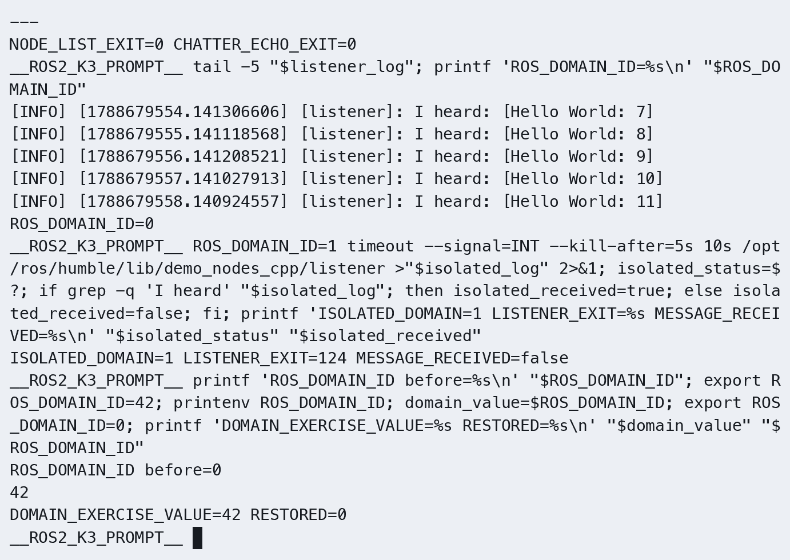
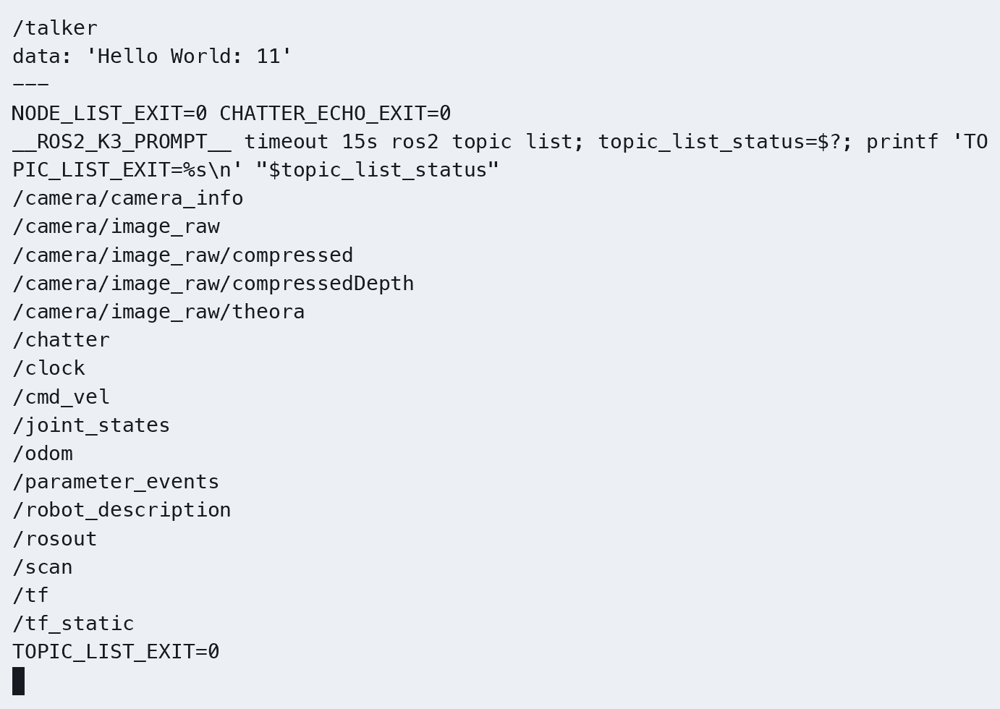

# 第1章：ROS 2 概述与架构设计

> **课程**：ROS 2 C++17 编程
> **章节**：第1章  
> **课时**：2 课时（90 分钟）  
> **教学方式**：讲授 + 演示  

---

## 1.1 ROS 2 发展背景与设计目标

### 知识点 1.1.1：从 ROS 1 到 ROS 2

ROS（Robot Operating System）最初由 Willow Garage 于 2007 年发布，旨在为机器人软件开发提供统一的分布式框架。ROS 1 在学术界和工业界获得了广泛采用，但随着应用场景从实验室扩展到工业级产品，ROS 1 的局限性逐渐暴露出来：首先是**单点故障**问题，Master 节点（roscore）是所有通信的中枢，一旦崩溃整个系统便陷入瘫痪；其次是**实时性不足**，基于 TCP 的通信无法满足硬实时控制的需求；再次是**安全性缺失**，系统没有内置的认证、授权和加密机制；最后是**嵌入式支持薄弱**，对资源受限的微控制器支持有限。正是针对这些痛点，2014 年 Open Robotics 启动了 ROS 2 项目，完全重新设计了通信架构。

### 知识点 1.1.2：ROS 2 版本演进

ROS 2 自 2017 年底发布首个版本以来，以约半年一次的节奏迭代，各主要版本的代号、发布日期与维护状态如下表所示。其中 Humble（2022 年 5 月发布）与 Jazzy（2024 年 5 月发布）为长期支持（LTS）版本，是当前工业界与学术界的主力选择。

| 版本名 | 代号 | 发布日期 | 状态 |
|--------|------|---------|------|
| Ardent | Apalone | 2017.12 | EOL |
| Bouncy | Bolson | 2018.07 | EOL |
| Crystal | Clemmys | 2018.12 | EOL |
| Dashing | Diademata | 2019.05 | EOL |
| Eloquent | Elusor | 2019.11 | EOL |
| Foxy | Fitzroy | 2020.06 | EOL |
| Galactic | Geochelone | 2021.05 | EOL |
| **Humble** | Hawksbill | 2022.05 | **LTS (推荐)** |
| Iron | Irwini | 2023.05 | EOL |
| **Jazzy** | Jalisco | 2024.05 | **LTS (最新)** |

本课程使用 **ROS 2 Humble**：C++ 节点在 K3 Pico-ITX（Bianbu >= 4.0.1 / riscv64）运行，Gazebo/RViz 在 x86 的 Ubuntu 22.04/Humble/Harmonic 课程容器运行。连接与环境加载见 [公共双端环境](../lab_manuals_k3_pico_itx/ch00_common_setup.md)。

---

## 1.2 DDS 中间件架构

### 知识点 1.2.1：DDS 概念模型

DDS（Data Distribution Service）是 OMG 制定的分布式实时通信标准，ROS 2 采用它替换了 ROS 1 的自定义 TCP/UDP 协议。DDS 与 ROS 2 的核心概念之间存在清晰的对应关系：

```
DDS 概念          →    ROS 2 概念
━━━━━━━━━━━━━━━━━━━━━━━━━━━━━━━━━
DomainParticipant →    Node (通过 context)
DataWriter        →    Publisher
DataReader        →    Subscription
Topic             →    Topic
Domain            →    ROS_DOMAIN_ID
```

```
图 1-1：DDS 去中心化架构
┌─────────────┐                    ┌─────────────┐
│   Node A    │                    │   Node B    │
│             │                    │             │
│ ┌─────────┐ │    DDS Domain     │ ┌─────────┐ │
│ │Publisher│ │◄════Topic════════►│ │Subscribe│ │
│ └─────────┘ │    (自动发现)      │ └─────────┘ │
└─────────────┘                    └─────────────┘
        │                                  │
        └────────── 去中心化 ───────────────┘
               (无Master节点)
```

从图 1-1 可以看出，ROS 2 使用 DDS 的自动发现机制，节点可直接对等通信，无需中心化的 Master 节点。

### 知识点 1.2.2：RMW 抽象层

ROS 2 通过 RMW（ROS MiddleWare）接口抽象不同的 DDS 实现，其分层结构如图 1-2 所示：最上层是用户直接调用的 rclcpp/rclpy API，其下依次是统一的 ROS Client Library（RCL）与中间件抽象层（RMW），再往下则是可以自由切换的 DDS 实现（如 Fast DDS、Cyclone DDS、RTI Connext），底层以 UDP 或共享内存（SHMEM）完成数据传输。

```
┌──────────────────┐
│  rclcpp / rclpy  │  ← 用户代码 API
├──────────────────┤
│       RCL        │  ← ROS Client Library
├──────────────────┤
│       RMW        │  ← 中间件抽象层 (可替换)
├──────────────────┤
│  Fast DDS /      │
│  Cyclone DDS /   │  ← DDS 实现 (可切换)
│  RTI Connext     │
├──────────────────┤
│   UDP / SHMEM    │  ← 传输层
└──────────────────┘
```

图 1-2：ROS 2 分层架构。RMW 层允许用户在不修改应用代码的情况下切换不同的 DDS 实现。

### 知识点 1.2.3：官方要点——分层架构与 DDS 中间件

官方 About ROS 2 文档将 ROS 2 定位为「面向机器人应用的开源中间件框架」，其与 ROS 1 最本质的架构差异在于采用 DDS（Data Distribution Service，数据分发服务）作为通信中间件。DDS 是一种基于发布-订阅模型的数据分发标准，底层使用 RTPS 协议完成数据的可靠传输与节点发现。ROS 2 通过 rmw（ROS 中间件接口）抽象层将上层 API 与具体的 DDS 实现（如 Fast DDS、Cyclone DDS）解耦，用户使用 rclpy/rclcpp 编写的代码可以无缝切换底层供应商。

由于 DDS 本身就是去中心化的，节点之间通过自动发现（Discovery）机制互相感知，不再需要 ROS 1 时代的中央 Master 节点。这一设计带来三个显著收益：其一，系统天然支持多机分布部署，机器人本体与上位机可以位于不同主机；其二，QoS（服务质量）策略内建于通信层，可在可靠传输与实时低延迟之间按需取舍；其三，协议栈符合实时通信标准，为机械臂控制、自动驾驶等硬实时场景提供了基础。

---

## 1.3 Quality of Service (QoS) 策略

### 知识点 1.3.1：QoS 策略维度

QoS 定义了数据传输的质量保证机制，ROS 2 提供以下核心策略维度：

| 策略维度 | 选项 | 含义 |
|---------|------|------|
| **Reliability** | RELIABLE / BEST_EFFORT | 可靠传输（重传） / 尽力传输（允许丢包） |
| **Durability** | VOLATILE / TRANSIENT_LOCAL | 不保存历史 / 保存历史给后来者 |
| **History** | KEEP_LAST(n) / KEEP_ALL | 保留最后 n 条 / 保留所有 |
| **Depth** | 正整数 | 队列深度 |
| **Deadline** | 时间间隔 | 消息更新的最大间隔 |
| **Lifespan** | 时间间隔 | 消息的有效期 |
| **Liveliness** | AUTOMATIC / MANUAL | 发布者存活检测 |

其中 Reliability 决定消息是否重传，Durability 决定后加入的订阅者能否收到历史消息，History 与 Depth 共同控制缓存队列的长度，Deadline、Lifespan 与 Liveliness 则分别约束消息的更新频率、有效时长与发布端存活检测。

### 知识点 1.3.2：预定义 QoS 配置文件

为了让常见场景开箱即用，ROS 2 在 rclcpp 中预置了若干 QoS 类型，例如传感器数据流使用高频允许丢包的配置，服务通信则使用可靠传输的配置；同时用户也可以显式构造 rclcpp::QoS 自定义每一维度的取值：

```cpp
#include "rclcpp/rclcpp.hpp"

// Sensor data: BEST_EFFORT, KEEP_LAST(5).
auto qos_sensor = rclcpp::SensorDataQoS();

// Services: RELIABLE, KEEP_LAST(10).
auto qos_service = rclcpp::ServicesQoS();

// Custom QoS.
auto qos_custom = rclcpp::QoS(10).reliable().transient_local();
```

---

## 1.4 节点生命周期管理

### 知识点 1.4.1：生命周期状态机

ROS 2 为节点引入了标准化的生命周期状态机，其状态转换关系如图 1-3 所示：节点从 Unconfigured 状态出发，调用 configure() 进入 Inactive，再经 activate() 变为 Active 正常运行；反之可经 deactivate()、cleanup() 逐级退回，并且任意状态下都可以通过 shutdown() 进入 Finalized。

```
                              configure()
Unconfigured ─────────────────────────► Inactive
     ▲                                      │
     │                                      │ activate()
     │ cleanup()                            ▼
     │                                   Active
     │                                      │
     └────────────────── deactivate() ──────┘

           shutdown() (从任意状态进入 Finalized)
```

图 1-3：ROS 2 生命周期节点状态转换图。通过状态机管理节点的初始化和资源分配，确保确定的启动和关闭流程。

### 知识点 1.4.2：生命周期 C++ API

在 C++ 中实现生命周期节点只需继承 rclcpp_lifecycle::LifecycleNode，并按需覆写 on_configure、on_activate 等回调，每个回调通过返回 CallbackReturn::SUCCESS 表示迁移成功：

```cpp
#include "rclcpp/rclcpp.hpp"
#include "rclcpp_lifecycle/lifecycle_node.hpp"

using CallbackReturn =
  rclcpp_lifecycle::node_interfaces::LifecycleNodeInterface::CallbackReturn;

class MyLifecycleNode : public rclcpp_lifecycle::LifecycleNode
{
public:
  MyLifecycleNode() : LifecycleNode("my_lifecycle_node") {}

  CallbackReturn on_configure(const rclcpp_lifecycle::State &) override
  {
    // Allocate resources and set parameters.
    RCLCPP_INFO(get_logger(), "on_configure() called");
    return CallbackReturn::SUCCESS;
  }

  CallbackReturn on_activate(const rclcpp_lifecycle::State &) override
  {
    // Start processing data.
    RCLCPP_INFO(get_logger(), "on_activate() called");
    return CallbackReturn::SUCCESS;
  }

  CallbackReturn on_deactivate(const rclcpp_lifecycle::State &) override
  {
    // Stop processing data.
    RCLCPP_INFO(get_logger(), "on_deactivate() called");
    return CallbackReturn::SUCCESS;
  }

  CallbackReturn on_cleanup(const rclcpp_lifecycle::State &) override
  {
    // Release resources.
    RCLCPP_INFO(get_logger(), "on_cleanup() called");
    return CallbackReturn::SUCCESS;
  }
};
```

### 知识点 1.4.3：官方要点——生命周期节点设计动机

官方 Concepts 文档中的 About Lifecycle Nodes 页面解释了生命周期（Lifecycle）节点的设计动机：机器人系统中的硬件驱动、导航算法等组件需要有序的初始化与关停流程，而非一启动就全速运行。生命周期节点将运行状态划分为未配置（Unconfigured）、未激活（Inactive）、激活（Active）与已停止（Shutdown）等状态，外部通过服务调用触发状态迁移。

例如导航系统加载代价地图时，需要先完成参数读取与地图订阅初始化（Unconfigured → Inactive），再一次性切换到 Active 开始运行。rclpy/rclcpp 官方示例包（ros2/examples）提供了完整的生命周期节点实现，与本章演示的生命周期状态机一一对应，可作为进阶实现参考。

---

## 1.5 安装与环境搭建

### 知识点 1.5.1：安装 ROS 2 Humble

K3 使用 Bianbu 的 ROS 2 软件包及课程专用安装器，安装 ROS 2、colcon 和课程所需依赖；Gazebo/RViz 安装在 x86 课程容器中。安装前先预检并查看缺失项，具体双端准备步骤见 [公共环境](../lab_manuals_k3_pico_itx/ch00_common_setup.md)。

【K3 板端，安装终端】

```bash
cd ~/ROS2_RISCV
bash setup_course_k3.sh --dry-run
bash setup_course_k3.sh
```

### 知识点 1.5.2：配置开发环境

每次新开终端加载 ROS 2 和课程工作空间环境后，才能使用其中的包和节点。K3 安装器生成独立的课程环境文件；本课程使用已核对的显式依赖清单，rosdep 的初始化状态由安装检查记录。

【K3 板端，各实验终端】

```bash
source ~/.config/ros2-course-k3/env.bash
source ~/ros2_course_k3_ws/install/setup.bash
```

### 知识点 1.5.3：工作空间与 colcon 构建

开发机器人功能包时，通常先在主目录下创建 `~/ros2_ws` 工作空间并建立 `src` 子目录存放源码，随后用 colcon 构建整个空间，构建完成后加载 `install/setup.bash` 即可运行其中的节点，最后用官方的 talker/listener 示例节点验证整个环境是否可用：

【K3 板端，终端 1；已有工作空间内容保留】

```bash
# 创建工作空间
mkdir -p ~/ros2_ws/src
cd ~/ros2_ws

# 编译工作空间
colcon build --symlink-install

# 加载工作空间环境
source install/setup.bash

# 验证安装
ros2 run demo_nodes_cpp talker
# 在另一个终端：
ros2 run demo_nodes_cpp listener
```

### 知识点 1.5.4：官方要点——快速上手：turtlesim 与命令行工具

官方 Beginner: CLI Tools 系列教程以小乌龟仿真 turtlesim 为教学道具：在终端一运行 `ros2 run turtlesim turtle_sim_node` 启动乌龟仿真器，终端二运行 `ros2 run turtlesim turtle_teleop_key` 即可用方向键控制乌龟运动。教程刻意引导读者用 `ros2 node list`、`ros2 node info`、`ros2 topic list`、`ros2 service list` 等命令观察图形界面背后的节点、话题与服务实体，并演示节点重命名（`--ros-args -r __node:=my_turtle`）。

这一步与本章练习的仿真节点观察实验思路完全一致：从「黑盒」现象出发，借助命令行工具建立对 ROS 2 实体模型的直观认识。The Construct 的 5 天入门课也保留了这一「先跑仿真、再读命令」的教学法，Articulated Robotics 的视频系列则以更口语化的方式逐条演示这些命令，适合中文读者对照复习。

### 知识点 1.5.5：官方要点——工作区与 colcon 构建系统

官方 colcon 教程介绍了标准工作区布局：`src/`（源码）、`build/`（中间产物）、`install/`（安装产物）、`log/`（日志）四个目录。构建命令 `colcon build` 会递归编译所有包，常用选项包括 `--packages-select <pkg>`（只编译指定包）、`--symlink-install`（适用文件以符号链接安装，C++ 源码修改后仍需重新编译）以及 `--merge-install`（合并安装，适合在嵌入式/容器中运行）。

Articulated Robotics 强调初学者应形成「修改源码 → `colcon build --symlink-install` → `source install/setup.bash` → `ros2 run`」的日常循环，并提醒每次新开终端都要重新 source，否则会出现 `Package 'x' not found` 的错误——这是 ROS 2 初学者最高频的报错之一，根源正是环境变量（如 `AMENT_PREFIX_PATH`、`LD_LIBRARY_PATH`）未正确加载。

---

## 1.6 本章小结

本章围绕 ROS 2 的设计理念与核心机制展开。首先回顾了 ROS 1 在单点故障、实时性、安全性与嵌入式支持四方面的局限，以及 ROS 2 如何通过全新的通信架构解决这些问题。随后介绍了 DDS 中间件的去中心化自动发现机制：节点之间不再依赖中央 Master，而是通过对等发现直接通信，且底层 DDS 实现可以通过 RMW 抽象层自由切换。在通信质量层面，QoS 策略从可靠性、持久性、历史缓存、队列深度、截止时间、存活周期与存活检测等多个维度提供细粒度的保障。此外，生命周期节点通过标准状态机统一管理节点的配置、激活与关闭流程，保证系统启动和退出行为确定可控。在环境搭建方面，本章给出了 K3 上 ROS 2 Humble 的安装入口与环境加载步骤，并介绍了以 colcon 为标准构建工具的工作空间管理方式。

---

## 1.7 练习题

**练习 1.1**：简述 ROS 1 的三个主要局限性和 ROS 2 对应的解决方案。

ros1依赖master，存在中心节点————ros2使用dds通信机制，节点之间可以自动发现彼此
ros1不太能实时控制并传输，通信策略单一————Qos通信，根据不同数据类型设置可靠性队列深度。。。
ros1多机器人、多实验环境相互干扰————通过ROS_DOMAIN_ID划分通信领域
**练习 1.2**：DDS 域 ID（ROS_DOMAIN_ID）的作用是什么？如果两台机器上的域 ID 不同，它们的节点能通信吗？

作用是隔离通信环境。id不同一般不会互相发现和通信
**练习 1.3**：以下 QoS 配置能否匹配通信？  

- Publisher: RELIABLE, VOLATILE  
- Subscriber: BEST_EFFORT, VOLATILE
可以。Publisher 使用 RELIABLE，提供可靠传输能力；Subscriber 使用 BEST_EFFORT，只要求尽力接收，因此发布者能力满足订阅者需求。两者 Durability 都为 VOLATILE，也能够匹配。
**练习 1.4**：查看当前 ROS_DOMAIN_ID 环境变量值，将其修改为 42 并验证。



K3 实测 ROS_DOMAIN_ID=42；观察后恢复为课程使用的 Domain 0。

**练习 1.5**：创建一个 ROS 2 工作空间，使用 colcon build 编译，并验证 setup.bash 加载。


K3 既有工作空间复编译通过，加载 setup.bash 后可查询 my_first_pkg。

**练习 1.6**：运行 talker/listener 示例节点，使用 `ros2 node list` 和 `ros2 topic list` 查看运行状态。




K3 查看 ROS 2 节点和话题；/chatter 可见，查询退出码为 0。

---

## 仿真结合实例（当前仓库）：Gazebo Harmonic 仿真中的 ROS 2 体系验证

### 目标与知识点对应

本实例把第1章的三个核心概念——**DDS 分布式通信、去中心化自动发现、ROS_DOMAIN_ID 域隔离、QoS 策略**——放到一个真实的 Gazebo 仿真中验证。当前验证使用 K3 上的 ROS 2 Humble 与 x86 课程容器中的 ROS 2 Humble + Gazebo Sim Harmonic，移动机器人入口为 `robot_sim_demo`。通过观察一个仿真世界里的节点、话题和桥接关系，你能直观理解 DDS 中间件如何在节点之间自动建立连接。

### 运行命令

先按公共环境启动并进入 x86 课程容器；下列命令对应容器内仿真进程，已经启动时不要重复启动。

【x86 课程容器，仿真终端】

```bash
source /opt/ros/humble/setup.bash
source /workspace/install/setup.bash

# 终端 1：启动 Gazebo + 机器人 + 传感器桥（带 RViz）
ros2 launch robot_sim_demo gazebo2.launch.py gui:=true rviz:=true drive:=false
```

等待 Gazebo 3D 场景出现 TurtleBot3 Burger 机器人、RViz 显示机器人模型与激光雷达点云。随后在 **K3 独立终端**（先加载课程环境）观察：

```bash
# 查看自动发现到的所有节点（DDS 去中心化发现）
ros2 node list

# 查看传感器桥发布的话题及其 QoS 与类型
ros2 topic list
ros2 topic info /scan
```

### 需要观察到的现象

运行上述命令后应重点观察三类现象。其一，`ros2 node list` 能看到 `gazebo2_bridge`、`gazebo2_robot_state_publisher`、`camera_info_publisher` 等多个节点，且它们**没有中心 master**，全部靠 DDS 自动发现（对应 1.1-1.2 节）。其二，`ros2 topic info /scan` 显示 `Message type: sensor_msgs/msg/LaserScan`，桥接发布者采用 Lazy 桥（未匹配到订阅者时不发送），体现 QoS Durability/History 的实际影响。其三，在另一个带 source 的终端重新指定一个 `ROS_DOMAIN_ID` 再执行 `ros2 node list`，可以看到它与仿真图**隔离**，对应 1.2.2 节与练习 1.2。

### 源码与相关位置

本实例涉及的关键文件包括：启动入口位于 `src_k3_pico_itx/robot_sim_demo/launch/gazebo2.launch.py`，桥配置位于 `src_k3_pico_itx/robot_sim_demo/config/gazebo2_bridge.yaml`，相机内参发布器位于 `src_k3_pico_itx/robot_sim_demo/src/camera_info_publisher.cpp`，世界与模型文件则位于 `src_k3_pico_itx/robot_sim_demo/worlds/museum.sdf` 和 `src_k3_pico_itx/robot_sim_demo/models/turtlebot3_burger/model.sdf`。

> 本章既有运行通过结论保留；对应截图和连续 GUI 录像的交付状态见 [K3 实际运行证据](../lab_manuals_k3_pico_itx/runtime_evidence.md#ch01)。


K3 当前账号补验：configure、activate 成功，/cmd_vel 的 linear.x=0.1；均记录实际退出码。

---

学习材料：
- ROS 2 Documentation (Humble) —— About ROS 2：https://docs.ros.org/en/humble/About/About-ROS-2.html
- ROS 2 Documentation (Humble) —— ROS 2 Concepts：https://docs.ros.org/en/humble/Concepts.html
- ROS 2 Documentation (Humble) —— Beginner: CLI Tools（turtlesim 入门）：https://docs.ros.org/en/humble/Tutorials/Beginner-CLI-Tools.html
- ROS 2 Documentation (Humble) —— 使用 colcon 构建工作区：https://docs.ros.org/en/humble/Tutorials/Beginner-Client-Libraries/Colcon-Tutorial.html
- ROS 2 Documentation (Humble) —— About Lifecycle Nodes：https://docs.ros.org/en/humble/Concepts/About-Lifecycle-Nodes.html
- The Construct —— ROS 2 Basics in 5 Days：https://www.theconstructsim.com/
- Articulated Robotics —— ROS 2 Basics 系列视频：https://www.youtube.com/@ArticulatedRobotics